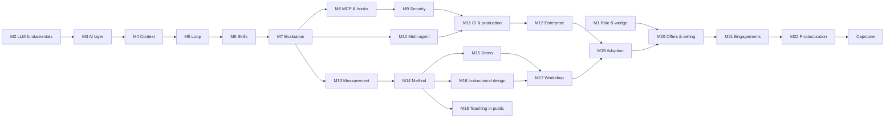

# Course map

22 modules in 11 stages, 101 lessons. Each module depends only on earlier ones; where an early module needs a later tool it gets a minimal version first (Module 4's fixed 10-task check becomes Module 7's harness; Module 5's `NOTES.md` becomes Module 13's controlled experiment).

| Stage | # | Module | Lessons |
|---|---|---|---|
| Stage A | 1 | [The AI-Native Trainer Role & Picking Your Wedge](lessons/module-01/lesson-01.md) | 4 |
| Stage B | 2 | [LLM and Agent Fundamentals](lessons/module-02/lesson-01.md) | 5 |
|  | 3 | [Anatomy of an AI-Native Codebase: The AI Layer](lessons/module-03/lesson-01.md) | 4 |
| Stage C | 4 | [Context Engineering](lessons/module-04/lesson-01.md) | 5 |
| Stage D | 5 | [Research → Plan → Implement → Validate](lessons/module-05/lesson-01.md) | 4 |
|  | 6 | [Skills, Sub-Agents and Workflow Automation](lessons/module-06/lesson-01.md) | 4 |
|  | 7 | [Agent Evaluation](lessons/module-07/lesson-01.md) | 6 |
| Stage E | 8 | [MCP, APIs and Hooks](lessons/module-08/lesson-01.md) | 4 |
|  | 9 | [Agent Security](lessons/module-09/lesson-01.md) | 6 |
|  | 10 | [Multi-Agent Systems](lessons/module-10/lesson-01.md) | 4 |
|  | 11 | [Agents in CI and Production](lessons/module-11/lesson-01.md) | 5 |
| Stage F | 12 | [Enterprise AI-Agent Architecture](lessons/module-12/lesson-01.md) | 5 |
| Stage G | 13 | [Measuring AI Engineering Impact](lessons/module-13/lesson-01.md) | 6 |
| Stage H | 14 | [Naming Your Method](lessons/module-14/lesson-01.md) | 4 |
| Stage I | 15 | [The Demo Repo and Live Demo Craft](lessons/module-15/lesson-01.md) | 4 |
|  | 16 | [Instructional Design for Engineers](lessons/module-16/lesson-01.md) | 5 |
|  | 17 | [Workshop Design and Delivery](lessons/module-17/lesson-01.md) | 4 |
|  | 18 | [Teaching in Public](lessons/module-18/lesson-01.md) | 4 |
| Stage J | 19 | [AI Adoption and Change Management](lessons/module-19/lesson-01.md) | 4 |
| Stage K | 20 | [Offers, Pricing, Selling and Consulting](lessons/module-20/lesson-01.md) | 5 |
|  | 21 | [Delivering Engagements](lessons/module-21/lesson-01.md) | 5 |
|  | 22 | [Productization and Scaling](lessons/module-22/lesson-01.md) | 4 |

## Dependencies

## The learning loop in every lesson

Learn → See → Do → **Break** → **Diagnose** → Fix → Verify → Reflect. Each lesson page has the same sections: Why it matters · How it works · Show me · Try it · Break it · Fix it · How do I know it works? · Use / don't use · Reflect · Sources — followed by a knowledge check.

## Portfolio

| Repo | Built in | Purpose |
|---|---|---|
| [ai-layer-lab](projects/ai-layer-lab/README.md) | M3–M6, M8, M11 | AI layer on a real brownfield .NET codebase + `NOTES.md` |
| [agent-evals](projects/agent-evals/README.md) | M4, M7, M9, M10 | Task dataset, graders, harness, attack suite, comparison reports |
| [security-lab](projects/security-lab/README.md) | M9 | Local Docker lab: vulnerable services, malicious MCP server, canaries, egress catcher |
| [enterprise-architecture](projects/enterprise-architecture/README.md) | M12 | Reference architecture, ADRs, security-review Q&A |
| [method-notes](projects/method-notes/README.md) | M13–M14 | Experiment report, named concepts, method, evolution policy |
| [brownfield-demo](projects/brownfield-demo/README.md) | M15 | Confidentiality-safe messy .NET app + PRD, tickets, docs, recordings |
| [talks](projects/talks/README.md) | M16, M18 | Mini-workshop, lunch-and-learn, content calendar, published pieces |
| [workshop-kit](projects/workshop-kit/README.md) | M17, M20 | Agenda, notes, starter pack, assessments, pricing, SOW |
| [case-studies](projects/case-studies/README.md) | M21 | Anonymized before → intervention → after results |

## Time

~26 hours of reading, ~75–100 hours of practice, ~6–9 months part-time — field assignments (interviews, talks, pilot, paid engagement) set the pace.
