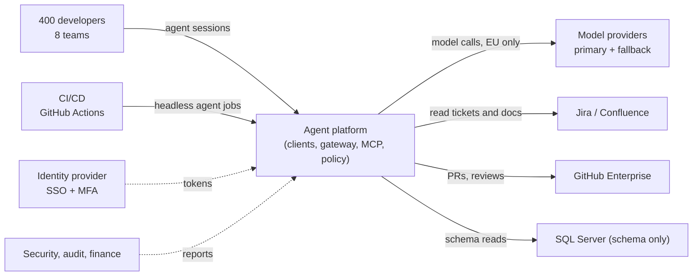
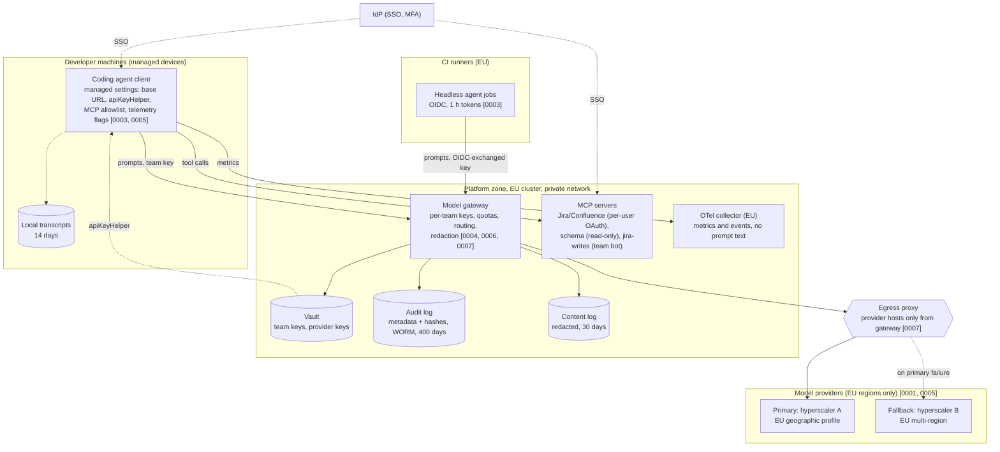

# Fabrikam reference architecture for coding agents (v1)

Two views, in the spirit of the C4 model: a context view (who and what talks to the agent platform) and a container view with trust boundaries. Every arrow that carries prompt or code content is EU-only. Numbers in brackets are the ADRs that decided the element.

## Context view

## Container view with trust boundaries

## What the boundaries mean

| Boundary | Crossing | Control |
|---|---|---|
| Developer machine → platform | prompts, tool calls | team key from the vault via `apiKeyHelper`; SSO user recorded by the gateway; managed settings cannot be overridden locally |
| CI → platform | headless prompts | OIDC federation; one-hour credential scoped to the repository's team; own quota |
| Platform → providers | model calls | only the gateway's subnet may reach provider hosts; both routes EU; private endpoints |
| Platform → stores | logs | redaction before any write; audit metadata in write-once storage |
| Agent → tools | MCP calls | per-user OAuth for reads, per-team bot for the few writes, allowlist of servers |

Checked by: `ArchCheck lint solution/architecture.json` (the machine-readable twin of this diagram).
