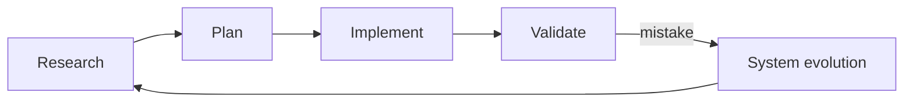

# The Contoso Method (draft, deliberately flawed)

> **Break for lesson 14.4.** A student's method draft, written in a hurry the week before a lunch-and-learn. Every word is technically true about what they do. Run `MethodCheck borrowed break/14.4-borrowed/method-draft.md --terms data/terms.csv` and decide, for every hit, whether to attribute, replace or justify.

## What it is

The Contoso Method is my approach to AI-native delivery on brownfield .NET. It treats the AI layer as a first-class part of the codebase and uses context engineering to keep the agent focused.

## The loop

Every ticket goes Research → Plan → Implement → Validate:

1. **Research.** Find what already exists, the constraints and the blast radius. Write it to a file.
2. **Plan.** Turn the research into steps with an out-of-scope list. Frequent intentional compaction between phases keeps the context small.
3. **Implement.** One plan step at a time.
4. **Validate.** Gates the agent did not write: architecture rules, scope, a human-reviewed test per acceptance criterion.

The rules file is the team's constitution: it holds the principles every change must follow. For larger features we do spec-driven development.

## Principles

- **Avoid paste-and-go.** A ticket pasted straight into the agent produces a change that compiles, passes its own tests and is still wrong.
- **Beware the productivity mirage.** Faster reviews are not faster delivery.
- **System evolution.** Every agent mistake becomes a rule update with a regression task.
- **Climb the claims ladder.** Never say more than the data supports.

## Diagram

