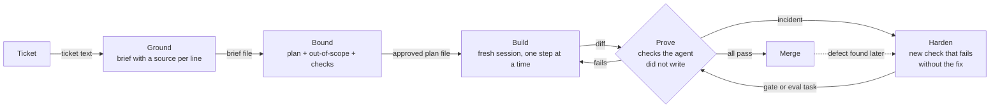
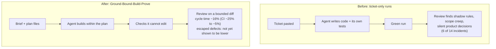

# Diagrams — Ground-Bound-Build-Prove 2.0.0 (reference, illustrative)

> Reference for lesson 14.3. Diagrams live as text next to the method and carry its version. Each box is something you can point at (an artifact or a check); each arrow is labelled with what is handed over.

## Loop (method 2.0.0)

Key: rectangles are artifacts or steps that produce one; the diamond is a decision made by checks, not by the agent; dotted arrows happen after merge.

## Before and after (one team, EXP-01)

The "after" box carries the guardrail result as well as the speed result. A before/after diagram that shows only the good number is an advertisement.
