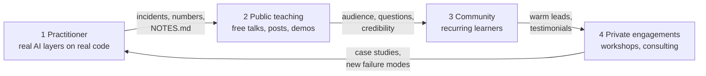

# 01.1 · The roles and the flywheel

## Why it matters

You already use coding agents every day. That makes you useful to your own team. It does not yet make you someone a stranger pays to change how *their* team builds software. Those are different jobs, and the difference is not skill. It is **evidence other people can check**.

The market is noisy. In the 2025 Stack Overflow survey, 84% of respondents use or plan to use AI tools, but more developers distrust the accuracy of AI output (46%) than trust it (33%). The most common frustration, named by 66%, is output that is "almost right, but not quite". The first rigorous field experiment on experienced developers (METR, 2025) found that AI tools made them **19% slower** on their own repositories, while the same developers estimated afterwards that they had been 20% faster. Every CTO has heard "10x". Many have also watched a pilot fizzle. Whoever walks in next is judged against both.

This lesson answers two questions before you invest months in the rest of the course. **Which job are you training for?** And **in what order do you earn the right to do it?** Get the order wrong and you arrive at a client with slides and no answer to their first hard question.

> [!NOTE]
> Content tags. **Concept** (stable): the three roles, the flywheel, the proof chain, stage-skipping failure. **Implementation**: none. The survey and study figures are dated (2024–2025) and will be superseded.

## How it works

### Three roles, three products

The job titles overlap, but each role sells something different. That changes who pays, what you deliver and how you know you succeeded.

| | Trainer | Consultant | Enablement engineer |
|---|---|---|---|
| **Sells** | learning: people can do X afterwards | an outcome: metric Y moves | adoption: the internal platform is used well |
| **Typical buyer** | engineering manager, L&D, CTO | CTO or VP Engineering | nobody; you are salaried by the platform or DevEx org |
| **Deliverable** | workshop, course, materials, exercises | assessment, AI layer built *with* the team, measurement, handover | rules, skills, CI agents and docs maintained over time |
| **Success measure** | measured learning gain; behavior change a month later | before/after number with an interval | sustained usage, fewer incidents, time saved |
| **Typical failure** | the workshop is enjoyed and nothing is learned | the metric moves while you are there and regresses after | the platform exists and nobody trusts it |
| **Where in this course** | Modules 15–18 | Modules 19–21 | Modules 3–13 are this job |

Most people who make a living here mix the three. A workshop (trainer) opens a door. It leads to an engagement (consultant). That engagement leaves behind an internal owner (enablement engineer). Pick one role to *lead with*, because your first offer, your first artifact and your first audience depend on it. Your employer is often the easiest first client for all three.

### The flywheel

The source teardown this course is built on studied one engineer-turned-trainer. It found a four-stage flywheel, where each stage produces the proof the next stage needs:



- **Practitioner.** Authority comes from scar tissue: rules files that failed, skills that broke on the edge-case ticket, a before/after number from your own `NOTES.md`. You do this in Modules 3–13. Your first measured comparison is the six-ticket run in [05.4](../module-05/lesson-04.md). The controlled one is in [13.6](../module-13/lesson-06.md).
- **Public teaching.** Free content that gives away the method. It is the top of the funnel, not the product. It is also the cheapest test of whether you can *explain*, not just *do*.
- **Community.** People who come back: office hours, a small paid group, repeat attendees. Their questions tell you what to build next.
- **Private engagements.** Gated and capped, priced on measured outcomes. Only here does the money look like consulting money.

The arrow back to the start matters as much as the forward ones. Engagements expose new failure modes, and those become new practitioner evidence. A trainer who stops practising goes stale within a few quarters in a field this volatile.

### The proof chain

The flywheel becomes practical when you write down the sentences you want to say to a future client. For each one, name the artifact that would make it checkable. If a sentence has no artifact, you can't say it yet.

This is Steve Blank's point about startups applied to one person. A new venture is a *search* for a model that works, and you test your hypotheses outside your own head rather than executing a plan you assumed. Your plan to become a paid trainer is a set of hypotheses. The proof chain lists which ones you have tested.

## Show me

A worked proof chain for a fictional student: 14 years of C#/.NET, tech lead on a SQL Server-heavy platform, daily Claude Code user.

| Sentence I want to say to a client | Artifact that makes it checkable | Produced in | Status today |
|---|---|---|---|
| "I have made a brownfield .NET codebase AI-native, not a demo." | `ai-layer-lab`: grounded rules file, 5 skills, changelog | [03.4](../module-03/lesson-04.md), [06.2](../module-06/lesson-02.md) | missing |
| "Here is how we will know whether it works." | eval harness with repeated trials and intervals | [07.1](../module-07/lesson-01.md), [07.6](../module-07/lesson-06.md) | missing |
| "The agent will not leak your customer data." | threat model, executed attacks, retest results | [09.1](../module-09/lesson-01.md), [09.6](../module-09/lesson-06.md) | missing |
| "The AI reviewer will not bury your team in noise." | CI-review precision/recall on your repo | [11.2](../module-11/lesson-02.md) | missing |
| "Teams like yours cut cycle time by X." | controlled comparison, interval, threats named | [13.6](../module-13/lesson-06.md) | missing — and maybe never X |
| "Your people can do this after I leave." | pre/post learning gain; adoption plan | Modules 16 and 19 | missing |
| "I know what hurts in shops like yours." | interview transcripts with verbatim quotes | [01.4](lesson-04.md) | **this module** |

Almost everything is "missing", and that is the correct starting state. The table turns the course into a to-do list with a reason for every item. Note the fifth row: the controlled comparison may show a smaller effect than X, or none. If it does, you say the smaller sentence. A null result you can defend beats a big number you can't.

The last row is the only one you can complete this month. It needs no code, only other people's time. That is why Module 1 is field work.

## Try it

Budget: 45 minutes. Work in a private folder `wedge/` (see the [Module 1 labs](../../labs/module-01/README.md)).

1. Write `wedge/role-and-stage.md`. Which role do you lead with — trainer, consultant or enablement engineer — and why? One paragraph. Name what you would have to stop doing to do it.
2. Place yourself on the flywheel. List every artifact you have today that someone outside your team could check: a repo, a talk, a post, a measured number. Be strict. "I'm good at prompting" is not an artifact.
3. Write **six** sentences you want to be able to say to a paying client in a year. For each, fill the proof-chain columns: artifact, module, status.
4. Circle the one sentence a skeptical staff engineer would attack first. That artifact is your priority.

<details>
<summary>Hint: sentences that are not checkable</summary>

"I'm passionate about AI", "I stay on top of the latest models" and "I've used every tool" have no artifact that proves them, and a client would not pay for them anyway. Rewrite each into a claim about *their* outcome ("your review queue…", "your migrations…") and see whether an artifact could back it.
</details>

## Break it

Here is a 90-day plan from a capable engineer who is eager to start:

```text
Week 1   Register a domain, build a website: "AI-Native SDLC Transformation".
Week 2   Pricing page: half-day workshop, two-day workshop, 6-week engagement.
Week 3   Download a popular trainer's public starter-pack repo; rebrand the skills and diagrams.
Week 4   LinkedIn post: "I help engineering teams become AI-native." Connect with 200 CTOs.
Week 5-8 Cold messages to 40 CTOs offering a free 30-minute call.
Week 9   First paid workshop (target).
Week 10+ Case study from the first workshop.
```

Before reading on: at which week does this plan fail, and what is the first hard question it can't answer?

## Fix it

**Diagnose.** Walk the plan against the proof chain. It starts at stage 4 (private engagements) with no stage 1 or 2 evidence behind it. In week 5 the CTO who does reply asks one of two things: "What happened when you did this on a codebase like ours?" or "How do you know it works?" The plan has no artifact for either. Week 3 is worse. Rebranding someone else's starter pack means reselling their method as your own expertise. It is also fragile: the first question about *why* a rule exists exposes that you did not write it. And the week-10 case study measures satisfaction, not an outcome, because no baseline was taken.

**Modify.** Put an evidence gate in front of each stage. You pass the gate by showing an artifact, not by reaching a date:

```text
Gate 1 (practitioner)   AI layer on a real brownfield repo; NOTES.md with >= 6 tickets, both ways.
Gate 2 (public)         One internal lunch-and-learn; one public piece teaching one concept you
                        can trace to your own NOTES.md; one unprompted follow-up question.
Gate 3 (community)      People who come back: repeat attendees, office-hours regulars.
Gate 4 (engagements)    A free pilot run exactly like a paid one: baseline taken before,
                        the same number measured after, feedback collected.
Pricing                 Only after gate 4 produced a number (Module 20).
```

Your own copy of the gates uses the modules that produce each artifact. Your first external action moves to *this* month: interviews (01.4). They cost nothing, need no website, and produce the one artifact you can finish now.

**Rerun.** Ask the same CTO question against the fixed plan. At gate 4 the answer is "on a .NET/SQL Server codebase like yours, here is my before/after, here is how I measured it, and here is what it did *not* show". It's slower, but it answers the question.

<details>
<summary>Solution notes: other stage-skipping patterns</summary>

- **Content before practice.** Publishing takes on agents from reading other people's posts. The first comment from a practitioner exposes it; the content cannot be traced to your own incidents (Module 14 makes this a rule).
- **Community before audience.** A paid community with no free content feeding it stays at three members.
- **Engagement without a baseline.** A paid job with no "before" number leaves you with a testimonial, not evidence. Module 13 exists so this does not happen.
- **Never returning to practice.** A trainer who stopped shipping in 2025 teaches 2025's tools in 2027.
</details>

## How do I know it works?

- [ ] `role-and-stage.md` names one lead role and one thing you will stop doing.
- [ ] Every artifact you listed as "have" can be opened by someone outside your team today.
- [ ] Six client sentences, each with an artifact, a module and a status; none of them is about you ("I'm passionate…").
- [ ] You can say in one sentence why the week-3 step of the broken plan is both unethical and fragile.
- [ ] Your next external action is something you can do this month without a website.

## Use / don't use

**Use** the proof chain whenever you are tempted to say something to a client, and when you plan the course: it tells you which module's artifact buys which sentence. **Use** your current employer as audience number one. Internal budget is the easiest first sale, and a lunch-and-learn that falls flat internally will fall flat externally too.

**Don't** start at stage 4. **Don't** resell someone else's method, repo, vocabulary or diagrams as yours. Learning from them is fine; Module 14 covers attribution. **Don't** use your employer's code, metrics or incidents in public without explicit permission, or without anonymizing past recognition. "We cut PR review time 60%" is an employer metric.

**Limitations.**

- The flywheel is modelled on one successful trainer. We don't see the people who tried the same path and stopped (survivorship bias). Treat it as a sensible order of evidence, not a guarantee of income.
- The enablement-engineer route has none of the sales risk and a salary. For many readers it is the better destination. Everything in Modules 2–13 serves it fully.
- Timelines vary widely. Field work (interviews, talks, a pilot) paces you more than reading does.

## Reflect

1. Which role do you lead with, and what did you decide to stop doing to make room for it?
2. Which client sentence would you most like to say, and which module produces its artifact?
3. What is the one thing about your current plan that a skeptical staff engineer would attack first?

## Sources

- [Becker et al. (2025) — Measuring the Impact of Early-2025 AI on Experienced Open-Source Developer Productivity](https://arxiv.org/abs/2507.09089) — randomized trial, 16 experienced developers, 246 tasks: AI tools increased completion time by 19%; developers had forecast a 24% speed-up and estimated 20% afterwards.
- [Stack Overflow Developer Survey 2025 — AI](https://survey.stackoverflow.co/2025/ai) — 84% use or plan to use AI tools; 46% distrust AI output accuracy vs 33% who trust it; 66% cite "almost right, but not quite" as the top frustration.
- [Google Cloud blog — Announcing the 2024 DORA report](https://cloud.google.com/blog/products/devops-sre/announcing-the-2024-dora-report) — AI adoption associated with gains in documentation and review speed but lower delivery throughput and stability; many respondents report little or no trust in AI-generated code.
- [Steve Blank (2010) — What's A Startup? First Principles](https://steveblank.com/2010/01/25/whats-a-startup-first-principles/) — a startup is a temporary organization searching for a repeatable business model; hypotheses are tested with customers rather than executed from a plan.
