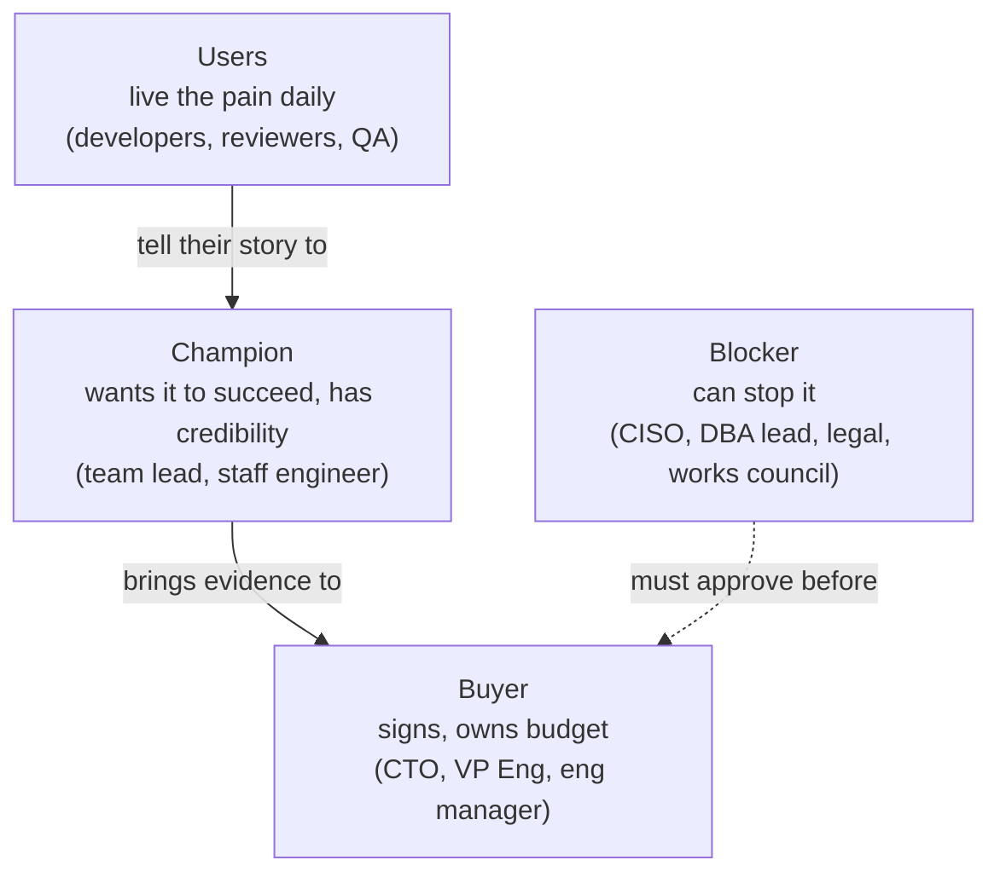

# 01.2 · Engineering pain vs AI hype

## Why it matters

The most common inbound request in this market is a sentence like *"We need AI training for our developers."* It sounds like demand, but it is really a solution looking for a problem. Nobody has said what should be different afterwards, for whom, or how anyone would notice. If you accept it as stated, you deliver a generic tour of tools. The room enjoys it, nothing changes, and there is no second engagement because there was never a first number.

Hype is not your enemy: board pressure often decides who has budget this quarter. But hype does not tell you **what to fix**. Pain does. A pain is something that already costs a specific person time or sleep, repeatedly, and that someone has already tried to work around. It is where agents can make a measurable difference, and where your later claims ([Module 13](../module-13/lesson-01.md)) can be checked.

The data says the gap between excitement and experience is wide. In 2025, 84% of Stack Overflow respondents used or planned to use AI tools, yet 66% named "almost right, but not quite" output as their top frustration. 45% said debugging AI-generated code takes longer. The 2024 DORA report associated more AI adoption with faster code review, but also with *lower* delivery stability. Those frustrations are pains. "Our AI strategy" is not one yet.

> [!NOTE]
> Content tags. **Concept** (stable): the four tests, the workaround signal, buyer / user / champion / blocker, effort vs flow, pain sizing with a capacity bound. **Implementation**: the T-SQL and `gh` queries in the lab. Survey figures are dated.

## How it works

### Four tests and one signal

A statement describes a **pain** when it passes all four tests:

| Test | Question | Passes | Fails |
|---|---|---|---|
| **Observable** | Could you see it in data or in a specific event? | "11 of 38 PRs waited over two days" | "Review is kind of slow" |
| **Recurring** | Does it happen weekly or monthly, not once? | every sprint, every release, every hire | the one outage in 2023 |
| **Costly** | Can someone name hours, delays, incidents or money? | "two of us most of a day" | "it's annoying" |
| **Owned** | Does someone with authority feel it and want it gone? | a manager lost a release date to it | only the interviewer cares |

The strongest single signal sits on top of the four: **an existing workaround or an abandoned attempt.** "We tried a spreadsheet generator twice and gave up" proves three things. The pain is real, someone already spent effort on it, and the obvious fix does not work. Rob Fitzpatrick's *The Mom Test* makes the same point about interviews. Past spending (time, money or reputation) is evidence; future enthusiasm is not.

Two other labels are useful, because not every real signal is a pain:

- **Symptom.** Observable, but the cause is unknown. "31 of 120 Copilot seats were used last month" is a number. The pain behind it might be trust, onboarding, policy or irrelevance. A symptom tells you where to dig.
- **Blocker.** A constraint someone can use to stop the work. An example is the CISO who says no agent touches customer data until she knows what leaves the building. A blocker isn't a pain you solve. It is a condition you design for, early ([Module 9](../module-09/lesson-01.md), [Module 12](../module-12/lesson-04.md)).

**Hype** has recognizable language. It names a technology instead of an event ("we should use MCP everywhere"). It names a feeling instead of a number ("we can't fall behind"). Or it names a solution instead of a problem ("we need training"). The Jobs-to-be-Done framing from Christensen and colleagues is a good corrective: customers do not want the product, they want progress on a job. Nobody wants "AI training". They want a release that ships on Thursday without a schema surprise.

### Who is in the room

One pain has several stakeholders, and each needs a different message:



- The **buyer** cares about an outcome they can report upward: lead time, incidents, onboarding weeks.
- **Users** care about their week: fewer interruptions, less rework, not being blamed for the agent's mistake.
- The **champion** needs material to carry into rooms you are not in, such as a number, a quote, or a pilot result.
- The **blocker** needs to see their concern handled *before* the buyer commits, not after.

The buyer and the users often describe *different* problems. That is normal. It is the single most useful thing a discovery conversation can reveal.

### Sizing a pain: effort and flow are different units

*Intuition.* A pain that costs 2 engineer-hours a month isn't worth a workshop. One that costs 200 might be. But calendar delay and human effort are different things. A pull request that waits 26 hours for review doesn't cost 26 hours of anyone's work. It costs the author a context switch when the review finally arrives, and it costs the *customer* a day of lead time.

*Equation.* Effort, in engineer-hours per month, is summed over the ways the pain costs work. Each term has a count $n$, a frequency $f$ per month and a time per occurrence $t$, carried as a range:

$$H_{\text{effort}} = \sum_k n_k \, f_k \, t_k \qquad H_{\text{effort}} \le \text{team capacity} = \text{developers} \times \text{productive hours per month}$$

Flow is reported separately, as a duration distribution (median and p90 of hours to first review), never multiplied into effort.

*Tiny example.* One PR a week waits over two days, and each costs the author 20–60 minutes to reload context: $1 \times 4.3 \times [20, 60]$ min ≈ 1.4–4.3 engineer-hours a month. It's small as effort. It's large as flow if that PR was a customer fix.

*Implementation.* [`labs/module-01/sql/review-wait.sql`](../../labs/module-01/sql/review-wait.sql) computes median and p90 hours to first review, PRs waiting over 48 hours, and reviewer concentration from synced PR data. The same file has a `gh pr list --json … --jq …` one-liner if you have no warehouse. Aggregates only; no titles, no names.

*Interpretation.* Always report both numbers and name who cares about each. Effort matters to developers and to cost. Flow matters to the buyer and the customer. The capacity bound catches the most common sizing error, which you will make in *Break it*.

## Show me

The module quiz scenario, worked through. A CTO of a 60-developer company writes: *"We need AI training."* In separate conversations, three developers on the 14-person claims team say that the review queue is their bottleneck. One says: *"Everything waits for the two people who know the claims engine."*

**Classify.** The CTO's request is hype with a real buyer attached. It names a solution, gives no metric, and is driven by the board. The developers' statement is a candidate pain: observable, recurring, and owned by a team lead. It isn't sized yet.

**Size it.** The team lead is allowed to share aggregates. Three months of their PR data, run through `review-wait.sql`, gives (illustrative numbers):

```text
MergedPrs  MedianHoursToFirstReview  P90HoursToFirstReview  PrsWaitingOver48h  AvgReviewsPerPr
378        26.0                      71.3                   114                2.3

ReviewerAlias  PrsReviewed  PctOfPrs
R1             131          34.7
R2             100          26.5
```

That's a month of 126 PRs, 38 of them waiting over two days, and two reviewers covering 61% of the PRs.

| Term | $n \cdot f$ per month | $t$ | Engineer-hours / month |
|---|---|---|---|
| Author context reload on PRs waiting > 48 h | 38 | 20–60 min | 13–38 |
| Rebase and conflict fixing after long waits | ~12 | 30–90 min | 6–18 |
| **Effort total** | | | **19–56** |
| Capacity check: 14 developers × ~140 h | | | 1,960 → the pain is 1–3% |

**Interpret.** As effort, this pain is modest. As **flow**, it adds a median day and a p90 of three days to every change, and a customer-facing fix waits in the same queue. As **risk**, two people carry most of the claims-engine knowledge. The buyer (CTO) cares about lead time and key-person risk. The users care about interruptions. The champion is the team lead who shared the data.

**Rewrite the request as a problem.** *"Claims-engine PRs wait a median 26 hours (p90 71) for a first review because two reviewers hold most of the knowledge; agents are about to increase PR volume."* That problem has a baseline number and could be measured again after an intervention. The intervention might combine an agent first-pass reviewer ([11.2](../module-11/lesson-02.md)) with rules that capture the experts' conventions ([03.4](../module-03/lesson-04.md)). Or it might be nothing to do with AI. That's fine too. "AI training" appears nowhere in it, and the CTO can still say yes to it, because it gives the board something concrete.

## Try it

Budget: 60 minutes.

1. Classify the twelve statements in [`exercises/hype-or-pain.md`](../../labs/module-01/exercises/hype-or-pain.md) as pain, hype, symptom or blocker. For each, note which tests it passes and the next question you'd ask. Check against the key.
2. Pick one pain from your own work that you can see in data. Review wait, migration incidents and onboarding weeks are all good candidates. Size it in `wedge/pain-sizing.md`: effort terms as $n \cdot f \cdot t$ ranges, flow as median and p90, and the capacity check.
3. For the same pain, name the buyer, users, champion and blocker by *role*, and write one sentence each on what they would need to hear.
4. Rewrite a hype-shaped request you have heard (from your organization, a meetup, a LinkedIn post) as a measurable problem statement, in the form used above.

<details>
<summary>Hint: you have no PR data you are allowed to use</summary>

Use your own PRs only (`gh pr list --author @me …`), or size a pain from memory with deliberately wide ranges and mark every number "estimated". A wide honest range is better than a precise invented one. Never export colleagues' names or PR titles.
</details>

## Break it

A first draft of the pain sizing, as a slide:

```text
REVIEW QUEUE COST
126 PRs/month x 26 h median wait = 3,276 engineer-hours/month wasted
At 14 developers, that's 234 hours per developer per month.
```

Before reading on: what is wrong, and how could you catch it without domain knowledge?

## Fix it

**Diagnose.** The capacity check catches it. 14 developers have about 1,960 productive hours a month, and the slide claims 3,276 hours of waste. That's 167% of everything the team does, or 234 hours per developer against roughly 140 available. A pain can't cost more than the team's entire capacity. The error is in the units: 26 hours is **calendar** time the PR sat in a queue. The author was working on something else during those hours. Multiplying calendar wait by PR count turns flow into fake effort.

**Modify.** Split the number by unit and by audience:

```text
FLOW   (buyer, customer):  median 26 h, p90 71 h to first review; 38 PRs/month wait > 48 h
EFFORT (developers, cost): 19-56 engineer-hours/month (context reload + rebases), 1-3% of capacity
RISK   (buyer):            2 reviewers cover 61% of PRs
```

**Rerun.** Capacity check: 56 hours at the top of the range is 3% of 1,960, which is plausible. The fixed slide is less dramatic, and it holds when a CTO checks it. The first version would have cost you the CTO's trust in everything else.

<details>
<summary>Solution notes: other sizing errors</summary>

- **Point estimates.** "45 minutes per reload" invites a debate you cannot win. "20–60 minutes" invites agreement.
- **Money too early.** Converting hours to currency invites a price conversation before you have evidence that an intervention changes anything. Keep M1 in hours; Module 20 converts measured ranges into prices.
- **Sizing the symptom.** "89 unused seats × licence cost" sizes a procurement problem. The pain is whatever made 89 people stop.
</details>

## How do I know it works?

- [ ] Your hype-or-pain classifications match the key on at least 10 of 12, and you can defend the differences.
- [ ] `pain-sizing.md` separates effort (engineer-hours, range) from flow (median, p90) and passes the capacity check.
- [ ] Every number is marked measured or estimated, with its source.
- [ ] Buyer, users, champion and blocker are named by role, with what each needs to hear.
- [ ] Your rewritten problem statement contains a baseline number and names no tool.

## Use / don't use

**Use** the four tests on every request before you propose anything, including requests from your own manager. **Use** the stakeholder map before any pilot: the blocker you did not meet is the pilot that gets cancelled in week three.

**Don't** dismiss hype. It tells you who has budget and urgency; ask what event made the board ask. **Don't** size pains in money in this module. **Don't** propose AI where the pain is not about AI: a two-person knowledge bottleneck may need pairing and documentation more than an agent, and saying so is the most credible thing you can do.

**Limitations.**

- Sizing from a few months of data is noisy; seasonal release cycles and holidays move review wait a lot. Carry ranges and say so.
- Self-reported pain is biased toward the recent and the vivid. The METR study showed that developers' own estimates of AI speed-up had the wrong sign; the same applies to "how much time does this cost you?". Prefer data and past events.
- Some real costs, such as burnout, attrition and the one incident that reached a customer, resist hour-based sizing. Name them instead of forcing a number.

## Reflect

1. Which request in your own organization is hype-shaped, and what event do you think is behind it?
2. What is the biggest pain you sized, in effort and in flow, and who cares about each number?
3. Who would be the blocker for your first pilot, and when will you talk to them?

## Sources

- [Stack Overflow Developer Survey 2025 — AI](https://survey.stackoverflow.co/2025/ai) — 84% use or plan to use AI tools; 66% cite solutions that are "almost right, but not quite"; 45% say debugging AI-generated code is more time-consuming.
- [Google Cloud blog — Announcing the 2024 DORA report](https://cloud.google.com/blog/products/devops-sre/announcing-the-2024-dora-report) — AI adoption associated with faster code review and better documentation, but lower delivery throughput and stability.
- [Becker et al. (2025) — METR randomized trial](https://arxiv.org/abs/2507.09089) — developers estimated a 20% speed-up after the study while measured completion time increased by 19%: self-reports are not measurements.
- [Christensen et al. (2016) — Know Your Customers' Jobs to Be Done](https://hbr.org/2016/09/know-your-customers-jobs-to-be-done) — customers "hire" products to make progress on a job; understanding the job, not product features or demographics, predicts what they will adopt.
- [Rob Fitzpatrick — The Mom Test](https://www.momtestbook.com/) — how to talk to customers when everyone is being polite: past behavior and commitments over opinions and compliments.
