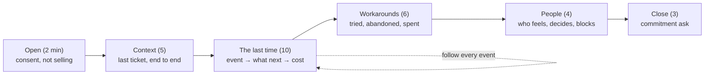

# 01.4 · Customer discovery interviews

## Why it matters

Everyone you interview will be nice to you. That is the problem. Ask "would you attend a workshop on this?" and people say yes, because saying no to a hopeful person's face is unpleasant. Ask "don't you find agents misunderstand legacy code?" and they agree, because you told them the answer. You leave delighted, having learned nothing while believing you learned something.

It is one of the best-replicated findings in psychology: **the question shapes the answer.** In Loftus and Palmer's 1974 experiment, people watched the same film of a car crash. Those asked how fast the cars were going when they "smashed" into each other estimated about 41 mph. Those asked with "hit" estimated about 34 mph. One verb moved the "memory" by 7 mph. Pew Research documents the same effect in surveys: support for the same policy moved from 68% to 43% when the question mentioned casualties.

Done well, a discovery interview gives you what nothing else in this course can: **verbatim evidence from strangers** about what hurts. Those quotes become your workshop's hooks, your eval tasks and your first case for a pilot. They fill the one row of the proof chain ([01.1](lesson-01.md)) you can finish this month.

> [!NOTE]
> Content tags. **Concept** (stable): the three rules, the evidence ladder, question defects, how many interviews, keep/change/kill. **Implementation**: the `TranscriptLint` heuristics and the worksheet formats.

## How it works

### Three rules

From Rob Fitzpatrick's *The Mom Test*, a book about talking to customers when everyone is being polite:

1. **Talk about their life, not your idea.** Once you describe your solution, the conversation becomes about being nice to you.
2. **Ask about specifics in the past, not generics or the future.** "Tell me about the last time…" gets an event. "Would you…" gets a guess. "Do you usually…" gets an average of things that never happened.
3. **Talk less, listen more.** When they mention an event, follow it. The script can wait.

### The evidence ladder

Not all answers are equal. Rank what you hear:

| Rung | Example | Worth |
|---|---|---|
| 7. Commitment now | "I'll introduce you to our DBA lead." · "Here's the anonymized PR export." | strongest: it costs them something |
| 6. Past spend / workaround | "We tried an AI reviewer and turned it off after three weeks." | the pain is real and the easy fix failed |
| 5. Specific past event with cost | "It dropped a default constraint; two of us lost most of Thursday." | evidence |
| 4. Specific past event | "Last sprint one PR sat for four days." | evidence, not yet sized |
| 3. Generic past | "We usually have review delays." | weak: an average of unknown events |
| 2. Opinion / prediction | "AI makes me 30% faster." · "My manager would see the value." | noise; often wrong in sign |
| 1. Future promise / compliment | "I'd attend." · "Sounds great!" | worthless |

Your questions decide which rung you get. The defect codes used in the lab name the questions that push people down the ladder:

| Code | Defect | Example | Rewrite |
|---|---|---|---|
| **L** | leading | "Don't you find…?" | "Tell me about the last time…" |
| **H** | hypothetical / future | "Would you pay…?" | "What have you spent trying to fix it?" |
| **G** | generic | "Do you ever…?" · "on a scale of 1–10" | "When did it last happen?" |
| **P** | pitch | "My workshop covers…" | (say nothing about your idea) |
| **D** | double-barrelled | "…and how would you fix it?" | one question at a time |
| **C** | compliment-fishing | "Do you like the idea?" | (don't) |
| **A** | anchoring | "30%? 50%?" | let them give the number, or none |
| **M** | missed thread | they mention an incident; you move on | "What happened next?" |

### The shape of a 30-minute interview



The full script, consent wording, question rewrites and the keep/change/kill table are in the [customer discovery script template](../../templates/customer-discovery-script.md).

### How many interviews, and what they can't tell you

*Intuition.* If a pain is common in your audience, a handful of interviews will surface it. A handful can't tell you *how* common it is.

*Equation.* If a fraction $p$ of your audience has a pain and you interview $n$ people independently, the chance you hear it at least once is

$$P(\text{heard} \ge 1) = 1 - (1-p)^n$$

*Tiny example.* $p = 0.3$, $n = 5$: $1 - 0.7^5 = 1 - 0.168 = 0.83$. For a rarer pain, $p = 0.1$: $1 - 0.9^5 = 0.41$. Hearing a $p = 0.3$ pain **at least twice** in five interviews happens only $1 - 0.168 - 5 \cdot 0.3 \cdot 0.7^4 = 0.47$ of the time. Nielsen's usability rule of thumb comes from the same formula: with a typical per-user discovery rate of 31%, five users find about 85% of the problems. In qualitative research, Guest, Bunce and Johnson found that themes saturated within about twelve interviews, with the main themes present by six.

*Implementation.* Log each interview in `interview-log.csv`. A pain enters the pain map when a past, specific event supports it, and becomes a *problem statement* once it is heard in at least two **independent** interviews. Two people on the same team telling the same story count as one.

*Interpretation.* Three to five interviews are for **finding** pains and checking your wedge's language. They are not for measuring prevalence. "3 of 5 said" has a 95% Wilson interval of roughly 23% to 88% (the same interval you meet in [07.4](../module-07/lesson-04.md)). Write "3 of 5 interviewees", never "60% of teams".

## Show me

The heart of the lab transcript, [`bad-interview.md`](../../labs/module-01/transcripts/bad-interview.md). Noa, a senior .NET developer, has just offered the best evidence of the call:

```text
Q7  Interviewer: What's the biggest problem with AI tools for your team, and how would you fix it?
    Participant: Trust, I guess. Last month one of the juniors merged a migration that Copilot
                 wrote, and it dropped a default constraint on the Claims table. We only caught it
                 in staging on the Thursday. It took two of us most of a day to find and fix.
Q8  Interviewer: Better context, actually — that's exactly what the rules-file part of my workshop
                 solves. Do you think your manager would see the value in something like that?
```

Q7 is double-barrelled and generic ("biggest problem… and how would you fix it"), but Noa answers on rung 5 anyway: a specific past event with a cost. Q8 throws it away. It pitches (P), asks for a prediction about someone else (H), and never returns to the migration (M). The whole thread should have been: *"Walk me through that migration from when it was written."* · *"What happened next?"* · *"What did you change afterwards?"*

The student critiqued the transcript by hand first, then ran the linter:

```text
$ dotnet run --project tools/TranscriptLint -- transcripts/bad-interview.md
Q    flags    past?  interviewer
Q1   P               Thanks so much for doing this! So, I'm building a workshop th...
Q2   L               Great. And don't you find that most developers are using them...
...
Q9   -               Awesome. Would your team attend a two-day workshop on this?
...
Q17  -               Amazing, that's really encouraging. Anything else you think I...
Summary
  flagged               15 (83%)
  past-specific asks    0
  talk share            interviewer 307 words, participant 260 words -> interviewer 54%
  participant turns     18: past evidence 3, opinion/future 11, neutral 4
  evidence after        Q5, Q7, Q15
```

Zero past-specific questions. The interviewer spoke more than the participant. Only 3 of 18 answers carried past evidence, and the next question dropped each one. The linter missed Q9: "would **your team** attend" is hypothetical, but its pattern looks for "would **you**". It also missed Q17, which asks the participant to design the product. It can't see a missed thread at all. The [answer key](../../labs/module-01/solutions/bad-interview-key.md) finds defects in 17 of 18 questions.

Two weeks later the student re-interviewed Noa with the script ([`better-interview-excerpt.md`](../../labs/module-01/transcripts/better-interview-excerpt.md)). Six questions, zero flags, 5 of 6 answers on rungs 4–7, and an interviewer talk share of 23%. The close produced a commitment: an introduction to the DBA lead, who "has a list of the conventions in his head". That list is the start of a grounded rules file ([03.4](../module-03/lesson-04.md)) and of an eval task set ([07.2](../module-07/lesson-02.md)).

## Try it

> [!WARNING]
> You are interviewing real people about their employers. Get consent before taking notes. Record only with explicit consent. Never ask for confidential code, customer data or numbers they are not allowed to share. File notes under ids (`I01`…), with no names or company names, in a **private** folder. Do not interview people who report to you.

Budget: about 5 hours over one to two weeks. Materials: [Module 1 labs](../../labs/module-01/README.md) and the [discovery script](../../templates/customer-discovery-script.md).

1. **Critique by hand (25 min).** For every question in `bad-interview.md`, write its defect codes. List the usable evidence (rungs 4–7), the opinions (rungs 1–3) and every dropped thread. Write the question that should have followed each piece of evidence.
2. **Critique with the linter (10 min).** Run `TranscriptLint` on the same file. List where it agrees with you, where it misses, and where it flags something you think is fine. Then read the answer key.
3. **Prepare (30 min).** Write your wedge hypothesis at the top of a new file, so you can tell afterwards whether you *heard* it or *put* it there. Pick 6–8 questions from the script. Choose one commitment ask that costs the participant something real.
4. **Recruit (spread over days).** Ask 8–10 people from your reachability funnel (01.3) for 30 minutes, expecting 3–5 to say yes. Use the consent message from the template. People outside your own team only.
5. **Interview (3–5 × 30 min).** Follow events, not the script. Write verbatim quotes in quotation marks as you go.
6. **Log within 24 hours.** Add a row to `interview-log.csv` per interview. Put notes in `interviews/I0N.md` using `I:` / `P:` lines, and run `TranscriptLint` on your own notes.
7. **Map and decide.** Build `pain-map.md` from past, specific events only, then write the verdict (keep / change / kill) in `wedge.md`.

<details>
<summary>Hint: the participant keeps giving opinions</summary>

Redirect gently to an event: "That's interesting — when did that last happen?" If they cannot name one, that is data too: the pain may not be recurring for them. Do not argue with an opinion, and do not repeat your question with more emphasis; that is how leading questions are born.
</details>

## Break it

A student's summary after five interviews:

```text
INTERVIEW SUMMARY (5 interviews)
- 5/5 loved the workshop idea
- 4/5 would attend a 2-day workshop; 3/5 said they'd pay for it
- Average pain score for "agents don't understand legacy code": 7.4 / 10
- Everyone agreed rules files would help
- Verdict: wedge validated, start building the workshop
```

Before reading on: which rung of the evidence ladder is each line on, and what would you expect the student's notes to look like?

## Fix it

**Diagnose.** Every line sits on rung 1 or 2. "Loved the idea" is a compliment. "Would attend" and "would pay" are future promises. The 7.4 is a generic opinion on a scale the student offered. "Agreed rules files would help" is the answer to a leading question that contained the solution. Running `TranscriptLint` on the notes would show the same pattern as the bad transcript: most questions flagged P, H, G or L, almost no past-specific asks, and an interviewer talk share around half. There isn't a single dated event, sized cost, workaround or commitment. The verdict "validated" comes from the questions, not from the participants.

**Modify.** Re-score each interview on the ladder and keep only rungs 4–7. For this student that leaves two events: a migration incident and a stored-procedure convention. Neither was followed up. Book a second round with the same people, or new ones. Open each call on the events you already have ("Last time you mentioned…"), follow them with *what happened next / what did you change / who else*, and close with a commitment ask. Change the summary format so it cannot hold rung-1 lines:

```text
| Pain | Events (interview, when) | Cost evidence | Workaround | Commitments |
```

**Rerun.** The second round, in the worked [pain map](../../labs/module-01/examples/pain-map-example.md), finds agent-written migrations in 3 of 5 interviews, with dated events, 8–16 engineer-hours each and two workarounds (a ban for juniors and manual DBA review). It also yields two commitments. The verdict changes from "validated, build the workshop" to **change**. The stack and audience stay. The pain moves from "agents don't understand legacy code" to "safe schema and procedure changes". It's a smaller, sharper claim, and it is backed by other people's words.

<details>
<summary>Solution notes: presupposing questions the linter misses</summary>

"How much time does the review bottleneck waste each week?" passes every regex in `TranscriptLint`, yet it presupposes that there is a bottleneck and that it wastes time. The participant now estimates a number for your premise. Rewrite: "What happened with the last PR you opened?" Heuristics catch surface wording; only a human reading the transcript catches a premise smuggled into a clean sentence.
</details>

## How do I know it works?

- [ ] Your hand critique of `bad-interview.md` found defects in at least 15 of 18 questions and all three dropped evidence threads (Q5, Q7, Q15).
- [ ] You can name two things `TranscriptLint` cannot detect.
- [ ] 3–5 real interviews logged, with consent recorded, verbatim quotes, and no names.
- [ ] In your own notes, most participant answers are on rungs 4–7, and your talk share is under about 30%.
- [ ] At least one commitment was asked for in every interview, and at least one was given.
- [ ] `pain-map.md` contains only pains backed by past events; problem statements only for pains heard in ≥ 2 independent interviews.
- [ ] `wedge.md` has a dated verdict (keep / change / kill) and the evidence line that decided it.

## Use / don't use

**Use** discovery interviews before you build anything for other people (workshop, demo repo, pilot) and whenever your wedge changes. The same technique works inside your own company.

**Don't** pitch, not even at the end "just to get feedback". **Don't** interview only friends; kindness is noise. **Don't** report prevalence from five interviews. **Don't** ask about price: it turns a research call into a sales call (the sales discovery *call* is Module 20's).

**Limitations.**

- Five interviews find common pains; rare but expensive pains, such as the once-a-year production outage, can hide. Ask directly about the worst event of the last year.
- Memory favors recent, vivid events. Cross-check with data where they may share it (01.2).
- Your recruitment is biased toward people who like talking to you. Note how you reached each person in the log, and look for someone who disagrees with your hypothesis.
- `TranscriptLint` is a regex heuristic. Treat every flag as a prompt to look, never as a score to optimize.

## Reflect

1. Which question from your own interviews produced the best evidence, and what made it work?
2. What did you hear that contradicted your wedge hypothesis, and did it change the wedge?
3. Which verbatim quote would you open your future workshop with, and why that one?

## Sources

- [Rob Fitzpatrick — The Mom Test](https://www.momtestbook.com/) — talking to customers when everyone is lying to you out of politeness; talk about their life, ask about specific past behavior, listen more than you talk, seek commitments over compliments.
- [Loftus & Palmer (1974) — Reconstruction of automobile destruction](https://www.sciencedirect.com/science/article/pii/S0022537174800113) — the verb in the question ("smashed" vs "hit") shifted speed estimates for the same filmed crash from about 34 to about 41 mph.
- [Pew Research Center — Writing Survey Questions](https://www.pewresearch.org/writing-survey-questions/) — wording and order effects on answers (e.g. 68% vs 43% support depending on whether casualties are mentioned); acquiescence bias in agree/disagree questions.
- [Nielsen (2000) — Why You Only Need to Test with 5 Users](https://www.nngroup.com/articles/why-you-only-need-to-test-with-5-users/) — problems found with n users $= N(1-(1-L)^n)$, typical $L = 31\%$; five users find about 85%.
- [Guest, Bunce & Johnson (2006) — How Many Interviews Are Enough?](https://journals.sagepub.com/doi/10.1177/1525822X05279903) — in their study, saturation occurred within the first twelve interviews, with basic metathemes present by six.
