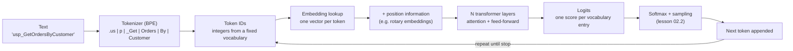

# 02.1 · From text to next token

## Why it matters

Every strange thing a coding agent does has a mechanical explanation, and most of those explanations start here. The agent "ignored" line 240 of your rules file. It quoted a column that was dropped two years ago. It handled an English ticket well and a Hebrew one badly. It cost four times what you budgeted on a legacy solution. None of these is mysterious once you can see the pipeline: text becomes tokens, tokens become vectors, attention mixes the vectors, and the model emits a probability distribution over the next token — once per token, thousands of times per task.

You need this for two jobs. As a practitioner, it tells you what to measure (tokens, not characters; effective context, not the number on the pricing page). As a trainer, it is the difference between "the AI got confused" and "the fact sat in the middle of 180,000 tokens of competing notes, and attention is a shared budget" — the second sentence is the one that earns a room of senior engineers' trust.

> [!NOTE]
> Content tags: **concept** — tokenization, attention, logits, context degradation (stable for years). **Implementation** — specific tokenizers, window sizes, prices (rot quarterly; every number marked "as of 2026-09").

## How it works

A decoder-only transformer — the architecture behind every mainstream coding agent's model — does one thing: given a sequence of tokens, produce a score for every token in its vocabulary as a candidate for the *next* one. Everything else is repetition.



### Tokenization

The model never sees characters. A tokenizer, usually a variant of **byte-pair encoding (BPE)**, splits text into sub-word pieces drawn from a fixed vocabulary of roughly 100k–200k entries. BPE starts from bytes and repeatedly merges the most frequent adjacent pairs in its training corpus, so common strings (`using System;`, ` the`) become single tokens and rare strings (`Contoso`, Hebrew morphology, your company's table prefixes) shatter into several.

Three consequences you will meet constantly:

- **Cost and limits are in tokens.** Pricing, rate limits, the context window and `max_tokens` all count tokens, not characters or lines.
- **Tokenizers differ between vendors and between model generations.** The same file has a different token count on each. Anthropic's docs state that its newer tokenizer (Claude Opus 4.7 and later, as of 2026-09) produces roughly 30% more tokens for the same text than earlier models — so a budget measured last year is wrong this year.
- **Languages and code are not equal.** Anything under-represented in the tokenizer's training data costs more tokens per character. You will measure this for Hebrew below.

### Embeddings and position

Each token ID indexes a row in an embedding matrix: a vector of a few thousand numbers. Similar tokens end up with similar vectors, but a token's vector carries no information about *where* it is. Position is injected separately — most current open models use rotary position embeddings (RoPE), which rotate the vectors by an angle that depends on position, so attention can tell "near" from "far". Long-context variants stretch these schemes beyond the lengths the model mostly trained on, which is one reason quality drops at the far end of a window.

### Attention

Inside each layer, every token builds a **query** vector and compares it with the **key** vector of every earlier token; the scores go through a softmax to become weights that sum to 1, and the token takes that weighted mix of the earlier tokens' **value** vectors:

$$\text{Attention}(Q,K,V) = \text{softmax}\!\left(\frac{QK^\top}{\sqrt{d_k}}\right)V$$

**Intuition first:** attention is how the token `Customer` at the end of your question "looks back" and finds the line in `OrderService.cs` it is about. **The equation** says the weights are a softmax, so they compete: raising one lowers the others.

**Tiny example.** Say the relevant line scores $s = 2$ and each irrelevant line scores $0$. With $N$ irrelevant lines, the weight on the relevant one is

$$w = \frac{e^{2}}{e^{2} + N \cdot e^{0}} = \frac{7.39}{7.39 + N}$$

With $N = 10$, $w = 0.42$. With $N = 1{,}000$, $w = 0.0073$. **Interpretation:** piling irrelevant material into context can dilute the signal even when the fact is present. Real models have dozens of layers and many attention heads, and they learn to produce much sharper scores than 2 vs 0 — so treat this as intuition for *why* distractors hurt, not as a prediction. Module 4 turns this into a context budget.

Attention over $n$ tokens costs on the order of $n^2$ comparisons for the input ("prefill"), which is done in parallel. Output is generated one token per forward pass ("decode"), with the keys and values of earlier tokens held in a **KV cache**. That asymmetry is why output tokens are priced several times higher than input tokens (for example $4 vs $20 per million on one current model, as of 2026-09) and why a long answer takes longer than a long question.

### Logits and the context window

The last layer produces a **logit** — an unnormalised score — for every vocabulary entry. Lesson 02.2 turns logits into choices. The **context window** is the maximum number of tokens (input plus output) the model can attend over in one request: 200k to 1M tokens on current frontier models, as of 2026-09.

**Nominal is not effective.** Liu et al. found a U-shape: models use information at the beginning and end of a long input much better than information in the middle. The RULER benchmark found that of 17 long-context models, almost all dropped sharply as length grew on tasks harder than single-needle retrieval, and only about half that claimed 32k or more held satisfactory performance at 32k. The window is a hard limit; the *useful* window for your task is smaller, and you have to measure it.

## Show me

Real numbers from the lab's `TokenLab`, run on four sample files with `Microsoft.ML.Tokenizers` 2.0.0 (`cl100k_base` is an older OpenAI encoding, `o200k_base` a newer one). The English and Hebrew tickets say the same thing.

| File | Chars | cl100k | o200k | chars/token (o200k) |
|---|---:|---:|---:|---:|
| `OrderService.cs` (legacy Dapper service) | 1,413 | 269 | 281 | 5.03 |
| `usp_GetOrdersByCustomer.sql` | 699 | 196 | 201 | 3.48 |
| `ticket-en.txt` | 336 | 76 | 76 | 4.42 |
| `ticket-he.txt` (same ticket, Hebrew) | 294 | 270 | 115 | 2.56 |

What to read from this:

- **The Hebrew ticket is shorter in characters but costs 3.6× the English one on cl100k (270 vs 76) and 1.5× on o200k (115 vs 76).** A newer tokenizer with a bigger vocabulary cut the Hebrew penalty by more than half. If your wedge includes Israeli, Arabic or Russian-speaking teams, this is a line item.
- **The "4 characters per token" rule of thumb fails both ways.** It predicts 74 tokens for the Hebrew ticket; cl100k actually uses 270 — a 3.6× underestimate. It predicts 353 tokens for the C# file; o200k uses 281.
- **SQL is expensive per character.** Whitespace alignment and identifiers like `@CustomerId` split badly: 3.48 chars/token versus 5.03 for C#.
- **Tokenizers disagree even in the same family.** o200k is *worse* than cl100k on this C# file (281 vs 269) while being far better on Hebrew.

The boundaries show why. First tokens of each file under o200k (`|` marks a boundary):

```text
using| System|.Data|.Sql|Client|;|using| D|apper|;|namespace| Cont|oso|.Leg|acy|.|Orders
CREATE| OR| ALTER| PROCED|URE| dbo|.us|p|_Get|Orders|By|Customer|   | @|Tenant|Id|  | INT
ב|אג|:| מס|ך| הה|ז|מנות| של| ה|לק|וח| מצ|יג| הז|מנות| של| ד|ייר
```

`Dapper`, `Contoso` and `usp_` are not in the vocabulary as whole words, so they fragment. The word for "the orders" (ההזמנות) becomes three tokens. The model still handles all of this — but every fragment is a position that attention has to stitch back together, and every one is billed.

**Extrapolation (label it as such when you teach it):** at ~5 chars/token, a legacy solution of 1,200 `.cs` files averaging 9 KB is about 10.8M characters, or ~2.2M tokens — more than any current window, before a single SQL file. "Just give the agent the whole repo" is not an option on real brownfield code, which is why Module 4 exists. Run `TokenLab solution` on your own repo for the real number.

## Try it

All labs are in [labs/module-02](../../labs/module-02/README.md). You need the .NET 8+ SDK; the needle test also needs an API key for one provider (or a local Ollama).

1. Count tokens on the samples and look at the boundaries:

   ```bash
   cd labs/module-02/01-tokens
   dotnet run -- count --show 30
   ```

2. Add a third tokenizer — your agent's own. With an Anthropic key, set `ANTHROPIC_COUNT_MODEL` to a current model id and rerun; the lab calls the free `/v1/messages/count_tokens` endpoint. Note the count includes a few tokens of message framing, so compare files relative to each other.
3. Measure your real solution and what it would cost to read once (use the input price from your provider's pricing page, and write down the date):

   ```bash
   dotnet run -- solution C:\src\YourLegacySolution --price 4.00
   ```

4. Run the single-needle test at five positions, three runs each, on ~20k tokens:

   ```bash
   dotnet run -- needle --provider anthropic --model <model-id> --tokens 20000 --runs 3
   ```

   Record the table in `ai-layer-lab/fundamentals/tokens.md`. Then repeat at `--tokens 100000` if your budget allows.

## Break it

Single-needle retrieval is the easy case — RULER reports near-perfect scores on it for most models. Real repositories are not single-needle: the same fact appears several times, in different states of truth. A connection timeout lives in `appsettings.json`, an old wiki page and an abandoned PR description.

Run the multi-needle variant. It inserts two distractors — a 2019 value (3) and a never-deployed proposal (5) — at other positions, and asks for the **current production** value (7):

```bash
dotnet run -- needle --provider anthropic --model <model-id> --tokens 100000 --variant multi --runs 3
```

Before you run it, write down your prediction: at which positions will it miss, and which wrong number will it give? Then look at every miss the lab prints. A wrong answer of 5 or 3 is not "hallucination" — the model retrieved a real fact from your context, just the wrong one. That distinction matters in lesson 02.5.

A second, quieter break: estimate the Hebrew ticket's budget with chars/4, then feed 40 such tickets into a prompt sized to that estimate. On cl100k you are 3.6× over budget and the tail gets truncated — silently, if your harness trims from the front.

## Fix it

Diagnose first: was the miss about **position** (the needle in the middle was missed, the ends were fine), about **interference** (a distractor was returned), or about **length** (everything degrades at 100k but not at 20k)? The table from Break it tells you which.

Then change one thing at a time and rerun:

- **Remove the stale facts at the source.** Delete or clearly archive the 2019 note. The best context fix is less context.
- **Label authority explicitly.** "Current production setting (source: appsettings.Production.json, 2026-09)" beats a bare sentence; the model can only prefer what it can distinguish.
- **Move the authoritative fact near the question**, at the end of the prompt — the strong side of the U-curve.
- **Shrink the haystack.** Rerun at 20k. If the misses vanish, you have measured your effective context for this kind of task.

For the budget break: count with the tokenizer of the model you will call, not a heuristic, and truncate on token boundaries (`GetIndexByTokenCount` in `Microsoft.ML.Tokenizers`), keeping the newest content.

<details>
<summary>An illustrative diagnosis (invented numbers, real reasoning)</summary>

"Multi-needle at 100k: 13/15 correct. Both misses at the 50% position, both answered 5 (the draft proposal sat at 16%, the stale value at 83%). At 20k: 15/15. After deleting the 2019 note and labelling the current value with its source: 15/15 at 100k. Classification: interference + position, not insufficient context." Your numbers will differ; the shape of the reasoning should not.

</details>

## How do I know it works?

- Your `tokens.md` has a table of at least three tokenizers for C#, SQL, English and Hebrew samples, plus your own solution's total — and a note of which tokenizer your agent actually uses.
- Your position table covers 5 positions × ≥3 runs for both variants, and the fixed version scores at least as well as the broken one at every position. Three runs is too few to prove a difference; it is enough to see a pattern worth testing properly in Module 7.
- The provider's `usage.input_tokens` for the needle run is within roughly 10–30% of the o200k estimate. If it is further off, you have just learned that your estimates for this vendor need the vendor's counter.

## Use / don't use

**Use** a local tokenizer (`Microsoft.ML.Tokenizers`, `tiktoken`) for fast estimates and for truncating on token boundaries. **Use** the provider's counting endpoint or the `usage` field in responses for anything you bill or budget. **Use** position and interference tests whenever you are about to put more than a few thousand tokens of reference material in front of an agent.

**Don't use** chars/4, lines of code or file sizes as token estimates for non-English text or SQL. **Don't** treat the advertised window as the usable one. **Don't** reuse token counts across vendors or across model generations of the same vendor.

**Limitations:** the attention-dilution example is intuition, not a model of a real network. Needle tests measure retrieval, not reasoning over what was retrieved — a model that finds the right config value can still misuse it. And tokenizer numbers here are for these samples; measure your own code.

## Reflect

Write three lines in your learning log:

1. The token count that surprised me most, and why the tokenizer produced it.
2. Where, in my own repository, the same fact exists in more than one state of truth.
3. How I would explain "effective vs nominal context" to a sceptical senior engineer in two sentences.

## Sources

- Vaswani et al., [Attention Is All You Need](https://arxiv.org/abs/1706.03762) — the transformer and scaled dot-product attention.
- Sennrich et al., [Neural Machine Translation of Rare Words with Subword Units](https://arxiv.org/abs/1508.07909) — byte-pair encoding for sub-word tokenization.
- Su et al., [RoFormer: rotary position embedding](https://arxiv.org/abs/2104.09864).
- Liu et al., [Lost in the Middle](https://arxiv.org/abs/2307.03172) — the U-shaped position effect.
- Hsieh et al., [RULER](https://arxiv.org/abs/2404.06654) — effective vs claimed context length across 17 models.
- Microsoft Learn, [Use Microsoft.ML.Tokenizers](https://learn.microsoft.com/en-us/dotnet/ai/how-to/use-tokenizers) — the .NET tokenizer library used in the lab.
- Claude API docs, [Token counting](https://platform.claude.com/docs/en/build-with-claude/token-counting) — counting endpoint; newer tokenizer ~30% more tokens (as of 2026-09).
- Claude API docs, [Models overview](https://platform.claude.com/docs/en/models/overview) — context windows and input/output price ratio (as of 2026-09).
