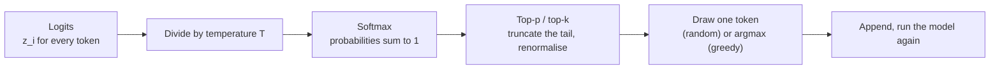

# 02.2 · Sampling and (non-)determinism

## Why it matters

A ticket that your agent completes correctly 7 times out of 10 is the most common state of affairs in AI-assisted development, and the most commonly misread one. One person sees the success and says "it works". Another sees the failure and says "it's random". A third sets temperature to 0 and declares it fixed. All three are wrong, and the way they are wrong is predictable from about ten lines of arithmetic.

This lesson gives you that arithmetic. It explains where variation comes from (sampling, and — less famously — the inference server itself), why an agent trajectory multiplies small per-step risks into large per-task ones, and why "make it deterministic" is the wrong goal. The right goal is a high, *measured* success rate plus a verifier that catches the rest. Every evaluation idea in Module 7 grows from this.

> [!NOTE]
> Content tags: **concept** — softmax, temperature, top-p, compounding probability, sources of non-determinism. **Implementation** — which parameters a given provider or model still exposes (this changes; see "as of 2026-09" notes).

## How it works

Lesson 02.1 ended with logits: one raw score per vocabulary entry. Decoding turns them into one chosen token.



### Softmax with temperature

**Intuition.** Logits are "how much the model likes each option". Softmax turns preference into probability; temperature decides how strongly the favourite wins.

**Equation.**

$$p_i = \frac{e^{z_i / T}}{\sum_j e^{z_j / T}}$$

Low $T$ exaggerates gaps between logits (the favourite takes almost everything); high $T$ flattens them. As $T \to 0$ it becomes **greedy decoding**: always pick the argmax.

**Tiny example.** The agent has written `conn.Query<OrderSummaryDto>("dbo.` and three candidate next tokens have logits `usp` = 2, `sp` = 1, `Get` = 0.

| T | $e^{z/T}$ for usp, sp, Get | sum | p(usp) | p(sp) | p(Get) |
|---|---|---:|---:|---:|---:|
| 1.0 | 7.389, 2.718, 1.000 | 11.107 | 0.665 | 0.245 | 0.090 |
| 0.5 | 54.598, 7.389, 1.000 | 62.987 | 0.867 | 0.117 | 0.016 |
| 2.0 | 2.718, 1.649, 1.000 | 5.367 | 0.506 | 0.307 | 0.186 |
| → 0 | — | — | 1.000 | 0 | 0 |

### Top-p (nucleus) sampling

Holtzman et al. proposed sampling only from the smallest set of top tokens whose cumulative probability reaches $p$, which cuts the unreliable tail that produces nonsense. At $T = 1$ with top-p 0.9: sorted, `usp` 0.665 → cumulative 0.665; add `sp` 0.245 → 0.910 ≥ 0.9, stop. `Get` is dropped and the survivors are renormalised: $0.665 / 0.910 = 0.731$ and $0.245 / 0.910 = 0.269$.

**Implementation** (the lab's version, abbreviated):

```csharp
static double[] ApplyTemperature(double[] logits, double t)
{
    var scaled = logits.Select(l => l / t).ToArray();
    var max = scaled.Max();                                   // subtract max: avoids overflow in Exp
    var exps = scaled.Select(s => Math.Exp(s - max)).ToArray();
    var sum = exps.Sum();
    return exps.Select(e => e / sum).ToArray();
}
```

Run `dotnet run -- softmax --logits 2,1,0 --t 0.5` and 10,000 simulated draws land at 0.871 / 0.115 / 0.015 — within sampling noise of the table.

**Interpretation.** Temperature and top-p change the *spread* of choices at each token. They do not change the logits, so they cannot make a model know something it doesn't.

### Why identical prompts still differ

Three independent sources, in decreasing order of how often engineers forget them:

1. **Sampling.** With $T > 0$, variation is by design.
2. **The inference server.** Thinking Machines Lab ran 1,000 completions of one prompt at temperature 0 on Qwen3-235B and got **80 distinct completions**; all were identical for 102 tokens and diverged at token 103. Their diagnosis: kernels whose floating-point reduction order depends on batch size, which depends on how busy the server is. Your request's numerics depend on strangers' traffic. Anthropic's API reference states it plainly: even at temperature 0.0, results will not be fully deterministic.
3. **Everything around the model.** An agent's context includes file listings, timestamps, tool outputs and previous turns. Change one byte of that and every downstream logit can move.

And a fourth, operational fact (implementation, as of 2026-09): you often cannot set temperature at all. Coding agents choose their own sampling settings, and Anthropic's API reference marks `temperature` as deprecated for models released after Claude Opus 4.6 — any value other than the default 1.0 is rejected with a 400. "Just set it to 0" may not be an option.

### Compounding: why agents amplify small risks

**Intuition.** An agent task is not one decision; it is a chain of forks — which file to open, which method to call, whether to run the tests. Most tokens are near-certain; a handful of forks decide the outcome.

**Equation.** If each of $k$ independent forks goes right with probability $p$:

$$P(\text{all } k \text{ succeed}) = p^k \qquad P(\text{at least one of } k \text{ attempts succeeds}) = 1 - (1-p)^k$$

**Tiny example.** Twenty forks at 97% each: $0.97^{20} = 0.544$. A step that looks "basically reliable" yields a task that fails almost half the time. In the other direction, a task that passes with $p = 0.7$ passes 3 runs in a row only $0.7^3 = 0.343$ of the time — but if a **verifier** (tests, a build, a SQL check) can tell pass from fail, three attempts give $1 - 0.3^3 = 0.973$.

**Interpretation.** $p^k$ is why long autonomous runs need checkpoints. $1-(1-p)^k$ is why retry-with-verification works — *only* when failures are independent. If the agent fails because a fact is missing from its context, every attempt fails the same way, and retries buy nothing. Module 7 names these pass^k and pass@k and puts confidence intervals on them.

### Reasoning models and capability boundaries

Reasoning ("thinking") models sample a stretch of intermediate tokens before the answer. That usually improves multi-step tasks, and it costs: Anthropic's docs state thinking tokens are billed as output tokens even when you do not see them, and count toward `max_tokens`. More sampled tokens also means more forks — thinking changes the *distribution* of outcomes; it does not make a single run trustworthy.

Separate **model capability** (what the network can infer from its context) from **tool capability** (what the harness lets it do). A model cannot know your test results unless a tool ran the tests. An agent that says "all tests pass" without a test tool in its trace is not reasoning badly; it is reporting something it had no way to observe.

## Show me

The module's sample scenario: a ticket — "add `GetOpenOrdersByCustomer` through a new stored procedure" — succeeds 7 of 10 runs. The three failures all used EF Core against `AppDbContext`, which exists in the solution for the Billing module.

A teammate sets temperature to 0 and reruns. Two outcomes are possible, and both are bad news for "fixed":

- **It still varies** (server numerics, changing tool output). The rate may move a little; the problem is untouched.
- **It locks into one answer.** Greedy decoding picks the argmax at every fork. If the fork "stored procedure or `AppDbContext`?" has probabilities 0.7 / 0.3, greedy chooses the procedure every time and the demo looks perfect. But nudge the context — a longer ticket, a different file listing order — and the argmax can flip to `AppDbContext`, after which it fails *every* time. Temperature 0 turned a 70% task into a 100%-or-0% task whose state depends on details nobody controls.

What was actually fixed: the visible variance in one fixed context. What wasn't: the 30% of probability mass on the wrong architecture, which lives in the logits and comes from the context (Module 4) and the instructions (lesson 02.3). The real fixes are to make the right choice more probable (state the convention, show an example procedure) and to make the wrong choice detectable (a gate that fails on `DbContext` in the Orders module).

## Try it

1. By hand, compute softmax for logits `3, 1, 0` at $T = 1$ and $T = 0.5$, then apply top-p 0.8. Check with:

   ```bash
   cd labs/module-02/02-sampling
   dotnet run -- softmax --logits 3,1,0 --t 0.5 --top-p 0.8
   ```

   <details>
   <summary>Answer</summary>

   $T=1$: $e^3 = 20.086$, $e^1 = 2.718$, $e^0 = 1$, sum 23.804 → 0.844, 0.114, 0.042. $T=0.5$: logits become 6, 2, 0 → 403.43, 7.389, 1, sum 411.82 → 0.980, 0.018, 0.002. Top-p 0.8 at $T=0.5$ keeps only the first token (0.980 ≥ 0.8), so the output is fully determined — by the sampler, not the server.

   </details>

2. Compute the chain numbers for your own agent: pick a real task, count its forks (files chosen, APIs chosen, commands run), guess $p$ per fork, and run `dotnet run -- chain --p <p> --steps <k>`.
3. Measure run-to-run variation. With a local model through Ollama (`OPENAI_BASE_URL=http://localhost:11434/v1`) or any provider that still accepts temperature:

   ```bash
   dotnet run -- runs --provider openai --model <id> --t 0 --n 10
   dotnet run -- runs --provider openai --model <id> --t 1 --n 10
   ```

   Record distinct outputs and the character where the top two diverge. Then try `--provider anthropic --t 0` with a current model and record what the API says.

## Break it

Reproduce the "temperature 0 fixed it" mistake on your own agent:

1. Pick a real task from your backlog that your agent gets right *sometimes*. Run it 10 times in fresh sessions with identical instructions; record pass/fail with a written criterion decided **before** the first run.
2. Apply the "fix": temperature 0 if your harness exposes it; otherwise the nearest equivalent your team would reach for (a stronger model, "be careful" added to the prompt, or a single rerun that happens to pass).
3. Run it 10 more times. Record the result honestly — including the case where every run now fails.

Also break your intuition about independence: run the chain calculation assuming 3 independent retries, then look at your 10 runs. Did the failures look alike? If they did, they were correlated and $1-(1-p)^3$ overstated your success.

## Fix it

Diagnose which kind of variation you have:

- **Failures differ from each other** (different wrong files, different errors) → mostly sampling at genuine forks. Raise $p$ at the forks: clearer instructions, an example, fewer irrelevant files. Add a verifier and allow retries.
- **Failures are the same wrong answer** → the wrong answer has real probability mass for a reason in the context. Find it — a stale README, a misleading class name, a missing rule — and remove or counter it. Retries will not help.
- **Outputs differ in harmless ways only** (naming, comment wording) → not a reliability problem; stop treating it as one and grade on behaviour, not text.

Then add the verifier that turns "7 of 10" into something shippable: build + tests + a deterministic architecture check (the lesson 02.3 gate is one). Rerun 10 times. The number that matters is pass rate *after* the verifier and retry policy, and its cost.

## How do I know it works?

- You report a rate, not an anecdote: "8/10 before, 10/10 after, criterion: gate passes and tests pass", with the criterion written before the runs.
- You can state whether your failures were independent or correlated, with evidence from the runs.
- Your hand calculations match the lab to three decimals.
- You know that 10 runs is a small sample: 8/10 and 10/10 can overlap once you put intervals on them. Module 7 adds those intervals; for now, never claim more than the runs show.

## Use / don't use

**Use** low temperature (where available) for extraction, classification and structured output, where one answer is right and diversity has no value. **Use** default or higher temperature with a verifier when generating candidates you will test — diversity is what makes $1-(1-p)^k$ work. **Use** seeds on local open-weights servers to make a single experiment repeatable on one machine.

**Don't** use temperature 0 as a reliability fix, a test strategy or a compliance argument. **Don't** assume retries help without a verifier and without checking independence. **Don't** debug variance by reading one transcript.

**Limitations:** real forks are not independent and not equally likely, so $p^k$ is a planning tool, not a prediction. Provider-side determinism is changing (batch-invariant kernels exist) and is not something you control on a shared API.

## Reflect

Write three lines in your learning log:

1. The task I measured, its pass rate over 10 runs, and whether its failures were alike.
2. The one fork in that task that decides the outcome, and what in the context pushes it the wrong way.
3. The sentence I will use when a client says "just set temperature to zero".

## Sources

- Holtzman et al., [The Curious Case of Neural Text Degeneration](https://arxiv.org/abs/1904.09751) — nucleus (top-p) sampling.
- Horace He / Thinking Machines Lab, [Defeating Nondeterminism in LLM Inference](https://thinkingmachines.ai/blog/defeating-nondeterminism-in-llm-inference/) — 80 distinct completions of 1,000 at temperature 0; batch invariance.
- Claude API docs, [Messages API reference](https://platform.claude.com/docs/en/api/messages) — temperature 0.0 not fully deterministic; temperature deprecated on models after Claude Opus 4.6 (as of 2026-09).
- Claude API docs, [Thinking](https://platform.claude.com/docs/en/build-with-claude/thinking) — thinking tokens billed as output.
- Ollama docs, [OpenAI compatibility](https://docs.ollama.com/api/openai-compatibility) — temperature, top_p and seed on a local open-weights server.
