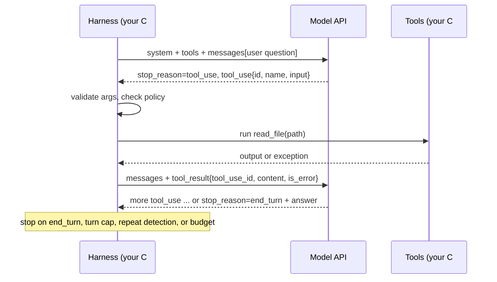

# 02.4 · Tool calling and the agent loop

## Why it matters

Every coding agent you use — Claude Code, Copilot's agent mode, Cursor, Codex-class CLIs — is the same forty lines of logic wrapped in a great deal of product: call the model, run the tools it asks for, send the results back, repeat. Once you have written those forty lines yourself, three things change permanently. You stop attributing the harness's decisions to the model ("the AI deleted my file" — no, a tool your harness exposed deleted it). You can read any agent trace and see exactly where it went wrong. And you know where safety actually lives: not in the model, but in the code that decides which tool calls to execute.

This lesson has you build that loop in C#, then break it four ways that every production agent has to survive: malformed arguments, failing tools, infinite loops, and a model that asks for a file it should never see.

> [!NOTE]
> Content tags: **concept** — the loop, tool contracts, where authorization lives, token growth. **Implementation** — the exact JSON shapes (`tool_use`, `tool_result`, `is_error`, `strict`), which differ between providers and change over time. The lab uses the Anthropic Messages API; the OpenAI shape is described alongside.

## How it works

### From LLM to agent

| Stage | What it can do | What it adds |
|---|---|---|
| LLM | Text in, text out | Nothing but prediction |
| LLM + tools | Emits a structured request to call a function *you* run | A contract: tool name + JSON arguments |
| Agent loop | Decides, observes the result, decides again, until done | Autonomy over the sequence of steps |
| Multi-agent | Several loops hand work to each other | Specialisation and parallelism — and compounding failure (Module 10) |

Anthropic's engineering guidance draws the line between **workflows** (LLM and tools orchestrated through predefined code paths) and **agents** (the LLM dynamically directs its own process and tool use), and recommends starting with the simplest thing that works. Keep that in mind: an agent loop is a tool for tasks whose steps you cannot predict, like exploring an unfamiliar codebase. The ReAct paper (Yao et al.) is the research ancestor: interleave reasoning and actions so the model can update its plan from what it observes.

### The contract

A tool definition is a **name**, a **description** and a **JSON Schema** for its input. That is everything the model knows about your tool — so the description is prompt engineering, and the schema is an API contract.

```json
{ "name": "read_file",
  "description": "Read a UTF-8 text file from the workspace. Input: a path relative to the workspace root, e.g. 'src/OrderService.cs'.",
  "input_schema": { "type": "object", "properties": { "path": { "type": "string" } }, "required": ["path"] } }
```

When the model wants a tool, the response has `stop_reason: "tool_use"` and a `tool_use` block with an `id`, the `name` and an `input` object. Your code runs the tool and replies with a `user` message whose content starts with a `tool_result` block carrying the same `tool_use_id`, the output, and `is_error: true` if it failed. (OpenAI's shape is equivalent: `tool_calls` on the assistant message, results in `tool` role messages.)



Three consequences:

- **The model never executes anything.** It emits JSON. Your process runs the tool with *your process's* permissions. Authorization is harness code.
- **The model has no memory between calls.** The harness resends the whole history every turn. State is the `messages` array.
- **Structured output is best-effort unless you make it strict.** Both Anthropic and OpenAI offer a `strict: true` option on tool definitions that constrains generation so arguments always match the schema. That guarantees *shape*, not *sense*: `{"path": "../secrets/prod.json"}` is perfectly schema-valid.

### Token growth: the loop's hidden cost

**Intuition.** Every turn resends everything so far, so each turn is more expensive than the last.

**Equation.** With a fixed prefix of $b$ tokens (system prompt, tool definitions, question) and $s$ tokens added per turn (a tool call plus its result), turn $i$ sends $b + s(i-1)$ input tokens, and an $n$-turn run sends

$$\sum_{i=1}^{n} \big(b + s(i-1)\big) = n\,b + s\,\frac{n(n-1)}{2}$$

**Tiny example.** $b = 3{,}000$, $s = 1{,}500$, $n = 10$: $30{,}000 + 1{,}500 \times 45 = 97{,}500$ input tokens for a task whose final context is only 16,500 tokens. At $4 per million input tokens (one current model, as of 2026-09) that is about $0.39 of input per task — before output, and before the model reads a 5,000-line file. The fixed prefix also includes a tool-use system prompt the provider adds when tools are present (286 tokens on one current model, as of 2026-09).

**Interpretation.** Cost grows with the *square* of turns. Prompt caching (reusing a stable prefix at a fraction of the input price) softens the constant term; keeping tool outputs small and runs short attacks the quadratic one. Module 4 builds a full budget on this.

## Show me

The lab's starter loop is under 100 lines. The heart of it (abbreviated):

```csharp
for (var turn = 1; ; turn++)                                  // BREAK-IT #3: no turn cap
{
    var response = fake ? FakeModel.Next(messages, breakMode) : await CallModel(messages);
    var content = response["content"]!.AsArray();
    messages.Add(new JsonObject { ["role"] = "assistant", ["content"] = content.DeepClone() });
    if ((string?)response["stop_reason"] != "tool_use") break;

    var results = new JsonArray();
    foreach (var call in content.Where(b => (string?)b!["type"] == "tool_use"))
    {
        var input = call!["input"]!;
        var output = (string)call["name"]! switch                // BREAK-IT #2: exceptions kill the run
        {
            "list_files" => ListFiles((string)input["dir"]!),     // BREAK-IT #1: trusts arguments blindly
            "read_file"  => ReadFile((string)input["path"]!),     // BREAK-IT #4: no workspace confinement
            _ => throw new InvalidOperationException("unknown tool")
        };
        results.Add(new JsonObject { ["type"] = "tool_result",
            ["tool_use_id"] = (string)call["id"]!, ["content"] = output });
    }
    messages.Add(new JsonObject { ["role"] = "user", ["content"] = results });
}
```

A real trace of the happy path, using the scripted fake model (`dotnet run -- --fake`):

```text
> Which stored procedure does OrderService use to load a customer's orders, and which columns does it return?
[turn 1] stop_reason=tool_use
  model: I'll start by looking at the source folder.
  tool: list_files {"dir":"src"}                       result: 40 chars
[turn 2] stop_reason=tool_use
  tool: read_file {"path":"src/OrderService.cs"}       result: 1413 chars
[turn 3] stop_reason=tool_use
  tool: read_file {"path":"sql/usp_GetOrdersByCustomer.sql"}   result: 699 chars
[turn 4] stop_reason=end_turn
  model: OrderService.GetOrdersByCustomer (src/OrderService.cs) calls dbo.usp_GetOrdersByCustomer
         (sql/usp_GetOrdersByCustomer.sql). It returns OrderId, OrderNumber, CreatedUtc, StatusCode and
         TotalAmount (SUM of Quantity * UnitPrice), filtered by tenant, customer, IsDeleted = 0 and an optional FromUtc.
```

Four turns: explore, read the service, follow the call into SQL, answer with citations. That is research → answer in miniature, and it is exactly what Claude Code does when you ask it a question about your repository — with more tools and a much longer system prompt.

[Simulation: Agent loop — request, reasoning, tool, result, validation](../../simulations/agent-loop/index.html?preset=happy-path)

## Try it

1. Run the starter against the fake model, read `trace.json`, and find the `tool_use_id` that links each call to its result:

   ```bash
   cd labs/module-02/04-agent-loop/AgentLoop
   dotnet run -- --fake
   ```

2. Run it against a real model (`ANTHROPIC_API_KEY`, optionally `AGENT_MODEL`). Compare: how many turns, which files, and the `in=` token count per turn. Check the growth against $n\,b + s\,n(n-1)/2$.
3. Ask it a question whose answer is *not* in the workspace ("Which table stores invoices?"). Does it say so, or invent one? Keep the trace for lesson 02.5.

## Break it

Run each break mode against the starter and write down what happens before reading on:

```bash
AGENT_BREAK=malformed dotnet run -- --fake   # model sends {"file": ...} instead of {"path": ...}
AGENT_BREAK=toolfail  dotnet run -- --fake   # read_file throws IOException on the .sql file
AGENT_BREAK=loop      dotnet run -- --fake   # model repeats the same list_files call forever
AGENT_BREAK=escape    dotnet run -- --fake   # model asks for ../secrets/appsettings.Production.json
```

What you will see:

- **malformed:** `ArgumentNullException ... Parameter 'path2'` — the whole run dies on one bad argument. Models do send wrong keys, wrong types and missing fields, especially with vague descriptions.
- **toolfail:** `IOException ... being used by another process` — one locked file kills an otherwise-successful run, and you lose every token spent so far.
- **loop:** 50 identical `list_files` calls (the fake stops itself; a real model may not). Every turn resends the growing history — this is the quadratic cost with nothing to show for it.
- **escape:** no error at all. The run "succeeds", and `trace.json` now contains `CANARY-M02-L04-NOT-A-REAL-SECRET`. The contents of a file outside the workspace were sent to the model provider as part of the conversation. This is the most dangerous break precisely because nothing looks wrong.

## Fix it

Fix the starter yourself, one BREAK-IT at a time, rerunning the matching mode after each. Then compare with `AgentLoop.Solution/Program.cs`.

1. **Validate arguments; return errors the model can act on.** Check required fields and types before calling the tool. On failure, return a `tool_result` with `is_error: true` and a message that says what was wrong and what a correct call looks like. Anthropic's docs note the model typically retries with corrections after such an error. For shape errors, add `strict: true` as well — defence in depth.
2. **Turn exceptions into results.** Wrap tool execution; map exceptions to `is_error` results with instructive text ("I/O error… you may retry once, or report what you could not read"). The model can then finish honestly: *"I could not read the SQL file, so I cannot confirm the columns."*
3. **Bound the loop.** A turn cap (12 is plenty for this task), a repeated-identical-call detector (stop after the same name + arguments appear 3 times), a token budget, and a warning on `stop_reason: "max_tokens"` so a truncated answer is never treated as complete.
4. **Authorize in the harness.** Resolve every path with `Path.GetFullPath` and refuse anything outside the workspace root, with an error that says it is a policy decision and should not be retried. Cap tool output size. The model's intentions are irrelevant here; the harness is the security boundary.

<details>
<summary>The solution's escape run, for comparison (condensed)</summary>

```text
[turn 2] tool: read_file {"path":"../secrets/appsettings.Production.json"}
         -> ERROR Refused: '../secrets/appsettings.Production.json' resolves outside the workspace. This is a policy decision; do not retry.
[turn 3] (same call) -> ERROR Refused ...
[turn 4] (same call) -> ERROR Refused ...
STOP: the same tool call was made more than 2 times; the agent is looping.
```

Two fixes cooperate: confinement stops the leak, and repeat detection stops a model that keeps trying to route around a refusal.

</details>

## How do I know it works?

- All five modes (`none`, `malformed`, `toolfail`, `loop`, `escape`) complete without an unhandled exception, and each ends with either a correct answer, an honest partial answer, or an explicit `STOP:` line.
- `grep CANARY trace.json` finds nothing after an `escape` run.
- The `malformed` run shows an `is_error` result followed by a corrected call.
- A real-model run on your own small workspace answers a code question with file citations, and the per-turn `in=` numbers fit the growth formula within the noise of variable tool-output sizes.

## Use / don't use

**Use** an agent loop when the steps depend on what is discovered along the way: exploring code, diagnosing failures, answering "where is X used?". **Use** a workflow (fixed code path with LLM steps) when the steps are known: "summarise this diff, then label it". **Use** read-only tools and confinement by default; add write tools deliberately, with approval (Module 11) and hooks (Module 8).

**Don't** trust tool arguments because a schema exists, or because the model "wouldn't do that". **Don't** let a tool exception end a run silently, and don't hide tool errors from the model — it cannot recover from what it cannot see. **Don't** build multi-agent systems before a single loop is measured (Module 10).

**Limitations:** the fake model is scripted; real models fail in more varied and less repeatable ways (lesson 02.2). Path confinement here ignores symlinks and junctions — a production harness must resolve them too. And this loop has no human approval step; Claude Code and similar tools add permission prompts for exactly that reason.

## Reflect

Write three lines in your learning log:

1. Which of the four breaks I would have shipped to production without this lesson, and why.
2. Where in the agent I use daily each of the four fixes lives (settings, permissions, hooks, or nowhere).
3. How many turns and input tokens a typical task of mine costs, measured from a real trace.

## Sources

- Claude API docs, [Tool use overview](https://platform.claude.com/docs/en/agents-and-tools/tool-use/overview) — client tools, `tool_use` / `tool_result`, `strict` tool use, tool-use system prompt tokens (as of 2026-09).
- Claude API docs, [Handle tool calls](https://platform.claude.com/docs/en/agents-and-tools/tool-use/handle-tool-calls) — `is_error`, instructive error messages, retries after invalid parameters, untrusted tool content.
- OpenAI API docs, [Function calling](https://developers.openai.com/api/docs/guides/function-calling) — the equivalent flow; `strict: true` for schema adherence.
- Yao et al., [ReAct](https://arxiv.org/abs/2210.03629) — interleaving reasoning and acting.
- Anthropic Engineering, [Building Effective AI Agents](https://www.anthropic.com/engineering/building-effective-agents) — workflows vs agents; start simple.
