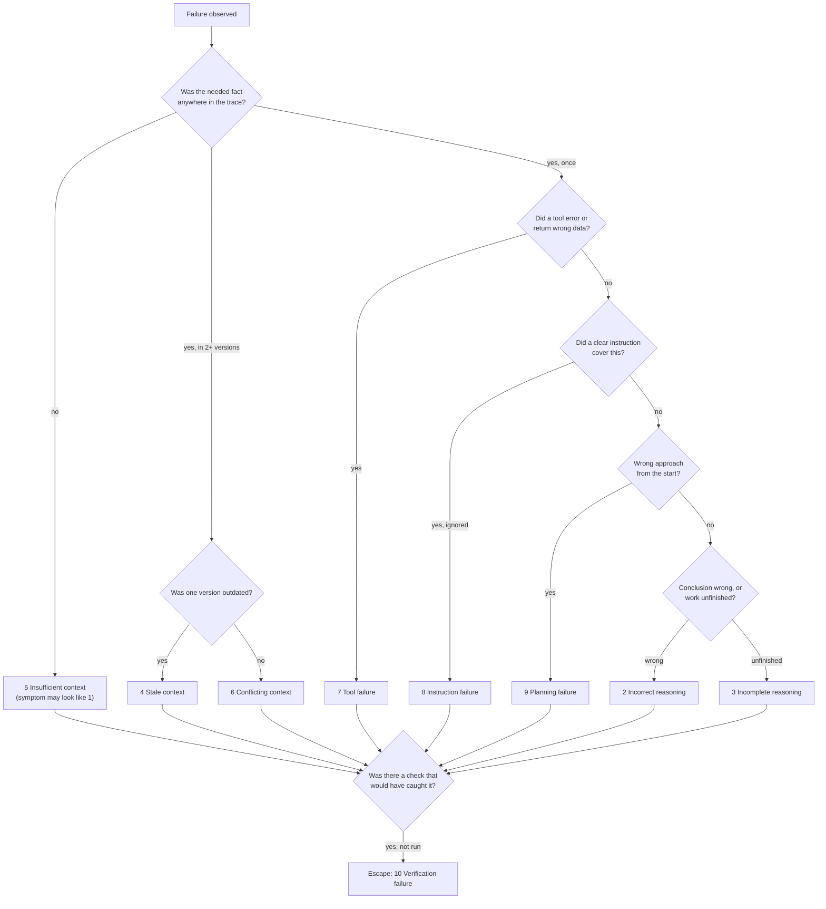

# 02.5 · Failure taxonomy and model selection

## Why it matters

"The AI got it wrong" is not a diagnosis, and "we use the best model" is not an architecture decision. Both sentences are everywhere, and both are where a trainer earns their fee by replacing them. The first becomes: *"This was insufficient context — the schema wasn't in the trace — and it escaped because nothing compiled against the database."* That sentence tells the team exactly what to fix. The second becomes: *"For ticket triage we use the small model: 19/20 on our tickets, 0.8 s, a tenth of the cost. For migrations we use the large one, because a failure costs 40 minutes of review."*

This lesson closes Module 2 by turning the mechanisms you have seen — tokens and position (02.1), sampling (02.2), instruction channels (02.3), and the tool loop (02.4) — into two working instruments: a failure taxonomy you apply to transcripts, and a selection matrix you fill with measurements. Both become permanent parts of your practice and your workshop.

> [!NOTE]
> Content tags: **concept** — the taxonomy, cost per successful task, constraints-before-weights. **Implementation** — model names, prices and benchmark scores, which rot within months. Every number you put in a matrix carries a date.

## How it works

### Ten failure classes

| # | Class | Mechanism (where you saw it) |
|---|---|---|
| 1 | Hallucination | A plausible continuation with no source; training and benchmarks reward guessing over "I don't know" |
| 2 | Incorrect reasoning | Correct facts in context, wrong inference from them |
| 3 | Incomplete reasoning | Stopped early: one caller of two, happy path only |
| 4 | Stale context | An outdated fact in context was used (02.1 multi-needle) |
| 5 | Insufficient context | The needed fact was absent, so the model filled the gap |
| 6 | Conflicting context | Two sources disagreed and the wrong one won (02.3) |
| 7 | Tool failure | A tool errored or returned bad data (02.4 `toolfail`) |
| 8 | Instruction failure | A clear, present instruction was ignored or misapplied |
| 9 | Planning failure | The approach was wrong from the first step (wrong layer, duplicate service) |
| 10 | Verification failure | Success claimed without checking, or an available check skipped (02.2 "all tests pass") |

On class 1, Kalai et al. (2025) argue that hallucinations persist largely because training and evaluation reward confident guessing: a model that guesses when unsure scores better on most benchmarks than one that abstains. Practically, that means you should expect a guess whenever the context lacks the answer and nothing rewards abstaining — which is why class 1 is so often really class 5.

### Primary cause and escape cause

Classify each failure twice:

- **Primary cause:** the earliest point where a correct system would have diverged.
- **Escape cause:** why nothing caught it. Very often class 10.



A claim with no source anywhere in context, after you have ruled out 5, is a true class 1.

### Selecting a model: constraints, then measurements

**Step 1 — hard constraints eliminate; they are never weighted.** Data-handling and retention terms, residency and hosting (Module 12), required API features (tool use, strict schemas, batch), the context you actually need, and — for open weights — the licence. A model that fails one is out, however well it scores.

**Step 2 — measure the survivors on your tasks.** Pass rate over N runs (02.2), latency (median and slow tail), tokens and cost per attempt, effective context on your inputs (02.1), behaviour on your language mix, and tool-use reliability (malformed calls per 100, from 02.4).

**Step 3 — weight only what is left**, and write down what would change the decision.

Why not just read a leaderboard? SWE-bench, the best-known coding-agent benchmark, is 2,294 issues from 12 popular **Python** repositories. It is a genuine signal about a model's general ability, and it says little about a 15-year-old .NET solution with stored procedures, Hebrew tickets and your team's conventions. Scores also move fast: the original SWE-bench paper's best model resolved 1.96% of issues, a number that was obsolete within a year. And public tasks can leak into training data (Module 7 calls this contamination).

### Cost per successful task

**Intuition.** Nobody pays for tokens; they pay for finished work. A cheap model that fails often is expensive once someone has to review and redo its failures.

**Equation.** With cost per attempt $c$, success probability $p$, and human cost $h$ of reviewing a failed attempt, and assuming failures are detected and retried until success:

$$\text{cost per success} = \frac{c}{p} + \left(\frac{1}{p} - 1\right) h$$

$1/p$ is the expected number of attempts; $1/p - 1$ the expected number of failures.

**Tiny example.** Review of a failed attempt takes 10 minutes at $90/hour, so $h = \$15$.

| | $c$ | $p$ | Tokens: $c/p$ | Failures: $(1/p-1)h$ | Total |
|---|---:|---:|---:|---:|---:|
| Model A (cheap) | $0.12 | 0.60 | $0.20 | $10.00 | **$10.20** |
| Model B (pricier) | $0.40 | 0.90 | $0.44 | $1.67 | **$2.11** |

Model B costs 3.3× more per attempt and is about 4.8× cheaper per finished task.

**Implementation.** ModelBench prints `$/attempt` and `$/success` (token cost divided by passes); the matrix template adds the failure term.

**Interpretation.** When a human reviews failures, pass rate usually dominates price. The ranking flips back only when $h$ is near zero (a deterministic check discards failures automatically) or volume is huge — so measure $h$ honestly instead of assuming it.

## Show me

Five short failures, classified. Each would appear in the log with its quoted evidence line.

| Trace excerpt | Primary | Escape | Why |
|---|---|---|---|
| Agent writes `o.CustomerNumber`; no schema or SQL file was read in the trace; the column does not exist | 5 Insufficient context (symptom: 1) | 10 — no build or query against the schema was run | The fact was never in context; the model guessed a plausible name |
| Agent reads the planted README (02.3), then uses `AppDbContext` in Orders | 6 Conflicting context | 10 — the architecture gate did not exist yet | Two sources disagreed; the recent, rule-framed one won |
| Agent answers "retry count 5" in the multi-needle test (02.1) | 4 Stale context | — (question-answering; no check possible) | A never-deployed proposal was retrieved instead of the current value |
| Agent fixes the date filter in the stored procedure but not the matching filter in `OrderService` | 3 Incomplete reasoning | 10 — the integration test covering both was not run | The first fix was right; the search for other occurrences stopped early |
| Agent adds a new `OrderLookupService` duplicating `OrderService` | 9 Planning failure | Reviewer caught it (the system worked) | The plan never looked for existing services — Module 5's research phase |

Notice how rarely the honest primary class is 1, and how often the escape class is 10. That pattern is the argument for everything in Modules 4, 5 and 7.

## Try it

1. **Taxonomy.** Collect ten real failures: from your own agent sessions this month, the lesson 02.4 "invoice table" question, and your 02.3 D outcomes. Classify each with the [failure taxonomy sheet](../../templates/agent-failure-taxonomy.md): primary, escape, one quoted line of evidence. Save as `ai-layer-lab/fundamentals/failure-taxonomy.md`.
2. **Selection.** Configure ModelBench with at least three models from at least two providers; a local open-weights model via Ollama counts as a provider and gives you a self-hosted data point. Check the pipeline first, then run:

   ```bash
   cd labs/module-02/05-model-selection
   dotnet run -- --fake        # verifies config, grading and arithmetic at zero cost
   dotnet run                  # real run, writes results.csv
   ```

   The three starter tasks (a SQL risk review, a sync-over-async deadlock fix, a Hebrew ticket triage) are there to get you running; replace them with three tasks from your real backlog before you draw conclusions.
3. Fill in the [model-selection matrix](../../templates/model-selection-matrix.md): constraints first, then measured rows, then a decision per task with a re-measure date.

[Simulation: Agent loop — where runs fail and which class it is](../../simulations/agent-loop/index.html?preset=failure-classes)

> [!WARNING]
> Sending employer or client code to a provider is a data-handling decision, not a lab detail. Use the starter tasks, or tasks from a repository you are allowed to send to every provider in your matrix.

## Break it

Make the decision the way it is usually made, then check it:

1. Set `"runsPerTask": 1`. Run once. Pick a winner per task from that single run — and, separately, pick the model with the lowest price per million tokens.
2. Set `"runsPerTask": 5` and run again.
3. Compare: did any single-run winner lose at N=5? Did the cheapest-per-token model stay cheapest per success once you add a realistic $h$ for your team?

A decision that flips between N=1 and N=5 was never a decision; it was a sample of one from the distribution in lesson 02.2.

## Fix it

- **Apply hard constraints before looking at any score**, and write down which rows eliminated which models. This is the part of the matrix a security reviewer will read.
- **Decide on N ≥ 5 per task**, with the pass criterion written before the first run. Where two models are within one or two passes of each other, record "no measurable difference at N=5" rather than a winner; Module 7 gives you the intervals to say how big N must be.
- **Rank by cost per success including $h$**, measured from your team's real review time, not by token price.
- **Allow different models per task.** Triage, code review and migrations have different $p$, $h$ and latency needs. One model everywhere is a convenience, not a requirement.
- **Date everything and set a re-measure date.** A matrix without dates is a rumour.

## How do I know it works?

- A colleague given your `results.csv` and matrix reaches the same decision without talking to you.
- Every eliminated model has a named constraint; every chosen model has a measured row at N ≥ 5.
- Your taxonomy has ten classified failures, each with primary, escape and quoted evidence, and at least one where you initially wrote "hallucination" and changed it after checking the trace.
- The decision includes a sentence of the form "we would switch if …", with a number in it.

## Use / don't use

**Use** the taxonomy in post-mortems, code review of agent PRs and workshop Q&A — it turns blame into a fix list. **Use** the matrix whenever a team standardises on a model, adds a task type, or a provider changes price or version.

**Don't** pick models from leaderboards, launch posts or a single impressive demo. **Don't** weight a hard constraint ("privacy: 20%") — a model that cannot legally see the code scores zero, not 80. **Don't** classify a failure without evidence from the trace.

**Limitations:** substring graders (the starter tasks use them) are crude — Module 7 replaces them with proper graders. Five runs detect large differences only. Classifications need judgement, and two people will sometimes disagree on primary cause; the evidence line is what makes a disagreement productive.

## Reflect

Write three lines in your learning log:

1. The most common primary class and the most common escape class in my ten failures.
2. The model I would have chosen before measuring, and the one I chose after.
3. The value of $h$ (cost of one failed attempt) for my team, and how I measured it.

## Sources

- Kalai et al., [Why Language Models Hallucinate](https://arxiv.org/abs/2509.04664) — training and evaluation incentives reward guessing over abstaining.
- Jimenez et al., [SWE-bench](https://arxiv.org/abs/2310.06770) — 2,294 issues from 12 Python repositories; best original model resolved 1.96%.
- Anthropic Engineering, [Building Effective AI Agents](https://www.anthropic.com/engineering/building-effective-agents) — measure before adding complexity.
- Claude API docs, [Models overview](https://platform.claude.com/docs/en/models/overview) — example of the dimensions a vendor publishes (context, latency class, price) and how quickly they change (as of 2026-09).
- Ollama docs, [OpenAI compatibility](https://docs.ollama.com/api/openai-compatibility) — running a local open-weights model behind the same API shape.
