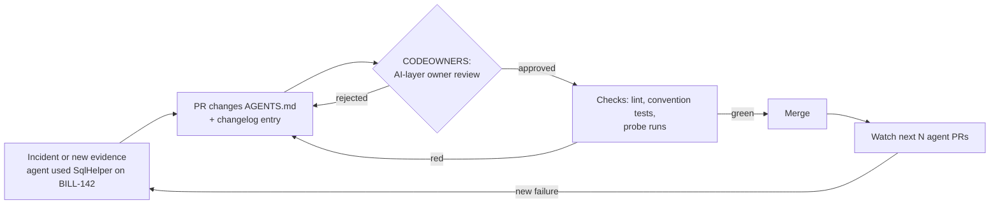

# 03.1 · The fourth citizen: AI behavior as an engineering artifact

## Why it matters

For twenty years a repository held three kinds of things: source, tests, and documentation. A repository that coding agents work in holds a fourth: **instructions that shape how an agent behaves** — rules files, skills, sub-agent definitions, MCP configuration, hooks. This course calls that set of files the **AI layer**.

The fourth citizen behaves differently from the other three in one uncomfortable way. A line of C# affects the code paths that call it. A line in an always-loaded rules file affects **every change an agent makes in the repository**. There is no compiler to reject a bad line and no type checker to flag a contradiction. The agent reads the line, weighs it against everything else in its context (you saw the ranking in [02.3 · The instruction hierarchy](../module-02/lesson-03.md)), and then acts on it — often faithfully, including when the line is wrong.

A quick number makes the stakes concrete. A team of 12 engineers each running 6 agent sessions a day produces $12 \times 6 = 72$ sessions a day, or about $72 \times 20 = 1{,}440$ sessions a month. A single stale line in `CLAUDE.md` is read 1,440 times a month. If it nudges even 1 session in 20 toward an abandoned pattern, that is roughly 72 pull requests a month that a reviewer has to catch by hand.

Teams that treat agent instructions as "a prompt someone wrote once" hit three predictable failures:

- **Silent drift.** The rules say "use `SqlHelper`"; the code migrated to Dapper two years ago. Nobody updates the rules because nobody owns them. (In the failure taxonomy of [02.5](../module-02/lesson-05.md) this is *stale context*.)
- **Unreviewed behavior changes.** Someone adds "skip tests on hotfix branches" to the rules file in a drive-by commit. The agent's behavior changes for everyone, and no reviewer ever saw it.
- **No memory of why.** A rule exists, nobody remembers the incident that produced it, so nobody dares delete it — and the file grows until it stops working. Anthropic's own guidance warns that a bloated `CLAUDE.md` makes the agent ignore the instructions that matter.

The fix is not a new tool. It is applying the engineering discipline you already use for code — versioning, review, testing, ownership, change management — to a new kind of file.

> [!NOTE]
> Content tags. **Concept** (stable): the five properties and why they matter. **Implementation** (changes quarterly): the exact file names each tool reads and GitHub's settings screens. Implementation details below are as of 2026-09.

## How it works

### The five properties

| Property | What it means for the AI layer | Failure it prevents |
|---|---|---|
| **Versioning** | Instructions live **in the repository**, in the same commit as the code they describe. | Wiki-kept rules that the agent never sees and that describe a different version of the code. |
| **Review** | Changes to AI-layer files go through a pull request and are reviewed by someone accountable for agent behavior. | Drive-by edits that change behavior for the whole team. |
| **Testing** | Every rule is checked: does it point at things that exist, and does the agent actually behave as it says? | Rules that are stale, invented, or ignored. |
| **Ownership** | A named person or team owns the layer (and each file in it). | "Everyone's file" that no one prunes. |
| **Change management** | Each change has a reason, a date, evidence and a verification, recorded in a changelog; incidents feed rule changes. | Rules nobody dares delete; repeated incidents. |

### Why "in the repository" is not optional

Agents load instructions from the file system. Claude Code, for example, loads `CLAUDE.md` files from the working directory and its parents at session start, and loads files in subdirectories when it reads files there. Tools that read `AGENTS.md` pick the nearest file in the directory tree. None of them read your Confluence page. Instructions outside the repository are, from the agent's point of view, **absent**. And because the files are in the repository, a branch that changes the database layer can change the data-access rule in the same commit — the rule and the code it describes cannot disagree on any single commit.

### Advisory versus deterministic

Rules files are **advisory**: Claude Code's documentation says it treats them "as context, not enforced configuration", and recommends a hook when an action must be blocked regardless of what the model decides. That distinction drives the rest of the module:

- A rule **asks**. The model may weigh it against other context and lose it in a long file.
- A test, a hook, a CI check **enforces**. It runs the same way every time.

So the AI layer needs both: rules that make the right behavior likely, and deterministic checks that catch the wrong behavior when it happens anyway. In the lab, `ConventionTests.cs` fails the build if any code outside `Legacy/` calls `SqlHelper` — it guards the code *and* the rules, because an agent following a stale rule now breaks the build instead of slipping past review.

### The change lifecycle



The same loop your team runs for production code, applied to the files that steer the agent. Module 7 replaces "probe runs" with a statistical evaluation, and Module 11 formalizes the governance around it; here you build the minimal version.

### How CODEOWNERS enforces review

GitHub reads a `CODEOWNERS` file from `.github/`, the repository root or `docs/` (first one found). Each line maps a path pattern to owners. Two mechanics matter:

1. **The last matching pattern wins.** A catch-all `*` line must come *first*; specific AI-layer lines come after it.
2. Ownership only **blocks merges** when branch protection (or a ruleset) has "Require review from Code Owners" enabled. Without it, owners are merely *requested*.

## Show me

Contoso Billing (the lab repo in [`labs/module-03/brownfield`](../../labs/module-03/README.md)) is a 2016 .NET billing service. In 2024 the team replaced its `SqlHelper`/`DataSet` data access with Dapper repositories (ADR 0007). In 2026 someone copied the old wiki's "architecture" page into `CLAUDE.md` — v1.0.0 of the AI layer, unreviewed.

An agent picked up ticket BILL-142 ("list a customer's overdue invoices") and produced:

```csharp
// Generated by the agent, following CLAUDE.md v1.0.0
public DataSet GetOverdue(int customerId) =>
    SqlHelper.ExecuteDataSet(_cs,
        "SELECT * FROM dbo.Invoice WHERE CustomerId = @c AND DueUtc < GETDATE()",
        new SqlParameter("@c", customerId));
```

Three problems, all traceable to one rules line: the obsolete helper, an untyped `DataSet`, and `GETDATE()` (server-local time) instead of the injected UTC clock. The agent did exactly what it was told.

Here is what the same repository looks like once the AI layer is treated as a citizen:

```text
# .github/CODEOWNERS  (order matters: last match wins)
*                          @contoso/billing-devs
/AGENTS.md                 @contoso/billing-leads
/CLAUDE.md                 @contoso/billing-leads
/.claude/                  @contoso/billing-leads
/.cursor/rules/            @contoso/billing-leads
/.github/instructions/     @contoso/billing-leads
/.mcp.json                 @contoso/billing-leads @contoso/security
/AI-LAYER-CHANGELOG.md     @contoso/billing-leads
/.github/CODEOWNERS        @contoso/billing-leads
```

And the changelog entry for the fix:

```markdown
## 2026-09-28 — v1.1.0
- Changed: data-access rule now points to Dapper repositories; SqlHelper forbidden outside Legacy/.
- Why: agent implemented BILL-142 with SqlHelper.ExecuteDataSet, copying the 2021 rule.
- Evidence: docs/adr/0007-dapper-repositories.md; history BILL-66, BILL-79.
- Verified: lint clean; probes P1–P4 3/3; BILL-142 rerun passes dotnet test.
- Reviewed by: @contoso/billing-leads
```

Six months from now, someone who wants to delete that rule can read *why* it exists and what evidence would make it obsolete.

## Try it

You will create the `ai-layer-lab` portfolio repository (see [its README](../../projects/ai-layer-lab/README.md)) and give its AI layer the five properties. Budget: 60 minutes.

1. Create a **private** GitHub repository `ai-layer-lab`. Copy the contents of `labs/module-03/brownfield/` into it and commit as "before: brownfield import".
2. Copy `labs/module-03/starter/CLAUDE.md` to the repository root. Commit it as "AI layer v1.0.0 (imported from wiki)". This is the deliberately poor starting point you will fix in [03.4](lesson-04.md).
3. Write `.github/CODEOWNERS` with a catch-all line for all code and specific lines for every AI-layer path (`CLAUDE.md`, `AGENTS.md`, `.claude/`, `.cursor/rules/`, `.github/instructions/`, `.mcp.json`, the changelog, and `CODEOWNERS` itself). Use your own username or a team.
4. In **Settings → Branches** (or **Rules → Rulesets**), protect `main`: require a pull request and enable **Require review from Code Owners**.

   > [!NOTE]
   > Branch protection availability for private repositories depends on your GitHub plan. If yours does not offer it, make the lab repository public *with only the Contoso lab code in it* — never your employer's code.

5. Create `AI-LAYER-CHANGELOG.md` with a v1.0.0 entry that honestly says "imported from wiki, not verified".
6. Fill in section 1 (ownership and change process) of the [AI-layer architecture template](../../templates/ai-layer-architecture.md) and commit it as `docs/ai-layer.md`.

<details>
<summary>Hint: what counts as an "AI-layer path"?</summary>

Anything an agent loads or executes: instruction files (`CLAUDE.md`, `AGENTS.md`, Cursor and Copilot rule files), skills and sub-agent definitions (`.claude/skills/`, `.claude/agents/`), settings that grant permissions (`.claude/settings.json`), MCP configuration (`.mcp.json`), hook scripts, CI workflows that run agents, and eval task sets. [03.2](lesson-02.md) maps them all.
</details>

## Break it

Reorder your `CODEOWNERS` so the catch-all comes **last**:

```text
/CLAUDE.md                 @your-user-or-leads-team
/.claude/                  @your-user-or-leads-team
*                          @some-other-user-or-team
```

Now open a pull request from a branch that changes one line of `CLAUDE.md` (for example, add "Prefer `DataSet` for reports."). Look at who GitHub requests as a reviewer.

Predict before you look: who owns `CLAUDE.md` now?

## Fix it

**Diagnose.** GitHub evaluates `CODEOWNERS` top to bottom and the **last matching pattern wins**. `*` matches `CLAUDE.md`, and it is the last line — so the AI layer is now owned by the catch-all owners. The leads are not requested, and "Require review from Code Owners" is satisfied by the wrong people. This failure is silent: nothing errors, the protection just stops meaning what you think it means.

**Modify.** Put `*` first and the AI-layer lines after it. Add a line that makes `CODEOWNERS` itself owned by the AI-layer owners — otherwise anyone can reassign ownership in the same PR that changes a rule.

**Rerun.** Push the fix to `main` through its own PR, then re-open (or update) the test PR and check the requested reviewers again.

<details>
<summary>Solution</summary>

See `labs/module-03/solution/CODEOWNERS`. The file starts with `*` and ends with the AI-layer and `CODEOWNERS` lines. On the test PR, the leads team (or your user) is requested and the merge button stays blocked until they approve.
</details>

## How do I know it works?

Check behavior, not files:

- [ ] A PR that touches only `CLAUDE.md` requests the AI-layer owner and **cannot be merged** without their approval. Verify with `gh pr view <n> --json reviewRequests,reviewDecision`.
- [ ] A PR that touches only `src/**` does **not** request the AI-layer owner (otherwise owners drown in noise and start rubber-stamping).
- [ ] A PR that edits `CODEOWNERS` itself requests the AI-layer owner.
- [ ] GitHub shows no syntax errors for `CODEOWNERS` (the file view flags invalid lines and unknown owners).
- [ ] The changelog has an entry for every commit that touched an AI-layer path: `git log --oneline -- CLAUDE.md AGENTS.md .claude` lines up with changelog headings.

Testing *what the rules make the agent do* comes in [03.4](lesson-04.md) (lint and probes) and properly in Module 7. Be honest that on this commit the rules are untested — that is exactly what the v1.0.0 changelog entry should say.

## Use / don't use

**Use it** as soon as more than one person, or any unattended agent (CI, scheduled jobs), relies on the AI layer. The cost is a 10-line `CODEOWNERS` section and a changelog; the benefit is that behavior changes become visible.

**Don't over-process it** in a solo spike or a throw-away prototype: a personal `CLAUDE.local.md` (gitignored) or your user-level rules are enough, and they deliberately sit outside review.

**Limitations.**

- Review catches changes you can *see*. It does not tell you whether a rule works; research on repository context files found that they often did not improve agent task success and raised inference cost by over 20% on average (Gloaguen et al., 2026). Ownership without testing just gives you well-reviewed bad rules.
- `CODEOWNERS` needs owners with write access, and merge blocking needs branch protection or rulesets on your plan.
- Rules remain advisory. Anything that must never happen belongs in a test, a hook (Module 8) or a CI gate (Module 11), not only in prose.
- Ownership of the AI layer is a people question as much as a file question — who is accountable when an agent-written change breaks production? Module 11 (governance) and Module 19 (adoption) come back to it.

## Reflect

Write three lines in your learning log:

1. Where does your team's agent guidance live today, and who changed it last?
2. Which one rule in it would you be unable to justify with evidence?
3. What would break first if nobody owned the AI layer for six months?

## Sources

- [Claude Code docs — How Claude remembers your project](https://code.claude.com/docs/en/memory) — load locations, "context, not enforced configuration", AGENTS.md handling (as of 2026-09).
- [Claude Code docs — Best practices](https://code.claude.com/docs/en/best-practices) — keep CLAUDE.md concise, check it into git, treat it like code.
- [GitHub Docs — About code owners](https://docs.github.com/en/repositories/managing-your-repositorys-settings-and-features/customizing-your-repository/about-code-owners) — file locations, last-match-wins, code-owner review.
- [GitHub Docs — About protected branches](https://docs.github.com/en/repositories/configuring-branches-and-merges-in-your-repository/managing-protected-branches/about-protected-branches) — "Require review from Code Owners".
- [Gloaguen et al. (2026) — Evaluating AGENTS.md](https://arxiv.org/abs/2602.11988) — context files did not generally improve success rates and increased cost by over 20%.
