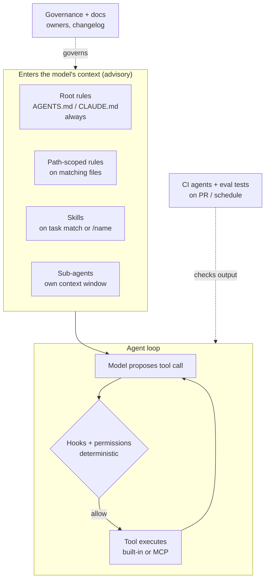

# 03.2 · Component map and portability

## Why it matters

Ask five engineers what "the AI layer" contains and you will get five lists: "the CLAUDE.md", "our Cursor rules", "the MCP servers", "the review bot". Each is right and each is incomplete. Without a shared map, teams put things in the wrong place: a 40-step release procedure pasted into the always-loaded rules file, a security rule ("never touch `appsettings.Production.json`") written as polite prose instead of a hook, the same convention copied into four tool-specific files that drift apart in a month.

There is also a commercial reason. The organizations you will train rarely standardize on one agent. The backend team uses Claude Code, the front-end team uses Cursor, the enterprise license covers GitHub Copilot. If your method only works in one tool, it is a tool tutorial. If you can say "this is a *fact* the agent must always know, so it goes in the always-loaded layer — here is where each of your three tools reads it", you are teaching architecture.

> [!NOTE]
> Content tags. **Concept** (stable): the three axes and the decision rule. **Implementation** (changes quarterly): every file name and front-matter key in the tables. All tool details are as of 2026-09; re-check each tool's docs before teaching them.

## How it works

### Three axes

Every AI-layer component can be placed on three axes. Learn the axes and new tools become easy to slot in.

1. **When does it enter the agent's context?**
   - *Always* — loaded at session start (root rules files). Costs context in every session.
   - *On demand* — loaded when relevant: path-scoped rules when the agent reads matching files, a skill when the task matches its description or the user invokes it, a sub-agent when delegated to.
   - *On event* — runs outside the model at a lifecycle point (hooks before/after a tool call; CI on a pull request).
2. **Does it advise or enforce?**
   - *Advisory* — text the model weighs (rules, skills, sub-agent prompts). Likely, not guaranteed.
   - *Deterministic* — code that runs the same way every time (hooks, permission settings, tests, CI gates).
3. **What is its scope?** Organization (managed policy), user (your machine), repository, directory/path, or task.

Recall the agent loop from [02.4 · Tool calling and the agent loop](../module-02/lesson-04.md): the model proposes a tool call, the harness executes it, the result comes back as context. Rules and skills act on the *proposal* (they shape what the model wants to do). Hooks and permissions act on the *execution* (they decide whether it happens). MCP servers add *new tools* to the loop.



### The component map

| Component | Problem it solves | Loads | Advise / enforce | Claude Code (2026-09) | Cursor | GitHub Copilot |
|---|---|---|---|---|---|---|
| Root rules | Facts the agent must always know | Always | Advise | `CLAUDE.md` (or reads `AGENTS.md` when no `CLAUDE.md` exists) | `AGENTS.md`, `.cursor/rules` with `alwaysApply: true` | `.github/copilot-instructions.md`, `AGENTS.md` |
| Path-scoped rules | Facts true only in part of the tree | When matching files are read | Advise | `.claude/rules/*.md` with `paths:`; nested `CLAUDE.md` | `.cursor/rules/*.mdc` with `globs:`; nested `AGENTS.md` | `.github/instructions/*.instructions.md` with `applyTo:`; nearest `AGENTS.md` |
| Skills | Procedures used sometimes | On task match or invocation | Advise | `.claude/skills/<name>/SKILL.md` (Agent Skills format) | Agent-decided rules (`description`, no globs) | Prompt files / skills support varies |
| Sub-agents | Work that needs a separate context window | When delegated | Advise | `.claude/agents/<name>.md` | Tool-specific | Tool-specific |
| MCP servers | Access to external systems (Jira, SQL Server, docs) | Tool list at start; calls on demand | Capability | `.mcp.json` | `.cursor/mcp.json` | Repository/org MCP config |
| Hooks | Guarantees at lifecycle points | On event | **Enforce** | `hooks` in `.claude/settings.json` (e.g. `PreToolUse` can block) | Tool-specific | Tool-specific |
| Permissions / settings | What the agent may run or touch | Always | **Enforce** | `permissions` allow/deny in settings | Tool settings | Org policy |
| Scripts | Repeatable commands the agent calls | On call | Enforce (they are code) | Any script in repo | same | same |
| CI agents | Unattended review / fixes | On PR / schedule | Advise (comment) or enforce (gate) | GitHub Actions with a headless agent | same | Copilot code review |
| Eval tests | Evidence the layer works | On change | **Enforce** (as a gate) | Your harness (Module 7) | same | same |
| Governance + docs | Ownership, changelog, decision records | Humans read them | — | `CODEOWNERS`, changelog, ADRs | same | same |

The last four rows are the same in every tool: they are ordinary engineering. That is part of the point — most of the durable value of the AI layer lives in parts that do not care which agent you use.

### The decision rule

When someone proposes "let's add this to the AI layer", ask what *kind* of thing it is:

| It is a… | Put it in | Example (Contoso Billing) |
|---|---|---|
| **Fact** that applies almost everywhere | Root rules | "Build with `dotnet build Contoso.Billing.sln`." |
| **Fact** that applies to one area | Path-scoped rule | "Migrations need a `U###` undo script." (only `db/migrations/**`) |
| **Procedure** used sometimes | Skill | "How to add a report endpoint: 7 steps." (Module 6) |
| **Guarantee** that must always hold | Test, hook or CI gate | "No `SqlHelper` outside `Legacy/`." → `ConventionTests.cs` |
| **External system** access | MCP server | Read Jira ticket BILL-142. (Module 8) |
| **Isolated investigation** | Sub-agent | "Search the whole repo for callers of `SqlHelper`." |

A rule of thumb from Claude Code's skill documentation fits every tool: when a section of the rules file "has grown into a procedure rather than a fact", it should become a skill, because a skill's body loads only when used.

### Portability: one source, many readers

`AGENTS.md` is a plain-Markdown convention read natively by many agents (the project's site lists Codex, Copilot, Cursor, Gemini CLI, Jules, Aider, Zed, Junie, Devin and more); the nearest file in the directory tree takes precedence. Claude Code's default, as of 2026-09, is subtle: it reads `AGENTS.md` **only when there is no `CLAUDE.md`** (or `CLAUDE.local.md`) in the working directory or above. If both exist, it reads `CLAUDE.md` only — unless `CLAUDE.md` imports the other file with `@AGENTS.md`, or the "Project instructions" setting is changed.

That gives a portable pattern:

- `AGENTS.md` — the canonical repo-wide rules.
- `CLAUDE.md` — one line `@AGENTS.md`, plus any Claude-specific additions.
- Path-scoped rules — expressed per tool (the three formats below), generated or linted from one source.

## Show me

The migration convention from Contoso Billing, expressed in three tools. The bullets are identical; only the scoping front-matter (which must be the first thing in each file) differs.

**Claude Code** — `.claude/rules/migrations.md`:

```markdown
---
paths:
  - "db/migrations/**"
---
- New migration = `V###__name.sql` plus matching `U###__name.sql` undo script.
- Never edit a merged `V###` script; add a new one.
```

**Cursor** — `.cursor/rules/migrations.mdc`:

```markdown
---
description: SQL Server migration conventions for Contoso Billing
globs: db/migrations/**
alwaysApply: false
---
- New migration = `V###__name.sql` plus matching `U###__name.sql` undo script.
- Never edit a merged `V###` script; add a new one.
```

**GitHub Copilot** — `.github/instructions/migrations.instructions.md`:

```markdown
---
applyTo: "db/migrations/**"
---
- New migration = `V###__name.sql` plus matching `U###__name.sql` undo script.
- Never edit a merged `V###` script; add a new one.
```

And the root:

**Root** — `CLAUDE.md`:

```markdown
# Contoso Billing
Claude Code reads CLAUDE.md instead of AGENTS.md when both exist, so this file imports it.

@AGENTS.md
```

The full set is in `labs/module-03/solution/` (see the [lab README](../../labs/module-03/README.md)). The resulting **portability matrix** for Contoso has one row per rule and one column per tool, each cell saying where the rule lives and how it is scoped. It becomes a slide in your workshop in Module 17: "same layer, three tools".

## Try it

Budget: 60 minutes, in your `ai-layer-lab` repository.

1. Inventory: list every AI-layer file in the repository and in your user profile (`~/.claude/`, Cursor user rules, Copilot personal instructions). For each, record the three axes: load timing, advise/enforce, scope.
2. Classify the eight lines of `starter/CLAUDE.md` with the decision rule. Which are facts, which should be tests, which are procedures, which are noise? (Do not fix them yet — that is [03.4](lesson-04.md).)
3. Create `AGENTS.md` with the repo-wide facts and make `CLAUDE.md` import it.
4. Write the migration rule in all three path-scoped formats.
5. Fill in section 2 (component inventory) and section 3 (portability matrix) of the [AI-layer architecture template](../../templates/ai-layer-architecture.md).

<details>
<summary>Hint: classifying the starter lines</summary>

"Write clean, maintainable code that follows SOLID principles" and "Always think step by step" are not facts about *this* repository — the agent cannot act differently because of them. "Use `DateTime.Now`" is a claimed fact that is false (see [03.3](lesson-03.md)); the true version is also a guarantee and already has a test. "Use 4 spaces" is inferable from the code and from `.editorconfig` if present.
</details>

## Break it

Create both files with **different** data-access rules, the way it happens in real teams when one person adopts `AGENTS.md` and another keeps the old `CLAUDE.md`:

- `CLAUDE.md` (no import): "All data access goes through `SqlHelper.ExecuteDataSet`."
- `AGENTS.md`: "New data access uses Dapper repositories behind an interface."

Ask Claude Code and one other agent (Cursor or Copilot) the same question in a fresh session at the repo root: *"Where should a new query that loads a customer's issued invoices go? Answer in 5 lines, no code changes."* Compare.

## Fix it

**Diagnose.** Claude Code, by default, loaded `CLAUDE.md` and not `AGENTS.md`, so it recommends `SqlHelper`. Cursor and Copilot read `AGENTS.md` and recommend Dapper. Two agents in the same repository now write two different architectures. This is *conflicting context* at the repository level: not a contradiction inside one file, but two files each tool resolves differently. Confirm which files Claude loaded: in Claude Code, `/memory` lists the instruction files in use and `/context` shows what occupies the window.

**Modify.** Make `AGENTS.md` the single source. Replace the body of `CLAUDE.md` with `@AGENTS.md`. Delete the stale rule; do not keep it "for reference".

**Rerun.** Ask both agents the same question in fresh sessions. Both should now name `IInvoiceRepository` / Dapper.

<details>
<summary>What if the team insists on keeping separate files?</summary>

Then treat the duplication as generated code: keep one source and generate the others in a script, or add a CI check that fails when the shared sections differ. Unowned copies always drift.
</details>

## How do I know it works?

- [ ] Every AI-layer file appears in your inventory with its three axes filled in.
- [ ] In a fresh session, each tool reports (or demonstrably uses) the same repo-wide rules: run probe P1 from `labs/module-03/solution/probes/probes.md` in Claude Code and in one other tool, 3 times each; all 6 answers must name the repository pattern and none may name `SqlHelper`.
- [ ] Open a file under `db/migrations/` and ask "what files do I create for a new migration?" in each tool — the path-scoped rule is applied. Then ask the same question while working only in `src/` and confirm the rule does not load there (in Claude Code, `/memory` or `/context` shows whether `migrations.md` is loaded).
- [ ] `git grep -n "SqlHelper" -- AGENTS.md CLAUDE.md .cursor .github/instructions` shows no *recommendation* to use it.

## Use / don't use

**Use the map** whenever you design or review an AI layer, and in every client engagement: the first question in an audit is "what components exist, and which axis is each on?"

**Use portability** when more than one agent tool touches the repository, or when you teach a mixed audience.

**Don't** build every component. A repository with a 40-line rules file, one convention test and no skills can be a perfectly good AI layer. Each component has a cost: context budget (always-loaded rules), maintenance (every file can go stale), and attack surface (MCP servers and hooks execute code — Module 9).

**Limitations.** File names, front-matter keys and precedence rules change quarterly; the `CLAUDE.md`/`AGENTS.md` interaction above was documented as of 2026-09 and has already changed once. Portability is **format-level only**: the same text can be weighed differently by different models, so "portable" means "loaded in every tool", not "obeyed identically". Verify behavior with probes, not by reading config.

## Reflect

1. Which component in your current setup is doing a job that belongs to a different component (for example, a guarantee written as a rule)?
2. How many copies of the same convention exist across your tools today?
3. Which row of the component map would you explain first to a team that only uses Copilot, and why?

## Sources

- [Claude Code docs — How Claude remembers your project](https://code.claude.com/docs/en/memory) — CLAUDE.md locations, `.claude/rules` with `paths:`, `@` imports, AGENTS.md loading rules (as of 2026-09).
- [Claude Code docs — Skills](https://code.claude.com/docs/en/skills) — SKILL.md, on-demand loading, "procedure rather than a fact".
- [Claude Code docs — Subagents](https://code.claude.com/docs/en/sub-agents) — `.claude/agents/`, separate context.
- [Claude Code docs — Hooks reference](https://code.claude.com/docs/en/hooks) — `PreToolUse` can block a tool call.
- [Claude Code docs — MCP](https://code.claude.com/docs/en/mcp) — `.mcp.json` project scope.
- [AGENTS.md](https://agents.md/) — format, nearest-file precedence, supporting tools.
- [Cursor docs — Rules](https://cursor.com/docs/rules) — `.cursor/rules`, `alwaysApply`, `globs`, `description`, AGENTS.md.
- [GitHub Docs — Repository custom instructions for Copilot](https://docs.github.com/en/copilot/how-tos/copilot-on-github/customize-copilot/add-custom-instructions/add-repository-instructions) — `copilot-instructions.md`, `applyTo`, AGENTS.md.
- [Agent Skills](https://agentskills.io/home) — the open skill format Claude Code follows.
- [Model Context Protocol — Specification](https://modelcontextprotocol.io/specification/latest) — what an MCP server exposes.
