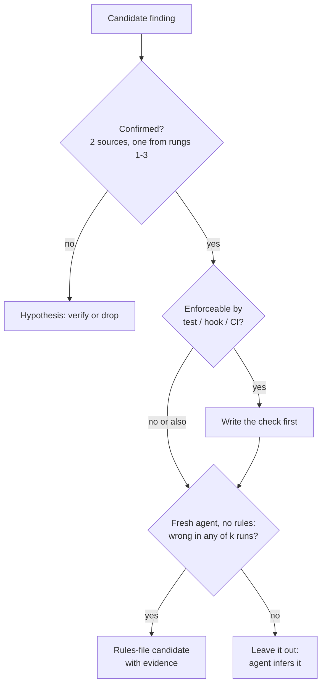

# 03.3 · The brownfield audit

## Why it matters

A coding agent arriving in a brownfield repository is a very fast new hire with no memory and no colleagues to ask. It can read every file in minutes. What it cannot do is know **which of the patterns it reads are current**, which commands actually work, and which rules exist only in people's heads.

That gap is where most brownfield agent failures come from. In a 10-year-old .NET codebase, the *majority* pattern is often the *abandoned* one: 200 files still use the old data-access helper, 12 use the new repository pattern, and the ADR that explains why sits in a folder the agent has no reason to open. An agent that imitates what it sees will imitate the past.

The audit is how you find those gaps before the agent does. It also decides what does **not** go into the rules file. Research on repository context files found that, across several agents and models, they did not generally improve task success and increased inference cost by over 20% on average; the authors concluded that such files should describe only minimal requirements (Gloaguen et al., 2026). Anthropic's CLAUDE.md guidance says the same from the other direction: for each line, ask whether removing it would cause mistakes. The audit produces the evidence for that question.

> [!NOTE]
> Content tags. **Concept** (stable): the five passes, the evidence ladder, the inference filter. **Implementation**: the `AiLayerTool scan` helper is lab code for this course, not an industry tool.

## How it works

### Five passes

Do them in this order; each one feeds the next. Timebox each to 10–20 minutes on a real repository.

| Pass | Question | Where to look in a .NET / SQL Server repo |
|---|---|---|
| 1. **Solution topology** | What are the deployable units, and how do they depend on each other? | `*.sln`/`*.slnx`, `*.csproj` (target frameworks, project references, packages), `Directory.Build.props`, `global.json` |
| 2. **Build and test commands** | What exact command builds and tests it, and does it pass *today*? | CI workflow files, `README`, scripts; then **run them** |
| 3. **SQL Server conventions** | How do schema changes, naming, types and data access work? | migrations folder, `.sqlproj`/DACPAC, stored procedures, repository classes, column types for money and time |
| 4. **Legacy patterns** | Which patterns are still present but no longer wanted? | `[Obsolete]` attributes, ADRs, `Legacy/` folders, `git log` on the old helper, analyzer suppressions |
| 5. **Tribal knowledge** | What does everyone "just know" that is written nowhere? | PR review comments, incident notes, ask two engineers "what do new hires always get wrong?" |

### The evidence ladder

When sources disagree, trust the stronger one. From strongest to weakest:

1. **Executable evidence** — a test, analyzer or CI check that fails when the convention is broken; a build command you just ran.
2. **Recent code** — what the last 6–12 months of commits actually do (`git log --since`).
3. **Decision records** — ADRs, with dates and status.
4. **Commit and PR history** — messages and review comments.
5. **Docs in the repo** — README, `docs/`; check the last-modified date.
6. **Wiki pages and slide decks** outside the repo.
7. **Memory** — "I think we always…".

A finding is **confirmed** when two sources agree and at least one is from rungs 1–3. A finding that rests only on rungs 5–7 is a *hypothesis* to test.

### The inference filter

Not every confirmed finding belongs in the rules file. The question is not "is this true?" but **"would the agent get it wrong without being told?"** Test it directly: open a fresh session with **no rules file**, ask the finding as a question ("How do I get the current time in this codebase?"), and check the answer.

Agents are stochastic ([02.2 · Sampling and (non-)determinism](../module-02/lesson-02.md)), so one run proves little. Here is the arithmetic.

*Intuition.* If the agent gets a finding right most of the time, a few runs will often all come back right — and you will wrongly conclude it can infer the finding.

*Equation.* If each run is independently correct with probability $p$, the chance that all $k$ runs are correct is

$$P(\text{all } k \text{ correct}) = p^{k}$$

*Tiny example.* Suppose the agent names the right data-access pattern in 80% of sessions ($p = 0.8$). With $k = 3$ probe runs: $0.8^3 = 0.512$. With $k = 5$: $0.8^5 \approx 0.33$.

*Implementation.* Run each probe $k$ times in fresh sessions; the finding becomes a rule if **any** run is wrong.

*Interpretation.* With 3 runs, a finding the agent gets wrong one time in five still looks "inferable" about half the time. Five runs cut that to a third. That is good enough for triage — deciding what to write — but not for proving a rules change works; Module 7 turns this into proper confidence intervals.



## Show me

The lab tool scans Contoso Billing. From `labs/module-03/`:

```bash
dotnet run --project tools/AiLayerTool -- scan brownfield
```

Abridged output:

```text
## Solutions and projects
- solution `Contoso.Billing.sln` -> build: `dotnet build Contoso.Billing.sln`, test: `dotnet test Contoso.Billing.sln`
- `src/Contoso.Billing/Contoso.Billing.csproj` | net8.0 | Dapper 2.1.35, Microsoft.Data.SqlClient 5.2.2
- `tests/Contoso.Billing.Tests/Contoso.Billing.Tests.csproj` | net8.0 | TEST PROJECT | ... xunit 2.9.2 ...

## SQL migrations (V### needs a matching U### undo script?)
- V001__create_invoice.sql: NO undo script
- V002__add_due_date.sql: NO undo script
- V003__utc_offsets_and_status.sql: undo present
- V004__due_not_null.sql: undo present

## Obsolete types and their remaining callers
- `SqlHelper` (src/Contoso.Billing/Legacy/SqlHelper.cs) | "Use a Dapper repository behind an interface..." | callers: src/Contoso.Billing/Legacy/MonthlyRevenueReport.cs

## Docs that name things the code no longer has
- `docs/ARCHITECTURE.md` (last edited 2021-06-10):
  - `SqlHelper.ExecuteDataSet` is [Obsolete] ...
  - `DateTime.Now` is not used anywhere in code (stale or invented?)
  - path `Billing.sln` does not exist
  - `Billing.UnitTests` is not used anywhere in code (stale or invented?)
```

The tool only surfaces *leads*. The auditor turns them into findings:

| # | Finding | Evidence (rung) | Confirmed? | Enforceable? | Fresh-agent probe (5 runs) | Rules file? |
|---|---|---|---|---|---|---|
| 1 | Build/test with `Contoso.Billing.sln` | ran `dotnet test` (1), csproj (2) | yes | CI | 5/5 correct | no — inferable |
| 2 | New data access = Dapper repository behind interface; never `SqlHelper` | `ConventionTests` (1), ADR 0007 (3), history BILL-66 (4) | yes | test exists | 3/5 correct (2 runs copied `SqlHelper` from `Legacy/`) | **yes** |
| 3 | Time from `IClock.UtcNow`, never `DateTime.Now` | `ConventionTests` (1), `InvoiceService` (2) | yes | test exists | 4/5 correct | **yes** |
| 4 | Every new `V###` migration needs a `U###` undo script | V003 comment (2), V003/V004 pairs (2) | yes | could be a CI check | 1/5 correct (V001/V002 have none) | **yes** + add check |
| 5 | Money is `decimal(19,4)` / `decimal` | schema (2), `Invoice.cs` (2) | yes | analyzer possible | 5/5 correct | no — inferable |
| 6 | `docs/ARCHITECTURE.md` is stale | dated 2021 (5) vs ADR 2024 (3) | yes | — | 2/5 cited the doc as current | **yes** (one line) |

The probe counts above are illustrative for this walkthrough; you will record your own. Note finding 4: the majority of migrations (2 of 4) *lack* undo scripts, so an agent that imitates the folder gets it wrong. That is the classic brownfield trap — the convention is newer than most of the evidence. Also note what the docs said: the 2021 architecture page contradicts the ADR, the code and the tests. On the evidence ladder it loses on every count.

## Try it

Budget: 75 minutes. Use the [brownfield audit checklist](../../templates/brownfield-audit-checklist.md).

1. **Contoso first (30 min).** Run `scan` on `labs/module-03/brownfield`. Then run `dotnet test` yourself. Read `docs/history-excerpt.txt` and the ADR. Produce your own findings table with at least 6 rows, each with evidence rungs.
2. **Probe (15 min).** For every confirmed finding, run the fresh-agent probe 5 times with no rules file present (rename `CLAUDE.md`/`AGENTS.md` temporarily). Record the counts.
3. **Your repository (30 min).** Run `scan` on a real brownfield .NET repository you are allowed to work on. Do pass 5 (tribal knowledge) by asking two colleagues: *"What do new people always get wrong in this repo?"* Write the report to `ai-layer-lab/audit/brownfield-audit.md`.

> [!WARNING]
> Your employer's repository is confidential. Keep the audit of a real work repository in a **private** repository, never paste its code or findings into public tools or your public portfolio, and anonymize before you reuse anything in teaching (Module 14 and Module 21 cover attribution and case studies).

<details>
<summary>Hint: pass 2 when the build is broken</summary>

A build that does not pass today is itself a top finding: agents validate their work by running the build and tests, so a red baseline means every agent session starts by "fixing" unrelated failures or learns to ignore red. Record the exact failures and the command that reproduces them; getting a green baseline is usually the first engagement deliverable.
</details>

## Break it

Do a **docs-only audit** of Contoso: read `docs/ARCHITECTURE.md` and the `README` (if any) and nothing else. Write the findings you would put in the rules file.

Then give an agent those findings as its only instructions and hand it ticket `tickets/BILL-142.md`. Run `dotnet test`.

<details>
<summary>What you should see</summary>

The docs-only findings are "use `SqlHelper.ExecuteDataSet`", "use `DateTime.Now`", "build `Billing.sln`, tests in `Billing.UnitTests`". The agent follows them: it calls `SqlHelper` outside `Legacy/` and `ConventionTests.Only_the_Legacy_folder_may_call_SqlHelper` fails; the build command it suggests fails because `Billing.sln` does not exist.
</details>

## Fix it

**Diagnose.** Every wrong finding rests on a single rung-5 source (a repository doc last edited in 2021, copied from a wiki). None was confirmed by a second source, and the stronger sources — the test project, the `[Obsolete]` attribute, the ADR, the history — all contradict it. The audit failed at *confirmation*, not at reading.

**Modify.** Re-run the audit with triangulation: every finding needs two sources and one from rungs 1–3. Add one more finding the docs-only audit could never produce: "`docs/ARCHITECTURE.md` is stale; trust the ADR and the code." Open a ticket to fix or delete the stale doc — the audit is allowed to change the repository, not just describe it.

**Rerun.** Probe the corrected findings with a fresh agent and rerun BILL-142 with a rules file containing only the confirmed, non-inferable findings. `dotnet test` passes.

## How do I know it works?

- [ ] Every finding in your report lists at least two evidence sources, one from rungs 1–3; nothing rests on memory alone.
- [ ] You ran the build and test commands yourself and recorded their result (green, or the exact failures).
- [ ] Every "yes, rules file" finding has a probe count showing the agent got it wrong at least once in 5 fresh runs.
- [ ] At least one finding was **excluded** because the agent inferred it 5/5 — an audit that puts everything in the rules file has not used the filter.
- [ ] Each enforceable finding either has an existing test/check or a ticket to add one.
- [ ] A colleague who knows the repository reads the report and finds no false statements.

## Use / don't use

**Use the audit** before writing any rules file, at the start of every client engagement (it doubles as the discovery deliverable), and again every time a major migration lands — the audit is how you notice that the AI layer just went stale.

**Don't** let it become an architecture review. The audit asks one narrow question: *what would an agent get wrong here, and what evidence says so?* Refactoring recommendations go in a separate list.

**Limitations.** The scan tool finds only what can be pattern-matched (obsolete attributes, missing files, unused names); tribal knowledge only comes from people. Probe counts of 3–5 runs are triage, not measurement — as computed above, they miss unreliable findings a third to a half of the time. And an audit describes one moment: in a repository with active migrations, parts of it are stale within a quarter, which is why [03.4](lesson-04.md) ties every rule to evidence that can be re-checked automatically.

## Reflect

1. Which finding in your own repository surprised you most, and which rung of evidence revealed it?
2. What did a colleague tell you in pass 5 that no file in the repository records?
3. Which of your findings would you have written into the rules file *before* this lesson that the agent can actually infer?

## Sources

- [Gloaguen et al. (2026) — Evaluating AGENTS.md](https://arxiv.org/abs/2602.11988) — context files did not generally improve task success, raised cost by over 20%; recommend minimal requirements only.
- [Claude Code docs — Best practices](https://code.claude.com/docs/en/best-practices) — "Would removing this cause Claude to make mistakes?"; include what cannot be inferred from code.
- [Anthropic Engineering — Effective context engineering for AI agents](https://www.anthropic.com/engineering/effective-context-engineering-for-ai-agents) — context as a finite resource; smallest set of high-signal tokens.
