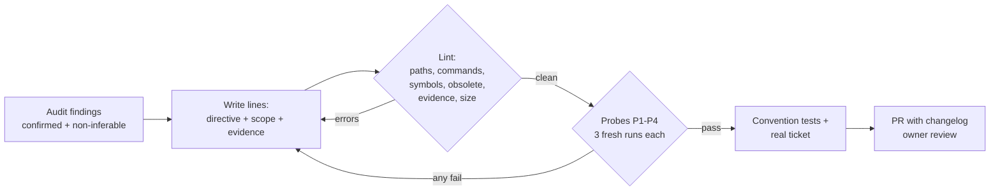

# 03.4 · Writing a grounded rules file

## Why it matters

The root rules file (`AGENTS.md`, `CLAUDE.md`, Copilot's `copilot-instructions.md`) is the most leveraged file in the AI layer: it is loaded into every session, and — as you saw in [02.3 · The instruction hierarchy](../module-02/lesson-03.md) — it arrives with the authority of repository instructions. It is also the easiest file to get wrong, because nothing checks it. Most rules files in the wild are a mix of three things:

- **Generic advice** the agent cannot act on ("write clean, SOLID code", "think step by step").
- **Claims that were true once** ("use `SqlHelper`", "build `Billing.sln`").
- **A few genuinely useful, non-obvious facts** — buried in the middle.

The first costs tokens and attention. The second is actively harmful: the agent follows it. The third is the only reason the file exists. A **grounded** rules file keeps only the third kind and makes every line prove it belongs: each line points at evidence in the repository that a person — or a script — can re-check.

> [!NOTE]
> Content tags. **Concept** (stable): line anatomy, grounding, the four tests, lint + probes. **Implementation**: size guidance quoted from tool docs (as of 2026-09) and the course's `AiLayerTool lint`.

## How it works

### Anatomy of a grounded line

```text
- Never call `SqlHelper` from new code; only `src/Contoso.Billing/Legacy/` may use it. (ev: `src/Contoso.Billing/Legacy/SqlHelper.cs`)
  └──── directive ────┘                   └──────── scope ─────────┘       └──────────── evidence ─────────────┘
```

- **Directive** — an action the agent can take differently: a command, a file, a pattern, a forbidden thing named precisely.
- **Scope** — where it applies. If the scope is one folder, consider a path-scoped rule instead ([03.2](lesson-02.md)).
- **Evidence** — the strongest source from the [03.3](lesson-03.md) evidence ladder: a test, a file, an ADR. It costs a few tokens and it doubles as a pointer the agent can follow for detail.

### The four tests for every line

| Test | Question | Fails when… | What to do |
|---|---|---|---|
| **True** | Does the evidence exist and say this *today*? | path gone, symbol unused or `[Obsolete]`, command fails | fix or delete |
| **Needed** | Would a fresh agent get this wrong without the line? | probe 5/5 correct | delete |
| **Actionable** | Can the agent do something different because of it? | "be careful with performance" | make concrete or delete |
| **Right place** | Is this a fact that applies broadly? | procedure, guarantee, one-folder fact | move to skill / test / path rule |

### Size is a budget, not a style choice

Claude Code's documentation targets **under 200 lines per `CLAUDE.md`** and says longer files "consume more context and reduce adherence"; Cursor's docs suggest keeping rules under 500 lines and splitting them. This course uses **300 lines as a hard cap** for the whole always-loaded layer, with 200 as the warning line.

Two mechanisms make length expensive:

- **Cost per session.** At roughly 10–15 tokens per rules line, a 300-line file is about 3,000–4,500 tokens loaded before the agent reads a single line of code. For the 1,440 sessions a month from [03.1](lesson-01.md), that is 4–6 million tokens a month of re-reading. Module 4 turns this into a proper context budget.
- **Attention.** Models use information at the start and end of a long context more reliably than information in the middle (Liu et al., 2023). Every line you add pushes other lines toward the middle. Anthropic's guidance states the practical consequence: if the agent keeps ignoring a rule, the file is probably too long; and emphasis such as "IMPORTANT" works on one line, not on many.

### Contradictions and staleness

If two rules contradict each other, Claude Code's docs warn the model "may pick one arbitrarily". The same happens between a rule and the code it describes, except the rule usually wins — it is an explicit instruction, and the code is just an example. That is why grounding matters: a lint can re-check every line against the repository on every pull request, so a migration that obsoletes a rule turns the build red *before* an agent uses the rule.



### What the lint checks

`AiLayerTool lint` (in `labs/module-03/tools/`) is 200 lines of C# with no dependencies. For every backticked token in the rules file it:

- checks that paths exist and that `dotnet …` commands refer to solutions/projects that exist;
- checks that code symbols (`SqlHelper.ExecuteDataSet`, `IClock.UtcNow`) are actually used in code, ignoring comments and string literals;
- flags a symbol whose type is marked `[Obsolete]` — unless the line forbids it ("never call `SqlHelper`");
- warns on any bullet with no evidence;
- errors above 300 lines, warns above 200.

It cannot tell whether a rule is *needed* or *obeyed*. That is what probes are for.

## Show me

The v1.0.0 rules imported from the wiki (`labs/module-03/starter/CLAUDE.md`), linted against Contoso Billing:

```text
$ dotnet run --project tools/AiLayerTool -- lint brownfield/CLAUDE.md --repo brownfield
WARN line 7: rule has no evidence: cite a file with (ev: `path`) or delete it
WARN line 8: rule has no evidence: cite a file with (ev: `path`) or delete it
ERROR line 13: command `dotnet build Billing.sln` refers to `Billing.sln`, which does not exist
ERROR line 14: `Billing.UnitTests` is not used anywhere in code (stale or invented?)
ERROR line 18: `SqlHelper.ExecuteDataSet` is [Obsolete] in src/Contoso.Billing/Legacy/SqlHelper.cs: "Use a Dapper repository behind an interface. See docs/adr/0007-dapper-repositories.md."
ERROR line 23: `DateTime.Now` is not used anywhere in code (stale or invented?)
...
29 lines | 4 error(s) | 11 warning(s)
```

Four false claims in 29 lines, and not one line is grounded. The grounded rewrite (`labs/module-03/solution/AGENTS.md`, 28 lines) reads, in part:

```markdown
## Data access

- New data access: Dapper in a repository behind an interface, following `IInvoiceRepository` / `InvoiceRepository`. (ev: `docs/adr/0007-dapper-repositories.md`)
- Never call `SqlHelper` from new code; it is `[Obsolete]` and only `src/Contoso.Billing/Legacy/` may use it. (ev: `src/Contoso.Billing/Legacy/SqlHelper.cs`)
- `docs/ARCHITECTURE.md` is stale (2021) on data access, dates and build; trust the ADR and the code. (ev: `docs/history-excerpt.txt`)

## Database migrations

- New migration = `db/migrations/V###__name.sql` plus a matching `U###__name.sql` undo script; a PR without the `U###` file is rejected. (ev: `db/migrations/V003__utc_offsets_and_status.sql`)
```

```text
$ dotnet run --project tools/AiLayerTool -- lint brownfield/AGENTS.md --repo brownfield
28 lines | 0 error(s) | 0 warning(s)
```

What is **not** in it matters as much: no "clean code", no indentation rules (inferable from the code), no money-type rule (the audit's probe showed the agent infers it), no personality ("You are a senior .NET developer").

## Try it

Budget: 90 minutes, in `ai-layer-lab` (which holds the Contoso code from [03.1](lesson-01.md)).

1. Build the lint once: `dotnet build labs/module-03/tools/AiLayerTool`. Run it on the v1.0.0 `CLAUDE.md` and save the output as your "before".
2. From your [03.3](lesson-03.md) findings, write `AGENTS.md`: only confirmed, non-inferable findings; every bullet with directive, scope and `(ev: …)`. Put build/test commands first. Make `CLAUDE.md` import it (`@AGENTS.md`).
3. Lint until clean: `dotnet run --project <path>/AiLayerTool -- lint AGENTS.md --repo .`
4. Run probes P1–P4 from `labs/module-03/solution/probes/probes.md`, 3 fresh sessions each, and log the results table.
5. Give an agent `tickets/BILL-142.md` with the new rules. Run `dotnet test Contoso.Billing.sln`.
6. Add a v1.1.0 entry to `AI-LAYER-CHANGELOG.md` and merge through a PR reviewed by the AI-layer owner.
7. Repeat steps 2–4 for your own brownfield repository (private), from your audit.

<details>
<summary>Hint: a line that keeps failing the probe</summary>

If a grounded, correct line still fails probes, check in order: is it buried in the middle of a long file (move it up or cut other lines)? Is it phrased as a prohibition only (add the positive alternative: *what* to use, not just what to avoid)? Does another loaded file contradict it (`/memory` in Claude Code)? Is it really a guarantee that belongs in a test? Add "IMPORTANT" to at most one line.
</details>

## Break it

> [!CAUTION]
> Do this on a branch of your lab repository only. Never plant a known-bad rule in a shared or production repository's AI layer.

This is the module's deliberate failure. A teammate "restores the architecture notes" in your clean `AGENTS.md`, replacing the data-access section with the line from the 2021 wiki:

```markdown
- All data access goes through `SqlHelper.ExecuteDataSet`; repositories return a `DataSet` and the caller reads the tables it needs.
```

The PR is small, reads plausibly, and the reviewer approves it. Now, in a fresh session, give the agent `tickets/BILL-142.md` and let it implement the story. Then run `dotnet test Contoso.Billing.sln` and read the diff.

Before you run it, predict: which pattern will the agent use, and which test will catch it?

## Fix it

**Diagnose.** Work from the symptom back to the line.

1. *Symptom:* `ConventionTests.Only_the_Legacy_folder_may_call_SqlHelper` fails; the diff has a new method returning `DataSet` via `SqlHelper.ExecuteDataSet`, outside `Legacy/`.
2. *Failure class* ([02.5](../module-02/lesson-05.md)): this is not a hallucination or a reasoning failure — the agent followed an explicit instruction. It is **stale context delivered as an instruction**.
3. *Source:* search the loaded instruction files for the pattern (`git grep -n SqlHelper -- AGENTS.md CLAUDE.md .claude`), then `git log -p -- AGENTS.md` to find the commit that introduced it.
4. *Evidence check:* the lint reports the line as recommending an `[Obsolete]` symbol; on the evidence ladder, the test, the ADR and the history all contradict it.

**Modify.** Revert the line to the grounded version (directive + scope + evidence), keep the negative rule with its positive alternative, and add a CI step that runs the lint on every PR touching the AI layer so the next "restore" fails before review:

```yaml
# .github/workflows/ai-layer.yml (fragment)
- run: dotnet run --project tools/AiLayerTool -- lint AGENTS.md --repo .
```

Record the incident in `AI-LAYER-CHANGELOG.md` (what, why, evidence, verification).

**Rerun.** Fresh session, same ticket. `dotnet test` passes; the diff adds `ListOverdueAsync` (or similar) to `IInvoiceRepository` with Dapper and a `CancellationToken`, filters `Status = Issued` in SQL, and computes days overdue from `IClock.UtcNow`.

<details>
<summary>Solution notes</summary>

The reference rules are `labs/module-03/solution/AGENTS.md` and the changelog entry is in `labs/module-03/solution/AI-LAYER-CHANGELOG.md`. The key insight for teaching: the agent was *correct* given its instructions. The review process approved a plausible line; only a check against the repository could have caught it. That is why grounding plus a lint beats reviewer vigilance.
</details>

## How do I know it works?

- [ ] `AiLayerTool lint` reports **0 errors and 0 warnings**, and it runs in CI on every PR that touches an AI-layer path.
- [ ] The always-loaded layer (root file + everything it imports) is under 300 lines; `wc -l AGENTS.md CLAUDE.md` confirms.
- [ ] Probes P1–P4 pass in **3 of 3** fresh runs each (12/12), logged with date, rules version and agent/model.
- [ ] `dotnet test Contoso.Billing.sln` is green after the agent implements BILL-142 with the new rules.
- [ ] Deleting any one line and re-running its probe shows a failure at least once in 5 runs — if not, that line was not needed. (Spot-check 3 lines.)
- [ ] The changelog entry for v1.1.0 names the incident, evidence and verification.

Remember the arithmetic from [03.3](lesson-03.md): 3/3 probe passes are consistent with an agent that still fails one time in five. The probes tell you the rules are not *obviously* broken; Module 7 tells you how well they work.

## Use / don't use

**Use a grounded rules file** for any repository where agents write code that ships. Use the evidence markers even in small files — they are how the next person (or the lint) knows a line is still true.

**Don't** use the rules file for procedures (skills, Module 6), guarantees (tests, hooks — Module 8), or knowledge that belongs to one folder (path-scoped rules). Don't paste the README, an architecture overview, or a style guide your formatter already enforces; the AGENTS.md study found repository overviews unhelpful and context files costly (Gloaguen et al., 2026).

**Limitations.**

- Grounding proves a line is *consistent with the repository*, not that it is *good*. A grounded rule can still encode a bad convention.
- The lint is heuristic: it pattern-matches backticked tokens and misses claims written in plain prose. Keep claims in backticks so they can be checked.
- Rules stay advisory. The agent can still deviate; the convention test is what makes the deviation visible.
- As models change, some rules become unnecessary (the model infers them) and new failures appear. Re-run the probes when you change model or agent tool.

## Reflect

1. Which line in your own rules file failed one of the four tests, and which test?
2. How did it feel to watch the agent follow the stale rule perfectly — and what does that change about how you review AI-layer PRs?
3. What is the smallest check you could add today so the next stale rule turns a build red?

## Sources

- [Claude Code docs — Best practices](https://code.claude.com/docs/en/best-practices) — "Would removing this cause Claude to make mistakes?"; bloated files cause ignored instructions; emphasis on one line only.
- [Claude Code docs — How Claude remembers your project](https://code.claude.com/docs/en/memory) — target under 200 lines per file; contradictions may be resolved arbitrarily; `@` imports load at launch (as of 2026-09).
- [Cursor docs — Rules](https://cursor.com/docs/rules) — keep rules focused, under 500 lines, split into composable rules.
- [Liu et al. (2023) — Lost in the Middle](https://arxiv.org/abs/2307.03172) — models use information in the middle of long contexts less reliably.
- [Gloaguen et al. (2026) — Evaluating AGENTS.md](https://arxiv.org/abs/2602.11988) — context files did not generally improve success; over 20% higher cost; overviews unhelpful.
