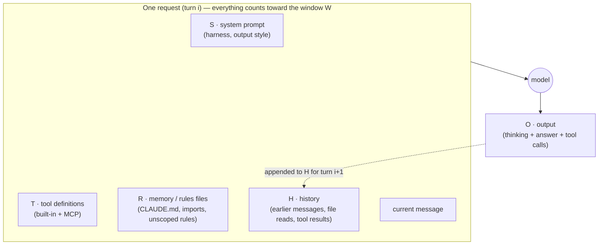

# 04.1 · What context is and what it costs

## Why it matters

In Module 3 you wrote a grounded rules file and capped it at 300 lines. The cap was a rule of thumb. This module turns it into engineering: context is a **budget**, every token in it is paid for twice — once in money and latency, once in the model's attention — and "just give it more context" is a design decision with a cost you can compute.

The problem this solves is a familiar one. A team's agent does something wrong; someone adds a paragraph to `CLAUDE.md`. Two years later the file imports an architecture page, a style guide and a handbook, and nobody can say what the agent actually needs to know. You will meet exactly that layer in this module's lab: 905 lines, 807 of them loaded into every request. Before you can cut it responsibly, you need two numbers: what it costs, and what it leaves for the work.

**Context engineering** is the practice of curating the smallest set of tokens that lets the agent do the task — across system instructions, tools, external data and message history (Anthropic, 2025). Prompt engineering is about one message; context engineering is about everything the model sees on every turn.

> [!NOTE]
> Content tags. **Concept** (stable): the budget equation, per-request resending, nominal vs effective context. **Implementation** (as of 2026-09): Claude Code's `/context` categories, cache multipliers, window sizes, example prices.

## How it works

### What one request contains

A coding agent does not "remember" anything between turns. On every turn, the harness rebuilds the whole request ([02.4](../module-02/lesson-04.md)) and sends it again:



Claude Code's documentation shows a representative startup: about 4,200 tokens of system prompt, a few hundred for environment info and deferred MCP tool names, and around 1,800 for a project `CLAUDE.md` — before your first prompt (representative numbers, as of 2026-09). Then every file the agent reads and every command output lands in **H** and stays there. The API documentation is explicit that the system prompt, every message including tool results, the tool definitions and the output all count toward the window.

### The budget equation

**Intuition.** The window is a fixed box. Everything that is not your task's working material takes space from it.

**Equation.** For one request:

$$B = W - S - R - T - H - O$$

where $W$ is the context window, $S$ the system prompt, $R$ the always-loaded rules and memory files, $T$ the tool definitions, $H$ the history so far, $O$ the space you reserve for the output (including thinking), and $B$ what is left for the code and tool results this turn needs.

**Tiny example.** $W = 200{,}000$, $S = 4{,}200$, $T = 1{,}000$, $O = 20{,}000$. With the lab's bloated layer, $R = 7{,}028$ (o200k tokens). At turn 1, $H = 0$:

$$B = 200{,}000 - 4{,}200 - 7{,}028 - 1{,}000 - 0 - 20{,}000 = 167{,}772$$

At turn 30 of a debugging session with $H = 120{,}000$, the same equation gives $B = 47{,}772$ — roughly six medium C# files. $R$ looked harmless at turn 1; $H$ is what ate the window.

**Implementation.** `ContextLab budget` discovers the files the way Claude Code loads them (root `CLAUDE.md`, `@` imports, rules without `paths:`) and prints this equation with your numbers. `/context` in a live Claude Code session shows the real breakdown by category.

**Interpretation.** On a large window, $R$ is rarely what makes you run out; history and tool output are. $R$ matters for a different reason: it is present on *every* request of *every* session, so it is the term you multiply.

### Cost: R is re-sent on every request

**Equation.** A session of $n$ requests re-sends $R$ each time, so the rules cost $n \cdot R$ input tokens per session. With prompt caching, the stable prefix is written once at a premium and read afterwards at a discount. With the multipliers in Anthropic's docs as of 2026-09 (5-minute cache write $1.25\times$, cache read $0.1\times$ on most models):

$$\text{cost}_R \approx p \cdot \big(1.25\,R + 0.1\,R\,(n-1)\big) \quad\text{vs}\quad p \cdot n \cdot R \text{ uncached}$$

**Tiny example.** $R = 7{,}028$, $n = 10$ requests per session, 1,440 sessions a month (the team from [03.1](../module-03/lesson-01.md)), example price $p = \$3$ per million input tokens:

- uncached: $7{,}028 \times 10 \times 1{,}440 = 101.2$M tokens → **\$303.61/month**
- warm cache: $1{,}440 \times (8{,}785 + 6{,}325) \approx 21.8$M token-equivalents → **\$65.28/month**
- the Module 3 grounded layer, $R = 531$: **\$22.94** uncached, **\$4.93** cached.

**Interpretation.** Caching turns a real bill into a small one — as long as the prefix stays identical. Anything that changes the cached prefix (tool definitions, the system block) invalidates what follows it, and a cached prefix still occupies the window: caching changes what you pay, not whether the tokens count. So the money argument for a short layer is modest. The attention argument is not.

### Nominal vs effective context

You saw in [02.1](../module-02/lesson-01.md) that the usable window is smaller than the advertised one: information in the middle of a long input is used less reliably (Liu et al., 2023). Chroma's 2025 study of 18 models found performance changing with input length even on simple tasks, and that a single distractor already reduced accuracy. Anthropic's engineering team calls the result an **attention budget**: every token depletes it a little, and they, like the API docs, use the term **context rot** for recall degrading as the context grows.

For a rules file this means: the one line that decides whether the agent writes a `U###` undo script — line 24 of `.claude/rules/sql.md`, one of 807 always-loaded lines — competes with hundreds of lines about coffee machines, React and Kubernetes. More context is not automatically better.

[Simulation: Context budget — irrelevant material vs usable budget and fact recall](../../simulations/context-budget/index.html?preset=bloated-rules)

## Show me

The bloated layer from `labs/module-04/bloated/`, placed on Contoso Billing:

```text
$ dotnet run --project tools/ContextLab -- budget ~/m4-work
LOAD         LINES  TOKENS  FILE
always         306   2,785  CLAUDE.md  (root instructions)
always         164   1,410  docs/ai/architecture-full.md  (@import in CLAUDE.md)
always         205   1,729  docs/ai/coding-standards.md  (@import in CLAUDE.md)
always          96     726  docs/ai/team-handbook.md  (@import in CLAUDE.md)
always          36     378  .claude/rules/sql.md  (rule without paths:)
not loaded      98     542  AGENTS.md  (CLAUDE.md exists and does not import it)

Always-loaded layer R: 807 lines, 7,028 tokens
  =  left for code, tool results, reasoning: 167,772 (83.9% of W)
R is re-sent on every request: 10 requests/session x 1,440 sessions/month = 101.2M tokens/month
  uncached at $3.00/M input: $303.61/month
  with a warm prompt cache (1.25x write once, 0.1x reads; multipliers as of 2026-09): $65.28/month
OVER BUDGET: always-loaded layer is 807 lines (course cap 300, warning at 200).
```

Three things to read off it:

1. **Imports are not lazy.** The three `@docs/ai/…` files look like "references", but Claude Code expands imports at launch; they cost the same as if they were pasted in.
2. **A rule without `paths:` is always loaded.** `sql.md` sits in `.claude/rules/`, which sounds optional; it is not.
3. **The file other tools read is not loaded at all.** Copilot and Cursor users get `AGENTS.md`; Claude Code users get `CLAUDE.md`. Two teams, two different contexts ([03.2](../module-03/lesson-02.md)).

The same run on the Module 3 grounded rules gives 34 lines and 531 tokens. Note that 7,028 tokens is only 3.5% of a 200k window. If you judged bloat by window share alone you would never fix it — which is why this module measures pass rate, not just tokens.

## Try it

Budget: 50 minutes.

1. Make a working copy with the bloated layer and build the tool (see [`labs/module-04/README.md`](../../labs/module-04/README.md)):

   ```bash
   cp -r labs/module-03/brownfield ~/m4-work && cp -r labs/module-04/bloated/. ~/m4-work/
   dotnet run --project labs/module-04/tools/ContextLab -- budget ~/m4-work
   ```

2. Compute $B$ by hand for turn 1 and for a turn with $H = 90{,}000$, then rerun with `--history 90000` and compare.
3. Rerun with `--window 1000000` (a 1M-token model). Write down what changed and what did not ($R$ per request, monthly cost).
4. Open Claude Code in `~/m4-work`, send one short question, then run `/context`. Record the memory-files total and compare it with `R` from the tool. Explain the difference (tokenizer, what the harness adds).
5. Run the tool on the Module 3 reference layer (`labs/module-03/solution/AGENTS.md` + `CLAUDE.md` over a fresh copy) and fill a one-page `context/budget.md`: both $R$ values, $B$ at turns 1 and 30, monthly cost with your team's real session count and your provider's current price.

<details>
<summary>Hint: my /context number is bigger than the tool's</summary>

Expected. The tool counts with `o200k_base`, a proxy; Claude's tokenizer differs. `/context` also shows categories the tool ignores (auto memory, skill descriptions, MCP tool names). Use `/context` for truth about one session and the tool for comparing two layers on equal terms.
</details>

## Break it

Stay in the same interactive session. Ask the agent:

> Run the full test suite with diagnostic verbosity (`dotnet test Contoso.Billing.sln -v diag`) and tell me whether it passes.

Then run `/context` again, and ask two more short questions ("which folder holds the migrations?", "what does `IClock` do?"). Before you look: predict which budget term grows, and by roughly how much.

## Fix it

**Diagnose.** `/context` shows the **messages** category jumping by tens of thousands of tokens after one tool call: the diagnostic build log is now part of $H$. It is re-sent on every later request — cheaply if cached, but it still occupies the window and still competes for attention. The two follow-up questions each carried the whole log. The failure is not a bad answer; it is a budget term nobody chose.

**Modify.** Three fixes, from cheapest to most structural:

- `/clear` (or `/rewind` to before the command) — the log leaves the window. When you want a fresh start rather than continuity, `/clear` costs nothing.
- Make the right command the default: the grounded `AGENTS.md` already names `dotnet test Contoso.Billing.sln` with the default (minimal) verbosity; add "never use `-v diag` unless asked" only if you see the agent choose it on its own.
- Keep verbose output out of the main context: delegate the run to a sub-agent that returns a summary, or use a hook that filters test output to failures (the Claude Code cost docs show a `PreToolUse` example). Module 8 covers hooks.

**Rerun.** Fresh session, same three questions with the default verbosity. `/context` should show the messages category growing by a few hundred tokens for the test run instead of tens of thousands.

## How do I know it works?

- [ ] Your hand computation of $B$ matches `ContextLab budget` within rounding for two different turns.
- [ ] `budget.md` states $R$, $B$ at turns 1 and 30, and the monthly cost of $R$ with and without caching, with your price source and date.
- [ ] You can name the term that grew in the break ($H$) and the command that proves it (`/context`).
- [ ] After the fix, the same question sequence adds less than 1% of the window to $H$.

## Use / don't use

**Use the budget** when you design a context layer, choose between a 200k and a 1M-token model, estimate what an AI layer costs a whole team, or explain to a manager why "paste the whole wiki into CLAUDE.md" is not free.

**Don't** optimise tokens in isolation. A layer that saves 90% of $R$ and loses the one fact the agent needed is a regression; 04.5 makes pass rate the first number and tokens the second. And don't treat a larger window as a fix for bloat — a bigger box does not make the model read the middle better.

**Limitations.**

- `ContextLab` counts with a proxy tokenizer and models only what loads at start; `/context` is the ground truth for one tool on one day.
- Cache multipliers, window sizes and prices change; they are marked as of 2026-09. On subscription plans you pay in usage limits, not dollars, but the same arithmetic drives how fast you hit them.
- The equation ignores quality. It tells you what fits, not what helps.

## Reflect

1. What is $R$ for your own main repository today, and how many sessions a month multiply it?
2. Which term of $B = W - S - R - T - H - O$ did you underestimate before this lesson, and why?
3. What is one thing in your always-loaded layer you would now pay \$0 to keep out?

## Sources

- [Claude Code docs — Explore the context window](https://code.claude.com/docs/en/context-window) — what loads at startup (representative token sizes), imports load at launch, what survives compaction (as of 2026-09).
- [Claude Code docs — Manage costs effectively](https://code.claude.com/docs/en/costs) — `/context`, `/clear`, prompt caching, hook that filters test output, sub-agents for verbose operations.
- [Claude API docs — Context windows](https://platform.claude.com/docs/en/build-with-claude/context-windows) — everything in the request counts toward the window; context rot; cached prefixes still occupy the window.
- [Claude API docs — Prompt caching](https://platform.claude.com/docs/en/build-with-claude/prompt-caching) — cache write 1.25× (5 min), read 0.1× on most models; prefix order tools → system → messages (as of 2026-09).
- [Anthropic Engineering — Effective context engineering for AI agents](https://www.anthropic.com/engineering/effective-context-engineering-for-ai-agents) — definition of context engineering; attention budget; context rot.
- [Hong, Troynikov, Huber (2025) — Context Rot](https://www.trychroma.com/research/context-rot) — 18 models; performance varies with input length on simple tasks; one distractor reduces accuracy.
- [Liu et al. (2023) — Lost in the Middle](https://arxiv.org/abs/2307.03172) — information in the middle of long contexts is used less reliably.
