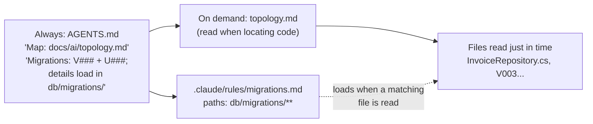

# 04.2 · Layering context

## Why it matters

[04.1](lesson-01.md) showed that the bloated layer costs money and attention. The naive fix is to delete most of it. That fixes the budget and breaks the agent, because some of those 807 lines were the only place a critical fact lived.

The real fix is **layering**: keep the knowledge, but decide *when* each piece enters the context. A fact the agent needs on every task goes in the always-loaded layer. A fact that matters only when touching `db/migrations/` loads when the agent works there. A 40-step release procedure loads when someone asks for a release. A map of the code is generated from the code, so it cannot drift. And some things never enter the context at all.

This is the same idea as a well-designed codebase: not everything is global. Module 3 gave you the components ([03.2](../module-03/lesson-02.md)); this lesson gives you the placement rule — and the failure it creates when the trigger for a layer fires too late.

> [!NOTE]
> Content tags. **Concept** (stable): the four layers, triggers, pointers, progressive disclosure, "decision before trigger". **Implementation** (as of 2026-09): Claude Code `paths:` rules and nested-file loading, Cursor `globs`, Copilot `applyTo`, skills.

## How it works

### Four layers

| Layer | Put here | Mechanism (Claude Code · Cursor · Copilot) | Trigger | Main risk |
|---|---|---|---|---|
| **Always loaded** | Facts needed on almost every task that the agent cannot infer: build/test command, the one data-access pattern, non-obvious prohibitions | root `CLAUDE.md` / `AGENTS.md`, `@` imports, rules without `paths:` · `alwaysApply: true` · `copilot-instructions.md` | session start | bloat; buried facts |
| **On demand** | Facts true in one area or one kind of task | path-scoped rules and nested `CLAUDE.md`/`AGENTS.md` · `globs:` · `applyTo:`; skills for procedures | a matching file is read; a skill is invoked or judged relevant | trigger fires late or never |
| **Generated** | Facts the code already knows: file tree, project list, migration numbers, test results | a script, `git ls-files`, `AiLayerTool scan`, a hook or the agent's own tools | regenerated on change or at query time | stale if committed and not regenerated |
| **Never** | Secrets, generated code, vendor folders, other teams' rules, personal preferences, anything the agent should not act on | `.gitignore`-style exclusions, permissions, `claudeMdExcludes`, `CLAUDE.local.md` for personal notes | — | leaks in through a paste or an import |

Layers apply at three **levels**: the repository (root files), the directory (path-scoped and nested files — "the closest `AGENTS.md` wins", per agents.md) and the task (the ticket, a plan, a skill, what you paste into the prompt).

### Just-in-time retrieval and progressive disclosure

Anthropic describes Claude Code as a hybrid: `CLAUDE.md` is loaded up front, while glob and grep let the agent retrieve files **just in time**. Agents built this way keep "lightweight identifiers" — file paths, stored queries, links — and load the content when a step needs it. That is **progressive disclosure**: each step reveals the next piece of context.

Retrieval here mostly means the agent's own search tools, not a vector database. Retrieval-augmented generation in the classic sense (Lewis et al., 2020) — embed documents, fetch the nearest passages — is one option for large prose corpora (policies, runbooks, tickets). For code, exact tools (grep, a symbol index, a language server) usually beat similarity search because names are exact. Module 8 covers MCP-based retrieval.

Progressive disclosure only works if the agent knows the next step exists. That is what a **pointer** does:



### Decision before trigger

Path-scoped rules and nested files load **when the agent reads a matching file**, not when it thinks about that area. That creates the one rule of layering you must never break:

> If the agent has to act on a fact *before* it would naturally open a file under the trigger path, the fact — or a one-line pointer to it — belongs in the always-loaded layer.

"Which files do I create for a new column?" can be answered without opening any migration file. So "`V###` needs a `U###`" must be always loaded; "money is `decimal(19,4)`" can wait for the path rule, because an agent writing the script will open a migration to copy its style first — and if it doesn't, `V001` is one search away and the fact is inferable.

Claude Code's docs add a second reason: path-scoped rules and nested files enter the message history when triggered, so compaction summarizes them away and they reload only when a matching file is read again (04.4).

### Documentation and topology maps as context

Documentation is context with a staleness risk ([03.3](../module-03/lesson-03.md)). The safe patterns are: reference docs by path instead of importing them; say which docs are stale; and generate what can be generated. A **topology map** — a short, annotated file tree plus a "where does X go?" table — is the cheapest way to save the agent a dozen exploratory reads. Keep it on demand (a path reference from the root), keep it short (under ~60 lines), and regenerate the tree from `git ls-files` in the same PR that moves folders.

## Show me

The Contoso facts from `labs/module-04/tasks-v0`, placed:

| Fact | Layer | Why |
|---|---|---|
| F1 test command | always | every task ends with it; old docs contradict it |
| F2 Dapper repository, no `SqlHelper` | always | decided before any file is opened; stale docs say the opposite |
| F3 `IClock.UtcNow` | always | one line; high cost of error; the convention test backs it |
| F4 `V###` + `U###` | always | decided before opening a migration; not inferable (half the scripts lack undo) |
| F5 `decimal(19,4)` | on demand (`db/migrations/**`) | inferable from `V001`; needed only while writing SQL |
| F8 index name | on demand (`db/migrations/**`) | needed only when writing a query plan or index |
| F9 BILL-97 owns the report migration | generated (topology map annotation) | the code comment already says it |
| Kubernetes, React, coffee | never | not in this repository |

The root keeps one pointer line for each on-demand layer:

```markdown
Map of the code: `docs/ai/topology.md` (read it when you need to find where something lives).
- Details (types, index names): `.claude/rules/migrations.md` loads when you open files in `db/migrations/`.
```

And the budget confirms the shape — small always-loaded core, detail behind triggers:

```text
$ dotnet run --project tools/ContextLab -- budget ~/m4-solution
always           9      78  CLAUDE.md  (root instructions)
always          25     453  AGENTS.md  (@import in CLAUDE.md)
on-demand       11     187  .claude/rules/migrations.md  (paths: db/migrations/**)
Always-loaded layer R: 34 lines, 531 tokens
```

The topology map (`docs/ai/topology.md`, 33 lines) is not listed: it is referenced by path, so it costs nothing until the agent reads it.

## Try it

Budget: 60 minutes, in your `~/m4-work` copy (bloated layer).

1. Print the bloated layer's blocks (headings are enough: `grep -n "^#" CLAUDE.md docs/ai/*.md .claude/rules/*.md`). In the [context audit template](../../templates/context-audit.md), section 2, give every block a layer: always / on demand / generated / never.
2. For every *on demand* block, write its trigger (glob, skill name, or "path reference") and check the decision-before-trigger rule. If it fails, promote the fact (or a pointer) to always.
3. Write `docs/ai/topology.md` from `git ls-files` (or `Get-ChildItem -Recurse -Name` if the copy is not a repository): annotated tree, "where does X go?" table, ≤ 60 lines. Reference it from the root by path — do not `@`-import it.
4. Write `.claude/rules/migrations.md` with `paths: ["db/migrations/**"]` and the migration details. Mirror it for one other tool (`.cursor/rules/*.mdc` with `globs:` or `.github/instructions/*.instructions.md` with `applyTo:`), as in [03.2](../module-03/lesson-02.md).
5. Replace the root files with your always-loaded core and run `ContextLab budget`. Then run the three tasks this lesson touches, three times each:

   ```bash
   sh labs/module-04/scripts/run-tasks.sh labs/module-04/tasks-v0/tasks.json ~/m4-work runs/layered 3 T04,T05,T08
   dotnet run --project labs/module-04/tools/ContextLab -- grade labs/module-04/tasks-v0/tasks.json runs/layered
   ```

<details>
<summary>Hint: skill or path rule?</summary>

A path rule carries **facts** about an area ("money is `decimal(19,4)` here"). A skill carries a **procedure** ("to add a migration: 1… 2… 3…") and loads when invoked or when its description matches the request. If you find yourself writing numbered steps in a path rule, it wants to be a skill (Module 6).
</details>

## Break it

> [!CAUTION]
> Work on your copy or a branch only. Never ship a known-broken rules layer to a shared repository.

"The root file should only have repo-wide facts," says a reviewer, "and migrations are one folder." Move the `V###` + `U###` line out of `AGENTS.md` and into `.claude/rules/migrations.md`. Delete the pointer line too. Run `budget` — $R$ drops again (about 55 tokens for the fact line alone). Now run T04 three times:

```bash
sh labs/module-04/scripts/run-tasks.sh labs/module-04/tasks-v0/tasks.json ~/m4-work runs/break-02 3 T04
```

Predict first: in how many of the three runs will the agent list a `U005` file?

## Fix it

**Diagnose.**

1. *Symptom:* some T04 runs list only `V005__add_po_number.sql`. Look at the failing JSON's `result` — the agent answered from the root rules and the file names it saw, without opening a migration.
2. *Did the layer load?* The rule loads only when a file under `db/migrations/` is read. In an interactive session, ask the T04 question, then run `/context` or `/memory`: the migrations rule is absent unless the agent opened a migration. Where it did open one, the run usually passes — which is why the failure is intermittent.
3. *Failure class:* **insufficient context** — the fact existed in the repository's AI layer but not in this request. The trigger fired after the decision, or never.
4. *Rule broken:* decision before trigger. Listing the files to create is a decision made before the agent has any reason to read a migration.

**Modify.** Put the fact back in the always-loaded layer (it is one line, about 55 tokens) and keep the detail in the path rule. Alternatively keep a one-line pointer in the root ("migrations: see `.claude/rules/migrations.md` before proposing files") — but a pointer the agent must choose to follow is weaker than the fact itself. For a fact this short, the fact wins.

**Rerun.** T04 three times: 3/3 list both `V005` and `U005`. Rerun T05 and T08 to confirm the facts that stayed on demand still pass.

<details>
<summary>Solution notes</summary>

The reference layer is `labs/module-04/solution/`. The teaching point: layering moves tokens out of $R$ only when the trigger reliably precedes the need. When you cannot guarantee that, you pay the 55 tokens. The task set is how you find out — reading the rules will not tell you.
</details>

## How do I know it works?

- [ ] Every block of the old layer has a layer and, for on-demand blocks, a written trigger.
- [ ] Every on-demand fact passes decision-before-trigger, or has its fact or pointer in the root.
- [ ] `ContextLab budget` shows the always-loaded layer under 300 lines (aim for under 100).
- [ ] T04, T05 and T08 pass 3/3 each on the layered version.
- [ ] `docs/ai/topology.md` matches `git ls-files` today, and a line in your PR template says to regenerate it when folders move.

## Use / don't use

**Use layering** as soon as the always-loaded layer passes ~100 lines, when a monorepo has areas with different conventions, or when procedures (release, migration, incident) are pasted into the root.

**Don't** layer a fact just because it is about one folder. Layer it when the agent reliably touches that folder before the fact matters. Don't `@`-import a document to "make it on demand" — imports load at launch. Don't commit a generated map without a way to regenerate it; a stale map is stale context with a friendly format.

**Limitations.**

- Triggers differ by tool: Claude Code loads path rules when matching files are *read*; Cursor and Copilot attach by glob to the files in play. Test each tool you support.
- Skill loading depends on the model judging the description relevant; that is a probabilistic trigger (Module 6).
- Retrieval quality depends on the agent's search behavior, which changes with model versions. Re-run the task set when you change model.

## Reflect

1. Which fact in your own repository's rules is decided before the agent would ever open the file that could trigger it?
2. Where did you feel the pull to "just import the doc", and what did you do instead?
3. What would a topology map of your main repository save a new agent session — and a new human colleague?

## Sources

- [Anthropic Engineering — Effective context engineering for AI agents](https://www.anthropic.com/engineering/effective-context-engineering-for-ai-agents) — Claude Code as a hybrid (CLAUDE.md up front, glob/grep just in time); lightweight identifiers; progressive disclosure.
- [Claude Code docs — How Claude remembers your project](https://code.claude.com/docs/en/memory) — rules without `paths` load at launch; path-scoped rules trigger when Claude reads matching files; nested files load on demand; imports load at launch (as of 2026-09).
- [Claude Code docs — Skills](https://code.claude.com/docs/en/skills) — skill bodies load when invoked or judged relevant.
- [AGENTS.md](https://agents.md/) — the closest `AGENTS.md` to the edited file wins; explicit user prompts override.
- [Cursor docs — Rules](https://cursor.com/docs/rules) — `alwaysApply`, `globs`, agent-requested rules.
- [GitHub Docs — Repository custom instructions for Copilot](https://docs.github.com/en/copilot/how-tos/copilot-on-github/customize-copilot/add-custom-instructions/add-repository-instructions) — `copilot-instructions.md` and path-specific `applyTo` instructions.
- [Lewis et al. (2020) — Retrieval-Augmented Generation](https://arxiv.org/abs/2005.11401) — the original RAG formulation: a generator conditioned on retrieved passages.
