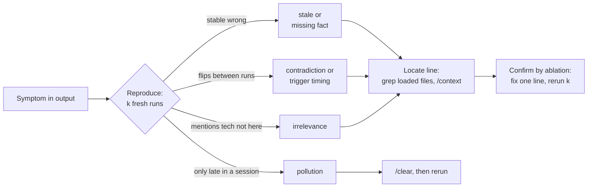

# 04.3 · Context pathologies

## Why it matters

When an agent gets something wrong, the reflex is to blame the model or to add another rule. Most of the time the defect is in what the agent was given. [02.5](../module-02/lesson-05.md) classified agent failures; this lesson zooms in on one family — **bad context** — and splits it into five pathologies, because each one has a different symptom, a different diagnosis and a different fix. "The context is bad" is not a diagnosis. "Line 57 of `CLAUDE.md` recommends an `[Obsolete]` helper and contradicts `AGENTS.md:19`" is.

You will need this vocabulary as a trainer too. A client says "our agent is unreliable on the billing module". The first thing you do is not a new prompt; it is a context audit that names what is wrong in terms the team can act on.

> [!NOTE]
> Content tags. **Concept** (stable): the five pathologies, symptom-to-cause mapping, confirmation by ablation. **Implementation**: `ContextLab audit` heuristics, Claude Code nested-file loading (as of 2026-09).

## How it works

### Five pathologies

| Pathology | What it is | Where it comes from | Typical symptom in output |
|---|---|---|---|
| **Pollution** | Residue in the *runtime* context: failed attempts, abandoned plans, huge tool outputs, the previous task's files | long sessions, no `/clear` between tasks, verbose commands | the agent revives a rejected approach, edits files from the last task, answers get slower and dearer turn by turn |
| **Stale** | Once true, now false | rules and docs not updated with the code | the agent *faithfully* reproduces an abandoned pattern ([03.4](../module-03/lesson-04.md)) |
| **Contradictory** | Two loaded instructions disagree — in one file, across files, across directory levels, across tools, or rule vs code | layers edited by different people; copies drifting | behavior flips between runs or depends on which files were read; hedged answers naming both options |
| **Redundant** | The same fact said more than once, or said when the code already says it | "the agent got it wrong again, add it again" | usually invisible; tokens spent, uneven emphasis, and the copies later drift into a contradiction |
| **Irrelevant** | True, but not about this repository or task | pasted company-wide docs, other teams' stacks | the agent proposes tools that do not exist here (npm, Helm), or misses a relevant rule buried among distractors |

Two distinctions matter:

- **Pollution vs irrelevance.** Irrelevance is in the *static* layer and hits every session. Pollution accumulates in *this* session's history ($H$ in [04.1](lesson-01.md)) and disappears with `/clear`.
- **Stale vs contradictory.** A stale rule that is the only instruction on its topic is followed consistently — wrong, but stable. The moment a correct instruction exists elsewhere, it becomes a contradiction, and the behavior becomes unstable. Claude Code's docs say it bluntly: if two rules contradict each other, Claude may pick one arbitrarily.

### Why these hurt: mechanisms

- **Distraction.** Shi et al. (2023) added irrelevant sentences to arithmetic word problems and saw large accuracy drops across models. Chroma's 2025 study found that even one distractor lowered accuracy relative to baseline, with effects that differ by model.
- **Position.** Facts in the middle of a long context are used less reliably (Liu et al., 2023). Irrelevant and redundant text pushes critical facts toward the middle.
- **Authority.** Instructions carry more weight than code the agent merely reads ([02.3](../module-02/lesson-03.md)). A stale rule beats correct code.
- **Trajectory dependence.** Directory-level files load only when the agent reads a file there (the closest `AGENTS.md` wins). The same question can see different context depending on which files the agent happened to open.

[Simulation: Context budget — irrelevant documents vs recall of the facts that matter](../../simulations/context-budget/index.html?preset=irrelevant-docs)



### Leads vs findings

`ContextLab audit` (in `labs/module-04/tools/`) produces **leads**: exact and near-duplicate lines (redundancy), the same backticked name recommended in one line and forbidden in another (contradiction), missing paths, missing symbols and `[Obsolete]` types (staleness), technologies with no trace in the repository (irrelevance), generic advice, and size. A lead becomes a **finding** when you confirm it against the code and label it. The tool is deliberately simple: it only sees what is in backticks, and it cannot see *semantic* contradictions such as "use `DateTime.Now`" vs "use `IClock.UtcNow`" — two different names for one decision. Your judgment closes that gap.

## Show me

`ContextLab audit` on the bloated layer (abridged):

```text
## redundancy (24)
- CLAUDE.md:109 repeated 2x: CLAUDE.md:120, CLAUDE.md:300  "- Always write tests."
- CLAUDE.md:153 repeated 1x: .claude/rules/sql.md:9  "- Money is `decimal(19,4)` in SQL Server and `decimal` in C#."
## contradiction (2)
- `SqlHelper`: recommended at CLAUDE.md:57 "- All data access goes through `SqlHelper.ExecuteDataSet`; ..."
    vs  forbidden at AGENTS.md:19 "- Do not use `SqlHelper` in new code."
- AGENTS.md exists but Claude Code does not load it (CLAUDE.md exists and does not import it)
## stale (46)
- CLAUDE.md:46 `Billing.sln` does not exist  "- Build with `dotnet build Billing.sln`."
- CLAUDE.md:57 `SqlHelper.ExecuteDataSet` is [Obsolete] but recommended here
## irrelevant (35)
- CLAUDE.md:192 mentions Kubernetes; no trace of it in the repo  "- We deploy to Kubernetes with Helm."
## generic (17)
- CLAUDE.md:12 "You are a world-class senior .NET architect with 20 years of experi..."
24 redundancy | 2 contradiction | 46 stale | 35 irrelevant | 17 generic | 3 size
```

Confirming three leads shows the range:

- **`Billing.sln` (stale) — confirmed.** `ls *.sln` shows only `Contoso.Billing.sln`; the history excerpt dates the rename to 2023. The same file's CI section names the right command 160 lines later, so this is also a *contradiction* the tool did not pair (different tokens). Symptom it predicts: T01 answers `dotnet test Billing.sln`.
- **`SqlHelper` (contradiction) — confirmed, and worse than reported.** The tool paired `CLAUDE.md` with `AGENTS.md` (a cross-tool contradiction: Claude Code users get one architecture, Copilot users the other). Reading `CLAUDE.md` itself shows a second, semantic contradiction the tool missed: "Use `SqlHelper` for everything" and, in the same file, "Since 2024 new repositories use Dapper".
- **`StringBuilder` (stale) — rejected.** It is a framework type the repository simply does not use yet; the line is generic advice, not a false claim. Label it *irrelevant/generic*, not stale.

## Try it

Budget: 60 minutes, on your `~/m4-work` copy.

1. Run the audit and save it: `dotnet run --project labs/module-04/tools/ContextLab -- audit ~/m4-work > audit-leads.txt`.
2. Pick **two leads per category** (ten in total). For each, confirm or reject it against the code (`ls`, `git grep`, the tests, the ADR) and write one row in a pathology log: lead, verdict, pathology, evidence, predicted symptom, task that would show it.
3. Find **two semantic contradictions** the tool missed (hint: time, and the solution file). Add them to the log.
4. Produce one pollution example yourself: in a single session ask T02, reject the answer ("no, use `SqlHelper`"), then ask the agent to "start over and give me the best answer". Record whether the rejected idea comes back. Then `/clear` and ask again.
5. Run T01, T02 and T03 three times each on the bloated layer and match the failures to your log:

   ```bash
   sh labs/module-04/scripts/run-tasks.sh labs/module-04/tasks-v0/tasks.json ~/m4-work runs/bloated-123 3 T01,T02,T03
   dotnet run --project labs/module-04/tools/ContextLab -- grade labs/module-04/tasks-v0/tasks.json runs/bloated-123
   ```

<details>
<summary>Hint: an audit lead points at a line the agent never sees</summary>

Check the load column first. A contradiction with `AGENTS.md` does not affect Claude Code when `CLAUDE.md` exists and does not import it — but it does affect every Cursor or Copilot user in the same repository. Label it a cross-tool contradiction and fix it by making one file canonical ([03.2](../module-03/lesson-02.md)).
</details>

## Break it

> [!CAUTION]
> Work on a copy or branch. Never commit a planted contradictory rule to a shared repository.

Start from the clean reference layer (`labs/module-04/solution/` over a fresh Contoso copy, T02 passing 3/3). The reporting squad adds a folder-level note — reasonable-sounding, reviewed by someone outside the team:

```bash
cp labs/module-04/breaks/Invoices-CLAUDE.md ~/m4-solution/src/Contoso.Billing/Invoices/CLAUDE.md
```

```markdown
- Queries in this folder must use `SqlHelper.ExecuteDataSet` and return a `DataSet`; callers read `Tables[0]`.
- Do not add new Dapper methods here until the reporting migration is finished.
```

Run T02 five times. Predict first: will it fail every time, never, or sometimes — and what decides which?

## Fix it

**Diagnose.**

1. *Symptom:* T02 fails in some runs and passes in others; failing answers return `DataSet` via `SqlHelper`; one may hedge ("the root rules say Dapper, but this folder says…").
2. *Reproduce and classify:* flipping between identical runs points to contradiction or trigger timing, not a missing fact. Compare trajectories: runs where the agent read a file in `Invoices/` loaded the nested `CLAUDE.md`; runs that answered from the root rules alone did not.
3. *Locate:* list every instruction file, not just the root — `ContextLab budget` shows the nested file as on-demand; `find . -name CLAUDE.md -o -name AGENTS.md` works anywhere. `ContextLab audit` reports the contradiction and flags the `[Obsolete]` recommendation.
4. *Decide which side is true:* the evidence ladder from [03.3](../module-03/lesson-03.md) — ADR 0007, the `[Obsolete]` attribute and `ConventionTests.Only_the_Legacy_folder_may_call_SqlHelper` all say Dapper. The nested rule is stale *and* contradictory.

**Modify.** Delete the nested file. If a directory genuinely has an exception, write it once, with scope, in the place that loads first — for example in the root: "`src/Contoso.Billing/Legacy/` may use `SqlHelper`; nowhere else" — and back it with a test. Then close the door: make sure `CODEOWNERS` covers `**/CLAUDE.md` and `**/AGENTS.md` so directory-level rules get AI-layer review ([03.1](../module-03/lesson-01.md)), and run `ContextLab audit` (or the Module 3 lint) in CI on changes to instruction files.

**Rerun.** T02 five times: 5/5. Ask the agent in an interactive session to read `InvoiceRepository.cs` first and then answer T02 — the trajectory that used to trigger the contradiction now finds nothing to contradict.

<details>
<summary>Solution notes</summary>

The instructive part is the intermittency. A consistently wrong answer sends people looking for a bad rule; a sometimes-wrong answer sends them looking at the model ("it's non-deterministic"). Teach students to treat "flips between identical runs" as a context symptom first: contradiction or trigger timing, then sampling.
</details>

## How do I know it works?

- [ ] Your pathology log has ten confirmed-or-rejected leads, each with evidence, plus two semantic contradictions the tool missed.
- [ ] Each confirmed finding names the task (T01–T10) that would expose it, and at least three predictions match what the T01–T03 runs showed.
- [ ] After the fix, `ContextLab audit` reports 0 contradictions on the reference layer and T02 passes 5/5.
- [ ] Nested instruction files are covered by `CODEOWNERS` and checked in CI.

## Use / don't use

**Use the pathology labels** in every AI-layer review and incident note: they turn "the agent is flaky" into a fixable line. Use the audit tool as a first pass on any layer you inherit.

**Don't** treat audit counts as a quality score. 46 stale leads include framework names and placeholders; one confirmed contradiction on the data-access rule matters more than all of them. And don't fix pathologies by adding emphasis ("IMPORTANT: really use Dapper") — that adds a third instruction to a contradiction instead of removing one.

**Limitations.**

- Heuristic detection only sees backticked names; semantic contradictions and stale prose need a human or a carefully evaluated LLM reviewer (Module 7).
- Distraction effects vary by model and task; the published studies use benchmarks, not your repository. Your task set is the evidence that counts.
- Some redundancy is deliberate (a pointer repeated in a path rule). Label it and keep it consistent rather than deleting reflexively.

## Reflect

1. Which pathology did you find most of in your own repository's layer, and which one did you find *first*?
2. When have you blamed "model randomness" for something that was probably a contradiction or a trigger?
3. What review rule would have stopped the Invoices note from being merged?

## Sources

- [Claude Code docs — How Claude remembers your project](https://code.claude.com/docs/en/memory) — contradictory rules may be resolved arbitrarily; nested CLAUDE.md files load when files in that directory are read; review nested files and rules periodically (as of 2026-09).
- [Shi et al. (2023) — Large Language Models Can Be Easily Distracted by Irrelevant Context](https://arxiv.org/abs/2302.00093) — irrelevant context sharply reduces accuracy; instructions to ignore it help partially.
- [Hong, Troynikov, Huber (2025) — Context Rot](https://www.trychroma.com/research/context-rot) — one distractor lowers accuracy; effects differ across 18 models.
- [Liu et al. (2023) — Lost in the Middle](https://arxiv.org/abs/2307.03172) — facts in the middle of long contexts are used less reliably.
- [AGENTS.md](https://agents.md/) — the closest AGENTS.md to the edited file wins.
- [Anthropic Engineering — Effective context engineering for AI agents](https://www.anthropic.com/engineering/effective-context-engineering-for-ai-agents) — context as a finite attention budget; context rot.
