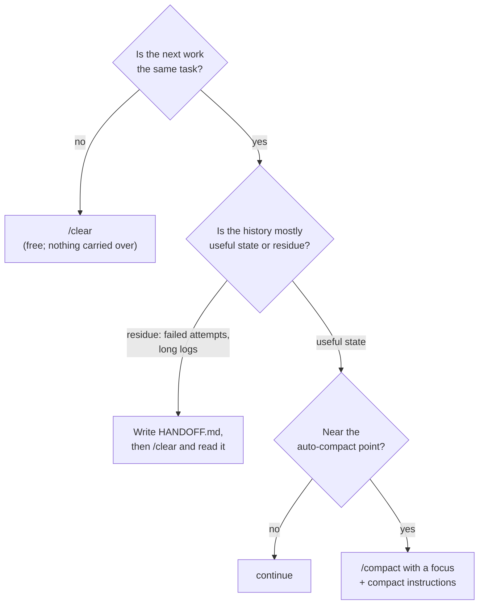

# 04.4 · Compression and compaction

## Why it matters

[04.1](lesson-01.md) showed history $H$ growing turn by turn; [04.3](lesson-03.md) showed it going bad (pollution). A real ticket — BILL-142 with tests, a migration and a review round — can easily run long enough to fill a large part of the window. Something has to give: the harness summarizes old turns, you clear the session, or you split the work.

Each of those is **lossy**. A summary keeps what the summarizer thinks matters. If the thing that mattered was a sentence you typed an hour ago — "migrations in this task are V010, the lower numbers are reserved" — it may not be in the summary, and the agent will carry on confidently without it. This lesson is about deciding what must survive and putting it where it will.

> [!NOTE]
> Content tags. **Concept** (stable): compression vs summarization vs reset; durable vs conversational constraints; handoff notes. **Implementation** (as of 2026-09, volatile): Claude Code's `/compact`, `/clear`, compact instructions, what it re-injects after compaction, `SessionStart` hooks, the API's compaction beta.

## How it works

### Five moves

| Move | What it does | Where | Loses |
|---|---|---|---|
| **Compression** | Makes new context smaller before it enters: quiet test output, filtered logs, terse tool results, a sub-agent that returns a summary | commands, hooks, sub-agents | detail you filtered out |
| **Prioritization** | Decides what gets the space: small always-loaded core, facts before procedures, recent over old | the layer design (04.2) | nothing, if done before the session |
| **Summarization** | Someone writes a short account of the state: you, the agent, or a sub-agent | a handoff note, a plan file | whatever the writer left out |
| **Compaction** | The harness replaces older history with a model-written summary and keeps going | `/compact`, auto-compact; server-side compaction in the API (beta) | conversation-only details |
| **Reset** | Start with an empty history | `/clear`, a new session | everything not in a file |

Anthropic's engineering guidance describes good compaction as keeping architectural decisions, unresolved bugs and implementation details while discarding redundant tool outputs — and recommends tuning a summarizer for recall first, then precision. It also describes **structured note-taking**: the agent maintains a notes file outside the window and reads it back. And sub-agents act as compression: one may explore with tens of thousands of tokens and return a distilled summary, often 1,000–2,000 tokens.

### What survives compaction in Claude Code

Claude Code's documentation lists what happens to each kind of content (as of 2026-09):

| Content | After compaction |
|---|---|
| System prompt, output style | still applies |
| Project-root `CLAUDE.md` and rules without `paths:` | **re-injected from disk** |
| Auto memory, the plan written in plan mode | re-injected from disk |
| Path-scoped rules, nested `CLAUDE.md` | summarized away; reload when a matching file is read again |
| Files read or edited | up to five most recently modified are re-read; a file over 5,000 tokens comes back as a reference only |
| Invoked skill bodies | re-injected, capped per skill and in total; oldest dropped first |
| Anything said only in conversation, and context hooks added earlier | **summarized with the rest** — may or may not survive |
| `SessionStart` hooks matching `compact` | run, and their output is added to the compacted context |

The rule that follows:

> A constraint that must survive belongs in a file that is re-injected (root rules, the plan, a handoff note a hook re-injects) — not only in the conversation.

Repository-wide constraints go in the root rules (04.2). **Task** constraints do not: "V010 for this task" is wrong for every other task. They go in the task's own durable artifacts — the ticket, the plan, a handoff note.

### Compact, clear or continue?



Two costs to weigh. **Money:** compaction reads the whole conversation it summarizes, so compacting a large context is itself a large request; `/clear` costs nothing. **Fidelity:** a compaction you steer ("focus on the auth bug") keeps what you choose instead of what the automatic pass guesses; an unsteered one is a guess.

### Compact instructions and handoff notes

Claude Code reads compaction guidance from the root `CLAUDE.md` (a "Compact instructions" section), and `/compact <focus>` steers a single run. The reference layer's instruction:

```markdown
# Compact instructions

When compacting, keep: the ticket id and its acceptance criteria, files changed so far, commands run and their
last result, and any constraint the user stated in this session (quote it verbatim).
```

A **handoff note** (`HANDOFF.md`) is summarization you control: goal, constraints *verbatim*, decisions, done, next, open questions — under ~40 lines, deleted when the ticket merges. To make it survive automatic compaction too, re-inject it with a `SessionStart` hook whose matcher is `compact` (the hooks guide shows this pattern with an `echo`; a `cat` of the note works the same way):

```json
{
  "hooks": {
    "SessionStart": [
      { "matcher": "compact", "hooks": [ { "type": "command", "command": "cat HANDOFF.md 2>/dev/null || true" } ] }
    ]
  }
}
```

## Show me

`labs/module-04/solution/context/HANDOFF-example.md` is a handoff note for BILL-142 halfway through. Its constraint section:

```markdown
## Constraints (verbatim from the user or ticket)

- "New migrations in this task are numbered V010/U010; V005-V009 are reserved by the reporting branch." (user, session 1)
- "Do not load paid or void invoices into memory." (ticket AC 4)
```

Note what is *not* in it: the repository rules (they are re-injected anyway), file contents (the agent can re-read them), the long test log (only its last result). A fresh session that reads this file can answer "which migration number?", "what is left?" and "what is undecided?" without the 100k tokens of history that produced it.

## Try it

Budget: 50 minutes, on the reference layer (`~/m4-solution`: Contoso + `labs/module-04/solution/`).

1. **Survival test.** Start an interactive session. Do four things: (a) say "For this task, new migrations are V010/U010; V005–V009 are reserved"; (b) ask the agent to read `db/migrations/V003__utc_offsets_and_status.sql` (this loads the path-scoped rule); (c) ask it to read `InvoiceService.cs` and `InvoiceRepository.cs`; (d) run `dotnet test Contoso.Billing.sln`.
2. Run `/context` and note the memory files and messages totals. Run `/compact` with no focus. Run `/context` again.
3. Ask four probes and record yes/no for each: "Which migration number do I use for a new column?" · "Which index covers customer + status?" (path rule) · "What is the test command?" (root rules) · "What did the last test run report?" (conversation).
4. Repeat steps 1–3 in a fresh session with `/compact keep every constraint I stated, verbatim` and compare.
5. Ask the agent to write `HANDOFF.md` using the structure in `HANDOFF-example.md`. `/clear`. Start with "Read HANDOFF.md, then tell me the next step and the migration number." Record the answers.
6. Put the Compact instructions section in your root `CLAUDE.md` and, optionally, the `SessionStart` hook in `.claude/settings.json`.

<details>
<summary>Hint: the index question failed after compaction</summary>

That is the documented behavior, not a bug: path-scoped rules are summarized away and reload only when a matching file is read again. If the agent needs that fact at a point where it will not reread a migration, either the fact or a pointer belongs in the root (the decision-before-trigger rule from [04.2](lesson-02.md)).
</details>

## Break it

> [!CAUTION]
> Do this on your working copy only; the break asks the agent to plan (not apply) a migration.

In a new session on `~/m4-solution`:

1. State the task constraint once, in chat: "For this task, new migrations are V010/U010; V005–V009 are reserved by the reporting branch."
2. Do 15–20 minutes of unrelated-looking work that fills history: read the tests, run `dotnet test`, ask for a review of `InvoiceRepository.cs`.
3. Steer the summary away from it: `/compact focus on the test results and the repository review`.
4. Ask: "I am adding a nullable column `PoNumber nvarchar(50)` to dbo.Invoice. List the file paths I create, one per line."

Predict before step 4: V005 or V010?

## Fix it

**Diagnose.**

1. *Symptom:* the answer lists `V005__…` and `U005__…` — correct for the repository, wrong for this task.
2. *Where did the constraint live?* Only in the conversation. Scroll to the compaction summary (or ask "what constraints did I give you in this session?"): the V010 sentence is missing or paraphrased away.
3. *Class:* insufficient context created by compaction — a conversational constraint summarized out of existence. The model did exactly what the repository rules and files suggest.
4. *Why the steered compaction made it worse:* you told the summarizer what to keep, and the constraint was not on the list.

**Modify.**

- Move the constraint to a durable, re-injected place: the task's `HANDOFF.md` (re-injected by the `SessionStart` `compact` hook) or the plan file if you work in plan mode. Not `AGENTS.md` — it is a task fact, not a repository fact.
- Keep the Compact instructions section in `CLAUDE.md` ("quote any constraint the user stated, verbatim"); it covers the unsteered case.
- When you steer a compaction, include the constraints: `/compact focus on the test results; keep all user constraints verbatim`.

**Rerun.** Repeat steps 1–4 with the handoff note and hook in place. The answer lists `V010__…` and `U010__…` — three times out of three compactions.

<details>
<summary>Solution notes</summary>

The reference files are `labs/module-04/solution/CLAUDE.md` (Compact instructions) and `labs/module-04/solution/context/HANDOFF-example.md`. The general lesson for teaching: the conversation is the least durable storage an agent has. Anything you would be upset to see forgotten should be written to a file whose survival you have verified.
</details>

## How do I know it works?

- [ ] Your survival table has four probes × two compaction styles, and it matches the documented behavior (root rules survive; path rules and conversation facts may not).
- [ ] After `/clear`, a fresh session that reads only `HANDOFF.md` answers the next step and the migration number correctly.
- [ ] With the handoff note and hook, the V010 constraint survives 3/3 compactions, including a steered one.
- [ ] Your root `CLAUDE.md` has a Compact instructions section of at most five lines.

## Use / don't use

**Use** compaction to keep continuity inside one task; `/clear` between unrelated tasks; handoff notes for anything that spans sessions or people; sub-agents for verbose exploration whose details you do not need in the main thread.

**Don't** rely on automatic compaction to keep constraints, and don't compact a polluted session hoping the summary will clean it — the summary is written from the pollution. Write a handoff note and clear. Don't turn `HANDOFF.md` into a second rules file; delete it when the task ends.

**Limitations.**

- What survives, the caps and the thresholds are implementation details that change between Claude Code releases; re-run your survival test after upgrading.
- Other agents manage long conversations in their own ways and document it differently. The durable-file rule transfers; the survival table does not — repeat the test per tool.
- Summaries are model-written: even a well-instructed compaction is probabilistic. That is why the fix is a file, not a better prompt.

## Reflect

1. What constraint have you lost in a long agent session, and where did it live?
2. When will you now choose `/clear` over `/compact`?
3. What would a handoff note for your current ticket say, in under 40 lines?

## Sources

- [Claude Code docs — Explore the context window](https://code.claude.com/docs/en/context-window) — what survives compaction, by mechanism; up to five files re-read; compact with a focus; `/clear` between tasks (as of 2026-09).
- [Claude Code docs — How Claude remembers your project](https://code.claude.com/docs/en/memory) — project-root CLAUDE.md is re-read from disk after `/compact`; conversation-only instructions can disappear.
- [Claude Code docs — Manage costs effectively](https://code.claude.com/docs/en/costs) — `/compact <focus>`, Compact instructions in CLAUDE.md, compaction is itself a large request, `/clear` costs nothing.
- [Claude Code docs — Automate actions with hooks](https://code.claude.com/docs/en/hooks-guide) — `SessionStart` hook with `compact` matcher re-injects context after compaction.
- [Claude API docs — Compaction overview](https://platform.claude.com/docs/en/build-with-claude/compaction) — server-side compaction on demand or at a token threshold (beta), custom summarization prompts, context editing as an alternative.
- [Anthropic Engineering — Effective context engineering for AI agents](https://www.anthropic.com/engineering/effective-context-engineering-for-ai-agents) — what compaction should keep and discard; structured note-taking; sub-agents returning 1,000–2,000-token summaries.
