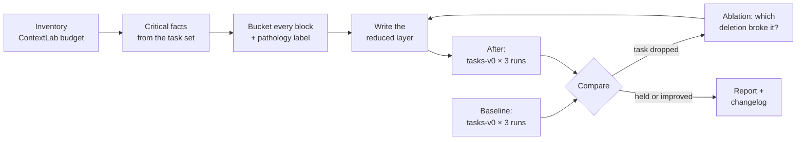

# 04.5 · The context audit

## Why it matters

This is the module's project and the first deliverable in the course that looks like consulting work. A team hands you an AI layer that grew for two years. You return three things: a smaller layer, a table that says why every piece went where it went, and numbers that show the agent did not get worse — ideally better and cheaper.

The last part is what separates an audit from an opinion. Anyone can delete 700 lines. The question the team will ask is "how do you know you didn't delete the line that mattered?" The answer is a **fixed task set**, run before and after in fresh sessions, with the same agent and model. Research backs the caution in both directions: an evaluation of repository context files found they did not generally improve task success and raised cost by over 20% (Gloaguen et al., 2026) — and Module 3 showed a single missing fact can break a ticket. You measure because both are true.

> [!NOTE]
> Content tags. **Concept** (stable): the four buckets, before/after on a fixed task set, ablation, cost per passing answer. **Implementation**: `ContextLab`, `run-tasks` with `claude -p --output-format json` (as of 2026-09).

## How it works

### Four buckets

Every fact and every block ends up in exactly one bucket. The questions decide it:

| Bucket | Question that puts it there | Where it lives (04.2) |
|---|---|---|
| **Must always know** | Would a fresh agent get it wrong without it (probe it), *and* is it needed before any on-demand trigger fires? | root `AGENTS.md` / `CLAUDE.md` |
| **Retrieve when needed** | True and needed, but only in one area or one kind of task, and the trigger reliably comes first? | path rule, nested file, skill, path reference |
| **Generate dynamically** | Can the repository produce it on request (tree, projects, migration numbers, test result)? | topology map from `git ls-files`, a scan, the agent's tools |
| **Never load** | Irrelevant, stale, generic, secret, or someone else's? | nowhere (delete; move human-only content to the handbook) |

Claude Code's own test for a line is the same idea in one question: would removing it cause the agent to make mistakes? The four buckets add *where* and *when*.

### The procedure



Rules for a fair comparison: same task set, same agent version and model, same number of runs, **fresh session per run** (the `run-tasks` script starts a new headless `claude -p` for each), and nothing else changed between the two measurements. Record the date and versions: model changes alone can move pass rates.

### The numbers

**Reduction.** $\text{cut} = (R_\text{before} - R_\text{after}) / R_\text{before}$, in lines and in tokens. The project requires at least 70%.

**Pass rate.** $\hat p = \text{passes}/\text{runs}$ over 10 tasks × 3 runs = 30 runs.

**Cost per passing answer** — the expected cost of getting one correct answer, which is what a team actually pays for:

$$c_\text{pass} = \frac{\sum \text{run costs}}{\text{passes}}$$

**Tiny example (illustrative numbers, not a measurement).** Before: 30 runs at a mean \$0.060, 15 passes → $c_\text{pass} = 1.80 / 15 = \$0.120$. After: 30 runs at \$0.050, 24 passes → $1.50 / 24 = \$0.0625$. The per-run saving is 17%; the saving per *useful* answer is 48%, because the pass rate rose. Interpretation: a layer that is cheaper per run but fails more can be *more* expensive per useful answer — always report both.

**What 30 runs can and cannot show.** 27/30 vs 28/30 is noise. 15/30 vs 24/30 is a difference worth believing provisionally, and a single task going from 3/3 to 0/3 is a strong hint about one fact. Module 7 puts confidence intervals on these; until then, do not claim more than "held" or "clearly improved".

### Ablation

A drop in one task after a big cut tells you *something* you deleted mattered, not *what*. **Ablation** answers that: start from the reduced layer, remove (or restore) one fact at a time, and rerun only the affected task. For the project, ablate the three deletions you are least sure about. A deletion that changes nothing is confirmed safe; one that breaks its task goes back in, in the right bucket.

## Show me

The reference reduction (`labs/module-04/solution/`), measured with `ContextLab budget`:

| | Before (`bloated/`) | After (`solution/`) | Cut |
|---|---|---|---|
| Always-loaded lines | 807 | 34 | 96% |
| Always-loaded tokens (o200k) | 7,028 | 531 | 92% |
| On-demand lines | 0 | 11 (migrations rule) + topology map by path | — |
| Audit leads | 24 redundancy · 2 contradiction · 46 stale · 35 irrelevant · 17 generic | 0 in every category | — |

Pass rate and cost need your own runs. To learn to read the report without spending anything, the lab ships hand-written **illustrative** runs (`labs/module-04/samples/`, one run per task — not measurements):

```text
$ dotnet run --project tools/ContextLab -- report demo.csv
| label          | rules tokens | pass rate | mean input tokens | mean cost | cost per pass |
|---|---|---|---|---|---|
| before         | 7028 | 50% (5/10) | 42550 | $0.0628 | $0.1256 |
| after          | 531 | 80% (8/10) | 35250 | $0.0508 | $0.0635 |
```

The lesson is in the two "after" failures. **T09** failed because the reduced layer dropped the BILL-97 fact as "inferable", and the agent did not infer it — a real context finding. **T02** failed because the answer named `ListIssuedByCustomerAsync` without writing the interface name the regex expects — a **grader false negative**; the answer was correct. Read every failing answer before you count it. Also notice that mean input tokens fell far less than $R$: most input is the harness's own system prompt, tools and file reads, not your rules.

## Try it

Budget: about 3 hours. Work on a branch of `ai-layer-lab` (or `~/m4-work`).

1. **Baseline.** Bloated layer in place. Run the full task set, 3 runs each, and grade:

   ```bash
   sh labs/module-04/scripts/run-tasks.sh labs/module-04/tasks-v0/tasks.json ~/m4-work runs/before 3
   dotnet run --project labs/module-04/tools/ContextLab -- grade labs/module-04/tasks-v0/tasks.json runs/before --label before --rules-tokens 7028 --out results.csv
   ```

   PowerShell: `pwsh labs/module-04/scripts/run-tasks.ps1 labs/module-04/tasks-v0/tasks.json ~/m4-work runs/before 3`.
2. **Audit.** Copy [the context audit template](../../templates/context-audit.md) to `context/context-audit.md`. Fill section 0 from `ContextLab budget`, section 1 from `tasks-v0/README.md` (probe any "inferable" fact you plan to drop — [03.3](../module-03/lesson-03.md)), section 2 from your 04.3 pathology log.
3. **Cut.** Write the reduced layer from your buckets: root file(s), path rule(s), topology map, compact instructions (04.4). Target ≥ 70% fewer always-loaded lines *and* tokens.
4. **After.** Rerun the task set into `runs/after`, grade with `--label after`, then `ContextLab report results.csv`.
5. **Read every failure.** For each failing run, open the JSON's `result` and label it: context (a fact missing, stale or contradicted), grader (correct answer, pattern too strict), or model (fact present, still wrong). Fix context failures; log grader failures for Module 7; do not "fix" the grader to make a number go up without writing down why.
6. **Ablate** your three riskiest deletions and record the results in section 4 of the audit.
7. **Commit** `context/context-audit.md`, the reduced layer, and `agent-evals/tasks-v0/` (`tasks.json` + `results.csv`), with an `AI-LAYER-CHANGELOG.md` entry.
8. **Own repository (private).** Write five tasks for your own codebase in the same format, measure your real layer, and audit it.

<details>
<summary>Hint: my "after" pass rate went down</summary>

Group the failures by fact (the `FACT` column). If they cluster on one fact, you deleted or mis-bucketed it — ablate it. If they are spread out and the answers look right, suspect the grader. If they are spread out and wrong, check that "before" and "after" ran on the same model and agent version, and that nothing else in the working copy changed.
</details>

## Break it

> [!CAUTION]
> Branch or copy only. The point is to see the task set catch a bad cut before it ships.

You are aggressive with the handbook. "Never edit a `V###` script that is already merged; add a new one" was in `team-handbook.md`, which you deleted wholesale, and you did not carry it over to the root. The reduced layer looks clean and lints clean. Run the full task set.

Before you look: which task will move, and why will the lint not warn you?

## Fix it

**Diagnose.**

1. *Symptom:* `grade` shows **T06** dropping (F6), with answers like `db/migrations/V004__due_not_null.sql` — the agent proposes editing the merged script.
2. *Classify:* the failures cluster on one fact and the answers are clearly wrong → a context failure, specifically **insufficient context** from over-deletion. The lint is silent because it checks lines that exist, not facts that are missing.
3. *Locate:* your fact table says F6 is not inferable (nothing in the code says merged scripts are immutable; `V004` looks editable). Diff the old and new layers for "merged" — the only statement of F6 was in the deleted handbook.
4. *Confirm by ablation:* add the one line back, rerun T06 only: 3/3.

**Modify.** Put F6 in the always-loaded root with its evidence (`docs/history-excerpt.txt`), exactly as the reference `AGENTS.md` does. Add a guard to your process: every row of the fact table must point to a line in the new layer or to a probe result that proves it inferable. A deletion without one of those is not allowed.

**Rerun.** T06 alone (3/3), then the full set, and regenerate the report. The cut percentage barely changes — one line — and the pass rate is back.

<details>
<summary>Solution notes</summary>

Reference answers: `labs/module-04/solution/` (layer) and `labs/module-04/solution/context/context-audit.md` (buckets and decisions). The instructive contrast with Module 3's break: there the agent failed because a *wrong* line was present; here it fails because a *right* line is absent. Both are context failures; only one is caught by a lint. The task set catches both.
</details>

## How do I know it works?

- [ ] Always-loaded lines **and** tokens are down by at least 70% (`ContextLab budget`, before and after).
- [ ] Pass rate after ≥ before on tasks-v0 (3 runs per task, fresh sessions, same model and agent version), and no single task dropped by 2 or more of its 3 runs.
- [ ] Every failing run is labeled context, grader or model, with a one-line reason.
- [ ] Three ablations are recorded; every critical fact maps to a line or to a probe result.
- [ ] `context/context-audit.md`, the reduced layer, `agent-evals/tasks-v0/tasks.json` and `results.csv` are committed with a changelog entry.

## Use / don't use

**Use a context audit** when you inherit an AI layer, when a layer passes ~200 always-loaded lines, before and after a model or agent change, and as the opening move of a client engagement — it is short, concrete and produces a before/after table a manager understands.

**Don't** present 10 × 3 results as proof of a percentage improvement; say "held" or "clearly improved" and point to Module 7 for intervals. Don't reuse another model's numbers: rerun when the model changes. And don't optimize the task set to the layer — the tasks come from real failure modes, not from the lines you kept.

**Limitations.**

- Ten short, read-only tasks measure whether facts are *known*, not whether real tickets get *done*. Add at least one real ticket (BILL-142, with `dotnet test`) as a final check.
- Regex grading has false negatives and false positives; you saw one of each kind in this module.
- Costs from `claude -p` JSON are client-side estimates; on subscription plans they express usage, not a bill.

## Reflect

1. Which deletion were you most nervous about, and what did the ablation say?
2. What is the cost per passing answer of your own repository's current layer — or what would it take to know?
3. How would you explain the before/after table to an engineering manager in two sentences?

## Sources

- [Claude Code docs — Best practices](https://code.claude.com/docs/en/best-practices) — "Would removing this cause Claude to make mistakes?" as the test for every CLAUDE.md line.
- [Claude Code docs — Run Claude Code programmatically](https://code.claude.com/docs/en/headless) — `claude -p`, `--output-format json` with `result` and `total_cost_usd` (client-side estimate), permission modes; `--bare` skips CLAUDE.md (useful for a no-context baseline) (as of 2026-09).
- [Gloaguen et al. (2026) — Evaluating AGENTS.md](https://arxiv.org/abs/2602.11988) — repository context files did not generally improve success and raised cost by over 20%.
- [Anthropic Engineering — Effective context engineering for AI agents](https://www.anthropic.com/engineering/effective-context-engineering-for-ai-agents) — smallest high-signal set of tokens; just-in-time retrieval.
- [Claude Code docs — Manage costs effectively](https://code.claude.com/docs/en/costs) — track token usage and cost; keep CLAUDE.md under 200 lines; move workflows to skills.
