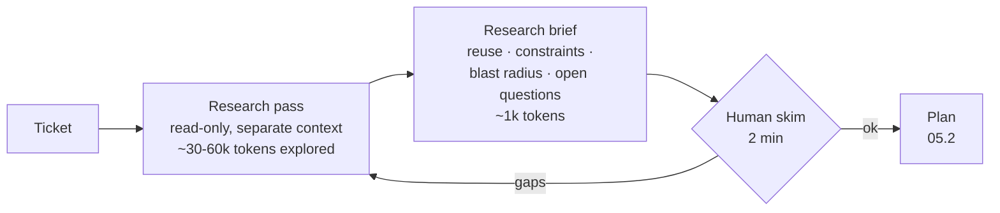

# 05.1 · Research discipline

## Why it matters

Paste the ticket, press Enter, get a pull request. On a greenfield toy project that often works. On a ten-year-old .NET codebase it usually produces something worse than a failure: a change that compiles, passes the tests the agent wrote for it, and is still wrong. It re-implements a rule that already exists with a slightly different meaning. It uses a pattern the team abandoned two years ago. It changes a method without noticing the three callers in another project.

The agent is not careless. It is working from what is in its context, and a pasted ticket gives it three blind spots:

1. **Reuse.** It does not know that `InvoiceService.IsOverdue` exists, so it writes its own "overdue".
2. **Constraints.** It does not know about ADR 0007 or the `U###` undo-script convention unless something loads them.
3. **Blast radius.** It does not know who calls what it changes.

Research is the phase that fills those three gaps *before* any code is written, while being wrong is still cheap. It is also the phase people skip, because paste-and-go *feels* faster. Be careful with that feeling: in a randomized controlled trial with 16 experienced open-source developers working in their own repositories (246 tasks), developers using AI tools took 19% longer, while estimating afterwards that they had been about 20% faster (Becker et al., 2025). That study does not tell you what will happen on your team (Module 13 takes it apart), but it is a good reason to time your tickets instead of trusting your impression. This lesson starts that log.

> [!NOTE]
> Content tags. **Concept** (stable): the three blind spots, the four research outputs, read-only delegated exploration, the research stopping rule. **Implementation** (as of 2026-09): Claude Code's plan mode and built-in Explore sub-agent, and the course's `LoopGate` tool. The phase names research → plan → implement → validate are a common shape (Anthropic's docs call it explore → plan → implement → commit); they are the course's working names, and in Module 14 you will name your own loop from your own evidence.

## How it works

### What research must produce

Research is not "understanding the codebase". It is a short list of answers the plan cannot be written without:

| Output | Question | Typical evidence |
|---|---|---|
| **Reuse** | Which existing code already does part of this ticket? | a symbol and its path |
| **Constraints** | Which architecture decisions and conventions must the change follow? | ADR, convention test, the exemplar class |
| **Blast radius** | What calls, reads or depends on what will change? | search results for callers, schema, config |
| **Open questions** | What does the ticket not say that the code needs? | ticket gaps, conflicting sources |

Each row needs evidence from the [03.3 evidence ladder](../module-03/lesson-03.md): a test beats code, code beats an ADR, and all of them beat a wiki page. A research brief that says "the project uses EF Core" with no path is an opinion.

### Three discovery passes

1. **Ticket nouns → code.** Take every noun and verb in the acceptance criteria ("overdue", "owed", "reminder", "customer") and search the *code* for them — symbols, SQL, tests. Not the docs first: docs are low on the ladder and often stale, as the Contoso `ARCHITECTURE.md` showed in Module 3.
2. **Architecture discovery.** Find the decisions: `docs/adr/`, convention tests, the most recent class of the same kind (the *exemplar*), and the history of the folder you will touch.
3. **Dependency discovery.** For each thing that will change, find what depends on it: callers, constructors used in tests, tables and indexes, configuration.

Research stops when every acceptance criterion maps to at least one row in the brief and every row has evidence, or when a time box runs out (10–15 minutes for a medium ticket). If the time box runs out first, what is left becomes an open question — it does not become a guess.

### Why read-only, and why delegated

Exploration is expensive in context. Reading a dozen files, their tests and a few search results easily costs 30,000–60,000 tokens. In [04.1](../module-04/lesson-01.md) you computed what that does to the usable budget; in [04.3](../module-04/lesson-03.md) you saw what irrelevant and stale material in context does to output quality. If exploration happens in the same session that will write the code, all of it — including the stale `ARCHITECTURE.md` it read on the way — sits in the implementation context.

The fix is structural: explore in a separate context and hand back only a summary. Claude Code's built-in **Explore** sub-agent is read-only (write and edit tools denied) and exists to keep "exploration results out of your main conversation context"; in plan mode the **Plan** sub-agent does the same for planning research. Anthropic's context-engineering guidance describes the same pattern for agents in general: a sub-agent may use tens of thousands of tokens, but returns a condensed summary of often 1,000–2,000 tokens. Cursor's plan mode and Copilot's agent have their own equivalents; the concept is the same.



*Tiny example.* Exploring BILL-150 cost about 38,000 tokens; the brief is about 900. Keeping exploration out of the main session saves roughly 37,000 tokens of implementation context — about $\frac{38{,}000}{900} \approx 42$ times less material for the implementing agent to attend to, and none of it is the stale architecture page.

Read-only matters for a second reason: an agent that is allowed to edit during research starts "fixing" things it finds, and research turns into unreviewed implementation. Agentless (Xia et al., 2024) made the same separation a design principle for automated repair: a localization phase first, then repair, then patch validation — and that simple phased pipeline outperformed more autonomous open-source agents on SWE-bench Lite at the time, at about $0.70 per issue.

## Show me

Ticket [BILL-151](../../labs/module-05/tickets/BILL-151.md) asks for a collections summary: the amount a customer owes and the part that is overdue, where both "mean exactly what they already mean elsewhere in Billing".

**Paste-and-go.** Given only the ticket, an agent produced `Collections/CollectionsSummaryService.cs` (reproduced in `labs/module-05/break/05.1-paste-and-go/`):

```csharp
var unpaid = invoices.Where(i => i.Status != InvoiceStatus.Paid).ToList();
var owed = unpaid.Sum(i => i.Amount);
var overdue = unpaid.Where(i => i.DueUtc < DateTimeOffset.UtcNow).Sum(i => i.Amount);
```

It wrote three tests; they pass. The two existing convention tests pass too, because their regex looks for `DateTime.Now` and `DateTimeOffset.Now`, not `UtcNow`. Nine of nine green.

**Researched.** A read-only pass on the same ticket returned, in part:

| Need in the ticket | Already exists | Evidence |
|---|---|---|
| "owed" | `InvoiceService.OutstandingAsync` — **Issued only** (not Draft, not Void) | `src/Contoso.Billing/Invoices/InvoiceService.cs` |
| "overdue" | `InvoiceService.IsOverdue` — Issued and `DueUtc < IClock.UtcNow` | same file |
| "now" | `IClock.UtcNow` — "All now values come from here so tests can freeze time" | `src/Contoso.Billing/Common/IClock.cs` |

Put the two side by side and the paste-and-go version has three defects that no test caught:

- **Definition drift.** "Not paid" includes `Void` and `Draft`, so a voided invoice is still "owed". Finance and Collections would now see two different totals for the same customer.
- **Clock bypass.** `DateTimeOffset.UtcNow` cannot be frozen in tests, so its tests depend on the real clock.
- **Duplication.** A second definition of "owed" and "overdue" in a new namespace, which the next change will update in one place only.

The researched implementation (`labs/module-05/solution/BILL-151/`) adds one method to `InvoiceService` that reuses the existing filter and `IsOverdue`, and a test with a void and a draft invoice that the paste-and-go version fails.

## Try it

Budget: 90 minutes, in your `ai-layer-lab` repository from Module 3 (Contoso Billing with the grounded `AGENTS.md` from [03.4](../module-03/lesson-04.md)).

1. Copy `labs/module-05/tickets/*.md` into `tickets/` and `labs/module-05/gates/architecture.rules` into `gates/`; commit on `main`. Copy `labs/module-05/tools/LoopGate/` to `tools/LoopGate/` so CI can run it later, and build it once: `dotnet build tools/LoopGate`.
2. Create `NOTES.md` from the [notes log template](../../templates/notes-log.md). Start a timer for every phase from now on.
3. In a fresh session, in plan mode (or with an explicit read-only instruction), run the research pass for BILL-150:

   ```text
   Use a read-only subagent to research tickets/BILL-150.md. Do not edit anything.
   Return a brief in the format of templates/research-brief.md: existing capabilities to reuse
   (symbol + path), architecture facts with evidence (read docs/adr/ and the convention tests),
   callers of anything that will change, and open questions. Search code before docs.
   Keep it under 80 lines.
   ```

4. Save the result as `research/BILL-150.md`. Compare it with `labs/module-05/examples/research-BILL-150.md`. Which rows did your agent miss? Did it read ADR 0007? Did it notice the 2-argument constructor in the existing tests?
5. Repeat for BILL-151. Record research minutes and the approximate tokens explored (the sub-agent's reported token usage is enough).
6. Apply the research brief checklist at the end of the [template](../../templates/research-brief.md). Fix the brief, not the code.

<details>
<summary>Hint: the brief is too long</summary>

A brief that narrates the exploration ("First I looked at…") has the wrong shape. Ask for the four tables only, one row per ticket criterion, and a hard line limit. If a fact needs more than one line, it probably belongs in a pointer (`see ADR 0007`) rather than a summary of the ADR.
</details>

## Break it

> [!CAUTION]
> Do this on a throwaway branch. Never merge a paste-and-go experiment into a shared branch, even if it is green.

On a branch `break/05-1`, give a fresh session only the ticket:

```text
Implement tickets/BILL-151.md. Add tests. Run the tests.
```

(If you want a deterministic run, copy `labs/module-05/break/05.1-paste-and-go/overlay/` over your working copy instead.) Run `dotnet test Contoso.Billing.sln`. Before you look at the diff, predict: which existing method did the agent re-implement, and will any existing test notice?

## Fix it

**Diagnose.**

1. *Symptom:* all tests green, but the diff adds a new class computing "owed" and "overdue".
2. *Compare definitions:* `git grep -n "InvoiceStatus\." -- src/` shows two different filters for "owed" (`== Issued` versus `!= Paid`). `git grep -n "UtcNow" -- src/` shows a clock read outside `IClock`.
3. *Failure class* ([02.5](../module-02/lesson-05.md)): primary cause is **insufficient context** — `InvoiceService` was never in the agent's context — which surfaced as a **planning failure** (duplicate service). It escaped through a **verification failure**: the only tests were written by the same agent from the same misunderstanding, and no gate encoded "now comes from `IClock`" for `UtcNow`.
4. *Phase:* the defect was born in research — the phase that did not happen.

**Modify.**

- Discard the branch. Write `research/BILL-151.md` (Try it, step 5), then implement from it: one method on `InvoiceService` that reuses the existing filter and `IsOverdue`. Reference: `labs/module-05/solution/BILL-151/`.
- Close the escape route with a gate. `gates/architecture.rules` already forbids `DateTimeOffset.UtcNow` outside `Common/IClock.cs`, citing the evidence:

```text
forbid-text | DateTimeOffset.UtcNow | src/**/*.cs | src/Contoso.Billing/Common/IClock.cs | IClock.cs: "now" comes from IClock.UtcNow
```

**Rerun.**

```text
$ dotnet run --project tools/LoopGate -- all --repo . --rules gates/architecture.rules --min-tests 6
PASS arch
  tests: total 9, passed 9, failed 0, skipped 0 (minimum 6)
PASS tests
ALL GATES PASSED
```

Run the same command on the paste-and-go branch and it fails with `CollectionsSummaryService.cs:21 uses DateTimeOffset.UtcNow`. The definition drift has no generic gate; the test with a void and a draft invoice is what catches it — and that test only exists because research surfaced the definition.

## How do I know it works?

- [ ] Your BILL-150 and BILL-151 briefs each have at least one "reuse" row per acceptance criterion, with a symbol and a path, and at least one row citing `docs/adr/0007-dapper-repositories.md`.
- [ ] Each brief fits on one screen (under 80 lines, roughly 1,000 tokens), and the exploration happened in a separate, read-only context.
- [ ] A colleague (or a fresh agent session given only the brief and the ticket) can name which existing methods the change should reuse without opening the code.
- [ ] `LoopGate all` passes on your BILL-151 implementation and fails on the paste-and-go branch.
- [ ] The void/draft test from the reference solution fails against the paste-and-go class and passes against yours.
- [ ] `NOTES.md` has two rows with research minutes recorded from a timer.

## Use / don't use

**Use a research pass** whenever the change touches more than one file, touches data access or schema, uses words the codebase may already define ("overdue", "active", "owed"), or lands in code you have not read in the last month.

**Don't** research a change you can describe as a one-sentence diff. BILL-152 (`<` becomes `<=` in `IsOverdue`, plus one boundary test) needs no brief; Anthropic's own guidance is to skip the plan when you could describe the diff in one sentence. Don't let research become open-ended "investigate the codebase" — unscoped exploration fills context and time.

**Limitations.**

- Research can be confidently wrong. A brief built on a stale document is worse than no brief, because it carries authority into the plan. Evidence rungs are the defense.
- A summary loses detail. The brief should point to files, not replace them; the implementing agent may still need to open the exemplar.
- Research costs tokens and minutes. On small tickets the loop can be slower than paste-and-go; the notes log is how you find your break-even size.
- Code search finds what is in the repository. It does not find the decision someone made in a meeting last week — that is an open question for a person.

## Reflect

1. Which of the three blind spots (reuse, constraints, blast radius) did your first paste-and-go run hit?
2. How long did the research pass take, and how did that compare with the time you would have spent finding the duplicate in review?
3. What is one noun in your own codebase that has two meanings in two places today?

## Sources

- [Claude Code docs — Best practices](https://code.claude.com/docs/en/best-practices) — explore → plan → implement → commit; skip the plan for one-sentence diffs; use sub-agents for investigation to keep the main context clean (as of 2026-09).
- [Claude Code docs — Subagents](https://code.claude.com/docs/en/sub-agents) — built-in Explore and Plan sub-agents are read-only and keep exploration output out of the main context (as of 2026-09).
- [Anthropic Engineering — Effective context engineering for AI agents](https://www.anthropic.com/engineering/effective-context-engineering-for-ai-agents) — sub-agents explore with tens of thousands of tokens and return condensed summaries of often 1,000–2,000 tokens; just-in-time retrieval.
- [Xia et al. (2024) — Agentless](https://arxiv.org/abs/2407.01489) — localization → repair → patch validation; 32.00% on SWE-bench Lite at about $0.70 per issue, ahead of the open-source agents compared at the time.
- [Becker et al. (2025) — METR randomized controlled trial](https://arxiv.org/abs/2507.09089) — 16 experienced developers, 246 tasks; 19% slower with AI tools while believing they were faster.
