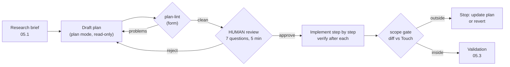

# 05.2 · Plans worth reviewing

## Why it matters

A plan is the cheapest place in the whole loop to be wrong. Rejecting a bad approach in a 50-line plan takes five minutes; rejecting it in a 400-line diff takes forty, plus the implementation time already spent, plus the argument about whether "it works anyway" is good enough.

Most agent plans do not buy you that. They look like this:

```markdown
1. Add a table for reminders with a migration.
2. Add a repository and a service method, following the project's Dapper pattern.
3. Clean up data access in the area as needed so everything is consistent.
4. Add tests and make sure everything passes.
```

Every line is reasonable, and none of it can be reviewed. Which table, with which columns? Which files will change? What does "the area" include? What counts as "passes"? A reviewer can only say "looks fine", which is not a review. Step 3 is worse than vague: it is a licence to change code nobody asked about.

A plan worth reviewing is an artifact with a checkable goal, decisions tied to evidence, explicit boundaries, small verifiable steps and named human checkpoints. It is saved in the repository next to the change, so the reviewer can compare what was planned with what was done.

> [!NOTE]
> Content tags. **Concept** (stable): the seven criteria, boundaries as a contract, checkpoints at decisions, plan-as-artifact. **Implementation** (as of 2026-09): plan mode in Claude Code and Cursor, and the course's `LoopGate plan-lint` / `scope`.

## How it works

### Seven criteria

| # | Criterion | Test a reviewer can apply | Typical failure |
|---|---|---|---|
| 1 | **Goal** | Could I tell from the diff alone whether it was met? | "Implement reminder recording" |
| 2 | **Evidence** | Does each design decision cite a file that supports it? | "follow the project's pattern" with no path |
| 3 | **Reuse** | Does it use what research found, or re-implement it? | a new "overdue" check |
| 4 | **Boundaries** | Can I predict every file in the diff from the plan? | "clean up as needed" |
| 5 | **Steps** | Is each step small, with a `verify:` that can fail? | "add tests and make sure it passes" |
| 6 | **Checkpoints** | Is the riskiest decision in front of a human, with a stop rule? | approval as a formality |
| 7 | **Validation** | Are the final gates runnable commands with expected results? | "run the tests" |

Criteria 2 and 3 come straight from the [05.1 research brief](lesson-01.md): a plan without a brief has nothing to cite.

### Boundaries are a contract

The **Touch** list names every file the change may create or modify. The **Do not touch** list names the areas that look related but are owned elsewhere: `Legacy/` (BILL-97), merged migrations, the convention tests, project files (no new packages). Together they make the diff *predictable* — and a predictable diff is one a script can check. `LoopGate scope` lists the changed files (against a git ref, or against a pristine copy of the repository) and fails on any file that is outside Touch or inside Do not touch. It does not judge the code; it only answers "did the change stay where the plan said it would?"

When the agent legitimately needs a file that is not on the list, the order is: stop, update the plan, get it re-approved, then edit. Plan drift that happens silently is how "while I was here" changes reach production.

### Checkpoints go at decisions, not keystrokes

Anthropic's agent guidance describes agents that "pause for human feedback at checkpoints or when encountering blockers", with stopping conditions to keep control. In a coding loop that means three things:

- **HUMAN: approve the plan** — naming the risky decision (a new table, an assumption about "7 days", a new dependency). Reviewers approve decisions, not prose.
- **HUMAN: review the diff against Boundaries** before merge, with the scope gate's output in hand.
- **STOP rule** — "if the same step fails twice, stop and report". It turns an agent that would loop into one that asks. It also prepares the reset decision in [05.3](lesson-03.md).

### Plan as an artifact



Claude Code's plan mode keeps the agent read-only while it researches and drafts, and `Ctrl+G` opens the plan in your editor before anything is executed. Cursor's Plan Mode researches, asks clarifying questions and produces an editable plan saved to a file. Any other agent can do the same with an instruction: "write the plan to `plans/BILL-150.md`, do not edit code". Anthropic's guidance on specs lists what makes them useful: they name the files and interfaces involved, state what is out of scope, and end with a verification step. Commit the plan in the same pull request as the code.

### Is the review worth five minutes?

*Intuition.* A plan review costs a little every time and saves a lot occasionally.

*Equation.* If a fraction $q$ of plans have a wrong approach, and catching one at plan time saves $S$ minutes of implementation and diff review, the expected saving per plan is $q \cdot S$, against a review cost $r$. Review pays when $q \cdot S > r$.

*Tiny example.* Say 1 plan in 5 is wrong ($q = 0.2$), a wrong implementation plus its review costs $S = 60$ minutes, and a plan review costs $r = 5$ minutes: $0.2 \times 60 = 12 > 5$. Even at $q = 0.1$ it breaks even (6 versus 5).

*Interpretation.* Your own $q$ is unknown until you log it; the failure-diagnosis log in [05.4](lesson-04.md) is where it comes from. On one-sentence diffs, $S$ is tiny and the review does not pay — skip the plan.

## Show me

The reviewed plan for BILL-150 (`labs/module-05/examples/plan-BILL-150.md`), in part:

```markdown
## Approach

- New `IInvoiceReminderRepository` + `InvoiceReminderRepository` with Dapper, `Func<IDbConnection>`, `CancellationToken`. (ev: `docs/adr/0007-dapper-repositories.md`)
- Reminder repository is an optional third constructor argument so the 3 existing tests compile unchanged. (ev: `tests/Contoso.Billing.Tests/InvoiceServiceTests.cs`)
- Assumption A1: exactly 7 days since the last reminder is allowed (`now - last < 7 days` refuses). (ev: `tickets/BILL-150.md`)

### Do not touch

- `src/Contoso.Billing/Legacy/**` (BILL-97 owns it)
- `db/migrations/V00[1-4]*` and `db/migrations/U00[1-4]*` (merged migrations are immutable)
- `*.csproj` (no new packages)

## Steps

1. Write `InvoiceReminderTests.cs` with the 4 cases from the ticket; they fail to compile. verify: `dotnet build` fails only on the missing members.
2. Add the interface and `RecordReminderAsync`. verify: the 4 new tests pass; the 6 old tests still pass.

## Checkpoints

- HUMAN: approve this plan, especially Assumption A1 and the new table, before step 1.
- STOP rule: if the same step fails twice, stop and report instead of trying a third fix.
```

Every decision has a reason a reviewer can check in seconds. The ambiguity in the ticket ("within 7 days" — is day 7 in or out?) is surfaced as assumption A1 rather than silently decided in code.

Lint and scope, on the reference implementation:

```text
$ dotnet run --project tools/LoopGate -- plan-lint plans/BILL-150.md --repo .
PASS plan-lint
$ dotnet run --project tools/LoopGate -- scope plans/BILL-150.md --repo . --git main
  scope: 6 changed file(s): db/migrations/U005__invoice_reminder.sql, db/migrations/V005__invoice_reminder.sql, src/Contoso.Billing/Invoices/IInvoiceReminderRepository.cs, src/Contoso.Billing/Invoices/InvoiceReminderRepository.cs, src/Contoso.Billing/Invoices/InvoiceService.cs, tests/Contoso.Billing.Tests/InvoiceReminderTests.cs
PASS scope
```

The four-line plan from *Why it matters* fails `plan-lint` with 14 problems, starting with `missing section 'Evidence'` and ending with `Validation names no runnable command`.

## Try it

Budget: 75 minutes, in `ai-layer-lab`, on branch `feature/BILL-150`, with `research/BILL-150.md` from [05.1](lesson-01.md).

1. Fresh session, plan mode. Prompt: *"Read research/BILL-150.md and tickets/BILL-150.md. Write a plan to plans/BILL-150.md using templates/implementation-plan.md. Every Approach bullet needs `(ev: path)`. Do not edit code."* (Copy the [plan template](../../templates/implementation-plan.md) into `templates/` first.)
2. Lint: `dotnet run --project tools/LoopGate -- plan-lint plans/BILL-150.md --repo .` Fix the plan until it passes.
3. Review it yourself with the seven questions, with a timer. Write your decision and the time in the plan header. Change at least one thing (most first drafts are missing a Do not touch entry or a verify clause that can actually fail).
4. Implement step by step. After each step, run its verify clause and paste the result into the session before continuing.
5. Scope: `dotnet run --project tools/LoopGate -- scope plans/BILL-150.md --repo . --git main`.
6. Log plan minutes, review minutes and the number of plan edits in `NOTES.md`.

<details>
<summary>Hint: plan-lint passes but the plan is still bad</summary>

The lint checks form: sections exist, cited files exist, every step has a verify clause. It cannot tell whether the cited file supports the decision. Read each `(ev: …)` and ask "does this file say that?" Lesson 05.4 has a plan that passes the lint and is wrong.
</details>

## Break it

> [!CAUTION]
> Branch only. The break changes a finance report; never let an experiment like this near a shared branch.

On a branch `break/05-2`, give a fresh session the unbounded plan `labs/module-05/break/05.2-no-boundaries/plan-BILL-150.md` and say *"Implement this plan."* (Deterministic version: apply `labs/module-05/solution/BILL-150/` and then `labs/module-05/break/05.2-no-boundaries/overlay/` to your working copy.)

Run `dotnet test`. Predict before you look: which file outside the reminder feature did the agent change, and does any test notice?

## Fix it

**Diagnose.**

1. *Symptom:* tests green (10 of 10), `LoopGate arch` green — `MonthlyRevenueReport` no longer calls `SqlHelper`, which the architecture rules like. But the diff has seven files, not six.
2. *Scope check* with the reviewed plan's boundaries:

   ```text
   $ dotnet run --project tools/LoopGate -- scope plans/BILL-150.md --repo . --git main
     FAIL [scope] src/Contoso.Billing/Legacy/MonthlyRevenueReport.cs changed, but the plan says do not touch `src/Contoso.Billing/Legacy/**`
   ```

3. *Why it matters even though it is "better" code:* the revenue report is Finance's number, BILL-97 owns its migration, it has no tests, and nobody reviewed a change to it. The rewrite also swaps `YEAR()/MONTH()` for a half-open UTC range: probably equivalent for this data, but "probably" is not a review.
4. *Failure class* ([02.5](../module-02/lesson-05.md)): **planning failure** — step 3 of the plan authorized it ("clean up data access in the area as needed"). The agent did what the plan allowed. It escaped because no gate compared the diff with the intended scope.

**Modify.** Revert the out-of-scope file (`git checkout main -- src/Contoso.Billing/Legacy/`), replace the plan with one that has Touch, Do not touch and Out of scope sections (the reference plan), lint it, and add the scope check to the validation command. If migrating the report is worth doing, it becomes a comment on BILL-97, not part of BILL-150.

**Rerun.** `plan-lint` passes, `scope` reports six changed files and passes, tests are 10 of 10.

## How do I know it works?

- [ ] `LoopGate plan-lint` reports `PASS` on `plans/BILL-150.md`.
- [ ] The plan names at least one assumption the ticket left open, and the HUMAN checkpoint names it.
- [ ] Your review with the seven questions took 10 minutes or less, and you changed at least one thing.
- [ ] `LoopGate scope` passes; every file in the final diff was predictable from the Touch list.
- [ ] The plan is committed in the same PR as the code, and the PR description links it.
- [ ] On the break branch, `scope` fails on `Legacy/MonthlyRevenueReport.cs` and names the Do not touch rule.

## Use / don't use

**Use a written plan** for multi-file changes, anything touching schema, data access, security or money, and code you do not know well. Anthropic's guidance puts it the same way: planning is most useful when you are uncertain about the approach, the change modifies multiple files, or you are unfamiliar with the code.

**Don't** plan a one-sentence diff (BILL-152). Don't plan a spike whose purpose is to learn what the problem is — build the throwaway prototype, then research and plan the real change. Don't write a plan nobody will read; an unreviewed plan is only documentation of what went wrong.

**Limitations.**

- `plan-lint` checks form, not truth. A plan can cite an existing file that does not support its decision and still pass. That is what the human checkpoint is for.
- Boundaries can be too tight. Needing an extra file is normal; the fix is to update the plan first, not to disable the check.
- Plans age. A plan written before step 1 may be wrong by step 4; the stop rule and re-approval handle that, at the cost of interruptions.
- Approval can become a rubber stamp. A three-minute approval of a plan with a new dependency is a signal, and 05.4 shows what it costs.

## Reflect

1. Which of the seven criteria did your agent's first draft fail most clearly?
2. Where in your own team does "while I was here" change get merged without anyone deciding it should?
3. What is the riskiest kind of decision in your codebase that should always sit at a HUMAN checkpoint?

## Sources

- [Claude Code docs — Best practices](https://code.claude.com/docs/en/best-practices) — plan mode separates exploration from execution; `Ctrl+G` to edit the plan; useful specs name files and interfaces, state what is out of scope and end with verification; skip planning for small, clear changes (as of 2026-09).
- [Cursor docs — Plan Mode](https://cursor.com/docs/agent/planning) — researches the codebase, asks clarifying questions, produces an editable plan saved to a file (as of 2026-09).
- [Anthropic Engineering — Building Effective AI Agents](https://www.anthropic.com/engineering/building-effective-agents) — programmatic gates on intermediate steps; agents "pause for human feedback at checkpoints"; stopping conditions to maintain control.
