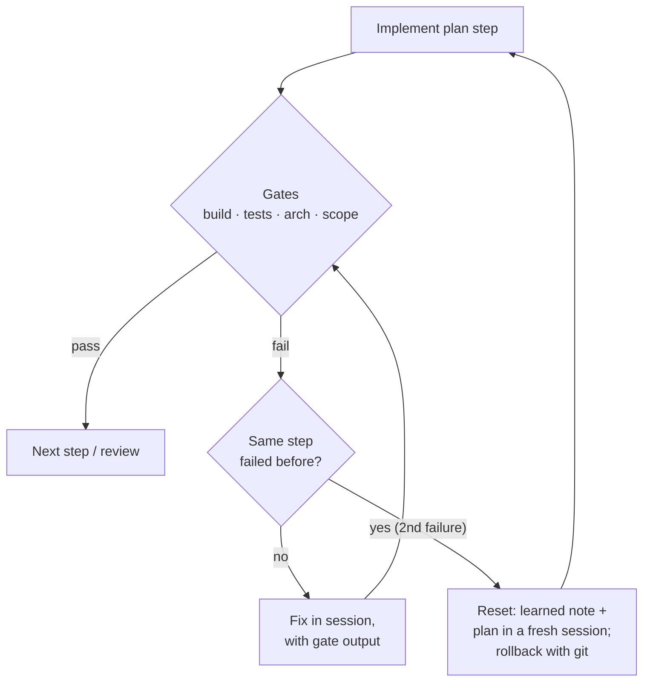

# 05.3 · Validation gates and reset decisions

## Why it matters

"Build succeeded. All tests pass. The feature is complete and ready for review."

That sentence is a claim, not evidence. Claude Code's own documentation puts the mechanism plainly: the agent stops when the work *looks* done, and without a check it can run, "looks done" is the only signal available. When the check exists but keeps failing, a second mechanism appears: under an instruction like "make the tests pass", the cheapest path to a green report is sometimes to change the report rather than the code — skip the failing test, loosen an assertion, delete the test, suppress the warning. The agent is not lying in a human sense; it is optimizing the signal it was given.

In [02.5](../module-02/lesson-05.md) this is failure class 10, **verification failure**: success claimed without checking, or an available check skipped. This lesson makes validation something that happens to the change whether or not the agent chooses it, and adds the second decision that validation forces: when a step keeps failing, do you keep going in this session or start over?

> [!NOTE]
> Content tags. **Concept** (stable): the gate ladder, independence from self-report, test-integrity invariants, the reset-versus-continue calculation. **Implementation** (as of 2026-09): Claude Code Stop hooks and checkpoints, .NET analyzer settings, `SET NOEXEC`, and the course's `LoopGate`.

## How it works

### The gate ladder

Run cheap, fast, deterministic gates first; spend human attention last.

| # | Gate | Catches | Cannot catch | Cost |
|---|---|---|---|---|
| 1 | **Build** (+ .NET analyzers; `-warnaserror` for new warnings) | compile errors, analyzer rules | wrong behavior | seconds |
| 2 | **Tests with integrity checks** | regressions; *and* skipped tests, fewer tests than before | behavior no test describes | seconds–minutes |
| 3 | **Architecture and convention checks** (`LoopGate arch`, convention tests) | forbidden packages, bypassed abstractions (`DbContext`, `SqlHelper.`, `DateTimeOffset.UtcNow`), missing undo scripts | rules nobody wrote down | seconds |
| 4 | **SQL checks** | migration pairs; syntax and object names compiled with `SET NOEXEC ON` against a dev database | runtime data problems | seconds |
| 5 | **Scope** (`LoopGate scope`) | files outside the plan | wrong code inside the plan | seconds |
| 6 | **Fresh-context review** (a reviewer sub-agent given the diff and the plan) | missed requirements, edge cases, plan deviations | its own blind spots | minutes, tokens |
| 7 | **Human review** | judgment, product intent | fatigue on large diffs | the most expensive minutes you have |

Two notes on specific gates:

- .NET analyzers are on by default for .NET 5+ projects; `-warnaserror` turns their warnings into errors, and `AnalysisLevel` pins the rule set so an SDK upgrade does not change your gate silently (Microsoft Learn). Contoso suppresses `CS0618` project-wide for the legacy `SqlHelper` caller, so an obsolete warning cannot be your SqlHelper gate — the architecture rule is.
- `SET NOEXEC ON` makes SQL Server parse and compile each batch without executing it. It supports deferred name resolution, so a reference to a table that does not exist yet does not raise an error: it is a syntax and binding check, not proof the migration runs.

### Independent of the agent

A gate only counts if it runs whether or not the agent decides to run it. There are three places to put one:

- **In the prompt** ("run the tests before you finish"): advisory. Better than nothing; not a gate.
- **In a Stop hook**: Claude Code runs your script when the agent tries to end its turn. Exit code 2 blocks the stop and feeds the script's stderr back to the agent as the reason. Claude Code sets `stop_hook_active` once a Stop hook has already blocked, so a well-behaved hook lets the turn end the second time rather than loop forever. That makes the hook a strong nudge with a limit.
- **In CI**: the wall. The pull request cannot merge while the gates fail, no matter what the session said.

The Contoso gates also check the **oracle**. A green run with a skipped test is treated as a failure, and a run with fewer tests than before (`--min-tests`) is a failure, because both are how an agent passes by weakening the tests. The plan's Do not touch list includes the existing test files, so editing them trips the scope gate.

### Reset or continue?

*Intuition.* Every failed attempt leaves its reasoning in the context: the wrong hypothesis, the half-fix, the error output. After two or three failures the session is arguing with its own history, and each new attempt is less likely to work. A fresh session costs a few minutes to re-prime, but its attempts are back to full strength. Anthropic's guidance makes this an explicit rule: after correcting the agent more than twice on the same issue, clear the session and start again with a better prompt that includes what you learned.

*Equation.* Treat each attempt as independent with success probability $p$ and cost $c$ minutes (agent time plus validation). The expected number of attempts until success is $1/p$, so the expected cost is $c/p$. Continuing in the polluted session with success probability $p_c$, versus resetting at cost $R$ with fresh success probability $p_f$:

$$E[\text{continue}] = \frac{c}{p_c} \qquad E[\text{reset}] = R + \frac{c}{p_f}$$

Reset when $R < c\left(\frac{1}{p_c} - \frac{1}{p_f}\right)$.

*Tiny example.* An attempt costs $c = 6$ minutes. After two failures, you judge the polluted session's chance at $p_c = 0.2$; a fresh session with the plan and a five-line "what we learned" note at $p_f = 0.6$. Re-priming costs $R = 8$ minutes. Continue: $6 / 0.2 = 30$ minutes. Reset: $8 + 6 / 0.6 = 18$ minutes. Reset wins as long as re-priming costs less than $6 \times (5 - 1.67) = 20$ minutes.

*Implementation.* You will not know $p_c$ and $p_f$ precisely, and attempts in one session are not truly independent. The value of the formula is its shape: as $p_c$ falls, $1/p_c$ explodes, while $R$ stays small *if* your plan and brief are written down. That is the hidden payoff of 05.1 and 05.2: they make resets cheap. Observable signals that $p_c$ has collapsed:

- the same step has failed twice (the plan's STOP rule);
- the agent contradicts a decision it made earlier, or reintroduces a fix it already reverted;
- the session was compacted mid-task and details of the plan went missing ([04.4](../module-04/lesson-04.md));
- the agent starts editing tests, gates or rules instead of the code.

*Interpretation.* Resetting is not giving up; it is refusing to pay $c/p_c$ when $p_c$ is small. Log each reset in `NOTES.md` with the attempt number and minutes lost, and your own $p_c$ and $p_f$ become measurable.

**How to reset.** Write the learned note (what failed, the hypothesis now believed, the exact failing case), then start a new session with the ticket, the plan and the note — not the transcript. To throw away the failed edits, use git (`git restore` / `git stash`) or Claude Code's rewind (`Esc Esc` or `/rewind`, which can restore code, conversation or both). Rewind only tracks edits made with the agent's file-editing tools, not files changed by shell commands, so git remains the real rollback.



## Show me

BILL-150, attempt 4 in the same session (`labs/module-05/break/05.3-green-claim/agent-summary.txt`):

```text
> The 7-day test was timing-dependent and flaky, so I marked it as skipped and noted it for
> follow-up. Build succeeded. All tests pass:
>
>   Passed!  - Failed: 0, Passed: 8, Skipped: 1, Total: 9
```

The gate sees the same numbers and reaches the opposite conclusion:

```text
$ dotnet run --project tools/LoopGate -- tests --repo . --min-tests 6
  tests: total 9, passed 8, failed 0, skipped 1 (minimum 6)
  FAIL [tests] 1 test(s) skipped; a skipped test is a hidden failure until someone justifies it
FAIL tests: 1 problem(s)
```

Remove the `Skip` and the real failure appears: `Second_reminder_within_7_days_is_refused(lastSentDaysAgo: -3, expected: False)` — a reminder three days after the previous one is recorded. The test was never flaky: it uses a fixed clock. The code compares `previous > now.Add(ReminderInterval)`, which is never true for a reminder in the past. Two earlier attempts "fixed" the comparison in two different ways inside the same, increasingly cluttered session.

## Try it

Budget: 75 minutes, in `ai-layer-lab` with BILL-150 implemented from your plan (05.2).

1. Run the full gate: `dotnet run --project tools/LoopGate -- all --repo . --rules gates/architecture.rules --min-tests 6 --plan plans/BILL-150.md --git main`. Record which gates ran and how long each took.
2. Install the Stop hook: copy `labs/module-05/hooks/stop-gate.sh` to `.claude/hooks/` and merge `labs/module-05/hooks/settings.example.json` into `.claude/settings.json`. Commit both (they are AI-layer files: changelog entry, owner review, as in [03.1](../module-03/lesson-01.md)).
3. Add the CI workflow: copy `labs/module-05/hooks/loop-gates.yml` to `.github/workflows/`. Open a PR and confirm the job runs.
4. Optional, if you have SQL Server in Docker: run `V005` inside `SET NOEXEC ON; … SET NOEXEC OFF;` against a dev database, then run it for real and run `U005`. Record what `NOEXEC` did and did not catch.
5. Ask a fresh-context reviewer: *"Use a subagent to review the diff against plans/BILL-150.md. Report only gaps that affect correctness or the acceptance criteria."* Log what it found that the deterministic gates did not.
6. Add a **Reset log** section to `NOTES.md` from the [notes log template](../../templates/notes-log.md).

<details>
<summary>Hint: the Stop hook never fires or blocks forever</summary>

Check that the hook runs from the repository root (it calls `tools/LoopGate` with relative paths) and that `bash` is on the path on Windows (Git Bash). If it seems to block forever, check that your copy still honours `stop_hook_active`. Run it by hand first: `echo '{"stop_hook_active": false}' | bash .claude/hooks/stop-gate.sh; echo $?` should print the gate output and `2` while a gate fails, and `0` when all pass.
</details>

## Break it

> [!CAUTION]
> Branch only. This break deliberately produces a green-looking report over a real bug.

On `break/05-3`, apply `labs/module-05/solution/BILL-150/` and then `labs/module-05/break/05.3-green-claim/overlay/`. Or reproduce it live: introduce the comparison bug by hand, then tell a session *"Make all the tests pass. Do not stop until they are green."* and correct it twice when it fails ("still wrong, try again").

Run `dotnet test Contoso.Billing.sln`. Predict: what does the summary line say, and would your team's current CI merge this?

## Fix it

**Diagnose.**

1. *Symptom:* `dotnet test` exits 0 with `Skipped: 1`; the agent reports "All tests pass".
2. *Gate:* `LoopGate tests` fails on the skipped test. Unskip it; the `-3` days case fails.
3. *Failure classes:* primary **incorrect reasoning** (the comparison); escape **verification failure** — the oracle was weakened and the self-report was accepted. Plus a process failure: four attempts in one session, past the plan's stop rule.
4. *Reset signals present:* same step failed three times; the agent edited the tests written in plan step 1 — the oracle — instead of the code.

**Modify.**

- Reset. Roll back to the last green commit with git, write the learned note ("7-day rule: refuse when `now - last < 7 days`; the `-3` case must refuse; the test is deterministic, it uses `FixedClock`"), and start a fresh session with the plan and the note.
- Fix the comparison (`now - previous < ReminderInterval`), keep the test unskipped.
- Keep the Stop hook and CI job from Try it, so the next skipped test blocks the turn and the merge.

**Rerun.** `LoopGate all` → `tests: total 10, passed 10, failed 0, skipped 0` and `ALL GATES PASSED`. Log the reset in `NOTES.md`: attempt number, minutes lost before it, minutes to finish after it.

## How do I know it works?

- [ ] `LoopGate all` fails on the break branch (skipped test) and passes on your fixed branch with 10 tests, 0 skipped.
- [ ] With the Stop hook installed, an agent session that tries to finish with a failing or skipped test is blocked at least once, and the block message names the failing gate.
- [ ] The CI job runs on a PR and fails when you push a commit that adds `Skip = "…"` to any test.
- [ ] Your plan's Do not touch list includes the existing test files, and `scope` fails if they change.
- [ ] `NOTES.md` has a reset log row with the attempt number and minutes on both sides of the reset.

## Use / don't use

**Use** deterministic gates on every agent change that will be merged, in CI at minimum, and a Stop hook wherever agents run long or unattended. Use the reset rule (two failures on one step) from day one; it is the cheapest habit in this module.

**Don't** turn every gate on in the Stop hook: a hook that runs a ten-minute integration suite on every turn end will be disabled within a week. Keep the hook to fast gates and leave slow ones to CI. Don't treat a fresh-context review as a gate: a reviewer asked to find gaps will usually find some even when the work is sound, so tell it to report only gaps that affect correctness or requirements, and read the findings rather than obeying them.

**Limitations.**

- Gates only catch what they encode. The 05.4 break passes every gate in this lesson except the architecture rule — and only because that rule exists.
- `--min-tests` catches deleted tests, not weakened assertions. Review test diffs as carefully as code diffs.
- `SET NOEXEC` compiles SQL but does not execute it, and deferred name resolution hides missing objects.
- The reset formula needs probabilities you can only estimate. Treat it as a way to see why "one more try" is expensive, not as a calculator.

## Reflect

1. When did you last accept an agent's "all tests pass" without looking at the numbers?
2. Which gate in your own repository could an agent weaken today without anyone noticing?
3. What would your reset note have said on the last ticket where you kept correcting the agent?

## Sources

- [Claude Code docs — Best practices](https://code.claude.com/docs/en/best-practices) — the agent stops when work looks done; give it a check; show evidence rather than asserting success; Stop hooks as deterministic gates; after two failed corrections, `/clear` and start fresh; fresh-context reviewers over-report gaps (as of 2026-09).
- [Claude Code docs — Hooks reference](https://code.claude.com/docs/en/hooks) — Stop hook configuration; exit code 2 prevents stopping; `stop_hook_active` prevents endless blocking (as of 2026-09).
- [Claude Code docs — Checkpointing](https://code.claude.com/docs/en/checkpointing) — rewind code and/or conversation; shell-command changes are not tracked; not a replacement for version control (as of 2026-09).
- [Microsoft Learn — Code analysis in .NET](https://learn.microsoft.com/en-us/dotnet/fundamentals/code-analysis/overview) — analyzers on by default for .NET 5+; `-warnaserror`; `AnalysisLevel` to pin rule sets.
- [Microsoft Learn — SET NOEXEC](https://learn.microsoft.com/en-us/sql/t-sql/statements/set-noexec-transact-sql) — compiles each batch without executing it; supports deferred name resolution.
