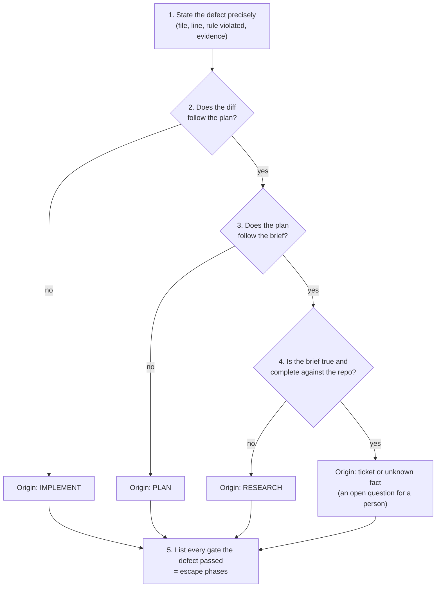

# 05.4 · Failure diagnosis across the loop

## Why it matters

The pull request compiles. All ten tests pass. The convention tests pass. The reviewer rejects it anyway: the change introduces EF Core and a `DbContext` into a codebase whose ADR says new data access is Dapper in a repository behind an interface.

What went wrong? The usual answers are "the AI did something weird" or "the implementation was bad". Both point at the last phase, because that is where the defect became visible. But the implementing agent did exactly what the approved plan said. The plan followed the research brief. The research brief was wrong. And three checkpoints let it through.

A defect in a phased loop has two kinds of location:

- **Origin phase** — where the wrong belief first entered an artifact.
- **Escape phases** — every later checkpoint or gate that could have caught it and did not.

Fix only the code and the next ticket repeats the defect, because the origin (how research is done) and the escapes (what the checkpoints check) are unchanged. This is the loop-level version of the primary-cause / escape-cause split from [02.5](../module-02/lesson-05.md), and it is the skill that turns a pile of agent incidents into a method.

> [!NOTE]
> Content tags. **Concept** (stable): origin vs escape phases, walking back the artifacts, escape probability across gates, fixing at the origin. **Implementation** (as of 2026-09): Claude Code sub-agent loading behavior and the course's `LoopGate`.

## How it works

### What each phase can get wrong

| Phase | Defects born here | Artifact to inspect | Gate that should catch it |
|---|---|---|---|
| **Research** | missed reuse, missed constraint, stale source believed, gap filled with a default | research brief | brief checklist, human skim |
| **Plan** | wrong approach, unbounded scope, assumption not surfaced, evidence that does not support the decision | plan | plan-lint, HUMAN checkpoint |
| **Implement** | incorrect or incomplete reasoning, deviation from the plan, edits outside scope | diff | tests, architecture rules, scope |
| **Validate** | missing gate, weakened oracle, self-report accepted | gate logs, CI | Stop hook, CI, test-integrity checks |

### Walk back the artifacts

The loop leaves an artifact at every phase boundary, so diagnosis is a sequence of comparisons, not an argument:



Two rules keep this honest. First, "follows" means *could a reviewer have predicted this from the previous artifact?* — not "is it vaguely consistent". Second, if an artifact does not exist (no brief, no plan), the phase that should have produced it is the origin by default: that is the paste-and-go case from [05.1](lesson-01.md).

### How defects escape a series of gates

*Intuition.* Each gate catches some share of defects of a given kind. A defect reaches production only if it slips through every one of them.

*Equation.* If gate $i$ catches this kind of defect with probability $c_i$, and the gates act independently, the escape probability is

$$P(\text{escape}) = \prod_{i} (1 - c_i)$$

*Tiny example.* For "wrong data-access pattern" in Contoso: plan review catches it half the time ($c = 0.5$), tests almost never ($c = 0.1$ — an EF implementation is still correct behavior), code review often ($c = 0.6$). Escape: $0.5 \times 0.9 \times 0.4 = 0.18$, nearly one in five. Add an architecture rule that fails on EF packages and `DbContext` ($c = 0.95$): $0.18 \times 0.05 = 0.009$, under one in a hundred.

*Implementation.* The $c_i$ values come from your failure-diagnosis log: for each defect class, which gates saw it and which caught it. `LoopGate arch` is the targeted gate in this example.

*Interpretation.* Three lessons fall out. A cheap deterministic gate aimed at one defect class beats another round of general review. Tests are a weak gate for architecture defects, because the wrong architecture usually *works*. And the independence assumption flatters you: the same tech lead who approved the plan in three minutes also reviews the diff, so their misses are correlated, and the real escape rate is higher than the product suggests. Anthropic's agent guidance warns about the same thing from the agent side — errors compound across steps, which is why agents need ground truth from the environment at each step, not only at the end.

### Fix at the origin, gate the escape

Every diagnosis ends with two changes, and both go into the AI layer's changelog ([03.1](../module-03/lesson-01.md)):

1. **At the origin:** change how that phase is done so the defect is not produced — a research prompt that names the ADR folder, a template field, a rules line.
2. **At the biggest escape:** add or tighten the gate so that if the origin fails again, the defect is caught early and cheaply.

## Show me

The seeded case in `labs/module-05/break/05.4-wrong-architecture/`: research brief, approved plan, and the implementation an agent produced from them. The gates on that implementation:

```text
$ dotnet run --project tools/LoopGate -- all --repo . --rules gates/architecture.rules --min-tests 6 --plan plans/BILL-150.md --git main
PASS plan-lint
  scope: 8 changed file(s): ... src/Contoso.Billing/Data/BillingDbContext.cs, ...
PASS scope
  FAIL [arch] src/Contoso.Billing/Contoso.Billing.csproj references package Microsoft.EntityFrameworkCore.SqlServer (ADR 0007: data access is Dapper repositories, not EF Core)
  FAIL [arch] src/Contoso.Billing/Data/BillingDbContext.cs:7 uses `DbContext` (ADR 0007: data access is Dapper repositories, not EF Core)
  ...
FAIL arch: 7 problem(s)
  tests: total 10, passed 10, failed 0, skipped 0 (minimum 6)
PASS tests
1 GATE(S) FAILED
```

The plan passes its lint and the diff stays inside the plan's boundaries (the plan *listed* the `.csproj` and a `Data/` folder in Touch). Only the architecture rule fails. Now walk back:

1. **Defect:** `BillingDbContext` and two EF Core packages; ADR 0007 says new data access is Dapper in a repository.
2. **Diff vs plan:** the plan's Approach says "Introduce EF Core (`BillingDbContext`) for writes". The implementation followed the plan.
3. **Plan vs brief:** the brief says "there is no write pattern… the modern .NET default is a reasonable choice: EF Core". The plan followed the brief.
4. **Brief vs repository:** the brief never cites `docs/adr/0007-dapper-repositories.md`. It correctly dismissed the stale `ARCHITECTURE.md` and then filled the gap with a general default. The ADR is explicit: *new* data access uses Dapper, whether it reads or writes. **Origin: research.**
5. **Why research missed it:** the brief was produced by the built-in Explore sub-agent with the prompt "find how to persist reminders". Claude Code's Explore and Plan sub-agents skip `CLAUDE.md` files to keep research cheap (as of 2026-09), so the grounded data-access line in `AGENTS.md` from [03.4](../module-03/lesson-04.md) never reached the researcher, and the prompt did not name the ADR folder. Failure class: **insufficient context**, surfacing as a confident default — close to a hallucinated convention.
6. **Escapes:** (a) the HUMAN plan checkpoint approved in 3 minutes — the plan's evidence for the EF decision was `InvoiceRepository.cs`, a file that shows the Dapper pattern and supports nothing about EF; (b) `plan-lint` checks that the file exists, not that it supports the claim; (c) tests and convention tests, which cannot see architecture; (d) no architecture gate in CI before this incident.

The failure-diagnosis log entry:

| Defect | Origin | Escapes and missing gate | Class (primary / escape) | Fix at origin | Gate added |
|---|---|---|---|---|---|
| EF Core `DbContext` for BILL-150 writes, against ADR 0007 | Research: ADRs not read; Explore sub-agent has no rules file | Plan checkpoint (evidence not checked), plan-lint (form only), tests | Insufficient context / verification | Research prompt and template require `docs/adr/` and convention tests; brief checklist item | `forbid-package` + `forbid-text DbContext` rules in `LoopGate arch`, in CI |

## Try it

Budget: 135 minutes for part A and the setup of part B; part B then runs over one to two weeks of normal work.

**Part A — diagnose (45 min).** On `break/05-4`, copy `labs/module-05/break/05.4-wrong-architecture/research-BILL-150.md` and `plan-BILL-150.md` into `research/` and `plans/`, then either have a fresh session *"Implement plans/BILL-150.md"* or apply the `overlay/` folder. Run `dotnet test` (green), then walk back the artifacts yourself and fill a failure-diagnosis row in `NOTES.md` before reading the Fix it section.

**Part B — the field comparison (90 min setup, then 1–2 weeks).**

1. Pick 6 real tickets from your own repository (or 4 Contoso tickets — BILL-142, 150, 151, 152 — plus 2 of your own), of mixed size.
2. Run each ticket twice in separate git worktrees: once paste-and-go (ticket text only), once through the full loop (brief → plan → gates). Alternate which arm goes first (odd tickets paste-and-go first, even tickets loop first): whichever runs second benefits from what you learned in the first.
3. Time every phase with a timer. Count defects found by gates, by your review and later (keep the rows open for two weeks). Count rework commits and resets.
4. For every defect in either arm, fill a failure-diagnosis row: origin, escapes, fix at origin, gate added.
5. Write the weekly summary from the [notes log template](../../templates/notes-log.md), including its last line: what this sample cannot show.

<details>
<summary>Hint: every defect looks like an implementation defect</summary>

That usually means step 2 of the walk-back was answered too generously. Put the plan next to the diff and ask for each changed file: "could I have predicted this line from the plan?" If the plan says "add a repository method" and the method uses `DateTimeOffset.UtcNow`, the plan was silent on time — check whether the brief mentioned `IClock`. Silence in an earlier artifact moves the origin earlier.
</details>

## Break it

> [!CAUTION]
> Branch only. The seeded implementation adds packages to the project; do not restore it into a shared branch or package cache you care about.

This is the module's headline failure. Give a fresh session the seeded brief and plan from `labs/module-05/break/05.4-wrong-architecture/` and let it implement the plan (or apply `overlay/`). Validate it **with the gates your team had before this module** only: `dotnet test Contoso.Billing.sln`, which includes the Module 3 convention tests.

Before you run it, predict: will any of those gates fail? Then open the diff and decide what the reviewer will say.

## Fix it

**Diagnose.** Walk back as in *Show me*: the defect is a `DbContext`; the diff follows the plan; the plan follows the brief; the brief contradicts ADR 0007, which it never read. Origin: research. Escapes: plan checkpoint, plan-lint, tests. Root mechanism: a research sub-agent that does not load the rules file, given a prompt that does not name where decisions live.

**Modify — at the origin.**

- Research prompt (and the [research brief template](../../templates/research-brief.md)): *"Read `docs/adr/` and the convention tests before proposing any pattern; cite the ADR for every architecture fact."* The template's checklist already has "ADRs in `docs/adr/` were read" — make it a required row.
- If your team uses a custom research sub-agent (Module 6), put the pointer to `docs/adr/` in its own definition, since it will not see `AGENTS.md` through the built-in Explore agent.

**Modify — at the biggest escape.**

- Keep the architecture rules in CI (`labs/module-05/gates/architecture.rules` already has the EF rules; in your own repository, this is the moment you would add them, with the ADR as the reason).
- Add one question to your plan review: *"For each `(ev: …)`, does the file say this?"* For the EF decision, `InvoiceRepository.cs` says the opposite.

**Rerun.** Delete the branch. Research again with the fixed prompt (the brief should now cite ADR 0007 and propose a Dapper repository), plan from the new brief, implement, and run:

```text
$ dotnet run --project tools/LoopGate -- all --repo . --rules gates/architecture.rules --min-tests 6 --plan plans/BILL-150.md --git main
PASS plan-lint
PASS scope
PASS arch
  tests: total 10, passed 10, failed 0, skipped 0 (minimum 6)
PASS tests
ALL GATES PASSED
```

Record both changes in `AI-LAYER-CHANGELOG.md` with the incident, the evidence and the verification.

## How do I know it works?

- [ ] Your failure-diagnosis row for the seeded case names research as origin, lists at least three escapes, and cites the artifact line for each (brief, plan Approach bullet, lint output).
- [ ] With the fixed research prompt, 3 fresh research runs on BILL-150 each cite `docs/adr/0007-dapper-repositories.md`.
- [ ] `LoopGate all` fails on the seeded implementation (arch) and passes on your re-implementation.
- [ ] `NOTES.md` has 6 tickets × 2 arms with phase minutes, defects by where they were found, rework and resets, and the arm order alternated.
- [ ] Every defect in part B has a diagnosis row with an origin phase, and at least one row led to a changed prompt, template, rule or gate.
- [ ] Your weekly summary states what six tickets cannot show.

## Use / don't use

**Use** the walk-back on every defect that reaches review or later, and on every "the agent did something weird" story you hear from your team. It takes five minutes when the artifacts exist; the artifacts are the reason to keep them.

**Don't** use it to assign blame to a person or a model. "Origin: research" is a statement about a process that can change, not about who ran it. Don't treat six tickets as a result: with that sample, one hard ticket or one learning effect can flip the comparison. Module 13 turns this log into a controlled comparison; the published evidence (for example the METR trial, where developers were slower with AI while feeling faster) is a reminder that the direction of the effect is an empirical question.

**Limitations.**

- Walking back requires the artifacts. For paste-and-go runs there is only a diff and a transcript, and the origin defaults to "research that did not happen".
- Some defects have more than one origin (a vague ticket *and* a shallow brief). Record both; fix the cheaper one first.
- The escape formula assumes independent gates; human checkpoints are rarely independent of each other.
- Sub-agent loading behavior is tool- and version-specific. Re-check it when you change agent or upgrade; what does not change is that a researcher only knows what its context contains.

## Reflect

1. What was the origin phase of the last agent defect you saw at work, and which gate let it through?
2. In your six-ticket log so far, which arm has fewer defects found *later*, and how confident are you in that difference?
3. Which one gate would lower your team's escape rate the most for its most common defect class?

## Sources

- [Claude Code docs — Subagents](https://code.claude.com/docs/en/sub-agents) — built-in Explore and Plan sub-agents are read-only and skip CLAUDE.md files to keep research fast (as of 2026-09).
- [Claude Code docs — Best practices](https://code.claude.com/docs/en/best-practices) — explore/plan/implement separation; verification; specs that name files, out of scope and verification (as of 2026-09).
- [Anthropic Engineering — Building Effective AI Agents](https://www.anthropic.com/engineering/building-effective-agents) — compounding errors; ground truth from the environment at each step; checkpoints for human feedback.
- [Becker et al. (2025) — METR randomized controlled trial](https://arxiv.org/abs/2507.09089) — experienced developers 19% slower with AI tools while believing they were faster; why your own comparison needs timers and care.
