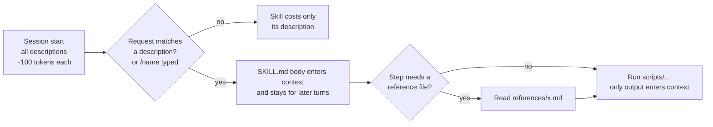

# 06.1 · Skill anatomy

## Why it matters

By the end of Module 5 you were typing the same instructions into every session: "search the code before the docs, write the brief in this shape", "run LoopGate with these flags and paste the numbers". Retyping a procedure has three costs: you forget a line on the day it matters, each teammate types a different version, and nobody can test a procedure that lives in people's heads.

A **skill** turns a repeated procedure into a versioned file the agent loads when it needs it. In [03.2](../module-03/lesson-02.md) you placed skills on the component map: *on demand*, *advisory*, for a *procedure used sometimes*. In [04.2](../module-04/lesson-02.md) you saw why that matters for context: a procedure in the always-loaded rules file is paid for in every session, while a skill's body costs nothing until it is used.

The catch is the word *advisory*. A skill is a program whose interpreter is probabilistic: the model decides whether to load it, reads its steps as text, and may skip one. Writing a skill is therefore designing a small interface: when it fires, what it takes, what it promises, and which steps are too important to leave to the model.

> [!NOTE]
> Content tags. **Concept** (stable): the four parts, progressive disclosure, deterministic versus model steps, trigger recall and false-trigger rate, context cost. **Implementation** (as of 2026-09): Claude Code's `SKILL.md` fields (`disable-model-invocation`, `allowed-tools`, `${CLAUDE_SKILL_DIR}`, `!` command injection), the Agent Skills format limits, and the course's `SkillCheck` tool.

## How it works

### Four parts

| Part | The question it answers | Where it lives | Failure when it is missing |
|---|---|---|---|
| **Trigger** | When does this load? | `description` (model-invoked), the `/name` command (user-invoked), optional `paths:` globs | fires on the wrong requests, or never |
| **Inputs** | What does it need, and what if that is missing? | `$ARGUMENTS`, `$0`, `$1`; files it reads; commands injected at load | invents the missing input from the conversation |
| **Output contract** | What does it promise, in a form a check can verify? | a section of the body, plus a rules file a script checks | "done" means whatever the model felt like |
| **Steps** | How, and which steps are code? | numbered list; `scripts/` for deterministic steps | skipped or improvised steps |

The output contract is the part most skills lack and the one this module leans on. Treat it like a method signature plus postconditions: named artifacts at known paths, required sections, invariants ("every `V###` has its `U###`"), and the command that verifies them. A contract that a script can check turns "the skill worked" from an opinion into a gate, exactly as [05.3](../module-05/lesson-03.md) did for code.

### How a skill loads

Skills use **progressive disclosure**, in three levels. The open Agent Skills specification, which Claude Code follows and which Cursor and GitHub Copilot also read, puts numbers on them:

1. **Metadata**, about 100 tokens per skill: `name` and `description`, loaded at startup for every skill the model may invoke.
2. **Instructions**, under 5,000 tokens recommended: the `SKILL.md` body, loaded when the skill is activated.
3. **Resources**, as needed: files in `scripts/`, `references/`, `assets/`. A script can run without its source ever entering the context; only its output does.



Two details (Claude Code, as of 2026-09) matter for design. The body, once loaded, stays in the conversation for the rest of the session, so every line is a recurring cost. And the description is the *only* thing the model sees when deciding whether to load the skill (the Agent Skills spec caps it at 1,024 characters).

### Deterministic steps and model steps

Anthropic's skill-authoring guidance calls this "degrees of freedom": give the model open instructions where many approaches are valid, and exact scripts where an operation is fragile and must follow one sequence. Its image is a narrow bridge with cliffs on both sides, where you want guardrails, versus an open field where you want direction. The engineering blog that introduced Agent Skills gives the cost argument: sorting a list by generating tokens is far more expensive than running a sort.

A practical test: *does this step have exactly one right answer?* Then it is code. The next migration number, the file names, collecting a diff, running the gates: scripts. Writing the SQL body, choosing an approach: model steps, each followed by a deterministic check. The pattern inside a skill is the same validate → fix → repeat loop you built in Module 5, with the same stop rule: two failures, then stop and report.

### Who invokes it

| Setting (Claude Code) | You can `/name` it | Model loads it on its own | Use for |
|---|---|---|---|
| default | yes | yes | procedures without side effects that the model should reach for (`validate`, `new-migration`) |
| `disable-model-invocation: true` | yes | no; description not even loaded | deliberate steps and side effects (`plan-feature`, deploy, commit) |
| `user-invocable: false` | no | yes | background knowledge the user never calls by name |

A user-only skill has no trigger problem and no description cost. A model-invoked skill has both, so its description must carry *what*, *when* and *when not*, in the third person, with the words users actually type ("column", "index", "migration"). Cursor and Copilot choose skills from the same field, so a good description is portable.

### What a skill costs

*Intuition.* Descriptions are rent: paid on every request, for every model-invocable skill, used or not. A body is a purchase that keeps charging: once loaded, it is re-sent with every later turn.

*Equation.* For a session with $t$ requests, $n$ model-invocable skills with average description $\bar d$ tokens, and a body of $b$ tokens loaded at request $t_0$:

$$T_{\text{skills}} = n\,\bar d\,t + b\,(t - t_0)$$

*Tiny example.* A team with 40 skills averaging 90 tokens of description, in a 30-request session: $40 \times 90 \times 30 = 108{,}000$ input tokens of descriptions. One 450-line skill body of about 6,000 tokens loaded at request 5: $6{,}000 \times 25 = 150{,}000$ more. The `new-migration` skill in this lesson: 364 characters (about 90 tokens) of description and a 27-line body (about 450 tokens): $450 \times 25 = 11{,}250$.

*Implementation.* Prompt caching makes repeated prefix tokens much cheaper ([04.1](../module-04/lesson-01.md)), but they still occupy the window and compete for attention. `SkillCheck inventory` prints description lengths and body lines for every skill in a repository; `/context` in Claude Code shows what one session is really holding.

*Interpretation.* The first term grows with the *number* of skills, which is why 40 overlapping skills hurt even when none is used. The second grows with *body length × remaining turns*, which is why rare material belongs in `references/`, loaded only by the step that needs it.

## Show me

The Contoso migration procedure as a skill (`labs/module-06/layer/.claude/skills/new-migration/`):

```markdown
---
name: new-migration
description: >-
  Creates the next numbered SQL Server migration pair for Contoso Billing
  (db/migrations/V###__name.sql plus its U### undo script) and writes both scripts. Use when a
  change adds or alters a table, column, index or constraint, or when the user asks for a
  migration or schema change. Not for editing a migration that is already merged, and not for
  one-off data fixes.
argument-hint: "[snake_case_name] [ticket-id]"
metadata:
  version: "1.0.0"
---
## Inputs
- `$0`: migration name in snake_case. `$1`: ticket id. If either is missing, ask.
## Output contract
- Exactly two new files, V### and U###, same number, created by the script.
- U### reverses the schema change, not the data. NOT NULL on an existing table: DEFAULT or backfill.
- No existing V### or U### changes. `LoopGate arch` passes.
## Steps
1. Run `bash ${CLAUDE_SKILL_DIR}/scripts/new-migration.sh $0 $1` …        (deterministic)
3. If the change adds a NOT NULL column to a table with rows, read `references/patterns.md`.
4–5. Write the V### body, then the U### body that undoes it.            (model)
6. Run `LoopGate arch`. Fix and rerun once; after two failures, stop.     (deterministic check)
```

The script never lets the model choose the number. It takes the highest number used by any `V` *or* `U` file (so an orphaned undo script still reserves its number), refuses a duplicate name, and prints the previous pair so the model can match the style:

```text
$ bash .claude/skills/new-migration/scripts/new-migration.sh invoice_po_number BILL-153
created db/migrations/V005__invoice_po_number.sql
created db/migrations/U005__invoice_po_number.sql
previous pair (match its style):
  db/migrations/U004__due_not_null.sql
  db/migrations/V004__due_not_null.sql
```

The NOT NULL pattern lives in `references/patterns.md`, not in the body: most migrations never need it, so most sessions never pay for it. And the static check:

```text
$ dotnet run --project tools/SkillCheck -- lint .claude/skills/new-migration
PASS skill new-migration
```

## Try it

Budget: 75 minutes, in `ai-layer-lab` after the setup in the [lab README](../../labs/module-06/README.md).

1. Fill in sections 1–5 of the [skill design template](../../templates/skill-design.md) for the migration procedure *before* copying anything. Which steps did you mark deterministic?
2. Copy `labs/module-06/layer/.claude/skills/new-migration/` to `.claude/skills/`. Run `SkillCheck lint .claude/skills` and `SkillCheck inventory .`.
3. In a fresh session, ask: *"BILL-153 needs a PoNumber column on invoices. Create the migration, nothing else."* Did the skill load (in Claude Code, the transcript shows the skill being used)? Did the script create both files? Did `LoopGate arch` pass? Discard the files afterwards (`git clean -fd db/`); BILL-153 is planned properly in 06.4.
4. Run the trigger test (30 short headless sessions):

   ```bash
   sh <course>/labs/module-06/scripts/run-triggers.sh new-migration skill-tests/triggers/new-migration.tsv . skill-tests/runs/new-migration.tsv 3
   dotnet run --project tools/SkillCheck -- triggers skill-tests/runs/new-migration.tsv
   ```

5. Write one entry in `AI-LAYER-CHANGELOG.md`: skill added, version, trigger numbers.

<details>
<summary>Hint: the skill never loads in headless runs</summary>

Check that the session starts in the repository root, that `name` matches the folder name, and that the front-matter parses (in Claude Code, unparseable YAML loads the skill with no fields at all). Then read a raw log in `skill-tests/runs/raw-new-migration/`: no tool call at all means the description did not match; a different tool-call shape means you should adjust the detection patterns at the top of the script.
</details>

## Break it

> [!CAUTION]
> Branch only. The v0 skill writes a migration without its undo script.

On `break/06-1`, remove `new-migration` and install the version a team actually wrote first, `labs/module-06/break/06.1-vague-skill/db-helper/`:

```markdown
---
name: db-helper
description: Helps with database stuff.
---
When working with the database, look at db/migrations and find the highest migration number,
then add one. Create the V file with the SQL for the change. Follow the team conventions …
```

Run the same trigger test with `db-helper` as the skill name, then ask for the BILL-153 migration three times in fresh sessions. (Deterministic version: the illustrative results in `labs/module-06/samples/triggers-db-helper-v0.tsv`, and the migration it wrote in `break/06.1-vague-skill/overlay/`.) Predict: which of the four parts is each failure missing?

## Fix it

**Diagnose.**

1. *Static:* `SkillCheck lint` fails with 6 problems: no "when" in the description, no Inputs, no Output contract, no Steps, no version, no changelog. The lint cannot tell you the skill is wrong; it tells you it is not a skill yet, only a paragraph.
2. *Trigger:* in the illustrative runs, `db-helper` loaded on 3 of 15 should-load runs (recall 0.20) and on 2 of 15 should-not-load runs (false-trigger rate 0.13): once for a one-off reporting query, once for a data fix it must never handle. "Database stuff" matches everything and nothing.
3. *Contract:* the migration it wrote, V005 with `ADD PoNumber nvarchar(35) NOT NULL` and no U005, fails `LoopGate arch` (`has no undo script`) and would also fail on any table with rows. Nothing in the skill said what "done" means, so the model stopped at "a V file exists".
4. *Steps:* numbering was a model step. It happened to be right here; it would be wrong on a branch where someone else already added V005 but not yet U005, because the model reads the V files only.

**Modify.** Replace `db-helper` with `new-migration`: the description names the objects (table, column, index, constraint) and the phrases users say, and excludes merged migrations and data fixes; numbering moves into the script; the contract names the pair, the undo rule and the NOT NULL rule; `LoopGate arch` runs as the last step. Bump the version and write the changelog entry.

**Rerun.** Lint passes. On the illustrative v1 runs: recall 14/15 = 0.93, false-trigger rate 1/15 = 0.07, precision 0.93, `PASS triggers`. The migration request produces V005 and U005 and `LoopGate arch` passes. The one remaining false trigger (N04, "return PoNumber; the column already exists") is a near miss worth keeping in the query set.

## How do I know it works?

- [ ] `SkillCheck lint` passes for your skill, and your design template marks every step as deterministic or model.
- [ ] Every model step in the skill is followed by a deterministic check, and the skill has a stop rule.
- [ ] Your own trigger run (10 queries × 3) shows recall at least 0.9 and false-trigger rate at most 0.1. Record the numbers, not "it seems to work".
- [ ] Asking for a migration in a fresh session produces a V/U pair that passes `LoopGate arch`, and a second request with the same name is refused by the script.
- [ ] You can state the skill's context cost: description characters (from `SkillCheck inventory`) and body lines.

## Use / don't use

**Use a skill** for a procedure you have repeated at least three times, whose steps are stable, and whose result you can check. Good candidates in a brownfield .NET shop: add a migration, add a repository method in the house pattern, run the gates and report, prepare a release note.

**Don't** write a skill for a fact (that is a rule), for a guarantee (that is a test or hook: a skill can be skipped), for a one-off, or for a procedure you have not done by hand yet. Don't make a skill model-invocable if it has side effects a person should decide on. Don't put rarely needed reference material in the body; put it in `references/` and point to it from the step that needs it.

**Limitations.**

- Triggering is probabilistic. A good description raises recall; it never makes it 1.0. If the step must always happen, enforce it with a hook, a gate or CI ([05.3](../module-05/lesson-03.md)).
- 30 runs is a small sample: a measured recall of 0.93 is consistent with a true rate well below that. Module 7 puts intervals on these numbers.
- Skill fields beyond `name` and `description` are tool-specific. `${CLAUDE_SKILL_DIR}`, `disable-model-invocation` and `!` injection are Claude Code features (Cursor supports `disable-model-invocation` too, as of 2026-09); a portable skill keeps its logic in the body and in scripts.
- A skill that pre-approves tools or runs commands when it loads is executable configuration. Review it like code; Module 9 attacks exactly this.

## Reflect

1. Which procedure do you retype most often, and which of its steps has exactly one right answer?
2. For a skill you already use, what is its output contract, and could a script check it?
3. What near-miss request would wrongly load your best skill today?

## Sources

- [Claude Code docs — Extend Claude with skills](https://code.claude.com/docs/en/skills) — `SKILL.md` fields, invocation control, description truncation at 1,536 characters, body stays in context across turns, `${CLAUDE_SKILL_DIR}`, `!` command injection, supporting files, keep `SKILL.md` under 500 lines (as of 2026-09).
- [Agent Skills — Specification](https://agentskills.io/specification) — `name` (64 chars, lowercase, matches folder) and `description` (1,024 chars) rules; `scripts/`, `references/`, `assets/`; progressive disclosure at ~100 tokens / under 5,000 tokens / as needed.
- [Claude Docs — Skill authoring best practices](https://platform.claude.com/docs/en/agents-and-tools/agent-skills/best-practices) — degrees of freedom and the narrow-bridge analogy; third-person descriptions with what and when; validate → fix → repeat; utility scripts over generated code.
- [Anthropic Engineering — Equipping agents for the real world with Agent Skills](https://www.anthropic.com/engineering/equipping-agents-for-the-real-world-with-agent-skills) — three loading levels; code for deterministic reliability; name and description drive triggering; install skills only from trusted sources.
- [Cursor docs — Agent Skills](https://cursor.com/docs/skills) — `.cursor/skills/`, `.agents/skills/`, compatibility with `.claude/skills/`; `disable-model-invocation`; automatic and `/` invocation (as of 2026-09).
- [GitHub Docs — About agent skills](https://docs.github.com/en/copilot/concepts/agents/about-agent-skills) — Copilot reads skills from `.github/skills`, `.claude/skills` and `.agents/skills` (as of 2026-09).
