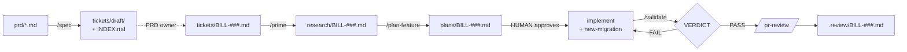

# 06.2 · The five core skills

## Why it matters

Module 5 gave you a loop and the artifacts it produces: a research brief, a reviewed plan, gate results, a review. Running it by hand means remembering, for every ticket, the brief template, the plan headings `plan-lint` reads, the exact `LoopGate` flags, and the reviewer prompt that "reports only gaps that affect correctness". The loop works; it is also easy to half-run on a busy Thursday.

Five skills cover the procedure points of that loop: **prime** (load the ticket and research the code), **spec** (turn a PRD into tickets), **plan-feature** (a reviewable plan), **validate** (the gates, reported verbatim) and **pr-review** (a fresh-context review against the plan). They are the five the source career path asks every trainer to build on a real brownfield repository before teaching, and each exists for a reason you already met as a failure: the duplicated "owed" of 05.1, the unbounded plan of 05.2, the "all tests pass" of 05.3.

The design question in this lesson is not what each skill says. It is how they connect. A chain of skills is a pipeline, and a pipeline is only as reliable as its handoffs.

> [!NOTE]
> Content tags. **Concept** (stable): skills as pipeline stages, handoff through artifacts, invocation chosen by side effects, a contract check at every boundary. **Implementation** (as of 2026-09): the Claude Code skill fields used below, `!` command injection, and the course tools `LoopGate` and `SkillCheck`. The five names come from the source material; your team may call them something else.

## How it works

### The pipeline

| Skill | Loop phase (Module 5) | Reads | Writes | Invocation | Deterministic parts | Contract check |
|---|---|---|---|---|---|---|
| **spec** | before the loop | `prd/*.md`, existing `tickets/` | `tickets/draft/DRAFT-NN.md`, `INDEX.md` | user only | glob of drafts, contract run | `SkillCheck contract` (type, criteria 2–6, no vague words, source) |
| **prime** | research ([05.1](../module-05/lesson-01.md)) | `tickets/<id>.md` | `research/<id>.md` | model and user | contract run | `SkillCheck contract` (four sections, paths, 80 lines, `Schema change:`) |
| **plan-feature** | plan ([05.2](../module-05/lesson-02.md)) | ticket + brief | `plans/<id>.md` | user only | `plan-lint`, contract run | `LoopGate plan-lint` + `SkillCheck contract` |
| *(implement)* | implement | the plan | code | — | `new-migration` script (06.1) | the gates |
| **validate** | validate ([05.3](../module-05/lesson-03.md)) | working tree, plan | nothing (verdict in chat) | model and user | the whole skill is one command | the `VERDICT:` line and verbatim gate lines |
| **pr-review** | review | ticket, plan, diff | `.review/<id>.md` | user only | diff to a file, `!git diff --stat` | `SkillCheck contract` (≤ 10 findings, `file:line`, no style) |

There is no "implement" skill. Implementation is the part the agent does from the plan; a skill wrapping it would be "follow the plan", which the plan already says. Small, sharp procedures inside implementation (a migration pair) are skills; the phase itself is not.



### Hand off through files, not the chat

Each arrow above is a file on disk. That is the most important design choice in the set, for four reasons:

1. **Resets.** 05.3 taught you to reset a polluted session: new session, plan and learned note, *not the transcript*. A brief that exists only in the chat dies with the transcript.
2. **Compaction.** When Claude Code compacts, it re-attaches invoked skill bodies within a budget, but the conversation itself is summarized ([04.4](../module-04/lesson-04.md)); a 60-line brief becomes a sentence.
3. **People and tools.** A reviewer, a colleague picking up the ticket tomorrow, or a different agent tool can read `research/BILL-154.md`. Nobody can read your session.
4. **Checks.** A script can check a file. It cannot check a chat message.

So every skill starts by reading its input file and stops, with a named next step, when it is missing: `plan-feature` replies "No research brief for BILL-154. Run /prime BILL-154 first." And every skill's chat reply is a pointer (path, counts, riskiest decision), not the content. Anthropic's "Building effective agents" calls this shape *prompt chaining*: a fixed sequence of steps with programmatic gates between them, which trades a little latency for accuracy by making each step easier. That fits the loop: the sequence is known in advance, so it does not need an agent deciding the order.

### Who presses the button

Invocation follows side effects and human moments ([06.1](lesson-01.md)):

- **validate** is model-invocable. It changes nothing, and "before saying work is done" is exactly when the model should reach for it. Its `allowed-tools` pre-approves only the `LoopGate` command, so running it needs no prompt. It is still not the enforcement: the Stop hook and CI from 05.3 are.
- **prime** is model-invocable. Research is read-only and its description ("when starting work on a BILL-### ticket") matches how people start.
- **plan-feature**, **spec** and **pr-review** are user-only. A plan is where a person approves a risky decision; a spec writes several files the PRD owner must see; a reviewer asked to find gaps usually finds some, so a person decides when a review is worth its noise.

### Reliability of a chain

*Intuition.* Four skills in a row that each produce a correct artifact 90% of the time do not give you a 90% pipeline.

*Equation.* With independent steps, $P(\text{chain correct}) = \prod_i p_i$, the same compounding you met as $p^k$ in [02.2](../module-02/lesson-02.md).

*Tiny example.* $0.9^4 \approx 0.66$. One ticket in three reaches review with an error from somewhere upstream. If each boundary has a contract check that catches, say, 70% of its step's errors and sends the step back once, the error surfaces at the step that made it, while the fix is cheap, instead of in review.

*Interpretation.* Contract checks are placed at handoffs for the same reason gates are placed after implementation: an error found at the boundary where it was born costs one step; found at the end, it costs the chain. Module 10 comes back to compounding with many agents.

### Composition

The five skills use three ways to reach beyond their own body. **Delegation:** `prime` hands research to a `researcher` sub-agent and `pr-review` hands the review to a `reviewer` (06.3). **Tools:** `validate` and `plan-feature` call `LoopGate` and `SkillCheck`, whose code never enters the context. **Injected context:** `pr-review` starts with `` !`git diff --stat main...HEAD` ``, a command Claude Code runs before the skill's text reaches the model, so the scope of the review is in front of it from the first line. A failing injected command aborts the whole skill, which is the right behavior when you are not on a branch.

## Show me

BILL-154 (customer statement) end to end with the five skills (`labs/module-06/layer/`), in one session, with `/clear` between phases on purpose:

```text
> /prime BILL-154
research/BILL-154.md · 1 open question · riskiest: "issued" is defined only inside OutstandingAsync
> /clear
> /plan-feature BILL-154
plans/BILL-154.md · riskiest: extract Issued(...) and reuse it in OutstandingAsync · Waiting for approval.
> (approve; implement)
> /validate BILL-154
PASS plan-lint
  scope: 3 changed file(s): …/InvoiceService.cs, …/StatementLine.cs, …/InvoiceStatementTests.cs   (paths shortened here)
PASS scope
PASS arch
  tests: total 9, passed 9, failed 0, skipped 0 (minimum 6)
PASS tests
ALL GATES PASSED
VERDICT: PASS
> /pr-review BILL-154
.review/BILL-154.md · blocker 0 · major 0 · minor 1
```

The `/clear` changed nothing, because the plan was built from `research/BILL-154.md`, not from memory. The reference brief and plan are in `labs/module-06/solution/`; both pass their contracts and the golden rules for BILL-154.

And `/spec prd/PRD-collections-q4.md` produced *one* draft ticket. Requirements 1–3 were already BILL-151, BILL-150 and BILL-154; requirement 4 ("fast and easy to read") became a question; requirement 6 was marked "later". The value of the skill was the index (`labs/module-06/solution/spec/INDEX.md`), not the ticket count.

## Try it

Budget: 90 minutes, in `ai-layer-lab`.

1. Install the five skills and both agents: copy `labs/module-06/layer/.claude/skills/{prime,spec,plan-feature,validate,pr-review}` and `labs/module-06/layer/.claude/agents/` into `.claude/`. Run `SkillCheck lint .claude` and `SkillCheck inventory .`. Note the two overlaps it reports and decide whether they are a problem (a skill and the agent it delegates to).
2. Read each `SKILL.md` and its `contract.rules` before first use (06.1: skills are executable configuration).
3. Run BILL-154 as in Show me, with `/clear` after `/prime` and after `/plan-feature`. Run the golden checks: `SkillCheck contract research/BILL-154.md --rules skill-tests/golden/BILL-154.research.rules` and the same for the plan.
4. Run `/spec prd/PRD-collections-q4.md`. Compare `tickets/draft/INDEX.md` with the reference. Did it notice the three existing tickets?
5. Log the run in `NOTES.md`: minutes per phase, contract results, anything you corrected by hand.

<details>
<summary>Hint: /pr-review aborts immediately</summary>

The injected `git diff --stat main...HEAD` failed: you are on `main`, the default branch has another name, or there are no commits on the branch. Create a feature branch, commit, and retry, or change the injected command to your default branch name.
</details>

## Break it

> [!CAUTION]
> Branch only. This break produces a plan that re-defines a business term.

On `break/06-2`, replace `prime` and `plan-feature` with the 0.9.0 versions from `labs/module-06/break/06.2-chat-handoff/`. In 0.9.0, `prime` shows the brief in the chat, and `plan-feature` uses "the research brief from earlier in this conversation", falling back to the ticket. Run `/prime BILL-154`, then `/clear` (a reset, exactly as 05.3 recommends), then `/plan-feature BILL-154`. (Deterministic version: `break/06.2-chat-handoff/plan-BILL-154.md`.) Predict: what will the plan say "issued" means?

## Fix it

**Diagnose.**

1. *Symptom:* the plan adds `src/Contoso.Billing/Statements/CustomerStatementService.cs` and defines statement lines as "unpaid invoices", `Status != InvoiceStatus.Paid`, so draft and void invoices would appear on a customer's statement.
2. *Check the artifacts:* `research/BILL-154.md` does not exist. The plan's Evidence cites only the ticket and `IInvoiceRepository.cs`; `OutstandingAsync` appears nowhere.
3. *Check the gates:* `LoopGate plan-lint` **passes**: the plan is well-formed. `SkillCheck contract … --rules skill-tests/golden/BILL-154.plan.rules` fails four times (no brief cited, `OutstandingAsync` not reused, the `!= Paid` filter, the `Statements/` folder). The 1.1.0 plan-feature contract fails once: "the plan cites the research brief it was built from".
4. *Cause:* not the model and not the trigger (both skills ran). The handoff was a chat message, and the reset deleted it. The failure class ([02.5](../module-02/lesson-05.md)) is insufficient context, created by the skill design, not by the session. It is 05.1's paste-and-go defect, reintroduced by a pipeline that looked complete.

**Modify.** Install `prime` and `plan-feature` from `layer/` (1.1.0): `prime` writes `research/<id>.md` and replies with a pointer; `plan-feature` reads the file and stops with "Run /prime first" when it is missing; its contract requires the plan to cite the brief. Log the change in `AI-LAYER-CHANGELOG.md`.

**Rerun.** Same sequence with `/clear`: `plan-feature` builds from `research/BILL-154.md`, reuses the "issued" filter, and passes `plan-lint`, the contract and both golden rule files. Delete `research/BILL-154.md` and run `/plan-feature BILL-154` once more: it must stop and name `/prime`.

## How do I know it works?

- [ ] `SkillCheck lint .claude` passes for all five skills and both agents.
- [ ] Every skill that produces something writes a file, and its chat reply is a pointer, not the content.
- [ ] The BILL-154 run survives `/clear` between phases, and its brief and plan pass their contracts and golden rules.
- [ ] `/plan-feature` without a brief stops and names `/prime`; it does not research or guess.
- [ ] `/validate` output contains the `tests:` line and a `VERDICT:` line copied from `LoopGate`, never a summary.
- [ ] `/spec` on the PRD lists the three already-ticketed requirements in the index instead of drafting duplicates.

## Use / don't use

**Use** these five as the starting set for any team that already runs a research → plan → implement → validate loop by hand: they remove the retyping, and their contracts make each phase checkable. Adapt the contracts to the team's templates; keep the handoff-through-files rule unchanged.

**Don't** build all five on day one for a team that has no loop yet: a skill automates a procedure, and automating a procedure nobody follows produces confident artifacts nobody reads. Start with `validate` (smallest, no judgment) and `prime` (largest payoff on brownfield). Don't build an "implement" skill, and don't chain skills by telling one to "invoke the next": keep the human checkpoint between plan and implementation.

**Limitations.**

- A contract checks form and a few invariants. The 06.4 break shows a plan that passes every form check and is still wrong; golden checks per ticket category are the next layer.
- User-only skills depend on people remembering to run them. `validate` being model-invocable helps; the Stop hook and CI are what guarantee it.
- These skills are Claude Code shaped. The procedures, contracts and file handoffs port to any tool; `${CLAUDE_SKILL_DIR}`, `!` injection and `.claude/agents/` do not.

## Reflect

1. Which handoff in your current workflow lives only in a chat, and what would you lose on a reset?
2. Which of the five skills would save your team the most time this month, and which one would they resist?
3. Where in your pipeline does an error travel furthest before anyone can see it?

## Sources

- [Claude Code docs — Extend Claude with skills](https://code.claude.com/docs/en/skills) — `disable-model-invocation`, `allowed-tools`, `!` command injection (a failing command aborts the skill), skill content after compaction (as of 2026-09).
- [Claude Code docs — Best practices](https://code.claude.com/docs/en/best-practices) — explore, plan, implement, commit; clear the session between tasks; fresh-context reviewers (as of 2026-09).
- [Claude Docs — Skill authoring best practices](https://platform.claude.com/docs/en/agents-and-tools/agent-skills/best-practices) — workflows with checklists, feedback loops, plan-validate-execute with verifiable intermediate outputs.
- [Anthropic Engineering — Building effective agents](https://www.anthropic.com/engineering/building-effective-agents) — prompt chaining with programmatic gates; workflows (predefined paths) versus agents; start with the simplest solution.
