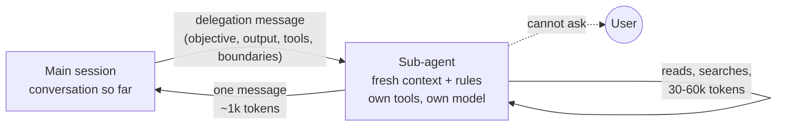

# 06.3 · Sub-agents, and when not to build one

## Why it matters

Sub-agents are the most over-built part of the AI layer. A team discovers `.claude/agents/` and a week later has an "architect", a "senior developer", a "tester", a "DBA" and a "product owner", each a paragraph of role-play. Most of them make results worse, and all of them make results more expensive.

The evidence cuts both ways, and you need both halves when you teach this. Anthropic reported that its multi-agent research system (a lead agent with parallel sub-agents) beat a single agent by 90.2% on an internal research evaluation, and in the same article reported that multi-agent systems used about 15 times the tokens of a chat, and that they fit badly where agents must share context or where work has many dependencies, noting that most coding tasks have fewer truly parallel parts than research. Cognition's "Don't Build Multi-Agents" argues the other side from coding agents: actions carry implicit decisions, and sub-agents that do not see each other's decisions produce parts that do not fit.

Both are right about different work. This lesson gives you the mechanism that explains when each is right, and a four-question test you can apply to any proposed agent in a client's repository.

> [!NOTE]
> Content tags. **Concept** (stable): context isolation, the four questions, the delegation contract, context saved versus tokens spent, "sub-agents cannot ask". **Implementation** (as of 2026-09): Claude Code's `.claude/agents/*.md` format, the `tools` allowlist, built-in Explore and Plan agents. Multi-agent topologies and coordination at scale are Module 10.

## How it works

### What a sub-agent actually is

Strip away the persona and a sub-agent is four mechanical differences from the main session:

1. **A fresh context window.** It starts with its own system prompt, the delegation message and, for custom agents in Claude Code, the project's CLAUDE.md files. It does **not** see the conversation so far. (The built-in Explore and Plan agents skip CLAUDE.md as well, to stay fast; that detail becomes a bug in 06.4.)
2. **Its own tools and model.** A `tools` allowlist, a `disallowedTools` denylist, a `model` field. This is the only way in Claude Code to give one piece of work fewer permissions than the session running it.
3. **One message back.** The caller receives the final answer, not the files read or the searches run. That is the whole context saving.
4. **No way to ask.** Sub-agents cannot put a question to the user mid-task; Claude Code removes the ask-user tool from their tool set. An unknown becomes a guess, unless the delegation says to return it as a question.



A persona prompt ("You are a senior architect") changes none of the four. Role-play is not isolation.

### Four questions

Before creating an agent, ask:

| # | Question | Yes points to |
|---|---|---|
| 1 | Does the work produce far more output than the caller needs (search results, logs, test output)? | sub-agent |
| 2 | Does it need different permissions (read-only, no MCP, a cheaper model)? | sub-agent |
| 3 | Can it finish from one written brief without asking anyone anything? | if **no**: main session |
| 4 | Is it free of decisions shared with other work in flight (same files, same design choice)? | if **no**: one thread |

A sub-agent is justified when 1 or 2 is yes *and* 3 and 4 are yes. If the work is a repeatable procedure, it is a skill, and that skill may delegate part of itself (06.2: `prime` → `researcher`, `pr-review` → `reviewer`).

| Candidate | Q1 | Q2 | Q3 | Q4 | Verdict |
|---|---|---|---|---|---|
| Research a ticket | yes | read-only | yes (open questions come back as a section) | yes | **sub-agent** |
| Review a diff against its plan | some | read-only | yes | yes | **sub-agent**: fresh context is the point |
| Summarize a 4,000-line test log | yes | — | yes | yes | **sub-agent** |
| Plan a ticket with an open product question | no | — | **no** | — | main session (plan mode or `plan-feature`) |
| Implement two tickets in parallel that both edit `InvoiceService.cs` | — | — | yes | **no** | one thread, or isolated worktrees and a merge plan (Module 10) |
| "Architect" persona that answers design questions | no | no | — | — | nothing: a rule or an ADR |

### The delegation contract

Anthropic's multi-agent write-up lists what each delegation needs: an objective, an output format, guidance on tools and sources, and clear task boundaries; without them, sub-agents duplicated work or left gaps. Add one more for coding: *what to do with an unknown*. The `researcher` agent's body in `labs/module-06/layer/.claude/agents/researcher.md` is exactly this: objective (four questions), how to search (code before docs, which folders), output (brief shape, 80 lines, `Schema change:` line), boundaries (no plan, no edits, stop after about 15 minutes, open questions as proposals).

Make the tool allowlist match the claims. `researcher` and `reviewer` both say "never edits files", and both have `tools: Read, Grep, Glob`. An agent that claims to be read-only while holding `Bash` is not read-only: shell commands write files. `SkillCheck lint` fails that combination.

### What delegation costs

*Intuition.* A sub-agent spends tokens to save the main session's attention.

*Equation.* If a sub-agent explores $E$ tokens and returns a summary of $s$, the main context saved is $S = E - s$. The tokens spent are roughly $E + O$, where $O$ is the sub-agent's own start-up (system prompt, tool definitions, project rules). For $k$ sub-agents in parallel, wall-clock time is about the slowest one, $\max_i t_i$, while tokens add up, $\sum_i (E_i + O)$.

*Tiny example* (illustrative numbers). Research for BILL-154 and BILL-155: $E_1 = 26{,}000$, $E_2 = 31{,}000$; briefs $s_1 = 750$, $s_2 = 900$; $O \approx 5{,}000$ each.

- In the main session: the main context grows by 57,000 tokens; about 20 minutes one after the other.
- Two sub-agents in parallel: main context grows by $750 + 900 = 1{,}650$, saving $S \approx 55{,}000$ tokens; tokens spent $\approx 57{,}000 + 10{,}000 = 67{,}000$ (about 18% more); wall-clock about 11 minutes.

*Implementation.* Claude Code reports each sub-agent's token use when it finishes; log it next to minutes in a delegation log in `NOTES.md`.

*Interpretation.* The trade is good when the saved context protects a long session that follows (implementation of both tickets) or when wall-clock matters. It is bad for a two-file change, where $O$ is most of the cost and the "summary" is as long as what it replaced. Anthropic's 15× figure is the upper end of this curve: many agents, each re-reading and re-searching.

## Show me

The `reviewer` agent (`labs/module-06/layer/.claude/agents/reviewer.md`), abbreviated:

```markdown
---
name: reviewer
description: >-
  Read-only reviewer for Contoso Billing branches. Use when the pr-review skill or the user asks
  for a review of a diff against its ticket and plan. Reports only gaps that affect correctness,
  acceptance criteria or plan boundaries, with file, line and evidence. Never edits files.
tools: Read, Grep, Glob
model: inherit
---
You review one change with a fresh context. You did not write it, and you have not seen the
conversation that produced it.
## What to check, in order
1. Each acceptance criterion: implemented, and a test that would fail without it?
2. Plan boundaries.  3. Reuse promised by the plan.  4. Project rules.  5. Tests changed or skipped?
## What not to report
Style, naming, formatting; refactors nobody asked for. "No findings" is a valid result.
## Output
## Findings (table: severity | file:line | criterion or plan item | evidence), at most 10 · ## Not checked
```

Every line answers one of the four questions: fresh context is the reason it exists (Q1, and independence from the author), `tools` enforces read-only (Q2), the inputs are files so it needs no conversation (Q3), and it touches nothing so it shares no decisions (Q4). The "No findings is valid" line is there because a reviewer asked to find problems will otherwise find some.

## Try it

Budget: 75 minutes, in `ai-layer-lab` with the 06.2 skills and agents installed.

1. Fill in the [sub-agent design template](../../templates/sub-agent-design.md) for `researcher`. Where does your answer to Q3 come from?
2. Parallel research: in a fresh session, *"Use two researcher subagents in parallel: one for tickets/BILL-154.md, one for tickets/BILL-155.md. Save each brief to research/."* Record each sub-agent's tokens and minutes, and `/context` of the main session before and after.
3. Do the same two tickets without delegation in another fresh session ("research BILL-154 then BILL-155, read-only, write the briefs"). Record the same numbers. Fill in $E$, $s$, $S$ and total tokens for both runs in a **delegation log** in `NOTES.md`.
4. Implement BILL-154 from the 06.2 plan if you have not, then run `/pr-review BILL-154`. Read the findings; mark each "valid", "noise" or "wrong".
5. Run `SkillCheck lint .claude/agents`.

<details>
<summary>Hint: the parallel run shows no saving</summary>

Check what came back. If the main session received the sub-agents' full exploration (file contents pasted into the reply), the delegation prompt did not constrain the output. The brief shape and line limit belong in the agent's `## Output` section, not only in the calling prompt.
</details>

## Break it

> [!CAUTION]
> Branch only. The planner writes a plan that decides a product question on its own.

On `break/06-3`, copy `labs/module-06/break/06.3-planner-agent/planner.md` to `.claude/agents/`. Put the reference brief `labs/module-06/solution/research/BILL-153.md` in `research/`: it lists two open questions, the first being what PO number the existing invoices get. Then: *"Use the planner subagent to plan BILL-153."* (Deterministic version: `break/06.3-planner-agent/plan-BILL-153.md`.) Predict: what happens to open question 1?

## Fix it

**Diagnose.**

1. *Symptom:* the plan reads "Resolved: existing invoices get `N/A`, the usual placeholder". Nobody at Contoso said so; Finance was never asked. Every approach line is otherwise sound: V005/U005 in Touch, backfill pattern from V004, trailing parameter.
2. *Gates:* `LoopGate plan-lint` passes. The `plan-feature` 1.1.0 contract fails once: "the backfill or default value is a product decision: name it at a HUMAN checkpoint".
3. *Mechanism:* the sub-agent could not ask (no ask-user tool), and its instructions said "resolve every open question … so the implementer is never blocked". It did exactly that. The failure is in the design, question 3 of four: planning with an open product question cannot finish from one brief without asking.
4. *Class* ([02.5](../module-02/lesson-05.md)): a planning failure, produced by delegating a task that needed a person; it escaped because the human checkpoint was generic ("approve this plan") rather than naming the decision.

**Modify.** Delete `planner.md`. Planning stays in the main session with `/plan-feature` (06.2), which turns each open question into an Assumption at a named HUMAN checkpoint and stops. If a team insists on delegating part of planning, the agent's output must include an `## Open questions` section and its instructions must forbid resolving them; the main session asks. Add Q3 to your team's agent review checklist.

**Rerun.** `/plan-feature BILL-153` produces a plan whose checkpoint reads "HUMAN: approve the backfill value for existing invoices (A1, `N'UNKNOWN'` proposed) and the column type (A2) with Finance". The contract passes (compare with `labs/module-06/solution/plans/BILL-153.md`).

## How do I know it works?

- [ ] Every agent in `.claude/agents/` has a design template with four answered questions, and `SkillCheck lint` passes (description with "Use when", a `tools` allowlist, an `## Output` section, read-only claims matching tools).
- [ ] Your delegation log shows $E$, $s$, $S$, tokens and minutes for the delegated and the non-delegated run of the same two tickets.
- [ ] You can state, from your own numbers, the smallest ticket for which delegating research paid off.
- [ ] Your reviewer run has each finding labelled valid, noise or wrong, and "No findings" would have been accepted.
- [ ] No plan in `plans/` resolves an open question without a named HUMAN checkpoint.

## Use / don't use

**Use a sub-agent** for read-heavy, summarizable work (research, log and test-output digestion), for work that needs fewer permissions than the session, and for independent review where not having seen the conversation is the point. Parallelize only work that shares no files and no decisions.

**Don't** create agents as personas, for planning that needs a person, for tightly coupled edits, or for small tasks where start-up cost dominates. Don't give a "read-only" agent `Bash`. Don't let a sub-agent's instructions say "resolve" or "decide" about anything a person owns.

**Limitations.**

- The summary is lossy by design. The main session knows only what came back; if the brief omits a caller, the implementation will too. Pointers (paths) in the output reduce the damage.
- Parallel sub-agents do not see each other's decisions. That is fine for research and wrong for implementation of shared code (Module 10).
- Token numbers here are illustrative; the multiplier depends on your agent, model and prompts. Measure your own before you teach a number.
- Sub-agent formats differ across tools more than skills do (as of 2026-09); the four questions port, the file format does not.

## Reflect

1. Which agent in your setup (or a client's) fails question 3 or 4?
2. What did your delegation log say about the break-even ticket size?
3. What decision did a sub-agent make for you recently that you would have wanted to make yourself?

## Sources

- [Claude Code docs — Create custom subagents](https://code.claude.com/docs/en/sub-agents) — file format and fields (`tools`, `disallowedTools`, `model`); separate context; what loads at start (CLAUDE.md for custom agents; built-in Explore and Plan skip it); the ask-user tool is removed for subagents; when to use the main conversation instead; parallel subagents (as of 2026-09).
- [Anthropic Engineering — How we built our multi-agent research system](https://www.anthropic.com/engineering/multi-agent-research-system) — 90.2% over single-agent on an internal research eval; ~4× (agents) and ~15× (multi-agent) chat tokens; poor fit for shared context and dependencies, most coding tasks less parallelizable; delegation needs objective, output format, tool guidance, boundaries.
- [Cognition — Don't Build Multi-Agents](https://cognition.com/blog/dont-build-multi-agents) — share full context; actions carry implicit decisions; prefer a single-threaded agent for coding work.
- [Anthropic Engineering — Effective context engineering for AI agents](https://www.anthropic.com/engineering/effective-context-engineering-for-ai-agents) — sub-agents explore with many tokens and return condensed summaries of often 1,000–2,000 tokens.
- [Anthropic Engineering — Building effective agents](https://www.anthropic.com/engineering/building-effective-agents) — add complexity only when it demonstrably improves outcomes; orchestrator-workers pattern.
