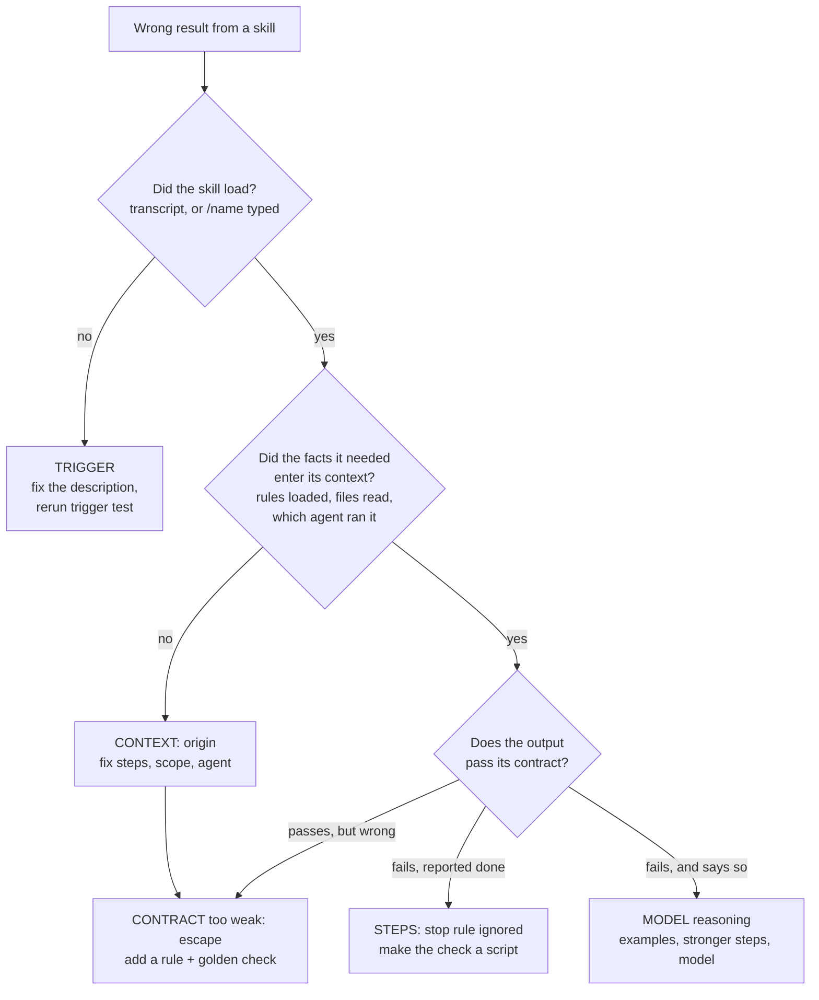

# 06.4 · Testing, versioning and failure analysis for skills

## Why it matters

A skill that works on the five tickets you tried is a skill that has been tested on five tickets. The next ticket is a different shape (it touches a migration, a legacy folder, a second project) and the skill produces something confident and wrong. Because the skill passed before, nobody checks it closely now.

That is the lab break for this module. `prime` and `plan-feature` 1.0.0 passed BILL-142, 151, 152, 154 and 155. On BILL-153, which adds a NOT NULL column to a table that already has rows, they produced a plan with no undo script, no backfill and no question about what existing invoices should hold. `plan-lint` passed it.

The same gap shows up at team scale as the question every AI-layer consultant eventually gets: *"We have 40 skills and nobody knows which ones fire."* Both are the same problem. Skills are code whose interpreter is a model, and code without tests, versions and failure analysis rots. This lesson gives you the test levels, the numbers, the versioning rule and the diagnostic sequence.

> [!NOTE]
> Content tags. **Concept** (stable): test levels, trigger precision and recall, representative ticket sets, SemVer for procedures, the trigger → context → contract diagnosis. **Implementation** (as of 2026-09): `context: fork` / `agent: Explore` in Claude Code, the fact that built-in Explore skips CLAUDE.md, and the course's `SkillCheck` and `run-triggers` scripts. Module 7 turns these tests into a proper evaluation harness with confidence intervals.

## How it works

### Four levels of tests

| Level | What it checks | Catches | Cannot catch | When | Cost |
|---|---|---|---|---|---|
| **1 Static** (`SkillCheck lint`) | fields, name, description has "when", sections, links, version = changelog | a paragraph pretending to be a skill; broken references | anything about behavior | every commit (CI) | seconds |
| **2 Trigger** (`run-triggers` + `SkillCheck triggers`) | loads for should-load queries, not for near misses; K runs each | vague or overlapping descriptions | whether the output is right | when a description changes; monthly | ~30 sessions |
| **3 Contract** (`SkillCheck contract`, `plan-lint`) | the artifact meets the skill's promise | missing sections, missing pairs, missing checkpoints | a well-formed wrong answer | inside every run (the skill's last step) | seconds |
| **4 Ticket set + golden checks** | the right facts for each ticket *category* | category-specific misses (schema, legacy, reuse) | categories not in the set | every release | an hour |

A fifth check is human: the **cold-use test**. The career path this course grew from sets the bar as a stranger getting a working PR out of your skills, unaided, within 30 minutes. Where they get stuck is where the skills' inputs and outputs are unclear. Run it on every major version.

Anthropic's skill guidance puts evaluations first: run the agent on representative tasks *without* the skill, build at least three evaluation scenarios from the gaps you see, measure a baseline, then write the minimum skill that closes the gaps. Its `skill-creator` skill tests triggering with about 20 queries, half should-trigger and half near-miss, runs each query 3 times, and holds out 40% of the queries so a description is not tuned to its own test set.

### Trigger numbers

*Intuition.* A trigger is a classifier: for each request it decides "load" or "don't". Measure it like one.

*Equation.* Over all runs, with TP = loaded when it should, FN = did not load when it should, FP = loaded when it should not:

$$\text{recall} = \frac{TP}{TP + FN} \qquad \text{false-trigger rate} = \frac{FP}{FP + TN} \qquad \text{precision} = \frac{TP}{TP + FP}$$

*Tiny example.* The illustrative `new-migration` runs from 06.1: 5 should-load queries × 3 runs, 14 loads; 5 near misses × 3, 1 load. Recall $14/15 = 0.93$, false-trigger rate $1/15 = 0.07$, precision $14/15 = 0.93$.

*Implementation.* `SkillCheck triggers <runs.tsv>` prints these per query and overall, lists *unstable* queries (loaded on some runs and not others), and fails below `--min-recall` / above `--max-false`.

*Interpretation.* Fifteen runs is a small sample. If the true recall were only 0.75, you would still see 14 or 15 loads out of 15 about 8% of the time ($\binom{15}{14}0.75^{14}0.25 + 0.75^{15} \approx 0.08$). So "0.93" means "probably well above 0.7", not "93%". Module 7 turns this into Wilson intervals and tells you how many runs a claimed difference needs. Until then: compare descriptions on the same queries, look at the unstable queries, and do not promise a client a trigger rate.

### A representative ticket set

A ticket set is representative when it covers the *categories* of work the skill will meet, not when it is large. For `prime` and `plan-feature` on Contoso, the categories are: read query, reuse trap, one-sentence fix, new read model, first write, new table, NOT NULL column on an existing table ([`labs/module-06/tests/tickets.md`](../../labs/module-06/tests/tickets.md)). Version 1.0.0 was tested on five tickets from one sprint. None of them touched the schema. Its test set measured the sprint, not the skill.

Each category that has failed once gets **golden checks**: the facts a correct artifact must contain, as a rules file (`skill-tests/golden/BILL-153.plan.rules`: U005 in Touch, a backfill, the value at a HUMAN checkpoint, existing tests untouched). Golden checks are regression tests for the skill.

### Versioning

Skills get the same discipline as a library ([SemVer](https://semver.org/)), with the definition adapted to procedures:

- **Major**: a caller or a check that relied on the old output breaks. Renaming a brief section that `plan-feature` reads; changing where `prime` writes.
- **Minor**: a new step, rule or capability; existing callers keep working. `prime` 1.1.0 adds a required `Schema change:` line; old briefs fail the new contract and are regenerated, but nothing that reads briefs breaks.
- **Patch**: wording only, same behavior on the ticket set.

`metadata.version` in `SKILL.md` must equal the newest `CHANGELOG.md` entry (`SkillCheck lint` checks it), and the repository's `AI-LAYER-CHANGELOG.md` records the change with its owner review ([03.1](../module-03/lesson-01.md)). Rollback is `git revert`, which is only possible because the skill is a file in the repository.

### Trigger, context or contract

When a skill produces a wrong result, ask in this order. Each question is answerable from evidence.

This is the origin/escape split from [05.4](../module-05/lesson-04.md) applied to one skill: the origin is where the wrong belief entered (usually context), the escape is the check that should have stopped it (usually the contract). Fix both, or the next edge case repeats it.

## Show me

The 1.0.0 ticket set, then BILL-153 (`labs/module-06/break/06.4-migration-edge/`):

| Ticket | Category | prime 1.0.0 contract | plan-feature 1.0.0 contract + plan-lint | Golden checks |
|---|---|---|---|---|
| BILL-142, 151, 152, 154, 155 | non-schema | PASS | PASS | PASS (151, 154) |
| **BILL-153** | NOT NULL column on existing table | **PASS** | **PASS** | **FAIL 4 + 4** |

The BILL-153 plan's Touch list has `V005__invoice_po_number.sql` and no `U005`; step 4 is `ALTER TABLE dbo.Invoice ADD PoNumber nvarchar(35) NOT NULL`, which fails on a table with rows; the only open question is about PO format. `LoopGate arch` would catch the missing U005, but only after implementation. Nothing would catch the backfill before production.

Walk the diagnosis:

1. **Trigger?** Ruled out. The engineer typed `/prime BILL-153` and `/plan-feature BILL-153`; both skills loaded.
2. **Context?** `prime` 1.0.0 has `context: fork` and `agent: Explore`. The built-in Explore agent skips CLAUDE.md files to stay fast, so the AGENTS.md that CLAUDE.md imports, with its "V### plus U###" rule, never entered the research context. Step 2 searched `src/` and `tests/` only, so no migration file was read and the path-scoped migrations rule never loaded either. The brief has no constraint about migrations and no `FROM dbo.Invoice` readers. **Origin: context**, created by the skill's own design.
3. **Contract?** The 1.0.0 contracts checked sections, paths and length, and `plan-lint` checked form. All passed on a plan that is wrong. **Escape: contract too weak** for the schema category.
4. **Model?** Not needed: given the rules and the V004 file, the model writes the backfill correctly (the 1.1.0 run shows it).

## Try it

Budget: 90 minutes, in `ai-layer-lab` with `skill-tests/` from the setup.

1. Fill in section 7 of the [skill design template](../../templates/skill-design.md) for `prime` and `plan-feature`: which categories will they meet in *your* repository?
2. Run the ticket test set for the installed 1.1.0 skills on the seven tickets in `skill-tests/tickets.md`, with the commands at the end of that file. Record pass/fail per check and minutes in a **skill test log** in `NOTES.md`.
3. Run a trigger test for `prime` (write 5 should-load and 5 near-miss queries first; "explain this ticket to me" is a good near miss).
4. Cold-use test: ask a colleague to pick a ticket in your repository and get from ticket to approved plan with only `/prime` and `/plan-feature`, without your help. Note every place they hesitate.
5. Run `SkillCheck inventory .` and write down the always-in-context description cost.

Hint: a golden check fails on a correct-looking artifact

Golden rules are regular expressions over text, so wording matters (`FROM dbo.Invoice` versus "the Invoice table"). Decide which is wrong: if the artifact omits a fact a reviewer needs, fix the skill; if it states the fact in other words, loosen the rule. Keep the rule strict for facts that must be greppable later, such as file paths.

## Break it

> [!CAUTION]
> Branch only. The 1.0.0 skills produce a migration plan that would fail on a production table.

On `break/06-4`, replace `.claude/skills/prime` and `.claude/skills/plan-feature` with `labs/module-06/break/06.4-migration-edge/skills-v1.0.0/`. Run the five 1.0.0 tickets: all pass. Then `/prime BILL-153`, `/clear`, `/plan-feature BILL-153`. (Deterministic version: the brief and plan in the same folder.) Predict before reading: which level of test will catch it first?

## Fix it

**Diagnose.** Walk the flow chart with evidence, as in Show me: transcript shows both skills loaded (trigger ruled out); `prime`'s front-matter shows `agent: Explore`, and the brief cites no `db/migrations/` file (context: origin); both 1.0.0 contracts and `plan-lint` pass while the golden checks fail 4 + 4 (contract: escape). Write the result as a failure-analysis entry in `NOTES.md`: ticket, category, origin, escape, evidence line for each.

**Modify.**

- *Origin.* `prime` 1.1.0 delegates to the project's `researcher` agent, which loads CLAUDE.md and therefore AGENTS.md, and adds `db/migrations/` and `docs/adr/` to the search scope. The brief must state `Schema change: yes|no`.
- *Escape.* `prime`'s contract: if schema change, cite a `V###` file and the `FROM dbo.<table>` readers. `plan-feature` 1.1.0 reads `references/schema-changes.md` only when the brief says `Schema change: yes`, and its contract requires the V/U pair in Touch, a DEFAULT or backfill with any NOT NULL, the backfill value at a HUMAN checkpoint, and merged migrations under Do not touch.
- *Tests.* Add BILL-150 and BILL-153 to the ticket set with golden rules. Bump both skills to 1.1.0, with changelog entries naming BILL-153, and a line in `AI-LAYER-CHANGELOG.md`.

**Rerun.** With the 1.1.0 skills from `layer/`: all seven tickets pass contracts and golden checks. Check the old artifacts against the new rules: the 1.0.0 brief now fails (no `Schema change:` line) and the 1.0.0 plan fails three rules (no U005, NOT NULL without DEFAULT or backfill, merged migrations not protected), so the new contract would have stopped them inside the skill run, before a human saw the plan.

## How do I know it works?

- [ ] Every skill in `.claude/skills/` passes `SkillCheck lint`, and each has `metadata.version` matching its changelog.
- [ ] Your ticket set lists its categories, and every category that has failed once has golden rules.
- [ ] The seven-ticket run passes for 1.1.0, and the 1.0.0 BILL-153 brief and plan fail the 1.1.0 contracts.
- [ ] You have a trigger test result for every model-invocable skill, with unstable queries named, and you can say why the numbers are not yet a guarantee.
- [ ] `NOTES.md` has a failure analysis for BILL-153 with origin, escape and evidence, and cold-use notes from a colleague.

## Use / don't use

**Use** all four levels for skills the team depends on (the five core skills); level 1 in CI for every skill. For the "40 skills, nobody knows which fire" audit: run `SkillCheck inventory` for duplicates, overlaps, vague descriptions and total description cost; ask owners which skills they used last month; delete or merge the unowned and unused; run trigger tests on the survivors that overlap; give each survivor a version, a changelog and an owner.

**Don't** build a ticket set before the skill has met real tickets (you will test imagined categories), and don't chase trigger recall to 1.0 with ever-longer descriptions: every character is paid on every request, and a step that must always happen belongs in a hook or gate.

**Limitations.**

- Golden checks are regular expressions; they check that facts are present, not that the plan is good. They complement review, they do not replace it.
- Trigger and ticket results come from small samples with a stochastic model; a model upgrade can change them overnight. Rerun on model changes.
- The Explore behaviour in this break is a Claude Code implementation detail as of 2026-09. The lesson that survives any version: know which context a delegated step runs in, and test it.

## Reflect

1. Which ticket category in your repository has no test in your skills' test set today?
2. For your last skill failure, which was the origin and which was the escape?
3. Which of your skills would you delete first in a 40-skill audit, and what evidence would you show its owner?

## Sources

- [Claude Docs — Skill authoring best practices](https://platform.claude.com/docs/en/agents-and-tools/agent-skills/best-practices) — build evaluations first; baseline without the skill; at least three evaluations; test with every model you plan to use; observe how the agent navigates the skill.
- [Anthropic — skill-creator skill](https://github.com/anthropics/skills/blob/main/skills/skill-creator/SKILL.md) — trigger evaluation with about 20 should- and should-not-trigger queries, 3 runs each, 60/40 train/test split for description optimization.
- [Claude Code docs — Extend Claude with skills](https://code.claude.com/docs/en/skills) — `context: fork` runs a skill in a subagent chosen by `agent` (as of 2026-09).
- [Claude Code docs — Create custom subagents](https://code.claude.com/docs/en/sub-agents) — built-in Explore and Plan skip CLAUDE.md files; custom subagents load them (as of 2026-09).
- [Semantic Versioning 2.0.0](https://semver.org/) — major, minor, patch.
- [Keep a Changelog 1.1.0](https://keepachangelog.com/en/1.1.0/) — changelog format used by the lab skills.
