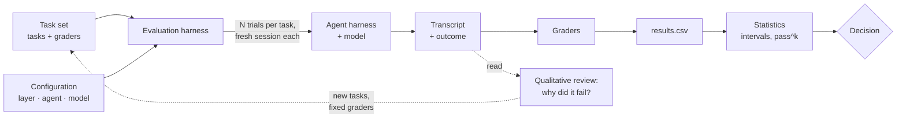

# 07.1 · Why evaluate agents

## Why it matters

Here is how most AI layers change. Someone edits the rules file or a skill, tries it on one ticket, watches it work, and merges. A week later a different ticket fails in a way that feels new. Nobody can say whether the edit helped, hurt, or did nothing, because the only evidence was one run of a system that — as [02.2](../module-02/lesson-02.md) showed — gives different answers to the same prompt.

That is the **improve-without-measuring trap**. It is not laziness; it is what happens when the feedback you have is a demo. Every AI-layer file you wrote in Modules 3–6 is a change to a stochastic system, and a stochastic system cannot be judged by one sample any more than a flaky test can be judged by one green run.

You have already built the minimal fix. Module 4's context audit ran a fixed 10-task set 3 times before and after a cut ([04.5](../module-04/lesson-05.md)). This module turns that check into an **evaluation harness**: more and better tasks, graders you have tested, repeated trials, intervals instead of point scores, paired comparisons, and a gate in CI. It is the instrument that lets you say "this change helped" to an engineering manager — and, later in the course, to a client — without bluffing.

> [!NOTE]
> Content tags. **Concept** (stable): the eval vocabulary, qualitative vs quantitative evaluation, capability vs regression suites, the one-run trap. **Implementation** (as of 2026-09): `EvalHarness`, driving Claude Code with `claude -p --output-format json`. This module measures the *agent system*. Measuring *business impact* (cycle time, defects, productivity) is Module 13.

## How it works

### The vocabulary

Anthropic's engineering guide to agent evals uses a vocabulary worth adopting, because every tool and paper uses some version of it:

| Term | Meaning | In the course harness |
|---|---|---|
| **Task** | One test: an input and a success criterion | an entry in `tasks-v1/tasks.json` |
| **Trial** | One attempt at a task; you run several because outputs vary | `T06.r3.json` = task T06, trial 3 |
| **Grader** | Logic that scores a trial | regex, golden tests, or an LLM judge with a rubric |
| **Transcript** | The full record of a trial: messages, tool calls, reasoning | the `claude -p` JSON (and the session log) |
| **Outcome** | The final state of the environment, not what the agent *said* | the files changed in the working copy, and whether golden tests pass |
| **Evaluation harness** | Runs tasks, records trials, grades, aggregates | `EvalHarness` |
| **Agent harness** | What turns a model into an agent (tools, loop, context) | Claude Code itself — part of the system under test |

The last distinction matters more than it looks. When you evaluate "Claude Code + your AI layer + a model", a change to *any* of the three can move the score. That is why the harness records all three in a manifest.



### Qualitative and quantitative

These answer different questions, and you need both.

- **Qualitative evaluation** is reading transcripts. It answers *why*: the agent never opened the ADR, the regex rejected a correct answer, the task was ambiguous. It finds hypotheses and grader bugs. It cannot tell you how often.
- **Quantitative evaluation** is scoring many trials. It answers *how often* and *how sure*: 86% of 120 trials, interval 78–91%. It cannot tell you why.

The loop between them is the method: read transcripts → form a hypothesis → change the layer → measure → read the new failures. Anthropic's guide is blunt that the reading is not optional: you won't know whether your graders work unless you read transcripts and grades from many trials, and every failure should look *fair* — clear what the agent got wrong and why. In Module 4 you found a grader false negative (T02) only because you read the failing answer.

### Capability and regression suites

- A **capability** eval asks "what can it do?" and starts with a low pass rate: tasks you hope a better layer or model will solve.
- A **regression** eval asks "does it still do what it did?" and should sit near 100%: tasks that once failed and were fixed, plus the facts that must never break.

Capability tasks that become reliable graduate into the regression suite. `tasks-v1` is mostly a regression suite for Contoso: its job is to guard the layer you built.

### The one-run trap, in numbers

*Intuition.* If a skill succeeds on a ticket 60% of the time, a single demo is a coin that lands heads 60% of the time. Two versions of the skill compared on one run each are two handfuls of coins.

*Equation.* With per-task success probability $p$ and $n$ tasks run once, the number of passes is binomial: mean $np$, variance $np(1-p)$. The difference between two *identical* versions has variance $2np(1-p)$.

*Tiny example.* $p = 0.6$, $n = 20$: each version's score has standard deviation $\sqrt{20 \times 0.6 \times 0.4} \approx 2.2$ passes, and the difference between two identical versions has standard deviation $\sqrt{2} \times 2.2 \approx 3.1$. Computing the binomial probabilities exactly, an unchanged skill "beats" itself by two or more tickets **31%** of the time, and one of the two versions wins by two or more **63%** of the time.

*Implementation.* `EvalHarness compare` does this arithmetic for you on real results (07.4 and 07.5 explain the intervals).

*Interpretation.* "v2 scored 14/20, v1 scored 12/20" is what you would see about one time in three if nothing had changed. Before the number can mean anything, you need more trials, more tasks, or both — and a decision rule written *before* you look.

### The charter

An eval without a stated decision drifts into a dashboard nobody trusts. Write one page, `agent-evals/CHARTER.md`, before the first run:

1. **Decision** the eval serves ("merge AI-layer changes to `main`").
2. **System under test** (repository, agent, model, AI layer) and what is held fixed.
3. **What it measures** (task pass rate; golden tasks never regress; cost per passing trial).
4. **What it does not measure** (developer productivity, business value — Module 13; security — Module 9 adds attack tasks).
5. **Decision rule** ("merge if the paired 95% lower bound is above −5 points and no golden task drops").
6. **Owner** and review cadence.

## Show me

The same ten hand-written answers from Module 4 (`labs/module-04/samples/illustrative-after/`), graded twice. First with Module 4's `ContextLab`:

```text
T02   F2    0/1    T02.r1.json: missing /IInvoiceRepository|InvoiceRepository/
T09   F9    0/1    T09.r1.json: missing /\bno\b/
pass rate 8/10 = 80.0%
```

Then replayed through `EvalHarness` with `tasks-v1`, whose T01–T10 keep the same prompts but carry a written reference answer, counterexamples and a repaired T02 grader:

```text
$ dotnet run --project tools/EvalHarness -- run tasks-v1/tasks.json --repo ../module-03/brownfield \
      --out runs/replay --trials 1 --agent replay:../module-04/samples/illustrative-after
$ dotnet run --project tools/EvalHarness -- grade tasks-v1/tasks.json runs/replay --config replay --out results.csv
T09   dev      regex   0/1    T09.r1.json: missing /\bno\b/
replay: 9/10 = 90%  (95% Wilson 60%-98%; see 'stats' for the task-clustered interval)
```

Nothing about the agent changed; the score moved ten points because the *instrument* changed. Two lessons follow. The eval is software, with bugs, versions and a changelog. And the interval printed next to 9/10 — 60% to 98% — is the honest summary of what ten single trials can tell you: not much.

## Try it

Budget: 60 minutes. No API key needed until step 5.

1. Create the private `agent-evals` repository (scaffold: [agent-evals](../../projects/agent-evals/README.md)). Copy `labs/module-07/tools/EvalHarness` to `harness/` and `labs/module-07/tasks-v1/` to `tasks/`. Commit your Module 4 `tasks-v0/` and `results.csv` alongside, unchanged: they are history.
2. Run the offline quick start from [the lab README](../../labs/module-07/README.md) (validate, replay, grade, stats). Find each vocabulary term from the table above in the files it produced: which file is a trial, which is the outcome of T18, where is the transcript?
3. Open `runs/replay/manifest.json`. Write down which three things it records that would make two runs non-comparable.
4. Write `CHARTER.md` with the six sections above. Keep it to one page.
5. With an agent: run 3 trials of T09 and T18 against your Module 4 working copy (`--only T09,T18 --trials 3`). Read all six transcripts before you look at the grades. Write one line per trial: what the agent did and whether you agree with the grade.

<details>
<summary>Hint: what to put under "does not measure"</summary>

Be specific about the three gaps that matter most for Contoso: the tasks are short and mostly read-only, so they measure whether facts are known, not whether long tickets get done; there are no attack tasks yet (Module 9); and nothing here measures developer time or defects in production (Module 13). Writing these down now stops you from over-claiming in 07.5.
</details>

## Break it

A teammate improves the `plan-feature` skill from Module 6 ([06.4](../module-06/lesson-04.md) gave it test tickets). They run v1 and v2 once each on 20 test tickets. v1 passes 12, v2 passes 14. "Two more tickets — ship it." The data is in `labs/module-07/samples/skill-compare/results.csv` as configs `skill-v1-once` and `skill-v2-once` (illustrative, simulated).

Before running anything: using the arithmetic above, how surprised should you be by a two-ticket win if v2 were no better at all?

## Fix it

**Diagnose.**

1. *Symptom:* a decision based on one trial per ticket.
2. *Check the arithmetic:* `EvalHarness compare samples/skill-compare/results.csv --a skill-v1-once --b skill-v2-once` reports v2 better on 3 tickets, worse on 1, equal on 16, and a 95% paired interval of **−10.9 to +30.9 points**. Zero is comfortably inside.
3. *Get more evidence:* the same file holds five trials per ticket (`--a skill-v1 --b skill-v2`): 55/100 vs 54/100, interval **−11.3 to +9.3 points**. The generator gave both versions *identical* success probabilities: the win was noise.

**Modify.** Add the decision rule to `CHARTER.md` ("no AI-layer change ships on fewer than 3 trials per task; report the paired interval, not the two scores") and ask the teammate to rerun with the harness.

**Rerun.** Run `compare` on the five-trial configs and record the verdict line in the PR: "no detectable difference at this sample size". That is a valid, useful result: it says v2 is not worth its review cost *yet*, or that the test tickets cannot tell the versions apart and need harder cases.

<details>
<summary>Solution notes</summary>

The one-run table has 16 of 20 tickets equal — many tickets are almost always passed or almost always failed by both versions, and they carry no information about the difference. The decision rests on the four tickets that moved. That observation leads straight to 07.2 (tasks that discriminate) and 07.5 (paired designs, where the "equal" tasks cancel out).
</details>

## How do I know it works?

- [ ] `agent-evals` exists with `harness/`, `tasks/`, the Module 4 history and a one-page `CHARTER.md` with a decision rule written before any comparison.
- [ ] You can point to a task, a trial, a grader, a transcript and an outcome in your own run folder.
- [ ] Your six-transcript review has one line per trial, and at least one disagreement or surprise is written down (if none, read again).
- [ ] You can explain to a colleague, with the numbers, why 14/20 vs 12/20 on one run each is not evidence.

## Use / don't use

**Use** an eval for every change to a shared AI layer, a skill, a model choice or the agent version — anything whose effect you cannot see in one run and whose failure costs more than the eval. Use it at the start of a client engagement: "here is how we will know" is the most credible sentence in a proposal (Module 20).

**Don't** build an eval for a one-off prompt you will use once, or before you have read a few dozen transcripts: you will encode the wrong criteria. Don't let the score replace reading; a rising number with unread failures is how graders rot.

**Limitations.**

- An eval measures its tasks. A layer can overfit a small task set and get worse on real work (07.2's holdout split is the guard).
- Evals cost money and wall-clock time. Size them to the decision (07.4 gives the arithmetic).
- Evidence on repository context files is mixed — Gloaguen et al. found they did not generally improve task success and raised cost by over 20% — which is exactly why your own layer needs your own measurement, not a general rule.

## Reflect

1. What was the last AI-layer change you shipped on the strength of a single run?
2. Which decision in your team would change if you had an interval instead of a demo?
3. What will your eval *not* measure, and who needs to hear that?

## Sources

- [Anthropic Engineering — Demystifying evals for AI agents](https://www.anthropic.com/engineering/demystifying-evals-for-ai-agents) — task, trial, grader, transcript, outcome, evaluation harness vs agent harness; code-based, model-based and human graders; capability vs regression evals; start with 20–50 tasks from real failures; read transcripts.
- [Miller (2024) — Adding Error Bars to Evals](https://arxiv.org/abs/2411.00640) — treat evals as experiments and report uncertainty, not point scores.
- [Claude Code docs — Run Claude Code programmatically](https://code.claude.com/docs/en/headless) — `claude -p`, `--output-format json` with `result` and `total_cost_usd` (client-side estimate), permission modes (as of 2026-09).
- [Gloaguen et al. (2026) — Evaluating AGENTS.md](https://arxiv.org/abs/2602.11988) — repository context files did not generally improve success and raised cost by over 20%.
