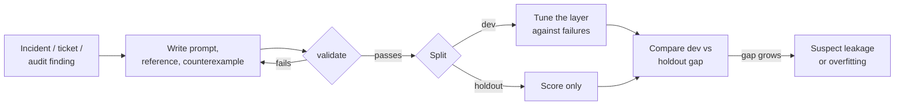

# 07.2 · Task datasets

## Why it matters

Every number the harness prints is an average over tasks. If the tasks are ambiguous, unrepresentative, mis-graded or already answered in the rules file, the number is precise and wrong.

This is not a hypothetical failure of amateurs. When OpenAI had 93 professional developers review samples of SWE-bench — the best-known coding-agent benchmark — they flagged 38.3% for underspecified problem statements and 61.1% for unit tests that could reject valid solutions; after review, 68.3% of the samples were filtered out, and the 500-task "Verified" subset was born. Separately, Liang et al. showed models could name the buggy file from the issue text alone up to 76% of the time on SWE-bench Verified, versus at most 53% on repositories outside the benchmark: a sign that some of the "skill" was memory.

Your task set has the same two enemies at a smaller scale: bad tasks, and tasks whose answers the system under test has already seen. Module 4's `tasks-v0` had no written reference answers and one grader that rejected a correct answer. This lesson turns it into `tasks-v1`, a dataset you can defend.

> [!NOTE]
> Content tags. **Concept** (stable): task anatomy, the three kinds of task, validity checks, holdout, contamination. **Implementation** (as of 2026-09): the `tasks.json` schema and `EvalHarness validate` / `leak`.

## How it works

### Anatomy of a task

| Field | Why it exists | T06 in `tasks-v1` |
|---|---|---|
| Prompt | the input, exactly as the agent gets it | "V004 has a bug … already merged and deployed. List the file paths …" |
| Environment | the state the agent starts from | Contoso Billing + your AI layer, fresh session |
| Grader | the pass criterion, as code | must match `V005__\w+\.sql`; must not mention `V004__due_not_null.sql` |
| Reference | a correct answer, written **before** the first run | `db/migrations/V005__fix_due_backfill.sql` + its `U005` |
| Counterexamples | wrong answers the grader must reject | `db/migrations/V004__due_not_null.sql` |
| Source | why this task exists | production incident: an edited `V###` never re-ran |
| Split | may you tune against it? | `dev` |
| Tags | how it is used | `golden`, `regression` |

Writing the reference first is the discipline that matters most. If you write the pass criterion after seeing agent answers, you will — without meaning to — write it around what the agent happened to say.

### Three kinds of task

- **Representative** tasks mirror the real mix of work: the questions developers ask, the tickets they get, in rough proportion. They make the average mean something.
- **Golden** tasks are few and non-negotiable: behavior that must never regress (never edit a merged migration, every `V###` has a `U###`, fix the code when a convention test fails). A golden task is checked individually, not averaged away (07.6).
- **Regression** tasks are born from failures. Every incident in your `NOTES.md` failure log ([05.4](../module-05/lesson-04.md)) and every transcript where the agent did something new and wrong becomes a task. Anthropic's guidance is to start with 20–50 simple tasks drawn from real failures rather than wait for a perfect suite.

Tags overlap: T06 is golden *and* regression.

### Validity: prove the task can tell right from wrong

A task is software. Test it:

- **Question tasks:** the grader must pass the reference and fail every counterexample. `EvalHarness validate` does this for all 19 regex tasks.
- **Code tasks:** the golden tests must **fail** on the unmodified repository (otherwise the task measures nothing) and **pass** with the reference solution (otherwise the task is impossible). SWE-bench calls these fail-to-pass tests. `validate --repo` copies the repository, runs the golden tests, overlays the reference fix and runs them again.
- **Rubric tasks:** the rubric names ground truth with paths, and the judge is calibrated against human labels (07.3).

Validation proves a grader accepts *one* right answer, not *every* right answer. T12's grader, for instance, fails "Issued (not Paid, Void or Draft)", which is correct. Only reading failing transcripts finds that class of false negative.

### Discrimination

A task every configuration always passes, or always fails, tells you nothing about a *difference* between configurations. In 07.1's one-run skill comparison, 16 of 20 tickets were equal and the decision rested on four. Keep easy golden tasks (they are regression guards), but make sure the representative set has tasks near the middle of the difficulty range for the systems you compare.

### Holdout: tune on dev, report on both

The moment you look at a failing task and change the layer to fix it, that task stops being a fair estimate of how the layer does on *unseen* work. So split:

- **dev** — you read the failures and change the layer against them.
- **holdout** — you run them and read only the score, never the transcripts, until a release.

`tasks-v1` keeps 8 of 24 tasks (33%) in holdout. The signal to watch is the **gap**: if dev climbs from 61% to 95% while holdout stays at 70%, the layer learned the tasks, not the codebase.



### Contamination and leakage

**Benchmark contamination**: a public benchmark's tasks or solutions were in the model's training data, so the score measures recall. For your purposes: never pick a model on a public leaderboard alone ([02.5](../module-02/lesson-05.md)), and prefer tasks from your own private code.

**Answer leakage into the AI layer** is the local version, and it is easy to do by accident. A task fails; someone adds a line to `AGENTS.md` that contains the task's question and its expected answer. The dev score rises. Nothing about the agent's ability to work on Contoso improved.

The line between leakage and a legitimate fix is whether the text is a **general fact with evidence** or **a copy of the test**:

| Legitimate | Leakage |
|---|---|
| "Never edit a `V###` script that is already merged; add a new one. (ev: `docs/history-excerpt.txt`)" | "V004 has a bug: the backfill should add 45 days. Answer: `V005__fix_due_backfill.sql`." |
| "Money is `decimal(19,4)`." | "If asked which column type is used for money, reply `decimal(19,4)`." |

`EvalHarness leak` flags copied prompt phrases (6-word shingles) and reference answers that sit next to them. It prints facts stated plainly as `info`, not as leaks: a fact the agent needs is supposed to be in the layer. The real test remains the holdout.

## Show me

`tasks-v0` fails validation, because it was a check, not a dataset:

```text
$ dotnet run --project tools/EvalHarness -- validate ../module-04/tasks-v0/tasks.json
ERROR T08: no reference answer (write the correct answer before the first run)
ERROR T09: no reference answer (write the correct answer before the first run)
ERROR T10: no reference answer (write the correct answer before the first run)
10 errors, 23 warnings
```

`tasks-v1`, with the code tasks checked against the real application:

```text
$ dotnet run --project tools/EvalHarness -- validate tasks-v1/tasks.json --repo ../module-03/brownfield
T18: unmodified repo fails the golden tests as expected (golden tests: 3/4 passed, 1 failed, 0 skipped)
T18: reference solution passes the golden tests (golden tests: 4/4 passed, 0 failed, 0 skipped)
T19: unmodified repo fails the golden tests as expected (build failed: error CS0246: The type or namespace name 'CollectionsSummary' could not be found ...)
T19: reference solution passes the golden tests (golden tests: 3/3 passed, 0 failed, 0 skipped)
T20: unmodified repo fails the golden tests as expected (build failed: error CS1061: 'InvoiceService' does not contain a definition for 'DaysOverdue' ...)
T20: reference solution passes the golden tests (golden tests: 5/5 passed, 0 failed, 0 skipped)

tasks-v1 (8c0dce2f34de): 24 tasks | dev 16, holdout 8 | qa/regex 19, code/tests 3, qa/judge 2
tags: golden 4, regression 7, representative 18
0 errors, 0 warnings
```

Note T18's baseline: three of the four golden tests already pass on the unmodified code. Only the boundary test (`Due_exactly_now_is_overdue`) fails. That is correct — the other three pin behavior the fix must *not* break — and it is why the task is graded on all four passing, not on "something changed".

## Try it

Budget: 60 minutes, in `agent-evals`.

1. Run `validate` on `tasks-v0` and on `tasks-v1` (with `--repo`). Read `tasks-v1/README.md`, the dataset card.
2. Add **four tasks of your own** to a copy of `tasks.json`, from your Module 5 `NOTES.md` or Module 6 skill failures ([06.4](../module-06/lesson-04.md)): two regression question tasks, one holdout task, and one code task with a golden test and a reference overlay (copy the T18 folder layout). Write each reference answer and counterexample *before* you run anything.
3. `validate --repo` until it reports 0 errors. At least once, it should catch a grader you got wrong — note which.
4. Fill in the [evaluation dataset template](../../templates/evaluation-dataset.md) for your 28 tasks and commit it as `tasks/README.md`.
5. Own repository (private): draft ten tasks from real tickets and incidents; do not run them yet.

<details>
<summary>Hint: writing a counterexample that actually tests the grader</summary>

Use the *plausible* wrong answer, not a silly one: the stale convention (`SqlHelper`, `DateTime.Now`, `Billing.sln`), the answer that edits the merged file, the right symbol in the wrong sentence. If your grader rejects "banana" but passes `DateTimeOffset.UtcNow`, the counterexample did not test anything.
</details>

## Break it

> [!CAUTION]
> Working copy only. This break plants an answer key in the rules file.

The T04, T06 and T09 failures annoy a teammate, so they append `labs/module-07/breaks/eval-hints-section.md` to `AGENTS.md` in the working copy: "Eval hints (added after the tasks-v1 run to fix the failing ones)". The lint from Module 3 is clean; every line is technically true.

Run the dev tasks and the holdout tasks, 3 trials each, before and after the change (or, offline, go straight to Fix it). Predict: which split moves, and by how much?

## Fix it

**Diagnose.**

1. *Symptom:* expect the dev pass rate to jump — the leaked tasks (T01, T04, T06, T09, T10, T11) head for 3/3 — while holdout does not move. The dev–holdout gap opens.
2. *Locate:* `EvalHarness leak tasks-v1/tasks.json <working-copy>`:

   ```text
   LEAK  T01: 62% of the prompt's 6-word phrases appear in AGENTS.md, together with the reference answer
   LEAK  T04: 32% of the prompt's 6-word phrases appear in AGENTS.md
   LEAK  T06: 48% of the prompt's 6-word phrases appear in AGENTS.md
   LEAK  T09: the reference answer sits next to phrases from the prompt in AGENTS.md
   LEAK  T10: 39% of the prompt's 6-word phrases appear in AGENTS.md, together with the reference answer
   LEAK  T11: 53% of the prompt's 6-word phrases appear in AGENTS.md, together with the reference answer
   6 leak(s): the eval now partly measures whether the agent can read its own answer key
   ```

3. *Classify:* evaluation failure, not agent failure — the instrument now measures reading, not knowing.

**Modify.** Delete the section. For each task it tried to fix, ask whether a *general* fact was missing; if so, write it as a fact with evidence (the reference `AGENTS.md` in `labs/module-04/solution/` already states F4, F6 and F9 that way). Add two rules to `CHARTER.md`: AI-layer PRs that mention a task id or copy a prompt are rejected in review, and `leak` runs in CI next to `validate`.

**Rerun.** `leak` reports 0 leaks (the remaining `info` lines are facts the agent needs). Dev and holdout, 3 trials: the gap is back to its pre-break size.

<details>
<summary>Solution notes</summary>

The leak check only sees copied text. A teammate who *paraphrases* the answer key defeats it; the holdout does not care how the key was written. That is why the holdout is the primary defense and `leak` a cheap early warning. If a holdout task ever has to be looked at (to fix a broken grader, say), move it to dev and write a fresh holdout task.
</details>

## How do I know it works?

- [ ] `validate --repo` reports 0 errors for your 28-task set; every regex task has a reference and at least one realistic counterexample.
- [ ] Each of your code tasks' golden tests fails on the unmodified repository and passes with the reference.
- [ ] At least 20% of tasks are holdout, and you have a written rule for when a holdout task may be looked at.
- [ ] `leak` reports 0 leaks on your AI layer, and the break's dev/holdout numbers are written in your notes.
- [ ] The dataset card names a source for every task.

## Use / don't use

**Use** representative + golden + regression tags from the first day; they cost nothing and decide how the gate treats each task later. **Use** incidents as your main source of new tasks: they are, by definition, the failures that happen. **Use** holdout whenever the same people tune the layer and run the eval.

**Don't** write tasks from the rules file ("the rules say X; does the agent say X?") — that tests reading, and it will pass even when the rule is wrong. **Don't** import a public benchmark as your regression suite: its tasks may be in training data and are not about your codebase. **Don't** grow the set without pruning: a task that no configuration has failed in six months belongs in a cheaper monthly run.

**Limitations.**

- Short question tasks measure whether facts are known, not whether long tickets get done. Keep adding code tasks as they become cheap to grade.
- Validation proves a grader against the answers you imagined, not all answers.
- A 24-task set is a regression guard for one codebase. It says nothing about other repositories.

## Reflect

1. Which task in your set would you be most embarrassed to see a client read, and why?
2. What is the most recent incident in your team that is not yet a regression task?
3. Where in your own AI layer might an answer key already be hiding?

## Sources

- [Anthropic Engineering — Demystifying evals for AI agents](https://www.anthropic.com/engineering/demystifying-evals-for-ai-agents) — start with 20–50 tasks drawn from real failures; capability tasks graduate to regression suites; failures should look fair.
- [Jimenez et al. (2024) — SWE-bench](https://arxiv.org/abs/2310.06770) — real GitHub issues graded by tests that fail before and pass after the reference patch.
- [OpenAI — Introducing SWE-bench Verified](https://openai.com/index/introducing-swe-bench-verified/) — human review flagged 38.3% of samples as underspecified and 61.1% for unit tests that may reject valid solutions; 500 verified samples remained.
- [Liang et al. (2025) — The SWE-Bench Illusion](https://arxiv.org/abs/2506.12286) — file-path identification from issue text alone up to 76% on SWE-bench Verified vs up to 53% on other repositories, pointing to memorization or contamination.
