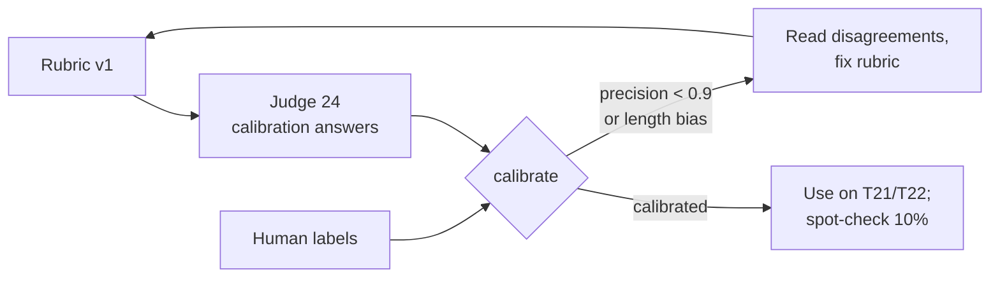

# 07.3 · Graders: deterministic checks, rubrics, humans and LLM judges

## Why it matters

A grader is a classifier. It looks at a trial and says pass or fail, and like every classifier it is sometimes wrong. Its mistakes do not show up as errors; they show up as your pass rate.

You have met both kinds of mistake already. In Module 4, T02's regex failed a correct answer (a **false negative**) and the lesson warned that a regex can pass a wrong sentence that name-drops the right symbol (a **false positive**). Now add open-ended tasks — an onboarding explanation, a review comment — and the tempting grader is another model: an **LLM judge**. Judges are flexible and cheap to write. They also prefer longer answers, the first of two answers shown, and answers that sound like themselves. A judge that nobody has checked against human labels is an opinion with a decimal point.

This lesson ranks the grader types, measures a grader's error rate as precision and recall, shows how that error distorts every score you report, and calibrates a judge until its "pass" can be trusted.

> [!NOTE]
> Content tags. **Concept** (stable): the grader hierarchy, grader error as precision/recall, the observed-rate correction, judge biases and calibration. **Implementation** (as of 2026-09): `EvalHarness judge` and `calibrate`, Claude Code as the judge runtime.

## How it works

### The grader hierarchy

Pick the first one that can grade the task fairly:

| Grader | Checks | Strength | Weakness | Contoso examples |
|---|---|---|---|---|
| **Outcome check** | state of the environment: tests, build, files changed | objective, cheap, reproducible | only exists when correctness is testable | T18–T20: golden tests + scope |
| **Deterministic text check** | regex, exact match, parse | cheap, reproducible | brittle to valid wording | T01–T17, T23, T24 |
| **Rubric + LLM judge** | criteria applied by a model | handles open answers, scales | non-deterministic, biased, needs calibration | T21, T22 |
| **Human** | expert reading | the reference standard | slow, expensive, tires | calibration labels, holdout spot checks |

Anthropic's guide describes the same three families — code-based, model-based, human — and the same trade-off: code is fast and objective but brittle; models are flexible but need calibration; humans are the gold standard and the most expensive. The rule that follows: **grade outcomes, not words, whenever you can.** Whether the agent *said* "V005" is a proxy; whether the golden tests pass is the thing.

### Known LLM-judge biases

- **Verbosity**: longer answers get higher scores. Zheng et al. (2023) documented it for GPT-4-class judges; Dubois et al. (2024) showed length bias strong enough on AlpacaEval that controlling for length raised its correlation with human preference rankings (Chatbot Arena) from 0.94 to 0.98.
- **Position**: in pairwise judging, the answer shown first (or second) wins too often. Wang et al. (2023) made a weaker model "beat" a stronger one on 66 of 80 queries by swapping the order.
- **Self-enhancement**: a judge may favor answers from its own model family (Zheng et al.).

The same papers report that a strong judge can agree with humans over 80% of the time — about as often as humans agree with each other. So judges are usable. They are not usable *unchecked*.

### Grader error as precision and recall

*Intuition.* Compare the grader with a human on the same answers. Every answer lands in one of four cells.

|  | Human: pass | Human: fail |
|---|---|---|
| **Grader: pass** | TP | FP (false positive) |
| **Grader: fail** | FN (false negative) | TN |

*Equations.*

$$\text{precision} = \frac{TP}{TP+FP} \qquad \text{recall (TPR)} = \frac{TP}{TP+FN} \qquad \text{FPR} = \frac{FP}{FP+TN}$$

Precision answers "when the grader says pass, how often is it right?". Recall answers "of the good answers, how many does it let through?". FPR is "of the bad answers, how many slip through?".

Now the part that matters for every number you will report. If the true pass rate is $p$, the grader's observed pass rate is

$$q = \text{TPR}\cdot p + \text{FPR}\cdot(1-p) \quad\Longrightarrow\quad p = \frac{q - \text{FPR}}{\text{TPR} - \text{FPR}}$$

*Tiny example.* Judge v1 on the calibration set below: TPR = 0.583, FPR = 0.500. A system that truly passes 80% gets $q = 0.583 \times 0.8 + 0.5 \times 0.2 = 0.57$. A system that truly passes 30% gets $q = 0.583 \times 0.3 + 0.5 \times 0.7 = 0.53$. The judge reports 57% and 53% for systems that differ by fifty points. Judge v2 (TPR = 0.917, FPR = 0.083): the same two systems score 75% and 33%.

*Implementation.* `EvalHarness calibrate human-labels.csv verdicts.csv` prints the matrix, the three rates, Cohen's kappa (agreement beyond chance) and the correction formula with your grader's numbers.

*Interpretation.* The denominator $\text{TPR} - \text{FPR}$ is how much signal the grader carries. When it approaches 0, every system scores about the same and no comparison can detect anything — the grader, not the agent, has become the bottleneck. Notice too that v1's *aggregate* bias on the calibration set is only +4 points (54% vs 50%): a grader can get the average right while being nearly random on each answer. That is why you check the matrix, not the average.

### Designing a judge that can be calibrated

- **Ground truth in the rubric**, with paths: the judge grades against the repository's facts, not its own taste.
- **Binary criteria**, each answerable yes/no, then a fixed verdict line the harness parses (`VERDICT: PASS|FAIL`).
- **Say what is not a criterion**: length, tone, formatting, confidence.
- **Isolate the judge**: `EvalHarness judge` runs it in an empty folder so no `CLAUDE.md` or code reaches it; pin its model.
- **Pairwise judging**: judge both orders; count disagreements as ties.
- **Calibrate** on 20–50 human-labelled answers (half right, half wrong, with long wrong ones and short right ones on purpose), and recalibrate when the judge model, prompt or task changes.



[Simulation: Evaluation — a biased judge distorts A vs B](../../simulations/evaluation/index.html?preset=biased-judge)

## Show me

The calibration set in `labs/module-07/calibration/`: 24 answers to T21 ("why does `SqlHelper` still exist, and what should I use instead?"), 12 labelled pass and 12 fail. The wrong ones include fluent, five-sentence answers that recommend EF Core, allow new `SqlHelper` calls "for reports", or invent ticket BILL-79. The verdict files are **illustrative**, hand-written to show the typical pattern.

Judge v1 — "a high-quality answer is thorough, detailed, well-explained":

```text
$ dotnet run --project tools/EvalHarness -- calibrate calibration/human-labels.csv calibration/illustrative-judge-v1.csv --answers calibration/answers
| grader pass    | TP   7     | FP   6     |
| grader fail    | FN   5     | TN   6     |
precision TP/(TP+FP) = 0.538   how far to trust a "pass"
recall    TP/(TP+FN) = 0.583   share of good answers it lets through
accuracy 0.542 | Cohen's kappa 0.083 (agreement beyond chance)
length check (median 432 chars): grader passes
  wrong answers: long 6/6 vs short 0/6
  right answers: long 6/6 vs short 1/6
  LENGTH BIAS: at equal human labels, long answers pass 92 points more often than short ones.
NOT CALIBRATED: needs precision >= 0.9 and recall >= 0.8.
```

Judge v2 — the rubric in `tasks-v1/graders/rubric-T21.md` (four binary criteria, ground truth, "length is not a criterion"):

```text
| grader pass    | TP  11     | FP   1     |
| grader fail    | FN   1     | TN  11     |
precision 0.917 | recall 0.917 | kappa 0.833
  wrong answers: long 1/6 vs short 0/6
  right answers: long 6/6 vs short 5/6
CALIBRATED: needs precision >= 0.9 and recall >= 0.8.
```

The two remaining errors are worth reading. C08 (false positive) is fluent and mostly right but invents "BILL-79" and a Q3 removal date — criterion C4 needs the judge to know the real ticket, which the rubric states. C15 (false negative) says "one old report still needs it", which the human accepted and the judge did not: the rubric's C1 wording is ambiguous. Both are rubric fixes, not model fixes.

## Try it

Budget: 75 minutes. Steps 1–2 and 5 are offline.

1. Label the 24 answers yourself in a new CSV (`file,label,note`) **before** opening `human-labels.csv`. Then compare: every disagreement is either your mistake or an ambiguity in the rubric. Write one line for each.
2. Run `calibrate` with your labels against both illustrative verdict files.
3. With an agent: run both judges for real and calibrate them:

   ```bash
   H="dotnet run --project tools/EvalHarness --"
   $H judge tasks-v1/graders/judge-v1.md calibration/answers --out my-v1.csv
   $H judge tasks-v1/graders/rubric-T21.md calibration/answers --out my-v2.csv
   $H calibrate calibration/human-labels.csv my-v2.csv --answers calibration/answers
   ```

   Run the v2 judge a second time into another file. How many verdicts flipped? That is your judge's own trial-to-trial noise.
4. Improve the rubric until C15 passes and C08 fails, without breaking the others. Recalibrate.
5. Fill in the [evaluation rubric template](../../templates/evaluation-rubric.md) as `graders/calibration.md`: rubric, matrix, targets, decision.

<details>
<summary>Hint: judge verdicts come back as "error"</summary>

The harness takes the last line matching `VERDICT: PASS|FAIL`. If the judge wraps it in Markdown (`**VERDICT: PASS**`) the regex still matches; if it answers with a score ("8/10") it does not. Make the output format the last paragraph of the rubric and include the exact line to print.
</details>

## Break it

You inherit `tasks-v1/graders/judge-v1.md` from a teammate who wrote it in five minutes. It has been grading T21 in CI for a month, and the T21 pass rate went *up* after a skill change that made every answer longer. Nobody has calibrated it.

Before running anything: what do you expect the judge's pass rate to be on long wrong answers, and what would that do to a comparison between a terse skill and a verbose one?

## Fix it

**Diagnose.**

1. *Symptom:* T21 pass rate rose after a change that only made answers longer.
2. *Measure:* `calibrate` against the human labels: precision 0.54, kappa 0.08, long answers pass 92 points more often than short ones at equal human label. The grader is close to a length detector.
3. *Consequence:* with TPR − FPR = 0.08, any two skills compared on T21 score within a few points of each other *unless* one writes longer answers. The "improvement" was verbosity.

**Modify.** Replace the prompt with the rubric (ground truth, binary criteria, "length is not a criterion", fixed verdict line). Add a rule to `CHARTER.md`: no judge grades a task until `calibrate` reports precision ≥ 0.9 and recall ≥ 0.8 on at least 20 labelled answers, and every judge change is recalibrated.

**Rerun.** Calibrate v2: precision and recall 0.92, no length bias. Re-grade the last month's T21 transcripts with v2 and write the corrected numbers in the changelog next to the old ones.

<details>
<summary>Solution notes</summary>

Judge v1 is not "a bad model"; it is a good model asked the wrong question. "Thorough, detailed, anticipates follow-up questions" *defines* quality as length. Most judge bias you will meet in client work is prompt design, and most of it is visible in 24 labelled answers.
</details>

## How do I know it works?

- [ ] You have labelled all 24 answers yourself and explained every disagreement with `human-labels.csv`.
- [ ] Your judge for T21 reaches precision ≥ 0.9 and recall ≥ 0.8 and shows no length bias, and you know its trial-to-trial flip count.
- [ ] You can compute, for your judge's TPR and FPR, the observed score of a system whose true pass rate is 50%.
- [ ] `graders/calibration.md` is committed with the matrix, the date, the judge model and the recalibration triggers.

## Use / don't use

**Use** outcome checks first: tests, build, files changed. **Use** regex for short factual answers, with counterexamples. **Use** an LLM judge only for open answers no code can grade, only with a rubric tied to ground truth, and only after calibration. **Use** humans to label the calibration set and to spot-check about 10% of judge verdicts every release.

**Don't** let a judge grade an answer from its own prompt family without checking self-preference on your calibration set. **Don't** use Likert scores (1–10) as gates: binary criteria are easier to calibrate and to read. **Don't** trust an average: a grader can match the human pass rate while disagreeing on half the answers.

**Limitations.**

- 24 labels estimate precision roughly: 11/12 has a 95% interval of about 65–99% (07.4). Grow the set for gates that matter.
- Human labels are not ground truth either; two humans disagree too. Label a subset twice.
- A judge's behaviour changes when its model changes. Recalibrate on every judge-model upgrade.

## Reflect

1. Which grader in your own set are you trusting without ever having counted its false positives?
2. Where does "longer looks better" already influence reviews in your team — human or AI?
3. What would a client need to see before believing a number graded by a model?

## Sources

- [Zheng et al. (2023) — Judging LLM-as-a-Judge](https://arxiv.org/abs/2306.05685) — position, verbosity and self-enhancement biases; strong judges reach over 80% agreement with humans, similar to human–human agreement.
- [Dubois et al. (2024) — Length-Controlled AlpacaEval](https://arxiv.org/abs/2404.04475) — length bias in automatic evaluators; length control raises Spearman correlation with Chatbot Arena from 0.94 to 0.98.
- [Wang et al. (2023) — Large Language Models are not Fair Evaluators](https://arxiv.org/abs/2305.17926) — position bias: Vicuna-13B "beats" ChatGPT on 66 of 80 queries by reordering; balanced-position calibration.
- [Anthropic Engineering — Demystifying evals for AI agents](https://www.anthropic.com/engineering/demystifying-evals-for-ai-agents) — code-based, model-based and human graders and their trade-offs; model graders need calibration; read transcripts and grades.
