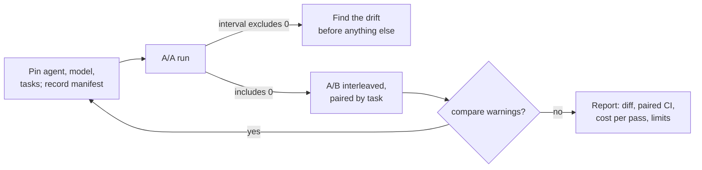

# 07.5 · Comparisons and paired designs

## Why it matters

Almost every question you will be paid to answer about an agent system has the shape "A or B?". Is the new model worth it? Did the rules rewrite help? Is skill v2 better than v1? Is the reduced context layer as good as the bloated one?

Most comparisons you will see in the wild change more than one thing: B ran on a different day, after the agent auto-updated, on a slightly different task list, with a new model snapshot behind the same alias. The difference they report is the sum of all of those, and nobody can say how much belongs to the treatment.

This lesson is the design that prevents that — hold everything else fixed, pair by task, interleave, check with an A/A run — and it is the module's project: you re-score the Module 4 context reduction ([04.5](../module-04/lesson-05.md)), which you could then only call "held" or "clearly improved", as a proper comparison report.

> [!NOTE]
> Content tags. **Concept** (stable): one treatment at a time, paired differences, interleaving, A/A checks. **Implementation** (as of 2026-09): Claude Code version pinning and auto-update settings, `--model`, `EvalHarness compare` and its manifest checks.

## How it works

### One treatment, everything else pinned

| Comparison | Treatment | Must be identical in both arms |
|---|---|---|
| Model A vs B | `--model` | agent version, AI layer, tasks, trials, time window |
| Rules / context A vs B | the working copy's AI layer | agent version, model, tasks, trials |
| Skill v1 vs v2 | the skill file | everything else in the layer, agent, model, tasks |
| Agent version | the CLI version | layer, model, tasks |

Three things drift silently and must be pinned and recorded:

- **The agent.** Claude Code's native installer updates itself in the background; a comparison whose arms run a day apart can run on two different agents. Install a specific version for the experiment and set `DISABLE_AUTOUPDATER=1` while it runs (the setup docs describe both).
- **The model.** Pass an explicit `--model` for model comparisons and record it; an alias can move to a new snapshot.
- **The task set.** Any edit to a prompt or grader makes a new version. The harness hashes `tasks.json` into every result row.

`EvalHarness run` writes all of this to `manifest.json` (tasks hash, AI-layer hash, agent version, model, seed), `grade` copies it into every row of `results.csv`, and `compare` warns — `gate` refuses — when anything but the treatment differs.

Do **not** use `claude --bare` for rules or context comparisons: bare mode skips `CLAUDE.md`, hooks and skills, which removes the very thing you are testing. It is useful as a deliberate "no layer" baseline arm.

### Interleave

Run the arms in alternating rounds, not one after the other. Because `run` is resumable, a loop does it: each call adds only the missing trial.

```bash
for k in 1 2 3 4 5; do
  $H run tasks-v1/tasks.json --repo ~/m7-bloated --out runs/bloated --trials $k
  $H run tasks-v1/tasks.json --repo ~/m7-reduced --out runs/reduced --trials $k
done
```

Within each round the harness shuffles task order. Slow drift (provider load, rate limits, time of day) now spreads over both arms instead of landing on one.

### Pair by task

*Intuition.* Tasks differ far more from each other than the two arms do. T15 ("which C# type holds money?") passes almost always; T06 depends on a fact that may or may not be loaded. If you compare the two arms' overall averages, that task-to-task variation sits in both averages as noise. If you compare *each task with itself* across arms, it cancels.

*Equation.* For each of $T$ tasks, $d_i = \hat p_{B,i} - \hat p_{A,i}$. Then

$$\bar d = \frac{1}{T}\sum d_i \qquad \text{SE} = \frac{s_d}{\sqrt T} \qquad \text{CI}_{95} = \bar d \pm t_{T-1}\,\text{SE}$$

and the reason it helps: $\operatorname{Var}(A - B) = \operatorname{Var}(A) + \operatorname{Var}(B) - 2\operatorname{Cov}(A,B)$. When a hard task is hard in both arms, the covariance is large and positive, and it is subtracted.

*Tiny example.* The illustrative skill comparison from 07.1, 20 tickets × 5 trials: v2 − v1 = −1.0 point. Unpaired by task, the 95% interval is −19.7 to +17.7 points. Paired by task: **−11.3 to +9.3 points**, about half the width from the same data.

*Implementation.* `EvalHarness compare results.csv --a A --b B` prints the per-task table, the paired interval, and two contrasts (unpaired by task; naive per trial).

*Interpretation.* Pairing is free: you were going to run the same tasks anyway. It only helps when difficulty is shared across arms, and it only works if both arms ran the same tasks — a task missing from one arm is dropped from the analysis, with a warning.

### A/A: test the instrument

Run arm A twice, as two configurations. The paired interval should contain 0. If it does not, something other than your treatment moves results between runs (drift, caching, a flaky grader), and no A/B result from this setup can be trusted until you find it.



[Simulation: Evaluation — paired vs unpaired comparison](../../simulations/evaluation/index.html?preset=paired)

## Show me

The Module 4 reduction re-scored on tasks-v1, 24 tasks × 5 trials per arm (illustrative data in `samples/context-reduction/`):

```text
$ dotnet run --project tools/EvalHarness -- compare samples/context-reduction/results.csv --a bloated --b reduced
24 paired tasks: reduced better on 16, worse on 3, equal on 5
pass rate bloated 64% (120 trials) -> reduced 86% (120 trials)
paired (by task):   diff +21.7 pts, SE 0.055, 95% CI [+10.3 pts, +33.0 pts]
unpaired by task:   diff +21.7 pts, 95% CI [+9.6 pts, +33.7 pts]  (ignores that both arms ran the same tasks)
naive per trial:    diff +21.7 pts, 95% CI [+11.1 pts, +32.3 pts]  (treats every trial as independent)
cost bloated: $0.0636/trial, $0.0991 per passing trial, mean input tokens 44,514
cost reduced: $0.0516/trial, $0.0601 per passing trial, mean input tokens 36,114

verdict: reduced is better: the 95% paired interval excludes 0
```

And the A/A check, the bloated layer run twice:

```text
$ dotnet run --project tools/EvalHarness -- compare samples/context-reduction/results.csv --a bloated --b bloated-aa
verdict: no detectable difference at this sample size: the interval [-8.0 pts, +14.6 pts] includes 0
```

Two readings. The effect is large enough that the design choice barely matters here: pairing helps most when the effect is small relative to task variation, as in the skill example. And the sentence you can now write is: "On 24 tasks × 5 trials, the reduced layer passes 22 points more often (95% CI +10 to +33) at 39% lower cost per passing trial." In Module 4 you could only say "clearly improved".

## Try it

> [!WARNING]
> This project runs about 240 headless sessions plus judge calls. Run a 1-trial pass first and read the cost line from `stats` before committing to 5 trials.

Budget: about 2.5 hours, mostly waiting.

1. **Pin.** Install one Claude Code version for the whole experiment and set `DISABLE_AUTOUPDATER=1` in the shell you run from. Record `claude --version`.
2. **Two working copies**, identical except the layer: `~/m7-bloated` (Contoso + `labs/module-04/bloated/`) and `~/m7-reduced` (Contoso + your reduced layer from 04.5, or `labs/module-04/solution/`).
3. **A/A first:** 2 interleaved rounds of the reduced copy into `runs/aa-1` and `runs/aa-2`; grade; `compare`. The interval must include 0 before you continue.
4. **A/B:** the interleaved loop above, 5 rounds. Judge T21 and T22 in both arms with your calibrated rubric from 07.3; grade both arms into one `results.csv`.
5. **Compare** and read every warning. Then read the transcripts of the three tasks with the largest moves in each direction.
6. **Report.** Fill in the [benchmark template](../../templates/benchmark.md) as `agent-evals/reports/context-reduction.md`: treatment, pinned versions, A/A result, paired interval, holdout vs dev, cost per passing trial, and limitations. Commit `results.csv` and both `manifest.json` files.

<details>
<summary>Hint: a task shows up in only one arm</summary>

A trial file is missing, usually because the agent timed out or you stopped a run. Rerun the same `run` command: it fills only the gaps. Never delete a task from one arm to "make it fair" — a timeout is a failure of that configuration and belongs in its score (the run file records `is_error`, which grades as a fail).
</details>

## Break it

The teammate who ran the bloated arm last week runs the reduced arm today to "finish the comparison". Overnight, the agent auto-updated. The three code tasks kept timing out, so they "skipped them to save time". The data is config `reduced-later` in `samples/context-reduction/results.csv`.

Predict: will the reported improvement be larger or smaller than the +21.7 points above, and which two warnings should `compare` print?

## Fix it

**Diagnose.**

```text
$ dotnet run --project tools/EvalHarness -- compare samples/context-reduction/results.csv --a bloated --b reduced-later
WARN  agent_version differs between arms: bloated=illustrative-agent 1.0, reduced-later=illustrative-agent 1.1. Anything but the treatment must be equal.
WARN  tasks in only one arm were left out of the paired analysis: T18, T19, T20
paired (by task):   diff +28.6 pts, SE 0.059, 95% CI [+16.2 pts, +41.0 pts]
```

1. *Symptom:* the effect grew from +21.7 to +28.6 points.
2. *Two confounds:* a different agent version (its own effect is unknown and mixed into the treatment), and the three hardest tasks dropped from one arm (the paired analysis drops them from both, so the comparison now covers only the easier 21 tasks, and B's headline rate rises to 92%).
3. *Verdict:* the number is uninterpretable, even though its interval "excludes 0".

**Modify.** Pin the agent version for both arms, rerun them interleaved on the same day, and treat timeouts as failures rather than skips. Add a rule to `CHARTER.md`: a comparison with a `compare` warning is not reported. The gate in 07.6 enforces the same rule automatically.

**Rerun.** The interleaved, pinned run is the `bloated` vs `reduced` comparison in Show me. If you want to know what the agent update did on its own, that is a *separate* A/B with the layer fixed and the version as the treatment.

<details>
<summary>Solution notes</summary>

The warnings come from the manifest, not from statistics: no interval can detect that the arms differ in more than the treatment. That is why the harness records versions and hashes on every row, and why "which version were you on?" is the first question to ask of any comparison someone shows you — a vendor's included.
</details>

## How do I know it works?

- [ ] Your A/A interval includes 0, and it is written in the report.
- [ ] `compare` on your A/B prints no warnings; both manifests show the same agent version, model and tasks hash.
- [ ] Every task appears in both arms with the same number of trials.
- [ ] `reports/context-reduction.md` states the paired difference with its interval, dev and holdout separately, cost per passing trial, and at least three limitations.

## Use / don't use

**Use** paired, interleaved designs for every A/B on a fixed task set: model, rules, context, skill, agent version. **Use** an A/A run whenever the setup is new or something changed in the harness. **Use** cost per passing trial next to pass rate; the cheaper arm is often the better one even at equal pass rate.

**Don't** compare against numbers someone ran last month on another agent version. **Don't** change two things and attribute the result to one. **Don't** read an interval before reading the warnings.

**Limitations.**

- Paired designs need the same tasks in both arms. When a treatment changes what a task means (a new tool, a different repository), you are back to an unpaired design with wider intervals.
- An A/A that includes 0 is necessary, not sufficient: it cannot detect a drift that happens to hit both runs equally.
- A result holds for this model, this agent version and this task set. The report must say so; the next upgrade is a new comparison.

## Reflect

1. Which comparison you have seen (or made) changed more than one thing at once?
2. What is the smallest improvement your current task set could detect with the budget you have?
3. How would you explain "paired by task" to a manager in one sentence?

## Sources

- [Miller (2024) — Adding Error Bars to Evals](https://arxiv.org/abs/2411.00640) — paired differences between models on the same questions reduce variance; report intervals; power analysis.
- [Claude Code docs — Advanced setup](https://code.claude.com/docs/en/setup) — native installations auto-update in the background; install a specific version; `DISABLE_AUTOUPDATER` and release channels (as of 2026-09).
- [Claude Code docs — Run Claude Code programmatically](https://code.claude.com/docs/en/headless) — `claude -p`, `--output-format json`; `--bare` skips hooks, skills and CLAUDE.md (as of 2026-09).
- [Anthropic Engineering — Demystifying evals for AI agents](https://www.anthropic.com/engineering/demystifying-evals-for-ai-agents) — the evaluation harness vs the agent harness: both are part of what a result depends on.
