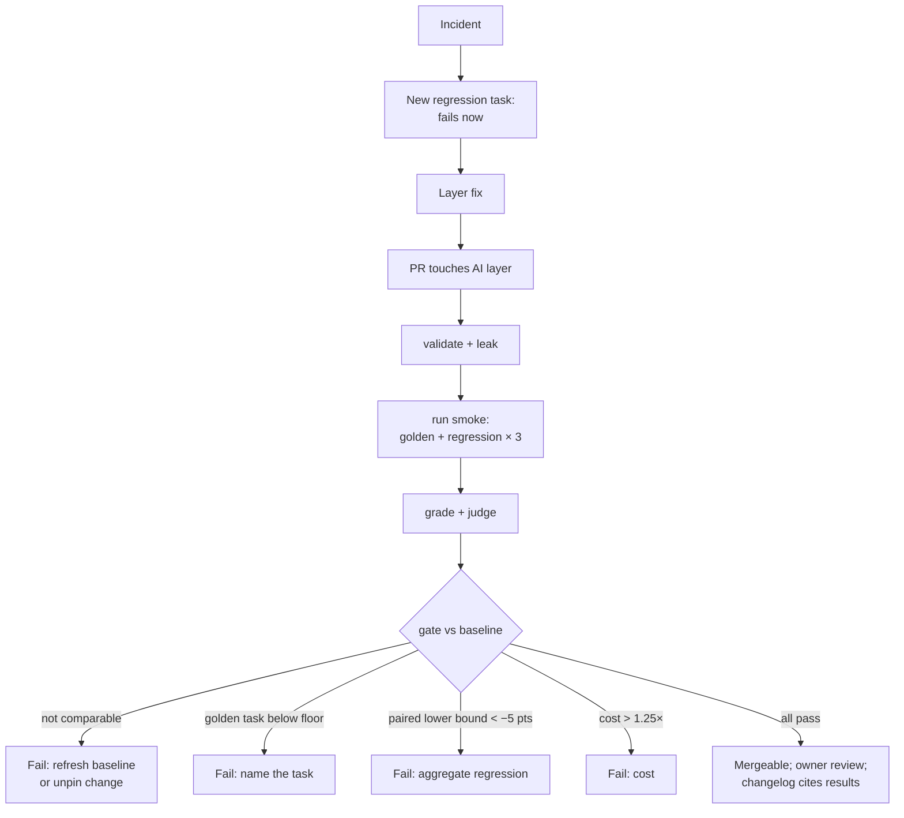

# 07.6 · Evals in the loop

## Why it matters

An eval that runs when someone remembers is an experiment. An eval that runs on every change and can block a merge is a **gate** — the same step Module 5 took for build and tests ([05.3](../module-05/lesson-03.md)), now applied to the files that steer the agent.

Module 3 made the AI layer a citizen of the repository: owned, reviewed, changelogged ([03.1](../module-03/lesson-01.md)). What it could not give you was evidence in the review: the reviewer of a rules change had to guess whether it helped. With the harness, the pull request carries the answer — and the gate decides whether the answer is good enough.

It also closes the loop that the career path this course grew from calls "system evolution": when the agent gets something wrong, someone updates the layer, reviewed by someone, and the mistake becomes a test so it cannot quietly come back.

> [!NOTE]
> Content tags. **Concept** (stable): gate policy, per-task floors vs averages, smoke vs full runs, incidents → regression tasks, baseline management. **Implementation** (as of 2026-09): GitHub Actions syntax, Claude Code install and auto-update settings, `EvalHarness gate`.

## How it works

### When evals run

| Trigger | Suite | Trials | Purpose |
|---|---|---|---|
| PR touching `AGENTS.md`, `CLAUDE.md`, `.claude/**`, `docs/ai/**`, `.mcp.json` | smoke: `golden` + `regression` tags (9 tasks in tasks-v1) | 3 | block a change that breaks a known behavior |
| Nightly, and on demand | full: all 24 tasks | 5 | detect drift you did not cause (provider-side changes) and refresh the baseline |
| Agent-version or model bump | full, as an A/B (07.5) | 5 | decide the upgrade; refresh the baseline in the same PR |
| Every incident | the new regression task, alone | 3 | confirm it fails before the fix and passes after |

### The gate policy

`EvalHarness gate results.csv --baseline baseline --candidate candidate` applies four checks. All must pass.

1. **Comparable.** Same agent version, model and task-set hash in both arms; otherwise the gate fails "not comparable" (07.5). A version bump therefore *must* come with a refreshed baseline.
2. **Golden floors, per task.** Every golden task in the candidate passes at least 80% of its trials and loses at most one pass against the baseline (`--golden-min 0.8 --golden-drop 1`).
3. **Aggregate.** The lower bound of the paired 95% interval is above −5 points (`--margin 0.05`): no evidence of a meaningful overall regression.
4. **Cost.** Mean cost per trial rises no more than 25% (`--max-cost-ratio 1.25`).

Why check golden tasks one by one? *Intuition:* an average over 24 tasks is a vote, and one task collapsing is one vote. *Equation:* a task going from 100% to 0% moves the mean of task rates by $-1/T$. *Tiny example:* with $T = 24$, that is $-4.2$ points, while the paired interval on 24 tasks × 5 trials is typically ±10 points or more. If the change also nudges a few other tasks up, the mean *rises*. *Interpretation:* no aggregate threshold can see a single-task collapse; only a per-task floor can.



### Incident → regression task → fix

The order matters. When the agent does something new and wrong:

1. Write the task from the incident (07.2): prompt, reference, counterexample, `regression` tag, `golden` if it must never recur.
2. Run it against the *current* layer and watch it **fail**. A regression task that passes before the fix does not test the fix.
3. Change the layer; run the task and the smoke suite; the gate must pass.
4. The `AI-LAYER-CHANGELOG.md` entry names the incident, the task id, and the before/after numbers.

### Running agents in CI safely and affordably

- **Pin the agent.** Install a specific version and set `DISABLE_AUTOUPDATER=1` for the job; bumping the version is a reviewed change with a refreshed baseline.
- **Trust.** A `claude -p` session runs the hooks in the project's `.claude/settings.json` and connects the servers in its `.mcp.json`, even in a folder you never trusted, with no trust dialog. An eval job on a pull request therefore executes whatever hooks the PR's author wrote, with your API key in the environment. Run the eval job only for branches of your own repository (GitHub does not pass secrets to workflows triggered from forks by default), keep `permissions: contents: read`, and treat the evals workflow itself as CODEOWNERS-protected. Module 9 goes further.
- **Cost.** Estimate from your own `stats` output: at an illustrative \$0.05 per trial, 9 tasks × 3 trials is about \$1.35 per PR and 24 × 5 is about \$6 per night. Use `concurrency` to cancel superseded runs.
- **Flakiness.** A gate that fails on noise gets bypassed. Measure it: gate an A/A pair (the same configuration twice) several times; it should pass nearly always. If it does not, add trials to the smoke run or widen the margin — and write down which.

The course workflow is `labs/module-07/ci/agent-evals.yml`: paths filter, nightly `schedule`, `workflow_dispatch`, pinned install, `validate`, `run`, `judge`, `grade`, `stats` into the job summary, `gate`, and the run folders uploaded as an artifact.

## Show me

`layer-v1.4` adds a topology map that helps many tasks. Its author also "tidied" `AGENTS.md` and deleted the merged-migration line. Illustrative data in `samples/gate/results.csv`. An aggregate-only gate:

```text
$ dotnet run --project tools/EvalHarness -- gate samples/gate/results.csv --baseline layer-v1.3 --candidate layer-v1.4 --aggregate-only
ok    aggregate: diff +7.5 pts, 95% CI [-3.8 pts, +18.8 pts], lower bound above -5 pts
ok    per-task golden checks disabled (--aggregate-only): only the aggregate is checked
ok    cost per trial 1.03x baseline
GATE PASSED: layer-v1.4 may replace layer-v1.3
```

The default policy:

```text
$ dotnet run --project tools/EvalHarness -- gate samples/gate/results.csv --baseline layer-v1.3 --candidate layer-v1.4
ok    aggregate: diff +7.5 pts, 95% CI [-3.8 pts, +18.8 pts], lower bound above -5 pts
ok    golden T04: 5/5 (baseline 4/5)
ok    golden T10: 5/5 (baseline 5/5)
ok    golden T18: 5/5 (baseline 4/5)
ok    cost per trial 1.03x baseline
FAIL  golden T06: 0/5 (baseline 5/5); golden tasks need >= 80%
GATE FAILED: 1 problem(s)
```

The mean rose by 7.5 points; the one behavior that caused a production incident is gone.

## Try it

Budget: 75 minutes, in `ai-layer-lab` with the harness under `evals/`.

1. **Baseline.** Run the full suite × 5 on `main` (or reuse your 07.5 reduced arm), grade it with `--config baseline`, and commit `evals/baseline/results.csv`.
2. **Gate locally.** Make a small, harmless layer change on a branch (reword a line), run the smoke suite (`--tags golden,regression --trials 3`), grade as `candidate` into a copy of the baseline CSV, and run `gate --subset true`. It should pass. Record how long and how much it cost.
3. **CI.** Copy `labs/module-07/ci/agent-evals.yml` to `.github/workflows/`, set the `ANTHROPIC_API_KEY` secret and the `CLAUDE_CODE_VERSION` variable, add the workflow file to `CODEOWNERS`, and open the PR. Confirm the job summary shows the stats and the gate.
4. **Incident loop.** Take one real failure from your `NOTES.md` (or: the agent proposed `DateTimeOffset.UtcNow` in a new service). Write the regression task, watch it fail on the current layer, fix the layer, watch it pass, and write the changelog entry with the numbers.
5. **Governance.** Add the gate policy (the four checks and their thresholds) to `CHARTER.md`, with who may change a threshold and how. Module 11 builds the full governance document on this.

<details>
<summary>Hint: the gate says "not comparable" on your first CI run</summary>

Your baseline was graded from runs on your laptop with a different Claude Code version than the one the workflow installs, or with a task set you have since edited. Either regenerate the baseline with the pinned version (the cleanest fix: run the nightly job once and commit its `results.csv` as the baseline), or pin the workflow to the version that made the baseline. Do not reach for `--allow-drift`; it exists for exploratory runs, not gates.
</details>

## Break it

> [!CAUTION]
> Branch only, and never with a live production gate: this break turns the gate into a rubber stamp.

A teammate finds the golden check "too strict — it failed twice last month on noise", and changes the workflow's gate step to `--aggregate-only`. The next PR is `layer-v1.4` above. Run both gate commands from Show me yourself.

Before you do: which merged-migration incident from Module 4 is about to repeat, and how many points would T06's collapse have to cost the mean before the aggregate check noticed?

## Fix it

**Diagnose.**

1. *Symptom:* the gate passes a change that removed a golden fact.
2. *Mechanism:* T06 falling from 5/5 to 0/5 costs the mean $1/24 = 4.2$ points; the other tasks gained more; the aggregate interval is ±11 points. The aggregate check was never able to see it.
3. *Root cause of the policy change:* the golden check really was flaky — `--golden-min 1.0` fails whenever a golden task has one bad trial in five. The teammate fixed noise by removing the signal.

**Modify.** Restore per-task golden checks with a noise-tolerant rule — at least 80% of trials and at most one pass lost against baseline (the harness defaults) — and measure the gate's false-alarm rate with A/A pairs before tightening it again. Restore the merged-migration line in `AGENTS.md` with its evidence. Protect `.github/workflows/agent-evals.yml` with CODEOWNERS so a threshold change gets the same review as a rules change.

**Rerun.** The default gate fails `layer-v1.4` on T06. After restoring the line, rerun the smoke suite: T06 back to 5/5, and the topology map's gains remain.

<details>
<summary>Solution notes</summary>

Two separate lessons. A gate policy is part of the AI layer and needs the same review and changelog as a rule. And flaky gates are fixed by measuring and tuning the noise (more trials, floors that allow one miss), never by dropping the check that carries the information. The same trade-off appears in Module 11, where CI review comments that are noisy get ignored.
</details>

## How do I know it works?

- [ ] A PR that touches the AI layer triggers the smoke suite; a PR that touches only code does not.
- [ ] The gate fails when you reproduce `layer-v1.4` (delete the merged-migration line on a branch), and names T06.
- [ ] An A/A gate run passes, and you know roughly how often it would fail on noise.
- [ ] One real incident has become a regression task that failed before its fix, with a changelog entry citing the numbers.
- [ ] The evals workflow runs only on your own branches, with read-only permissions, a pinned agent version, and a CODEOWNERS entry.

## Use / don't use

**Use** the smoke gate on every AI-layer PR and the full suite nightly; **use** per-task floors for golden tasks and a paired bound for everything else; **use** incidents as the main source of new regression tasks.

**Don't** gate on the average alone. **Don't** run agent evals on pull requests from people you do not trust. **Don't** let the baseline go stale: a baseline from another agent version makes every gate "not comparable", and the temptation will be to switch the check off.

**Limitations.**

- A smoke run of 9 tasks × 3 trials catches collapses and large regressions, not small drifts; that is what the nightly run and 07.5 comparisons are for.
- The gate is only as good as its golden tasks. A behavior nobody tagged golden can still disappear inside the average.
- Evals in CI cost money on every PR. Budget them like any other test infrastructure and review the cost monthly.

## Reflect

1. Which behavior of your agent would you tag golden first, and what incident taught you that?
2. Who in your team should be allowed to change a gate threshold, and how would they justify it?
3. What would your team do the first time the eval gate blocks a change someone is sure is correct?

## Sources

- [GitHub Docs — Workflow syntax for GitHub Actions](https://docs.github.com/en/actions/reference/workflows-and-actions/workflow-syntax) — `on.pull_request.paths` filters, `schedule` with cron, `workflow_dispatch`.
- [Claude Code docs — Run Claude Code programmatically](https://code.claude.com/docs/en/headless) — a `-p` session runs the project's hooks and connects its `.mcp.json` servers even in an untrusted folder, with no trust dialog; `--output-format json` with `total_cost_usd` (as of 2026-09).
- [Claude Code docs — Advanced setup](https://code.claude.com/docs/en/setup) — install a specific version; `DISABLE_AUTOUPDATER` (as of 2026-09).
- [Anthropic Engineering — Demystifying evals for AI agents](https://www.anthropic.com/engineering/demystifying-evals-for-ai-agents) — regression evals should stay near 100% and catch backsliding; capability evals graduate into regression suites.
