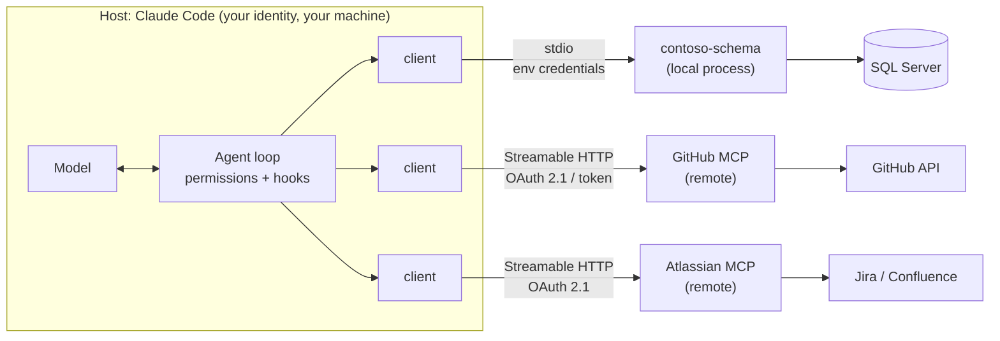

# 08.1 · MCP architecture, authentication and authorization

## Why it matters

Until now the Contoso agent has known only what is in the repository. The ticket text was pasted into the chat, the database schema was inferred from migration files, and nobody asked it to read a pull request. Real work needs the systems around the code: Jira for the ticket, GitHub for the review history, SQL Server for the schema that actually exists.

The **Model Context Protocol** (MCP) is the standard way to give an agent those connections. It is also the fastest way to give an agent more power than anyone intended. In [03.2](../module-03/lesson-02.md) MCP servers sat on the component map as *capability*: they add tools. Every server you add brings three things with it:

- **An identity.** The server calls Jira or GitHub *as someone*, usually you.
- **A data channel.** Whatever the server returns enters the model's context as a tool result, the lowest-trust layer of the instruction hierarchy from [02.3](../module-02/lesson-03.md).
- **Tool definitions.** Names, descriptions and schemas sit in the context window and compete for the budget you measured in [04.1](../module-04/lesson-01.md).

A team that installs "the Jira MCP" with a personal admin token has handed a probabilistic program write access to production tickets under a human's name. This lesson gives you the vocabulary to see that before it happens, and a checklist to prevent it.

> [!NOTE]
> Content tags. **Concept** (stable): host / client / server, the three primitives and who controls them, stdio versus HTTP credentials, the three permission layers, MCP versus API versus CLI. **Implementation** (as of 2026-09): protocol revision 2026-07-28 (stateless, `server/discover`) and its predecessor 2025-11-25 (`initialize` handshake); Claude Code's `.mcp.json`, tool search and permission rule syntax; the course's `McpCheck` tool.

## How it works

### Three roles

The specification names three participants. The **host** is the application the user works in (Claude Code, Cursor, VS Code with Copilot). Inside the host, one **client** per server holds the connection. The **server** is a program that exposes capabilities, either as a local subprocess or as a remote HTTP service.



Note where the agent loop from [02.4](../module-02/lesson-04.md) sits: the model *proposes* a call to `mcp__github__issue_read`; the host checks permissions and runs hooks; only then does the client send it. That gap between proposal and execution is where you enforce things (lesson 08.4).

### Three primitives, three controllers

| Primitive | What it is | Who decides it is used | Contoso example |
|---|---|---|---|
| **Tools** | Functions with a JSON Schema for inputs | the **model** ("model-controlled") | `describe_table("dbo.Invoice")` |
| **Resources** | Data identified by a URI | the **application** | a schema document the host attaches |
| **Prompts** | Templated messages | the **user** | a `/review-migration` template |

Tools are what almost every coding-agent integration uses, and the specification is blunt about them: tools represent arbitrary code execution, hosts must obtain consent before invoking one, and there **SHOULD** always be a human able to deny a tool call. Tool *annotations* such as `readOnlyHint` and `destructiveHint` exist, but clients **MUST** treat them as untrusted unless the server is trusted: a server can label a delete as read-only.

### On the wire

MCP messages are JSON-RPC 2.0. Two transports are standard:

- **stdio**: the host starts the server as a subprocess and exchanges newline-delimited JSON on stdin and stdout. The server **MUST NOT** write anything to stdout that is not a valid MCP message; logs go to stderr. One stray `Console.WriteLine` breaks the connection (you will see this in 08.3).
- **Streamable HTTP**: each message is an HTTP POST to one endpoint; used for remote servers.

The protocol is versioned by date. The **2025-11-25** revision opens with an `initialize` handshake and keeps a session. The **2026-07-28** revision removed both: every request carries its protocol version and client capabilities in `_meta`, and a new `server/discover` call lets a client ask what the server supports. Roots and sampling are deprecated. In September 2026 you meet both eras in the field; the official C# SDK used in this module (2.2.0) answers either, which you will see for yourself in *Try it*.

### Where credentials enter

This is the part most teams get wrong, so be precise.

- **stdio servers** do not use the protocol's authorization at all. The specification says they **SHOULD NOT** follow it and should retrieve credentials from the environment. In practice: an environment variable, set by you, inherited by the subprocess. The server acts with whatever that credential can do.
- **HTTP servers** use OAuth 2.1. The MCP server is an OAuth *resource server*; it publishes Protected Resource Metadata (RFC 9728) that tells the client which authorization server to use. The client **MUST** send a `resource` parameter (RFC 8707) naming the server it wants a token for, and the server **MUST** check that a token was issued for *it* (audience). A server **MUST NOT** accept or pass through tokens issued for anything else: "token passthrough" turns the server into a confused deputy whose downstream calls cannot be attributed or rate-limited.
- **Scopes** should start minimal and grow by step-up: a 403 with `error="insufficient_scope"` names the scope needed for the operation that was refused.

### Three permission layers

What an agent can do through a server is the intersection of three independent layers:

| Layer | Controlled by | Contoso example | Protects |
|---|---|---|---|
| 1. **Credential scope** | the API provider (GitHub, Jira, SQL Server) | fine-grained PAT: one repository, Issues read-only; SQL login with `VIEW DEFINITION` only | every client that ever holds the credential |
| 2. **Server tool surface** | the server (and its flags) | GitHub server with read-only mode and two toolsets; a schema server with no `run_sql` | every host that connects to this server |
| 3. **Host rules** | your `.claude/settings.json`, hooks | `deny: mcp__github__issue_write`; `ask` on Jira reads | this host only |

The layers are not interchangeable. A host deny rule does nothing for the same token used from a script, a CI job or another agent. Put least privilege at the lowest layer that supports it, and treat the upper layers as defence in depth.

### What connections cost in context

*Intuition.* Every tool definition is text the model must read before it can call the tool: rent, as with skill descriptions in [06.1](../module-06/lesson-01.md).

*Equation.* With $n$ tools of average definition size $\bar d$ tokens loaded up front, over a session of $t$ requests:

$$T_{\text{tools}} = n\,\bar d\,t$$

*Tiny example.* The 14 GitHub issue, pull-request and file tools in `samples/github-tools-default.json` measure about 2,900 tokens (`McpCheck tokens`, characters ÷ 4). Over 30 requests: $2{,}900 \times 30 = 87{,}000$ input tokens, for tools the session may never call. The four Contoso schema tools: about 394 tokens, or 11,820 over the same session.

*Implementation.* Claude Code (as of 2026-09) loads MCP tools on demand by default ("tool search"), so only the definitions of tools actually fetched are paid in full. Other hosts may load everything. Separately, Claude Code warns when a single tool result exceeds 10,000 tokens and caps it at 25,000 by default (`MAX_MCP_OUTPUT_TOKENS`): results cost context too.

*Interpretation.* Fewer, sharper tools beat a mirror of the whole API. Anthropic's guidance on tool design says the same from the quality side: build a few tools for high-impact workflows rather than wrapping every endpoint.

### MCP, direct API or CLI?

| Criterion | MCP server | Direct API call in your code | CLI the agent runs |
|---|---|---|---|
| Who decides when it runs | the model | your program | the model |
| Reuse across hosts (Claude Code, Cursor, Copilot, CI) | yes, one server | no | yes, if installed |
| Structured, described tools; per-tool permission rules | yes | n/a | coarse (command patterns) |
| Auth flow for remote SaaS (OAuth, consent) | built in for HTTP | you write it | the CLI's own login |
| Context cost | tool definitions + results | none | command output only |
| Best for | a capability several agents need, with narrow tools | deterministic steps (a script, a CI job) | a mature CLI already on the machine (`gh`, `sqlcmd`) |

A deterministic step (numbering a migration, running gates) belongs in code, as in [06.1](../module-06/lesson-01.md). A single developer's occasional `gh pr view` does not need an MCP server. A capability that three hosts and CI all need, with a narrow read-only surface, does.

## Show me

The Contoso schema server you build in 08.3, driven by hand over stdio with three lines from `labs/module-08/samples/handshake.jsonl` (2026-07-28 revision, `_meta` shortened here):

```json
{"jsonrpc":"2.0","id":1,"method":"server/discover","params":{"_meta":{"io.modelcontextprotocol/protocolVersion":"2026-07-28", "…":"…"}}}
{"jsonrpc":"2.0","id":2,"method":"tools/list","params":{"_meta":{"…":"…"}}}
{"jsonrpc":"2.0","id":3,"method":"tools/call","params":{"name":"describe_table","arguments":{"table":"dbo.Invoice"},"_meta":{"…":"…"}}}
```

The answers, trimmed:

```text
id 1  supportedVersions ["2026-07-28"], capabilities {tools:{listChanged:true}}, serverInfo contoso-schema 1.1.0
id 2  tools: list_procedures, describe_table, describe_procedure, list_tables
      describe_table  inputSchema {table: string, required}  annotations {readOnlyHint:true, destructiveHint:false, openWorldHint:false}
id 3  content[0].text:
      [schema] source=snapshot:catalog-v006.json version=V006 captured-age=… repo-head=unknown status=UNKNOWN
      dbo.Invoice
        InvoiceId      bigint             NOT NULL
        …
```

Send `samples/handshake-2025-11-25.jsonl` instead and the first answer is an `initialize` result with `"protocolVersion":"2025-11-25"`: same server, older era.

And the difference between two tool surfaces, from saved `tools/list` responses:

```text
$ McpCheck tools samples/github-tools-default.json
issue_write          WRITE
merge_pull_request   DESTRUCTIVE
delete_file          DESTRUCTIVE
…
14 tools: 7 read, 7 write (of which 2 destructive), 0 with open-ended input

$ McpCheck tools samples/github-tools-readonly.json --expect read-only
7 tools: 7 read, 0 write (of which 0 destructive), 0 with open-ended input
PASS read-only surface
```

## Try it

Budget: 60 minutes. Setup is in the [lab README](../../labs/module-08/README.md); no database or API key is needed for this lesson.

1. Build the server (`dotnet build server/ContosoSchema.Mcp -c Release`) and talk to it by hand in both revisions:

   ```bash
   S="dotnet server/ContosoSchema.Mcp/bin/Release/net8.0/ContosoSchema.Mcp.dll"
   bash scripts/mcp-talk.sh samples/handshake.jsonl $S --source snapshot:samples/catalog-v006.json
   bash scripts/mcp-talk.sh samples/handshake-2025-11-25.jsonl $S --source snapshot:samples/catalog-v006.json
   ```

   Find the tool annotations, the `_meta.serverInfo`, and the `isError` field in each response. Open `mcp-talk.log`: that is stderr, where the server's logs belong.
2. Measure: `McpCheck tokens` on `samples/contoso-schema-tools.json` and `samples/github-tools-default.json`. Compute $T_{\text{tools}}$ for a 30-request session with both loaded up front.
3. Classify: `McpCheck tools` on both GitHub lists. Which write tools would your team actually need in the next month?
4. Take the sample scenario: *a team wants one MCP setup that reads and writes production Jira and GitHub for all 12 developers.* Fill in sections 1–3 of the [MCP security checklist](../../templates/mcp-security-checklist.md) for it, one copy per server, and write the redesign as a table: layer, current, proposed.

<details>
<summary>Hint: what a good redesign usually contains</summary>

Separate read from write: reads through the MCP servers with each developer's own OAuth identity (Atlassian) or a fine-grained, read-only token on the needed repositories (GitHub, with read-only mode on); writes either not through the agent at all, or through a few narrow tools set to `ask`, with a bot identity whose actions are attributable. No shared tokens, nothing literal in `.mcp.json`, and an audit hook on every call (08.4).
</details>

## Break it

> [!CAUTION]
> The configuration in this break contains fake secrets in the shapes of real ones. Never paste real tokens into a file to test a scanner; generate obviously fake values as done here.

Open `labs/module-08/break/08.1-overbroad/.mcp.json` and `contoso-ops-tools.json`. This is a setup a platform team shipped "to get everyone started": a `contoso-ops` server run with `npx` from an internal registry, and the GitHub server in Docker. Before running anything, write down every problem you can see, labelled with its layer (credential, server surface, host) and one line on what could go wrong.

Then run:

```bash
M="dotnet tools/McpCheck/bin/Release/net8.0/McpCheck.dll"
$M config break/08.1-overbroad/.mcp.json
$M tools break/08.1-overbroad/contoso-ops-tools.json --expect read-only
```

## Fix it

**Diagnose.** `McpCheck config` reports seven problems in two servers; `McpCheck tools` finds three write tools where the team believed there was one:

- *Credential layer:* an `sa` connection string with a literal password, a literal Jira API token, a literal classic GitHub token. All three are in a file that is committed and cloned to every laptop. `sa` means the "ops" server can do anything the database engine can.
- *Server surface:* `run_sql` takes arbitrary SQL, so the model can write any statement, including `DELETE`. `jira_update_issue` edits any field of any issue. GitHub runs with `GITHUB_TOOLSETS=all`. And `cleanup_invoices` is annotated `readOnlyHint: true` while its description begins "Deletes test invoices": the annotation is the server author's claim, not a fact.
- *Supply chain:* `@contoso-internal/ops-mcp` and the GitHub image are unpinned, so a new release runs on every laptop at next start without review.
- *Host layer:* nothing. No rules, so every tool is available whenever the model wants it, with prompts that people learn to click through.

**Modify.** Rewrite it layer by layer:

1. Credentials out of the file: `${CONTOSO_SCHEMA_CONN}` and `${GITHUB_MCP_PAT}`, set per developer. Replace `sa` with a login that has `VIEW DEFINITION` and nothing else; replace the classic token with a fine-grained one (one repository, Issues and Pull requests read-only).
2. Surface: drop `contoso-ops`. Schema questions go to the read-only `contoso-schema` server (08.3). Ticket reads go to the vendor's server with the developer's own OAuth identity (08.2). `cleanup_invoices` is a job for a reviewed script, not a model.
3. GitHub: pinned version, read-only mode, `issues,pull_requests` toolsets only.
4. Host: allow the read tools you need, deny the write tools by name.

**Rerun.** `McpCheck config integration/mcp.json` passes; `McpCheck tools samples/github-tools-readonly.json --expect read-only` and the same on `samples/contoso-schema-tools.json` pass. Your checklist has an owner and a residual-risk line.

## How do I know it works?

- [ ] Given any agent setup, you can name the host, each client and each server, and say whether each server is stdio or HTTP and where its credential comes from.
- [ ] You can explain the output of both handshakes line by line, including `isError` and the annotations.
- [ ] Your redesign for the Jira + GitHub scenario puts least privilege at the credential layer, not only in host rules.
- [ ] `McpCheck config` passes on your `.mcp.json`, and `McpCheck tools --expect read-only` passes for every server you intended to be read-only.
- [ ] You have a number for the context cost of the tools you connect.

## Use / don't use

**Use** MCP when several hosts or agents need the same capability, when a remote SaaS needs a proper OAuth flow, and when you can offer a few narrow, well-described tools. Start read-only.

**Don't** use MCP to give the model a general-purpose escape hatch (`run_sql`, `run_command`, `call_api`): that moves your security boundary into the model's judgment. Don't use it for deterministic steps your own code should perform, and don't add a server because it exists. Don't rely on host rules alone for a credential that also lives elsewhere.

**Limitations.**

- `McpCheck` is a heuristic scanner. It reads names, descriptions and annotations the server wrote; a clean report means "nothing obvious", not "safe".
- The protocol is young and moving: the 2026-07-28 revision changed the lifecycle, and hosts and servers adopt revisions at different speeds. Re-verify implementation details quarterly.
- MCP authorization says how a client gets a token. It says nothing about whether the data the server returns is true, current or benign. Freshness is 08.3; malicious content is Module 9.

## Reflect

1. Which system would you connect first on your wedge stack, and which of the three layers can you make least-privilege there today?
2. Which tool in an MCP server you already use takes open-ended input (SQL, JQL, a command)?
3. Where in your team's setup does a token live in a file that is committed or synced?

## Sources

- [Model Context Protocol — Specification (latest, 2026-07-28)](https://modelcontextprotocol.io/specification/latest) — hosts, clients, servers; JSON-RPC 2.0; resources, prompts, tools, elicitation; tools are arbitrary code execution; annotations untrusted unless from a trusted server; consent before invoking tools.
- [Model Context Protocol — Key changes in 2026-07-28](https://modelcontextprotocol.io/specification/2026-07-28/changelog) — `initialize` and sessions removed; per-request `_meta` version and capabilities; `server/discover`; roots, sampling and logging deprecated.
- [Model Context Protocol — Authorization](https://modelcontextprotocol.io/specification/latest/basic/authorization) — optional; HTTP servers follow it, stdio servers retrieve credentials from the environment; OAuth 2.1 resource server; RFC 9728 metadata; RFC 8707 `resource`; audience validation; no token passthrough; scope challenges and step-up.
- [Model Context Protocol — Security best practices](https://modelcontextprotocol.io/docs/tutorials/security/security_best_practices) — confused deputy, token passthrough, local server compromise, scope minimization and its common mistakes.
- [Model Context Protocol — Tools](https://modelcontextprotocol.io/specification/latest/server/tools) — model-controlled tools; human in the loop SHOULD; `tools/list`, `tools/call`, `isError`; annotations untrusted; servers must validate inputs and rate-limit; clients should log tool usage.
- [Claude Code docs — Connect Claude Code to tools via MCP](https://code.claude.com/docs/en/mcp) — scopes and `.mcp.json`; `${VAR}` expansion; approval for project servers; tool search by default; 10,000-token warning and 25,000-token default limit for results; `mcp__server__tool` names (as of 2026-09).
- [Anthropic Engineering — Writing effective tools for AI agents](https://www.anthropic.com/engineering/writing-tools-for-agents) — few thoughtful tools rather than wrapping every endpoint; namespacing; token-efficient responses; evaluate tools with realistic tasks.
