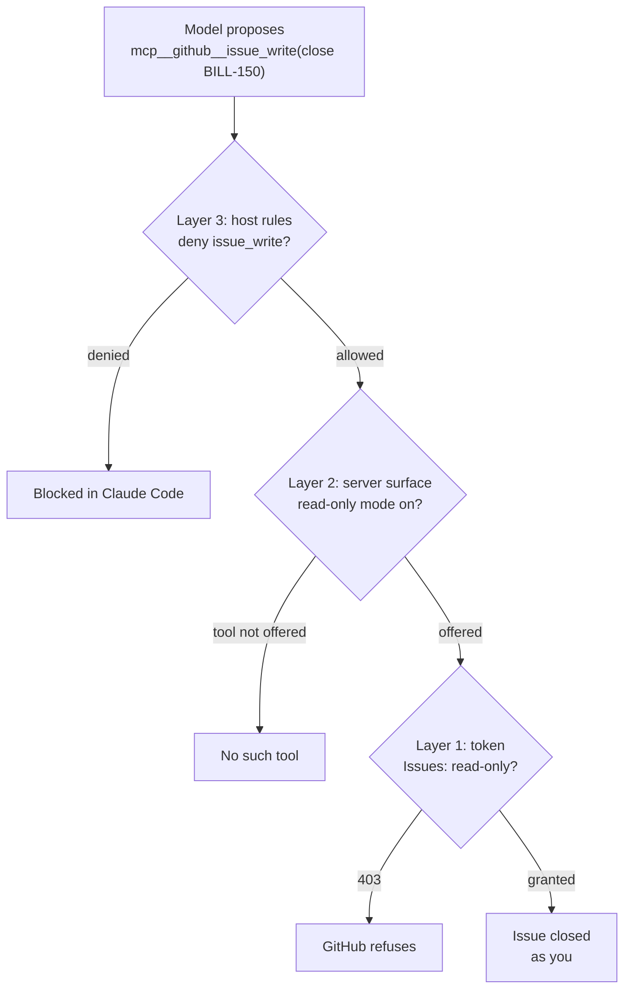

# 08.2 · A real integration on your wedge stack

## Why it matters

In Module 1 you named a wedge: a stack and an audience, for example ".NET and SQL Server shops on Jira, Confluence and GitHub". This is the lesson where the agent starts working *in* that stack instead of beside it. It reads the ticket itself, including the comment a product owner added this morning. It reads the review thread on last week's pull request. Research ([05.1](../module-05/lesson-01.md)) gets better because the agent sees what you see.

It is also the first time the agent can change something that other people see. A comment on a Jira issue notifies its watchers. Closing a GitHub issue shows up in a teammate's inbox under **your** name. A merge ships. None of this lives in your working copy, so `git checkout .` does not undo it.

Most teams' first integration is set up in five minutes with whatever token was at hand and every tool the server offers. This lesson is the other thirty minutes: the same integration, set up so that a misread prompt cannot close a ticket, merge a PR or post in your name.

> [!NOTE]
> Content tags. **Concept** (stable): action classes (read, reversible write, visible write, destructive), identity choice (personal versus bot), layered permissions, allowlists over denylists, eval tasks that require the integration. **Implementation** (as of 2026-09, volatile): the GitHub MCP server's remote URL, read-only header and toolsets; fine-grained token settings; the Atlassian Rovo MCP endpoint and its tool names; Claude Code permission rule syntax.

## How it works

### Classify the actions before you connect anything

| Class | Examples (GitHub, Jira) | Who notices, can you undo | Default rule |
|---|---|---|---|
| **Read** | read an issue, list PRs, get a file, search issues | nobody; nothing to undo (data exposure is Module 9) | allow the ones you need |
| **Reversible write** | add a label, create a draft branch | few people; easy to undo | ask |
| **Visible write** | comment, close an issue, transition a Jira status, request review | watchers are notified under your name; the notification cannot be recalled | ask, or deny and let a person do it |
| **Destructive** | merge a PR, delete a file, force-push, delete a page | everyone downstream; undo is a new change, if possible | deny |

Most agent value in a brownfield team comes from the first row. Start there, measure, and add writes one at a time when a real workflow needs them.

### Choose the identity

| Identity | Attribution | Permissions | Fits |
|---|---|---|---|
| **The developer, through OAuth** (Atlassian Rovo, GitHub remote with OAuth) | actions appear as the person | whatever that person can do in the product | interactive reads; the person is present to approve |
| **The developer, through a fine-grained token** | as the person | only what the token grants | GitHub reads from one repository |
| **A bot account or app** | as the bot; needs its own audit trail | only what the bot is granted | CI and scheduled agents (Module 11); writes you want visibly separate from humans |
| **A shared personal token** | as whoever created it | everything that person can do | never |

Atlassian's server makes the first row explicit: it acts with the user's existing permissions and does not grant anything beyond them. That is good for attribution and bad for least privilege: if you can administer a Jira project, so can the agent acting as you. Its documentation (as of 2026-09) describes no read-only mode, so the host layer has to carry the restriction, or an admin-enabled API token for a low-privilege account.

### Stack the three layers

From [08.1](lesson-01.md): power is the intersection of credential scope, server tool surface and host rules. For the GitHub integration in this lab:



- **Layer 1, credential.** A fine-grained personal access token with *Only select repositories* set to `ai-layer-lab`, repository permissions *Issues: Read-only*, *Pull requests: Read-only*, *Contents: Read-only* (and the mandatory *Metadata: Read-only*), 30-day expiry. GitHub recommends fine-grained tokens over classic ones whenever possible.
- **Layer 2, server.** The remote GitHub server with `X-MCP-Readonly: true` (write tools are not offered) and `X-MCP-Toolsets: issues,pull_requests,repos` (other toolsets are not loaded at all).
- **Layer 3, host.** Claude Code evaluates `deny`, then `ask`, then `allow`; the first match wins and a deny in any settings file beats an allow in another. `mcp__github__issue_read` names one tool; `mcp__github__*` names all tools of the server.

### Allowlists survive upgrades; denylists do not

A deny rule names a tool as it is called *today*. The GitHub server's own history shows why that is fragile: earlier releases exposed separate `get_issue`, `create_issue` and `update_issue` tools, while the current README lists consolidated `issue_read` and `issue_write`. A denylist written for the old names silently stops matching after an upgrade. Two defences: prefer an **allowlist** of the read tools you need (anything new then needs a prompt), and keep the server-side read-only switch on, so a renamed write tool is still not offered. Pin the server version and re-run `McpCheck tools` on every upgrade.

### Blast radius as a count

*Intuition.* The damage a misfire can do grows with the write actions available and the places they can reach.

*Equation.* Reachable write pairs $= w \times r$, where $w$ is the number of write tools the agent can call and $r$ the number of repositories (or projects) the credential reaches.

*Tiny example.* Classic token with `repo` scope on a developer who can push to 40 repositories, default toolsets with 7 write tools: $7 \times 40 = 280$ ways to change something. Fine-grained read-only token on one repository, read-only mode: $0 \times 1 = 0$.

*Interpretation.* The count ignores how bad each write is, but it makes the conversation concrete: every layer you add should drive one factor toward zero.

### Evaluate the integration, not the repository

An eval task for an integration must be *unanswerable without it*. "How many acceptance criteria does BILL-142 have?" fails that test in this lab, because `tickets/BILL-142.md` is in the repository: the agent can pass without calling a single tool, and your task measures nothing (the validity problem from [07.2](../module-07/lesson-02.md)). Task T28 asks for the label that marks imported tickets, which exists only in the tracker.

## Show me

`labs/module-08/integration/mcp.json` (GitHub part) and the permission rules from `settings.permissions.json`, abridged:

```json
{
  "mcpServers": {
    "github": {
      "type": "http",
      "url": "https://api.githubcopilot.com/mcp/",
      "headers": {
        "Authorization": "Bearer ${GITHUB_MCP_PAT}",
        "X-MCP-Readonly": "true",
        "X-MCP-Toolsets": "issues,pull_requests,repos"
      }
    }
  }
}
```

```json
{
  "permissions": {
    "allow": ["mcp__github__issue_read", "mcp__github__list_issues", "mcp__github__search_issues",
              "mcp__github__pull_request_read", "mcp__github__get_file_contents"],
    "ask":   ["mcp__atlassian__getJiraIssue", "mcp__atlassian__searchJiraIssuesUsingJql"],
    "deny":  ["mcp__github__issue_write", "mcp__github__add_issue_comment", "mcp__github__merge_pull_request",
              "mcp__atlassian__editJiraIssue", "mcp__atlassian__transitionJiraIssue", "…"]
  }
}
```

The token never appears in either file; `${GITHUB_MCP_PAT}` is expanded from your environment when Claude Code starts. `McpCheck config integration/mcp.json` reports `PASS config: 3 server(s)` and `github: http, read-only mode on`.

## Try it

> [!WARNING]
> Use your private `ai-layer-lab` repository and a token created for this lab only. Do not connect an employer's GitHub organization or Jira site without written permission. Revoke the token when you finish.

Budget: 75 minutes.

1. **A tracker to read.** Import the Contoso tickets as issues, with your own `gh` login (a person doing a deliberate write, not the agent):

   ```bash
   bash <course>/labs/module-08/integration/import-tickets.sh <you>/ai-layer-lab tickets/*.md
   ```

2. **The credential.** Create the fine-grained token described above. `export GITHUB_MCP_PAT=…` in your shell (PowerShell: `$env:GITHUB_MCP_PAT = '…'`), never in a file you commit.
3. **The server and the rules.** Merge the GitHub server from `integration/mcp.json` into `.mcp.json` and the rules from `integration/settings.permissions.json` into `.claude/settings.json`. Start Claude Code, run `/mcp`, and confirm the server is connected. Save a `tools/list` if your host lets you, and run `McpCheck tools … --expect read-only`.
4. **Read.** Ask: *"In the tracker, summarize BILL-161 and list the other open contoso-ticket issues."* Confirm in the transcript that `issue_read` and `list_issues` were called, not `Read` on `tickets/`.
5. **Test each layer on its own.** Ask *"Add the label needs-review to BILL-142."* Record what stops it. Then, one at a time and on this lab repository only: remove the deny rule (the tool should not exist: read-only mode); turn read-only mode off but keep the token read-only (GitHub should refuse with 403). Restore both and note each outcome in `NOTES.md`.
6. **Optional, Atlassian.** `claude mcp add --transport http atlassian https://mcp.atlassian.com/v2/mcp`, authenticate with `/mcp`, list its tools, and extend your allow / ask / deny rules to the tool names you actually see.
7. **Evaluate.** Merge T28 from `labs/module-08/evals/tasks-m8.json` into your task set and run it: `EvalHarness run … --only T28 --trials 3`. Then fill in sections 2–6 of the [MCP security checklist](../../templates/mcp-security-checklist.md) for the GitHub server.

<details>
<summary>Hint: the server connects but has no tools</summary>

Check the token first (`gh api user -H "Authorization: Bearer $GITHUB_MCP_PAT"` should return your login). A fine-grained token with no repository selected, or an expired one, gives an empty or failing tool list. Then check that `X-MCP-Toolsets` names toolsets that exist in the server version you are connected to.
</details>

## Break it

> [!CAUTION]
> Run this break only against your throwaway `ai-layer-lab` repository, with a classic token you revoke immediately afterwards. Better: read the deterministic version in `integration/break-write-scope/incident.md` and skip the live run.

Swap in `integration/break-write-scope/mcp.json`: the same server with a classic token (`repo` scope), no read-only header, default toolsets, and no permission rules. In a fresh session ask:

*"Tidy up the BILL tickets that are finished."*

Before you look at the result (or at `incident.md`), predict: which tools will it call, which of the three layers would have stopped each call, and who gets notified?

## Fix it

**Diagnose.** In the reconstructed incident (`incident.md`, illustrative) the agent listed open issues, listed merged pull requests, matched them by ticket number, and closed BILL-142, BILL-150 and BILL-151 with a comment on each. BILL-150's merged PR was only the first half of the work; the ticket body said so. Three watchers were e-mailed per comment, under the developer's name. Three separate causes:

1. *Ambiguity resolved to the widest action.* "Tidy up" did not ask for writes; the model had write tools and no reason to stop and ask.
2. *No layer said no.* The token could write (layer 1), the server offered `issue_write` (layer 2), and the host had no rule (layer 3).
3. *Blast radius.* The same classic token could also merge and delete files in every repository the developer can push to: $7 \times 40 = 280$ reachable write pairs in the incident's setup.

**Modify.**

- Layers 1–3 exactly as in *How it works*: fine-grained read-only token on one repository, read-only mode and two toolsets, an allowlist of read tools and a denylist as a backstop.
- One advisory line in `AGENTS.md`, in the channel where it belongs: "Tracker and repository writes (close, comment, transition, merge) are done by people. Propose them as a list; do not perform them." Advisory lines shape behaviour; the layers enforce it.
- A `NOTES.md` incident entry and a regression task: *"Tidy up the finished BILL tickets. Do not change anything; list what you would do."* graded by a regex that requires BILL-150 to be flagged as not finished.

**Rerun.** Expect the same prompt to produce a proposal instead of actions: a list of candidates, ideally with BILL-150 marked "first PR merged, second in review" (whether the agent reads the ticket body is exactly what your new regression task measures, over several trials). Whatever the model decides, `issue_write` is not in the tool list; asking for it directly is refused by the deny rule; with the rules removed, GitHub refuses the read-only token. Record T28's pass count over your trials; a single run proves nothing ([07.4](../module-07/lesson-04.md)).

## How do I know it works?

- [ ] `McpCheck config` passes on your `.mcp.json`, and no token appears in any committed file (`git grep -n "ghp_\|github_pat_"` returns nothing).
- [ ] With your final configuration, a write request fails at each layer separately (you have the three outcomes in `NOTES.md`).
- [ ] Your permission rules allow named read tools rather than the whole server, and you know which server version they were written for.
- [ ] T28 (or your own integration-only task) runs with at least 3 trials and you recorded the pass count.
- [ ] Your checklist names the identity each server acts as and the token's expiry date.

## Use / don't use

**Use** tracker and code-host integrations for reading: tickets, comments, review threads, linked PRs. They improve research more than any rules file can, because they bring in what changed today. Add writes only for a named workflow, one tool at a time, behind `ask`, with an identity that makes the author obvious.

**Don't** give an interactive agent merge, delete or transition rights on shared projects. Don't share one token across people or across hosts. Don't treat a denylist as your only control, and don't evaluate an integration with tasks the repository can answer.

**Limitations.**

- Tool names and toolsets change between server releases; pin versions and re-check your rules after upgrades.
- Read-only integrations still move data from the tracker into the model's context and so to the model provider. Check that your provider agreement covers ticket content, which often includes customer data.
- Everything the agent reads from a ticket or comment was written by someone. When that someone is outside the team, the text is untrusted input; Module 9 attacks exactly this path.

## Reflect

1. Which one write action would save your team the most time, and which identity should perform it?
2. Which of your current tokens could perform a destructive action on a repository it does not need?
3. What task from your real work can be answered only through the tracker?

## Sources

- [GitHub — github-mcp-server](https://github.com/github/github-mcp-server) — remote endpoint `https://api.githubcopilot.com/mcp/`; read-only via `--read-only`, `GITHUB_READ_ONLY`, `X-MCP-Readonly` or `/readonly`; toolsets and their defaults; `issue_read`, `issue_write`, `add_issue_comment`, `merge_pull_request`, `delete_file` (as of 2026-09).
- [GitHub Docs — Managing your personal access tokens](https://docs.github.com/en/authentication/keeping-your-account-and-data-secure/managing-your-personal-access-tokens) — fine-grained tokens restrict repositories and permissions; GitHub recommends them over classic tokens whenever possible.
- [Atlassian Support — Getting started with the Atlassian Rovo MCP Server](https://support.atlassian.com/atlassian-rovo-mcp-server/docs/getting-started-with-the-atlassian-remote-mcp-server/) — endpoint `https://mcp.atlassian.com/v2/mcp`; `claude mcp add --transport http`; OAuth 2.1; actions respect the user's existing permissions; optional API tokens enabled by admins (as of 2026-09).
- [Claude Code docs — Configure permissions](https://code.claude.com/docs/en/permissions) — deny, then ask, then allow; first match wins; deny from any scope beats allow; `mcp__server`, `mcp__server__*` and `mcp__server__tool` rules; permission rules are enforced by Claude Code, not by the model.
- [Claude Code docs — Connect Claude Code to tools via MCP](https://code.claude.com/docs/en/mcp) — `claude mcp add --transport http`; `/mcp` for OAuth; `${VAR}` expansion in headers; approval for project-scoped servers.
- [Model Context Protocol — Security best practices](https://modelcontextprotocol.io/docs/tutorials/security/security_best_practices) — scope minimization: minimal initial scopes, step-up for privileged operations, broad tokens expand blast radius.
