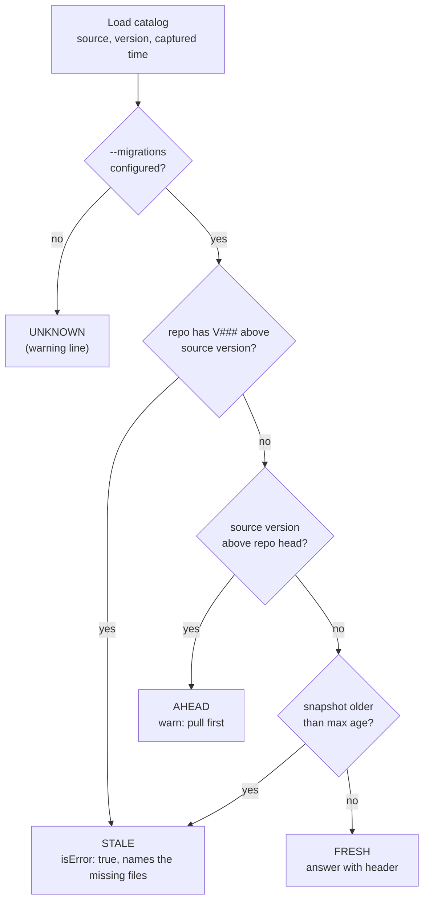

# 08.3 · Building a custom MCP server in C#

## Why it matters

The vendors' servers from [08.2](lesson-02.md) cover Jira and GitHub. The system that brownfield .NET agents get wrong most often has no vendor server: **your own SQL Server database**. The agent infers the schema from migration files, from old repository code, from `docs/ARCHITECTURE.md` written in 2021. In [04.3](../module-04/lesson-03.md) you named that pathology: stale context.

A small custom server fixes the inference: "what columns does `dbo.Invoice` have?" is answered by the database, not guessed. It also creates a new, quieter failure. A server that reads a snapshot returns *yesterday's* database with the same confidence as today's. The agent has no reason to doubt a tool result, and in this lesson's break it writes code against a column that was dropped two weeks earlier. The unit tests pass. The first production call fails.

This lesson builds the server (four read-only tools, under 600 lines of C# including the command-line extras), then breaks it the way real servers break, and fixes it with the one design rule that matters most for data tools: **every answer says where it came from and how old it is, and stale answers are refused, not decorated.**

> [!NOTE]
> Content tags. **Concept** (stable): narrow read-only tools, least privilege at the data source, provenance and freshness, metadata versus errors, testing a server at two levels. **Implementation** (as of 2026-09, volatile): the `ModelContextProtocol` 2.2.0 NuGet package and its attributes, SQL Server catalog views and `VIEW DEFINITION`, Claude Code's `.mcp.json`.

## How it works

### Anatomy of a stdio server in C#

The official C# SDK (`ModelContextProtocol`, maintained in the MCP organization on GitHub) plugs into the .NET generic host. `Program.cs` of `labs/module-08/server/ContosoSchema.Mcp`:

```csharp
var builder = Host.CreateApplicationBuilder();
builder.Logging.ClearProviders();
builder.Logging.AddConsole(o => o.LogToStandardErrorThreshold = LogLevel.Trace);   // stdout is the protocol
builder.Services.AddSingleton(service);                                             // catalog source + freshness
builder.Services
    .AddMcpServer(o => o.ServerInfo = new() { Name = "contoso-schema", Version = "1.1.0" })
    .WithStdioServerTransport()
    .WithTools<SchemaTools>();
await builder.Build().RunAsync();
```

The logging line is not decoration. On stdio, the server **MUST NOT** write anything to stdout that is not a valid MCP message, and the default console logger writes to stdout. What a stray line does depends on the client: some skip it, some lose the message it was glued to, some drop the connection with an unhelpful parse error. In the lab, the SDK's own client recovered from a stray `Console.Write` by retrying with the older handshake, which is exactly why you cannot rely on a test to catch it: keep stdout clean by construction.

A tool is a method with attributes. The SDK turns the parameter list into the `inputSchema` and the attributes into annotations:

```csharp
[McpServerTool(Name = "describe_table", ReadOnly = true, Idempotent = true, Destructive = false, OpenWorld = false)]
[Description("Returns the columns of one table (name, SQL Server type, NULL or NOT NULL). " +
             "Use before writing SQL that reads or writes the table. Read-only; returns schema, never row data.")]
public CallToolResult DescribeTable(
    [Description("Table name, e.g. dbo.Invoice or Invoice")] string table) => Answer((c, sb) => { … });
```

### Four design decisions

| Decision | This server | The tempting alternative | Why not |
|---|---|---|---|
| Tool granularity | `list_tables`, `describe_table`, `list_procedures`, `describe_procedure` | one `run_sql(query)` | open-ended input moves the security boundary into the model ([08.1](lesson-01.md)) |
| Output | compact text, one line per column, header first | the raw catalog as JSON | tokens; Anthropic's tool guidance favours high-signal, token-efficient results |
| Errors | tool errors (`isError: true`) that say what exists ("Known tables: dbo.Invoice, dbo.InvoiceNote") | exceptions, or an empty result | the spec reserves protocol errors for malformed calls; tool errors are for the model to self-correct |
| Secrets | connection string from `CONTOSO_SCHEMA_CONN`; source shown as `sql:127.0.0.1,14338/ContosoBilling` | `--conn "Server=…;Password=…"` in `.mcp.json` args | arguments end up in committed config, process lists and logs |

### Least privilege at the database, not only in code

The server's code never runs a `SELECT` on business tables, but code can change and a server can be compromised. The login is the real boundary. The lab database creates `schema_reader` with `VIEW DEFINITION` on the database and `SELECT` on `dbo.SchemaHistory` only. SQL Server's metadata visibility rules then let it see every table's and procedure's definition in the catalog views, and nothing else:

```text
$ sqlcmd -U schema_reader … -Q "SELECT TOP 1 Amount FROM dbo.Invoice"
Msg 229: The SELECT permission was denied on the object 'Invoice', database 'ContosoBilling', schema 'dbo'.
```

That is the credential layer from 08.1, applied to your own system.

### Provenance and freshness

Every data source an agent reads is a copy of something, taken at some time. The server needs a *reference* to judge its copy against. For a schema, the reference is sitting in the repository: `db/migrations/`. If the branch has `V006__…sql` and the source is at V005, the source describes a database that no longer exists on this branch.



Every answer starts with a header the model, a hook and a human can all read:

```text
[schema] source=sql:127.0.0.1,14338/ContosoBilling version=V006 captured-age=live repo-head=V006 status=FRESH
```

The design choice that matters is what happens when the status is not `FRESH`. **A warning line is metadata, and models skim metadata**; you will watch that happen in the break. **A tool error is a result the model has to handle**: it cannot use the data, and the error text tells it what to do instead ("read `db/migrations/V006__invoice_note_table.sql`"). The server refuses stale data by default (`--on-stale refuse`) and only warns if you explicitly ask it to.

*How stale can a snapshot get?* A rough estimate is unseen migrations ≈ merge rate × age. Contoso merges about two migrations a month (≈ 0.067 a day). A nightly snapshot that is at most 24 h old hides 0.07 migrations on average. The break's snapshot job stopped 41 days ago: $0.067 \times 41 \approx 2.7$. The formula is crude; the point is that age alone is a weak signal and the version comparison is a strong one, which is why the server checks both.

### Testing a server at two levels

- **Unit level** (fast, no process): freshness rules, refusal text, tool output against the two sample snapshots, the SQL check used in 08.4. 16 tests in `ContosoSchema.Mcp.Tests`.
- **Protocol level**: one test starts the built server as a real subprocess with the SDK's `StdioClientTransport`, lists tools, asserts all four are `readOnlyHint: true`, and calls `describe_procedure`. This is the test that catches a server that does not start, a missing tool registration or a broken attribute; unit tests cannot.

## Show me

The same `describe_table` call against the same 41-day-old snapshot, configured two ways.

Without a reference (`--source snapshot:.mcp-cache/catalog-nightly.json`):

```text
[schema] source=snapshot:catalog-nightly.json version=V005 captured-age=41.6d repo-head=unknown status=UNKNOWN
WARNING: no migrations folder configured, so the server cannot tell whether this schema is current.
dbo.Invoice
  InvoiceId      bigint             NOT NULL
  …
  Status         tinyint            NOT NULL
  Notes          nvarchar(400)      NULL
```

With the reference (`… --migrations db/migrations`), the result has `"isError": true`:

```text
[schema] source=snapshot:catalog-nightly.json version=V005 captured-age=41.6d repo-head=V006 status=STALE
REFUSED: the source is at V005 but the repository is at V006; not in the source: V006__invoice_note_table.sql.
Read these migration files for the current shape: db/migrations/V006__invoice_note_table.sql.
Or refresh the snapshot: ContosoSchema.Mcp snapshot --source sql --out <file>.
```

And the tests:

```text
$ dotnet test server/ContosoSchema.Mcp.Tests
Passed!  - Failed: 0, Passed: 17, Skipped: 0, Total: 17
```

## Try it

Budget: 90 minutes. Setup (overlay, database, publish into `ai-layer-lab`) is in the [lab README](../../labs/module-08/README.md).

1. **Read and test.** Read `Program.cs`, `SchemaTools.cs` and `Freshness.cs` (about 320 lines together). Run the tests. Then pollute stdout on purpose: add `Console.Write("starting ");` at the top of `Serve`, rebuild, and send `samples/handshake.jsonl` through `scripts/mcp-talk.sh`. What happened to the first response? Rerun the tests: do they notice? Remove the line.
2. **Least privilege.** Start the database, set `CONTOSO_SCHEMA_CONN` for `schema_reader`, and run `ContosoSchema.Mcp info --source sql --migrations <ai-layer-lab>/db/migrations`. Then try to read a row as `schema_reader` and record the error.
3. **Register it.** Publish the server into `.claude/mcp/contoso-schema/` and add the `contoso-schema` entry from `integration/mcp.json` to `.mcp.json`, with `--migrations db/migrations`. Allow `mcp__contoso-schema__*` in your settings. Confirm with `/mcp`.
4. **Use it.** Run BILL-161 through your Module 6 loop (`prime` → `plan-feature` → implement → `validate`). In the transcript, find the `describe_table` and `list_procedures` calls and the procedure the plan chose. Compare with `labs/module-08/solution/BILL-161/`.
5. **Guard the incident.** Merge T25–T27 from `evals/tasks-m8.json` into your task set and run them with 3 trials each. Add a line to `AI-LAYER-CHANGELOG.md` for the server.

<details>
<summary>Hint: Claude Code shows the server as failed</summary>

Run the exact command from `.mcp.json` by hand from the repository root, with `samples/handshake.jsonl` piped in through `scripts/mcp-talk.sh`. Relative paths in `args` resolve from the directory Claude Code was started in. If the environment variable is missing, `--source sql` exits with a usage message on stderr; the host then reports a failed connection.
</details>

## Break it

> [!CAUTION]
> Branch only. The break makes the agent write code against a column that does not exist; do not merge it.

This is the module's lab break: *an MCP tool returns stale data*. The team caches the schema in `.mcp-cache/catalog-nightly.json` so that nobody's laptop needs database access. The nightly refresh job stopped after a server move 41 days ago. V006 (notes move to `dbo.InvoiceNote`, `dbo.Invoice.Notes` dropped) was merged two weeks ago.

On `break/08-3`, copy `samples/catalog-nightly.json` to `.mcp-cache/` and replace the `contoso-schema` entry with `break/08.3-stale-schema/mcp.json` (snapshot source, no `--migrations`). In a fresh session: *"Implement BILL-161. Use the schema server for table shapes."* Then run `dotnet test`.

Deterministic version: `break/08.3-stale-schema/transcript-excerpt.md` and the code it produced in `break/08.3-stale-schema/overlay/`. Copy the overlay onto Contoso and run the tests: 7 passed.

Predict before you read on: which phase of the loop from [05.4](../module-05/lesson-04.md) failed, and which check would have caught it before production?

## Fix it

**Diagnose.**

1. *Where did the wrong fact come from?* The transcript shows one `describe_table` call returning `Notes nvarchar(400) NULL` under a header that says `version=V005 … repo-head=unknown status=UNKNOWN` and a warning line. The agent quoted the columns and ignored the header.
2. *Why was the source wrong?* The snapshot is 41.6 days old and at V005; the repository is at V006. The server had no reference to compare against, so it could only say "unknown".
3. *Why did nothing else catch it?* The agent never listed `db/migrations/`: it had a tool that sounded authoritative. The unit tests use a fake repository, so no test touches SQL. Research failed ([05.4](../module-05/lesson-04.md)), and validation had no oracle for SQL. In the failure taxonomy of [02.5](../module-02/lesson-05.md): stale context delivered by a tool.
4. *Confirm against the real database:* `ContosoSchema.Mcp check-sql --source sql --migrations db/migrations src/Contoso.Billing/Invoices/InvoiceNotes.cs` reports `unknown column Notes (not in dbo.Invoice)`.

**Modify.**

- Configuration: give the server its reference and a limit: `--migrations db/migrations --max-age-hours 24`, refusal on (the default). A stale snapshot now produces an error, not a warning.
- Source: either the live source with the least-privilege login, or a refresh job that fails loudly (and whose output the server checks anyway).
- Rules, one line in `AGENTS.md`: "Table shapes come from the contoso-schema server. If it refuses as stale, read the migration files it names; never fall back to memory or old code."
- Regression: T25–T27 in the eval set, tagged `regression`, T25 also `golden`.
- Validation: the SQL check becomes a hook in [08.4](lesson-04.md), so the next wrong column is caught at edit time.

**Rerun.** With the refusal in place, the first `describe_table` returns `isError: true` naming V006 (verified in the lab). What the agent does next is the part to measure: the error text points it at `V006__invoice_note_table.sql`, which creates `dbo.usp_InvoiceNote_LatestByCustomer`; record the T25–T27 pass counts over 3 trials rather than trusting one good transcript. `check-sql` on the solution and all Contoso sources: `PASS check-sql: 11 file(s) against V006`.

## How do I know it works?

- [ ] `dotnet test` on the server passes, including the protocol-level test, and nothing but `Console.Error` or the logger writes output in the server's code (`grep -n "Console.Write" tools/ContosoSchema.Mcp` finds only the CLI commands).
- [ ] `schema_reader` can list tables and cannot read a row, and no connection string appears in `.mcp.json`, in tool output or in the audit log.
- [ ] Pointing the server at `samples/catalog-nightly.json` with `--migrations` produces `isError: true` and names the missing migration.
- [ ] BILL-161 uses the stored procedure, and `check-sql` passes against a fresh source.
- [ ] T25–T27 are in your task set with trial counts recorded.

## Use / don't use

**Use** a custom server for internal systems the agent keeps guessing about (schema, feature flags, service catalog, build metadata) when several hosts need the answer and a few narrow read tools cover it. Put provenance in every answer from day one.

**Don't** build a server where a script or a CLI already answers the question ([08.1](lesson-01.md)), don't add write tools to a server you built for reading, and don't let a cache stand in for a source unless something checks its age against a reference.

**Limitations.**

- The freshness check compares migration numbers. A hotfix applied to the database by hand, outside migrations, is invisible to it; the max-age limit and the live source are the partial answers.
- The repository head is only as current as the branch. On a stale branch the server can report `AHEAD` correctly and still be describing a database you should not code against yet.
- SDK APIs change between major versions (2.x at the time of writing). Pin the package and rerun the protocol test on upgrade.
- A server you run locally executes with your user's rights. Review its code like any other AI-layer file; Module 9 shows what a malicious one can do.

## Reflect

1. Which system in your stack does your agent currently guess about, and what would be its reference for freshness?
2. Where in your AI layer does a tool or document return data without saying how old it is?
3. What would your server's least-privilege login be, concretely?

## Sources

- [MCP C# SDK — modelcontextprotocol/csharp-sdk](https://github.com/modelcontextprotocol/csharp-sdk) — `ModelContextProtocol`, `.Core` and `.AspNetCore` packages; hosting and dependency-injection extensions. Version 2.2.0 used and verified in the lab (as of 2026-09).
- [Microsoft Learn — Quickstart: create a minimal MCP server (.NET)](https://learn.microsoft.com/en-us/dotnet/ai/quickstarts/build-mcp-server) — `dotnet new mcpserver`, stdio default, `[McpServerTool]` and `[Description]`, configuration through environment variables.
- [Model Context Protocol — stdio transport (2026-07-28)](https://modelcontextprotocol.io/specification/2026-07-28/basic/transports/stdio) — newline-delimited JSON-RPC; the server MUST NOT write non-MCP output to stdout; stderr for logs; shutdown by closing stdin.
- [Model Context Protocol — Tools](https://modelcontextprotocol.io/specification/latest/server/tools) — protocol errors versus tool execution errors (`isError`) that models can use to self-correct; annotations; servers must validate inputs and sanitize outputs.
- [Microsoft Learn — Metadata visibility configuration](https://learn.microsoft.com/en-us/sql/relational-databases/security/metadata-visibility-configuration) — metadata is visible only for securables a user owns or has permission on; `VIEW DEFINITION` grants metadata visibility.
- [Anthropic Engineering — Writing effective tools for AI agents](https://www.anthropic.com/engineering/writing-tools-for-agents) — few targeted tools, high-signal and token-efficient responses, actionable error messages, evaluate tools with realistic tasks.
