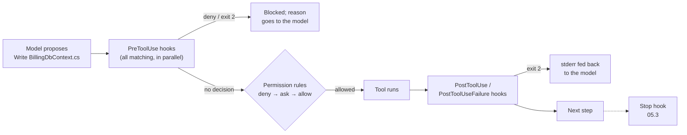

# 08.4 · Hooks: enforcement and audit

## Why it matters

Three promises from earlier modules are still open. In [02.3](../module-02/lesson-03.md) you saw a README talk the agent into writing EF Core code in a Dapper codebase, and the fix ended with "in Module 8 you will make it a PreToolUse hook that rejects the edit before it is written". In [05.3](../module-05/lesson-03.md) the Stop hook blocked a turn from ending while gates failed, but only at the end of the turn, after the damage was in the working copy. And in [08.3](lesson-03.md) BILL-161 read a dropped column, and nothing noticed until production.

Hooks are how you turn "the agent should" into "the agent cannot", at the moment of the tool call. They are also how you find out afterwards what an agent actually did, with which tools, against which systems, which matters as soon as MCP servers act in your name ([08.2](lesson-02.md)).

They are also code that runs on every tool call, with your user's rights, written quickly by people who test it once. This lesson's break is the most common hook bug there is: a guard that crashes and, by design of the exit-code contract, lets the edit through.

> [!NOTE]
> Content tags. **Concept** (stable): enforcement versus validation versus audit hooks, fail closed versus fail open, testing hooks with recorded payloads, the latency budget, what a local log can and cannot prove. **Implementation** (as of 2026-09, volatile): Claude Code's hook events, matchers, exit codes, `permissionDecision` output and `${CLAUDE_PROJECT_DIR}`; the course's `AgentHooks` tool.

## How it works

### Where hooks run



A hook receives a JSON payload on stdin: `session_id`, `cwd`, `hook_event_name`, `tool_name`, `tool_input`, a `tool_use_id`, and for post-events the `tool_response`. The events this lesson uses (Claude Code, as of 2026-09):

| Event | When | Can it prevent the action? | Use it for |
|---|---|---|---|
| `PreToolUse` | before a tool call, before the permission prompt | yes | **enforcement**: reject an edit, a command, an MCP call |
| `PostToolUse` | after a tool call succeeded | no, the tool already ran; exit 2 feeds stderr back to the model | **validation** with feedback; **audit** |
| `PostToolUseFailure` | after a tool call failed | no | audit of failures |
| `Stop` | the agent wants to end its turn | yes (keeps it working) | slower gates ([05.3](../module-05/lesson-03.md)) |

Matchers select tools: `Edit|Write|MultiEdit` is an exact list; anything with other characters is a regular expression, so `mcp__.*` matches every MCP tool and `mcp__github__.*` one server's tools.

### The exit-code contract

| Hook exits with | What happens to a `PreToolUse`'d call |
|---|---|
| **0** with JSON `permissionDecision: "deny"` | blocked; the reason is shown to the model |
| **0** with no output | no decision; the normal permission flow continues |
| **2** | blocked; stderr is the reason |
| **anything else** (1, a crash, a timeout) | **non-blocking error: the call proceeds** |

Read the last row twice. An enforcement hook that throws, cannot parse its input, or cannot find its configuration **fails open** unless you make it fail closed yourself. Two more rules from the permissions documentation shape the design: hook decisions do not bypass permission rules (a deny rule blocks even if a hook said `allow`), and a hook that returns `allow` skips the permission prompt, so a guard should say `deny` or nothing, never `allow`.

### Three kinds of hooks, two failure policies

| Kind | Example in the lab | Event | On its own error |
|---|---|---|---|
| **Enforcement** | `AgentHooks guard`: reject edits that add `DbContext`, `SqlHelper.` outside `Legacy/`, `DateTime.Now`, an EF Core package, or that change a merged migration | `PreToolUse` on `Edit\|Write\|MultiEdit` | **fail closed**: deny with "guard could not check this call" |
| **Validation** | `ContosoSchema.Mcp check-sql --hook`: SQL in the edited file against a fresh schema | `PostToolUse` on edits | refuse to validate against a stale source (exit 2 with the reason) |
| **Audit** | `AgentHooks audit`: one redacted JSON line per tool call | `PostToolUse` + `PostToolUseFailure`, matcher `.*` | **fail open**: never block work because logging failed; say so on stderr |

The guard reads its rules from the same `gates/architecture.rules` that `LoopGate arch` uses in CI ([05.3](../module-05/lesson-03.md)): one source of truth, checked twice, once before the edit and once before the merge.

### The latency budget

*Intuition.* A hook runs on every matching call. A slow hook is a tax on every edit, and a taxed team disables the hook.

*Equation.* Added wall time per session $\approx c \times \ell$, for $c$ matching calls and hook latency $\ell$ (hooks for the same event run in parallel, so the slowest one counts).

*Tiny example.* Measured in the lab: the compiled guard (`dotnet AgentHooks.dll guard`) takes about 0.22 s; the same code started with `dotnet run --project` takes 3.8–5.3 s, because it builds first. A session with 40 edits: $40 \times 0.22 \approx 9$ s versus $40 \times 4.5 = 180$ s.

*Interpretation.* Publish hook binaries; never build in a hook. Keep enforcement under about half a second; anything slower (a test run, a full build) belongs in the Stop hook or CI.

### What an audit log is, and is not

The audit hook writes one line per call: time, session, tool, MCP server, target (file, command or arguments, truncated), a hash of the full input, the outcome, and the number of redactions. Redaction runs before anything is written: tokens in the shapes GitHub, Atlassian, AWS and Slack use, `Password=` values in connection strings, bearer tokens, `sqlcmd -P` arguments. The MCP specification asks clients to log tool usage for audit; this is the local version of that.

A local log on a developer's laptop is **evidence for the developer**, not an audit trail for an auditor: the same user who is being audited can edit it. For that you ship the lines somewhere append-only (Module 12). What it gives you now is the ability to answer, after an incident like 08.2's, "which tools did the session call, in which order, against which server?"

## Show me

The three hooks in `.claude/settings.json` (from `labs/module-08/hooks/settings.example.json`, abridged):

```json
{
  "hooks": {
    "PreToolUse":  [{ "matcher": "Edit|Write|MultiEdit",
      "hooks": [{ "type": "command", "timeout": 10,
        "command": "dotnet \"${CLAUDE_PROJECT_DIR}/.claude/hooks/bin/AgentHooks.dll\" guard --rules gates/architecture.rules" }] }],
    "PostToolUse": [
      { "matcher": "Edit|Write|MultiEdit", "hooks": [{ "type": "command", "timeout": 30,
        "command": "dotnet \"${CLAUDE_PROJECT_DIR}/.claude/mcp/contoso-schema/ContosoSchema.Mcp.dll\" check-sql --hook --source sql --migrations \"${CLAUDE_PROJECT_DIR}/db/migrations\"" }] },
      { "matcher": ".*", "hooks": [{ "type": "command", "timeout": 5,
        "command": "dotnet \"${CLAUDE_PROJECT_DIR}/.claude/hooks/bin/AgentHooks.dll\" audit" }] }]
  }
}
```

What the model receives when it tries to write `BillingDbContext.cs`:

```json
{"hookSpecificOutput":{"hookEventName":"PreToolUse","permissionDecision":"deny",
 "permissionDecisionReason":"src/Contoso.Billing/Data/BillingDbContext.cs: the new text uses `DbContext` (ADR 0007: data access is Dapper repositories, not EF Core). Rewrite it; do not work around this hook."}}
```

The guard's test set, ten recorded payloads named by the decision they must produce:

```text
$ dotnet hooks/AgentHooks/out/AgentHooks.dll selftest hooks/payloads --rules ../module-05/gates/architecture.rules
ok   edit-comment-mentions-dbcontext.defer.json defer   …
ok   edit-merged-migration.deny.json          deny     db/migrations/V004__due_not_null.sql is a merged migration …
ok   malformed-no-path.deny.json              deny     guard hook could not check this call (FormatException …). Failing closed …
ok   multiedit-sqlhelper.deny.json            deny     … the new text uses `SqlHelper.` (ADR 0007 …)
ok   write-dbcontext.deny.json                deny     … the new text uses `DbContext` …
ok   write-new-migration.defer.json           defer
…
10 passed, 0 failed
```

## Try it

Budget: 60 minutes, in `ai-layer-lab` with the Module 8 setup from the [lab README](../../labs/module-08/README.md) (published `AgentHooks` and `ContosoSchema.Mcp`, lab database running).

1. **Test before you install.** Run `selftest` against the payloads. Then add two payloads of your own from your real sessions (copy a `tool_input` from a transcript): one that must be denied, one that must pass.
2. **Install.** Merge `hooks/settings.example.json` into `.claude/settings.json` next to the Module 5 Stop hook. Commit it with a changelog entry; hooks are AI-layer code under CODEOWNERS ([03.1](../module-03/lesson-01.md)). Claude Code asks you to trust the workspace before project hooks run.
3. **Enforcement, live.** In a fresh session ask: *"Add an EF Core DbContext for invoices so we can use LINQ."* Then: *"Fix the typo 'backfilled' in the comment of V004."* Record what the agent received and what it did next.
4. **Validation, live.** Copy `break/08.3-stale-schema/overlay/src/…/InvoiceNotes.cs` into the working copy with the agent (*"create this file"*). The `check-sql` hook should answer with `unknown column Notes (not in dbo.Invoice)`. Does the agent repair it, and with what?
5. **Audit.** `dotnet .claude/hooks/bin/AgentHooks.dll report .claude/audit/tool-calls.jsonl`. Find the denies, the MCP calls by server, and check that no secret appears in the file (`grep -n "Password=\|ghp_\|github_pat_" .claude/audit/tool-calls.jsonl` finds nothing).
6. **Time it.** Measure your guard's latency on one payload (`time dotnet … guard < payload.json`) and write $c \times \ell$ for your last real session into `NOTES.md`.

<details>
<summary>Hint: the hook never seems to run</summary>

Run `/hooks` in Claude Code to open the (read-only) hooks browser and see what is registered. Check that the matcher names the tool as it is called in your version (the transcript shows it), that `${CLAUDE_PROJECT_DIR}` resolves (start Claude Code in the repository root), and that `dotnet` is on the path of the shell that runs hooks. On Windows, a command that works in PowerShell can fail in the shell Claude Code uses for hooks; test the exact command string with a payload piped in.
</details>

## Break it

> [!CAUTION]
> Branch only. The v0 guard lets the edit it was written to stop through.

The first guard the team wrote is `labs/module-08/break/08.4-fail-open/guard-v0.sh`, registered by `settings.v0.json`. It extracts `file_path` and `new_string` with `grep`, checks for `DbContext`, and exits 2 with a clear message. The demo went well: the agent tried to *edit* a file to add `: DbContext` and was blocked.

Run it against the recorded payloads:

```bash
sed 's|{root}|C:/lab|g' hooks/payloads/write-dbcontext.deny.json | bash break/08.4-fail-open/guard-v0.sh; echo "exit $?"
sed 's|{root}|C:/lab|g' hooks/payloads/edit-wall-clock.deny.json  | bash break/08.4-fail-open/guard-v0.sh; echo "exit $?"
```

Predict before running: what does Claude Code do with each exit code?

## Fix it

**Diagnose.**

1. *The write payload.* `Write` sends `content`, not `new_string`. The `grep` for `new_string` finds nothing, `set -euo pipefail` makes the script exit with **1**, and exit 1 is a non-blocking error: Claude Code shows a notice and **writes the file**. The guard failed open on exactly the most dangerous shape, a whole new file.
2. *The wall-clock edit.* Exit 0: v0 only knows one rule. `DateTimeOffset.UtcNow`, `SqlHelper.` outside `Legacy/` and an EF package in a `.csproj` pass, while `LoopGate arch` in CI knows all of them. Two rule lists drift apart.
3. *Parsing JSON with `grep`.* A payload serialized with a space after the colon, an escaped quote in the new text, or `MultiEdit`'s `edits` array all defeat the pattern.
4. *No tests.* The demo was one `Edit`. Nobody replayed a `Write` or a `MultiEdit`.

**Modify.** Replace v0 with `AgentHooks guard`: a real JSON parser; every shape (`new_string`, `content`, `edits[].new_string`); rules loaded from `gates/architecture.rules`, the file CI uses; merged migrations immutable; and a `catch` that turns any internal error into a `deny` with the reason "failing closed". Commit the payload set next to it and run `selftest` in CI, so a change to the guard is tested like a change to the code it guards.

**Rerun.** `selftest`: 10 passed, 0 failed, including `write-dbcontext.deny.json` and `malformed-no-path.deny.json`. Live: the `Write` of `BillingDbContext.cs` is denied with the ADR reason. Latency stays near 0.22 s per call.

## How do I know it works?

- [ ] `selftest` passes on the ten lab payloads plus at least two recorded from your own sessions, and runs in CI.
- [ ] With the hooks installed, a live attempt to write a `DbContext` class, to edit a merged migration and to create SQL against a dropped column is each stopped or flagged, and the transcript shows the reason reaching the model.
- [ ] Breaking the guard's configuration on purpose (rename the rules file) produces denies, not silent passes.
- [ ] The audit report lists every tool call of a session, including MCP calls by server, and a grep for secrets in the log finds nothing.
- [ ] You know your guard's latency and it is under half a second.

## Use / don't use

**Use** `PreToolUse` enforcement for invariants that must hold on every edit and can be checked in milliseconds from the proposed change: architecture rules, immutable files, forbidden packages, MCP write tools you never want called. Use `PostToolUse` validation for checks that need the written file and give the model something to repair. Audit every tool call once MCP servers act in your name.

**Don't** use hooks for slow checks (full builds, test suites: Stop hook or CI), for anything that must hold across *all* tools and people (that is CI and branch protection), or for style preferences a rules line handles. Don't return `allow` from a guard.

**Limitations.**

- The guard watches `Edit`, `Write` and `MultiEdit`. An agent that writes the same file through `Bash` (`cat > file <<EOF`) is not stopped by it. A `FileChanged` hook sees such rewrites after the fact; `LoopGate arch` in CI stays the wall and the guard is the early warning ([05.3](../module-05/lesson-03.md)).
- The rules are text matches. They catch `DbContext`, not every way to reach EF Core; the SQL check models Contoso's SQL, not all of T-SQL.
- Hooks are tool-specific ([03.2](../module-03/lesson-02.md)). Event names, payload fields and exit semantics differ in other agents and change between Claude Code versions; keep the logic in a program with a test set, and keep the per-tool wiring thin.
- A hook runs with your user's rights on every call. A malicious or careless hook in a cloned repository is a supply-chain risk; workspace trust and code review are the controls, and Module 9 attacks them.

## Reflect

1. Which rule in your rules file would you move into a `PreToolUse` guard, and what is its recorded payload test?
2. What does your team's agent do today when a check it depends on crashes?
3. If an auditor asked what your agent did last Tuesday, what could you show them?

## Sources

- [Claude Code docs — Hooks reference](https://code.claude.com/docs/en/hooks) — events including `PreToolUse`, `PostToolUse`, `PostToolUseFailure`, `Stop`; matcher syntax, `mcp__server__tool` and regex; stdin fields; exit 0 / 2 / other semantics (other codes are non-blocking and the action proceeds); `permissionDecision` allow, deny, ask, defer; matching hooks run in parallel; `${CLAUDE_PROJECT_DIR}`; workspace trust for project hooks; `disableAllHooks` (as of 2026-09).
- [Claude Code docs — Configure permissions](https://code.claude.com/docs/en/permissions) — PreToolUse hooks run before the permission prompt; hook decisions do not bypass deny and ask rules; permission rules are enforced by Claude Code, not by the model.
- [Claude Code docs — Automate actions with hooks](https://code.claude.com/docs/en/hooks-guide) — worked examples, including blocking edits to protected files with exit code 2; the read-only `/hooks` browser; a `FileChanged` hook for files rewritten by `Bash`.
- [Model Context Protocol — Tools](https://modelcontextprotocol.io/specification/latest/server/tools) — clients should show tool inputs, prompt for sensitive operations, implement timeouts and log tool usage for audit purposes.
