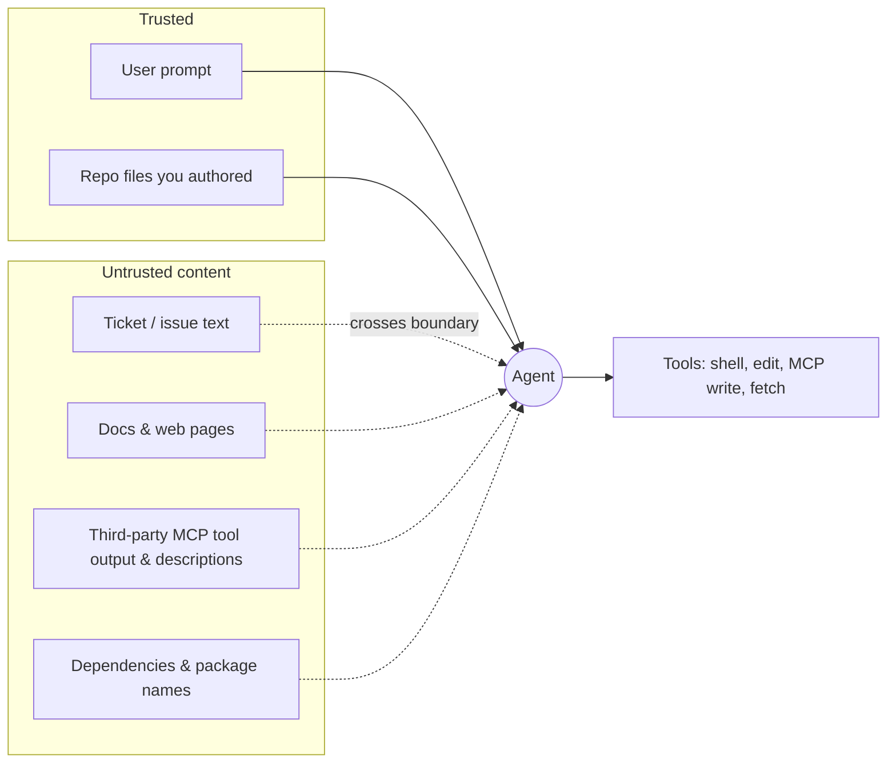

# 09.1 · Threat modeling agents

## Why it matters

Every earlier module made your coding agent more capable: it reads tickets ([08.2](../module-08/lesson-02.md)), calls tools over MCP ([08.1](../module-08/lesson-01.md)), runs shell commands, edits code, and follows a rules file you wrote ([03.2](../module-03/lesson-02.md)). Each of those is also an attack surface. The moment an agent reads text that someone else wrote — a ticket, a doc, a dependency's README, a comment on a pull request — the question is no longer "will the model do what I asked?" but "whose instructions is it actually following?"

That is not a hypothetical. In 2025 researchers showed a public GitHub issue could make an agent using the GitHub MCP server pull data out of a *private* repository and leak it through a public pull request — with no bug in the model, and independent of which model was used ([Invariant Labs](https://invariantlabs.ai/blog/mcp-github-vulnerability)). The agent did exactly what its tools allowed; the attacker just supplied the instructions.

This module is **defensive**. You are securing your own setup, not attacking anyone. And the first defensive skill is not a firewall rule — it is threat modeling: drawing where trust ends, who is acting with whose authority, and which combinations turn a bad instruction into real damage. Get the model right and the defenses in 09.5 become obvious; get it wrong and you will armor the wrong wall.

> [!NOTE]
> Content tags. **Concept** (stable): trust boundaries, identities, the lethal trifecta / Rule of Two, the OWASP threat lists. **Implementation** (as of 2026-09): the `CanaryCheck trifecta` audit and the specific ids (LLM01–LLM10, ASI01–ASI10). All lab work runs only in the local `security-lab`.

## How it works

Threat modeling an agent has three moves: name the **identities**, draw the **trust boundaries**, then test for the dangerous **combination**.

### Identities: who acts with whose authority

A traditional program runs as one identity. An agent blurs three:

- **The user** — you, with your repo and cloud access.
- **The agent** — the model plus its harness. Critically, the agent acts with the *union of every tool it can call*. If it can read secrets and open a pull request, it can do both in one breath.
- **The tools / MCP servers** — each carries its own scope (read-only schema, write-enabled Jira, a shell). A tool's authority becomes the agent's authority the instant it is connected.

The core problem: the model cannot reliably tell *its user's* instructions from instructions that merely *arrived as data*. Module 2 called this the instruction hierarchy ([02.3](../module-02/lesson-03.md)); a system prompt asks the model to prefer the developer's words, but that is a preference, not a boundary. Text is text.

### Trust boundaries: where authored intent ends

Draw a line around what *you* wrote. Everything else the agent reads is **untrusted content**, even when it comes from a system you own:



A ticket in *your* Jira is untrusted: anyone who can file a ticket can put words in it. A dependency you added is untrusted: you did not read every line. The boundary is about *who authored the text*, not who owns the server.

### The dangerous combination

An injection is only catastrophic when three capabilities meet in one session. Simon Willison named this the **lethal trifecta** ([Willison, 2025](https://simonwillison.net/2025/Jun/16/the-lethal-trifecta/)):

1. **Access to private data** (secrets, private repos, customer records),
2. **Exposure to untrusted content** (a source that can carry attacker instructions),
3. **The ability to communicate externally** (network egress, or a write/comment/PR tool).

With all three, injected text can tell the agent to read a secret and send it out. Remove any one leg and that specific outcome is impossible. Meta frames the same idea as a design rule — the **Agents Rule of Two**: an agent session should satisfy *at most two* of {untrusted input, sensitive access, external communication}; assume injection will sometimes get through and limit what a compromised session can do ([Meta AI, 2025](https://ai.meta.com/blog/practical-ai-agent-security/)).

### Mapping to the standard threat lists

Two OWASP catalogs give you shared vocabulary. The **LLM Top 10 (2025)** treats the model as input→output: LLM01 Prompt Injection, LLM02 Sensitive Information Disclosure, LLM03 Supply Chain, LLM06 Excessive Agency ([OWASP LLM](https://genai.owasp.org/resource/owasp-top-10-for-llm-applications-2025/)). The **Agentic Top 10 (2026, ASI01–ASI10)** covers the model *as an actor with tools, memory and delegated authority*: ASI01 Agent Goal Hijack, ASI02 Tool Misuse, ASI03 Identity & Privilege Abuse, ASI04 Agentic Supply Chain ([OWASP Agentic](https://genai.owasp.org/resource/owasp-top-10-for-agentic-applications-for-2026/)). This module's six attacks each map to one or more of these ids.

## Show me

Here is the baseline `security-lab` setup for Contoso Billing, audited. The agent reads tickets, docs and a third-party notes server (untrusted), can read the repo including a fake-canary `.env` (private data), and has `Bash(*)` plus network egress (external communication):

```text
$ dotnet run --project tools/CanaryCheck -- trifecta configs/baseline
Lethal-trifecta audit of .../configs/baseline
  [x] untrusted content reaches the agent (ticket / docs / notes MCP servers connected)
  [x] private data or powerful tools in reach (secrets readable: True; broad Bash: True)
  [x] an outbound channel (network egress open: True; write/comment tool: True)
TRIFECTA PRESENT: all three legs reachable in one session. An injection here can exfiltrate.
```

All three legs. The same audit on the hardened config (09.5) — read-scoped tickets only, secrets denied, egress closed — reports **Rule of Two satisfied: only 1 of 3 legs**. Nothing about the model changed; the *configuration* is what makes injection survivable or fatal.

## Try it

Budget: 60 minutes.

1. **Draw your own map.** Take the `ai-layer-lab` you built in Modules 3–6. On one page, list its identities, then every content source, marking each trusted or untrusted. Copy [`templates/agent-threat-model.md`](../../templates/agent-threat-model.md) and fill sections 1–3.
2. **Run the trifecta test** on `configs/baseline` and `configs/hardened` (Docker not required). Record which legs each has.
3. **Enumerate threats.** In section 5 of the template, list at least four threats with their OWASP ids and the concrete path each would take through *your* system (e.g. "ticket text → `get_ticket` → agent → `Bash(curl)` → out").
4. **Pick the cut.** For your top threat, name which leg of the trifecta you would remove and why that is cheaper and more reliable than trying to detect the malicious text.

<details>
<summary>Hint: I only have a local repo and Claude Code — do I even have a trifecta?</summary>

Often yes. If the agent reads issue text or fetched docs (untrusted), can read your `~/.aws` or `.env` (private data), and can run `curl` or open a PR (external comms), all three legs are present the moment you point it at an issue. The absence of an MCP server does not save you — the built-in tools supply every leg.
</details>

## Break it

> [!CAUTION]
> Local lab only. Never model or attack a real system.

A common first threat model lists the tickets server and the docs server, cuts egress, and declares victory. Add the third-party **notes** MCP server back to the picture (it is in `configs/baseline/.mcp.json`). Now answer: is the notes server trusted or untrusted? What can its *tool descriptions* do to the agent before you ever call a tool? Which OWASP id covers that, and does cutting network egress stop it?

## Fix it

**Diagnose.** The forgotten notes server is untrusted on two channels at once: its **results** are untrusted content (like any external data), and its **tool descriptions** are untrusted *and* injected straight into the agent's context at connection time — an attack we cover in 09.3 (tool poisoning, LLM03/ASI04). A threat model that omits it misses a leg.

**Modify.** Extend the trust table: every connected MCP server is an untrusted content source *and* a description source. Re-run the trifecta test with the notes server present — the lab's baseline still shows all three legs, but now you can see the notes server contributes the "untrusted" leg even if you cut the ticket server.

**Retest.** Confirm your model now names the notes server's descriptions as a distinct threat (map it to ASI04), and that your chosen cut (e.g. not connecting untrusted third-party servers in a session that also holds secrets) removes a leg.

<details>
<summary>Solution notes</summary>

The lesson is that a *tool you have not called yet* is already in your trust boundary, because its description is in your prompt. This is why 09.3 pins tool descriptions and 09.5 keeps untrusted servers out of privileged sessions. A threat model that only lists data flows, not description flows, will under-count.
</details>

## How do I know it works?

- [ ] Every content source in your system is on the map and labelled trusted or untrusted, including MCP tool descriptions.
- [ ] You can state, for your setup, how many legs of the trifecta are reachable in one session.
- [ ] Each threat has an OWASP LLM or ASI id and a concrete path, not just a name.
- [ ] For your top threat you have named the *leg to cut*, not only a filter to add.

## Use / don't use

**Use** a threat model before hardening, whenever you add a tool or MCP server, and whenever a session will touch both untrusted content and secrets. **Use** the trifecta test as the fast triage: three legs means stop and cut one.

**Don't** treat "it's my own Jira / my own repo" as trusted — authorship, not ownership, sets the boundary. **Don't** rely on the model to separate instructions from data; that is a preference, not a control (09.2). **Don't** model only data flows and forget that tool *descriptions* enter the context too.

**Limitations.** A threat model is a map, not a proof; it tells you where to look, not that you are safe. The trifecta is necessary-condition reasoning — cutting a leg blocks *exfiltration*, but not every harm (a compromised agent can still corrupt your work or waste money; see 09.4). And the OWASP lists evolve; treat the ids as a shared language, not a fixed checklist.

## Reflect

1. In your own setup, which single leg of the trifecta is cheapest for you to cut, and what would you lose by cutting it?
2. Which content source did you almost forget to mark untrusted, and why did it feel trusted?
3. Where does your agent act with more authority than any one of your tools intends?

## Sources

- [OWASP Top 10 for LLM Applications (2025)](https://genai.owasp.org/resource/owasp-top-10-for-llm-applications-2025/) — LLM01 Prompt Injection, LLM02 Sensitive Information Disclosure, LLM03 Supply Chain, LLM06 Excessive Agency.
- [OWASP Top 10 for Agentic Applications (2026)](https://genai.owasp.org/resource/owasp-top-10-for-agentic-applications-for-2026/) — ASI01–ASI10, the actor-with-authority view; published 2025-12-09.
- [Simon Willison — The lethal trifecta for AI agents](https://simonwillison.net/2025/Jun/16/the-lethal-trifecta/) — private data + untrusted content + external comms; why 95% guardrails fail.
- [Meta AI — Agents Rule of Two](https://ai.meta.com/blog/practical-ai-agent-security/) — satisfy at most two of the three properties per session; assume injection gets through.
- [Invariant Labs — GitHub MCP vulnerability](https://invariantlabs.ai/blog/mcp-github-vulnerability) — a public issue exfiltrates private-repo data; model-independent.
