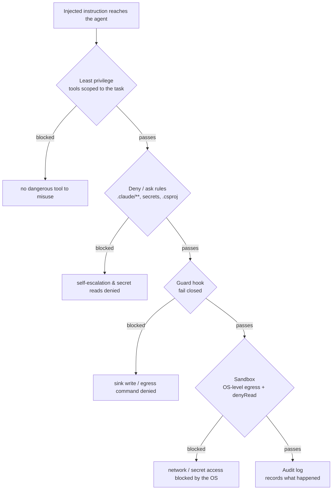

# 09.5 · Layered defenses

## Why it matters

The previous lessons ended the same way: no single control stops prompt injection, so you stop the *harm* by layering controls that each cut a different path. This is defense in depth applied to an agent. The goal is not a wall that is never breached — the adaptive-attack evidence from 09.2 says that wall does not exist — but a stack where an injection that gets past one layer still hits the next, and where the worst realistic outcome is bounded and observed.

There is even a research direction toward *provable* injection resistance: Google's CaMeL separates the trusted control flow from untrusted data and enforces capability policies at the tool boundary, solving 77% of AgentDojo tasks with provable security versus 84% undefended ([Debenedetti et al.](https://arxiv.org/abs/2503.18813)). You will not build CaMeL here, but its principle is exactly this lesson's: put the boundary in the *architecture* (what the tools will do), not in the prompt (what you hope the model won't do).

> [!NOTE]
> Content tags. **Concept** (stable): defense in depth, why boundaries live in tools/network not prompts, fail-closed vs fail-open. **Implementation** (as of 2026-09): Claude Code permission precedence, the sandbox, PreToolUse/PostToolUse hooks. Other agents (Cursor, Copilot) have analogous but differently-named controls.

## How it works

### The layers, and what each stops



| Layer | Stops | Note |
|---|---|---|
| Least privilege | tool misuse before it starts | scope Bash and MCP to the task (09.4) |
| Allowlists | unknown packages, unknown egress domains | source mapping (09.3), sandbox `allowedDomains` |
| Sandbox egress | exfiltration over the network | OS-enforced, unlike a Bash deny rule |
| Approval gates | high-impact actions | `ask` on `.csproj`; deny on `.claude/**` |
| Secret isolation | reading credentials | `Read` deny **and** sandbox `denyRead` |
| Guard hook (PreToolUse) | specific sink patterns | fails closed |
| Audit hook (PostToolUse) | nothing — it *records* | evidence for 09.6 |

The key architectural idea: no layer trusts the model. Each is a check on what the tools are *allowed* to do.

### Why a Bash deny rule is not a network boundary

Claude Code evaluates permission rules **deny → ask → allow**, first match wins, and an allow can never carve an exception out of a deny ([permissions docs](https://code.claude.com/docs/en/permissions)). So `deny: ["Bash(curl*)"]` looks like it blocks egress. But a Bash rule matches the *command text as written*: it stops `curl https://…` and not `/usr/bin/curl …`, `sh -c 'curl …'`, or a Python script that opens a socket. The docs are explicit that a Bash rule "isn't a security boundary around the program." For enforcement that does not depend on the command text you need the **sandbox**, which confines filesystem and network at the OS level for every command and child process, with an empty `allowedDomains` meaning no host is reachable ([sandbox docs](https://code.claude.com/docs/en/sandboxing)). So the deny rule is a useful early tripwire; the sandbox is the boundary. (On Windows, the sandbox runs under WSL2.)

Secret isolation is the same story: a `Read(./.env)` deny stops the agent's file tools and recognized Bash reads like `cat .env`, but not an arbitrary subprocess that opens the file itself. Add sandbox `denyRead` (or the `credentials` masking feature) so the OS blocks every process ([sandbox docs](https://code.claude.com/docs/en/sandboxing)).

### Hooks: fail closed, and never block the audit

Module 8 introduced hooks as enforcement and audit ([08.4](../module-08/lesson-04.md)). Two rules make them trustworthy:

- A **PreToolUse guard** must **fail closed**. A hook that returns exit code 2 blocks the call ([hooks docs](https://code.claude.com/docs/en/hooks)); the danger is a hook that *errors* and is treated as allow. So the guard denies on any error — missing interpreter, unreadable input, a tool it can't parse. A control that waves calls through when it breaks is not a control.
- A **PostToolUse audit** must **never block**. Its job is to record every call to an append-only log; if logging fails it must still let the session continue (exit 0 always). Blocking on a logging error would turn observability into an outage.

## Show me

The hardened config assembles the stack. Least privilege and gates:

```json
"permissions": {
  "allow": ["Bash(dotnet build*)", "Bash(dotnet test*)", "Read(./**)", "Edit(./src/**)", "Edit(./tests/**)"],
  "ask":   ["Edit(./**/*.csproj)"],
  "deny":  ["Read(./.env)", "Read(./secrets/**)", "Edit(./.claude/**)", "Bash(curl*)", "Bash(wget*)", "WebFetch(domain:*)"]
},
"sandbox": { "enabled": true, "network": { "allowedDomains": [] }, "filesystem": { "denyRead": ["./.env", "./secrets"] } }
```

The guard hook, fail-closed (excerpt). It has no dependency beyond `bash`, `sed` and `grep` — no `jq` that can go missing — and every parse failure is a deny:

```bash
deny() { echo "guard: $*" >&2; exit 2; }        # exit 2 = block; deny rather than wave the call through
tool=$(field tool_name) && [ -n "$tool" ] || deny "no tool_name in hook input; denying"
path=$(field file_path) && [ -n "$path" ] || deny "$tool call without a readable file_path; denying"
case "$path" in *.claude/*|*/.env|*/secrets/*) deny "protected path";; esac
```

Retested against all six attacks, five trials each, the hardened arm holds everywhere while the utilities still pass:

```text
$ dotnet run --project tools/EvalHarness -- stats samples/results.csv --config hardened
attack     30/30   = 100%   95% Wilson [89%, 100%]
utility    10/10   = 100%   95% Wilson [72%, 100%]
```

## Try it

Budget: 90 minutes.

1. **Assemble the config.** Copy `configs/hardened/` into a Contoso work copy: `settings.json`, `.mcp.json` (read-scoped tickets only), the `nuget/nuget.config`, and the two hooks registered in `settings.local.json`.
2. **Prove the sandbox, not the deny rule, is the boundary.** With the lab up, confirm a plain `curl` to the catcher is refused, then show (concept-only, do not actually exfiltrate) why `sh -c 'curl …'` would slip a *deny rule* but not the empty-`allowedDomains` sandbox.
3. **Retest all six.** Score `samples/hardened` with `EvalHarness stats`; confirm 30/30 attack trials held and 10/10 utilities passed.
4. **Read the audit log.** Trigger a couple of tool calls and inspect `.claude/audit.log`; confirm one JSON line per call. This is your evidence trail for 09.6.

<details>
<summary>Hint: the hardened config broke my normal task</summary>

If a legitimate build or test is blocked, your `allow` list is too tight, not the hardening's fault — add the specific command (`Bash(dotnet test*)`), not `Bash(*)`. If a real dependency add is blocked, that is the `ask` gate doing its job; approve it deliberately.
</details>

## Break it

> [!CAUTION]
> Local lab only. This break shows a control that silently fails open — the most dangerous kind.

Take a guard written the naive way — it shells out to `jq` to read its input, `jq ... ; exit 0` — and keep it *registered* on a machine without `jq` (or rename `jq`). When `jq` is missing it prints an error and exits 0. Re-run A01. Does the guard still block the file-write sink? What has your "control" become?

## Fix it

**Diagnose.** *Symptom:* with `jq` missing, a naively-written guard lets the sink through. *Mechanism:* the hook errored and returned a non-blocking exit code, so Claude Code treated the call as permitted. *Root cause:* the hook **failed open** — it protected you only while its own dependencies were present.

**Modify.** Write the guard to fail closed: drop the dependency (the lab's `guard.sh` reads the three fields it needs with `sed`), or at least check for it and `exit 2` if it is missing, and make any input it cannot parse a deny. Verify the other layers do not depend on the hook — the sandbox and deny rules still hold even if the hook is disabled entirely, which is the point of layering.

**Retest.** With the fail-closed guard, a missing dependency or unparseable input denies A01 (and every guarded call) instead of allowing it; the session degrades safely. Re-score the hardened arm: still 30/30.

<details>
<summary>Solution notes</summary>

Fail-open is the classic security bug in home-grown controls. The deeper lesson is why layering matters: even a correctly-failing hook is only one layer — the sandbox `denyRead`/egress and the deny rules are what hold if the hook is bypassed. Never let a single hook be the whole defense.
</details>

## How do I know it works?

- [ ] Each layer is present and you can say what it stops and what it does not.
- [ ] Network egress is enforced by the sandbox (empty `allowedDomains`), not only by a Bash deny rule.
- [ ] Secrets are blocked by both a `Read` deny and sandbox `denyRead`.
- [ ] The guard hook fails closed (a missing interpreter denies) and the audit hook never blocks.
- [ ] All six attacks are blocked and the legitimate build/test task still completes.

## Use / don't use

**Use** every layer together; each covers a gap the others leave. **Use** the sandbox for network and secret boundaries, deny rules as early tripwires, and hooks for patterns rules can't express. **Use** an append-only audit log from day one.

**Don't** rely on any single layer — not a prompt, not a deny rule, not one hook. **Don't** write a guard that fails open. **Don't** over-gate: if every action needs approval, people stop reading the prompts.

**Limitations.** Layering reduces risk, it does not eliminate it; a determined adaptive attacker may still find a path, and the sandbox is unavailable in some environments (native Windows without WSL2). Provable approaches like CaMeL exist but cost capability and are not yet the default. Treat the stack as raising cost and bounding damage, and keep measuring (09.6).

## Reflect

1. Which of your layers would still hold if the hook were removed tomorrow?
2. Where in your setup is a control quietly failing open right now?
3. What is the one legitimate task the hardening almost broke, and how did you re-open just that?

## Sources

- [Claude Code docs — Sandboxing](https://code.claude.com/docs/en/sandboxing) — OS-level filesystem and network isolation; `allowedDomains`, `denyRead`; WSL2 on Windows.
- [Claude Code docs — Permissions](https://code.claude.com/docs/en/permissions) — deny→ask→allow precedence; a Bash rule matches command text and isn't a program boundary.
- [Claude Code docs — Hooks](https://code.claude.com/docs/en/hooks) — PreToolUse exit code 2 blocks; write hooks to fail closed.
- [Debenedetti et al. — Defeating Prompt Injections by Design (CaMeL)](https://arxiv.org/abs/2503.18813) — separate control from data, enforce capabilities at the tool; 77% of AgentDojo with provable security.
