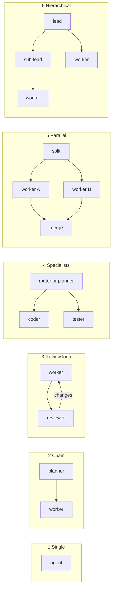
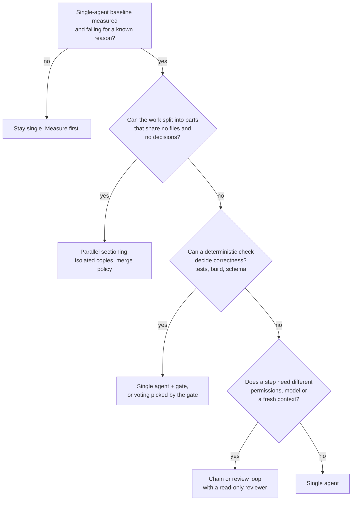

# 10.1 · Multi-agent topologies

## Why it matters

Sooner or later a client shows you a diagram with seven boxes — "architect", "planner", two "developers", "tester", "security reviewer", "release manager" — and asks whether to build it. The honest default answer is "probably not, but let's measure".

The published evidence points both ways, and a trainer who quotes one side will be wrong in front of the room:

- Anthropic's research system (a lead agent with parallel sub-agents) beat a single agent by 90.2% on an internal research evaluation, used about 15 times the tokens of a chat, and was described as a poor fit where agents share context or depend on each other, including most coding.
- A controlled study of 180 agent configurations (Google Research and collaborators) found centralized coordination improved a decomposable financial-reasoning task by 80.9%, while every multi-agent variant degraded sequential reasoning tasks by 39–70%. Independent agents amplified errors 17.2 times; an orchestrator contained it to 4.4 times.
- Cognition argues from coding agents that actions carry implicit decisions, and agents that cannot see each other's decisions produce parts that do not fit.

These are the same mechanism applied to differently shaped work. This lesson gives you the shapes, what each buys, and the task properties that decide between them; 10.2–10.4 cover coordination, cost, and a measured comparison on your own tasks.

> [!NOTE]
> Content tags. **Concept** (stable): the four mechanisms, six topologies, choosing by task properties, implicit decisions. **Implementation** (as of 2026-09): Claude Code subagents and agent teams, `AgentTeam` topologies. Module 6 ([06.3](../module-06/lesson-03.md)) covered the one-level case, a single delegated sub-agent; this module is about systems of several.

## How it works

### What an extra agent can buy

An agent is a model in a loop with tools and a context window ([02.4](../module-02/lesson-04.md)). Adding a second one changes only four things mechanically, the same four you met for sub-agents in 06.3, now multiplied:

| Mechanism | What it gives you | What it costs |
|---|---|---|
| **Context isolation** | Each agent starts clean; long exploration stays out of the caller's window | The handoff is lossy: the next agent knows only what was written down |
| **Parallelism** | Wall-clock time drops to the slowest branch | Tokens add up across branches; outputs must be merged |
| **Independent check** | A reviewer that did not write the work and has not seen the reasoning | One more call per round, and a loop that may not terminate |
| **Specialization** | Different tools, permissions or models per step (a read-only reviewer, a cheaper planner) | More configuration to version, review and evaluate |

A persona ("You are a senior security architect") is not on the list. It changes wording, not mechanism, and a role that differs from its neighbour only in its persona is one agent split in two for no gain.

### Six topologies

Anthropic's "Building effective agents" names the workflow patterns that most multi-agent designs are built from: prompt chaining, routing, parallelization (sectioning and voting), orchestrator-workers, and evaluator-optimizer. For coding work, six shapes cover almost every diagram you will be shown:



| # | Topology | Mechanism it buys | Typical coding use | Fails when |
|---|---|---|---|---|
| 1 | Single agent | none needed | most tickets | context overflows even after a context audit (Module 4) |
| 2 | Chain (planner → worker) | isolation, a reviewable artifact between steps | plan in plan mode, implement in a fresh session (Module 5) | the plan omits a decision the worker then makes differently |
| 3 | Review loop (worker ↔ reviewer) | independent check | PR review before a human sees it | the reviewer shares the worker's blind spots, or disagrees forever (10.3) |
| 4 | Specialists (route or split by concern) | specialization | a read-only security reviewer; a cheap triage model | the concerns share names, interfaces or files (this lesson's break) |
| 5 | Parallel (sectioning or voting) | parallelism | research across folders; N attempts and pick the one that passes tests | the parts touch the same files (10.2) |
| 6 | Hierarchical (orchestrator → workers, nested) | isolation at scale | large research, migrations across many independent services | errors compound through each level (10.3) |

Topology 5 has two variants. **Sectioning** splits one job into parts and is only as good as the split. **Voting** runs the *same* job several times and lets a check pick one; with tests as the check it is often the cheapest reliability gain available — and it is extra compute, not collaboration, a distinction 10.4 depends on.

### Choosing from task properties

Most of the decision comes from three questions about the work, not about the agents:



The middle question does most of the work in a .NET shop. Compilation and tests are a reviewer with perfect precision on what they check; a model reviewer earns its place only on what they cannot check (architecture rules, acceptance criteria no test covers, security smells).

**Coupling is the property people skip.** "Implement BILL-151 and write its tests" looks decomposable into code and tests. It is not: both halves must agree on the record's name, its constructor order, the method's signature. Each of those is an *implicit decision* — made silently by whoever writes it first. In one agent, the second half reads the first. In two parallel agents, both make it, independently.

### Where topologies live in tools (implementation, as of 2026-09)

| Topology | Claude Code | Other tools |
|---|---|---|
| Hierarchical, one level | Subagents ([06.3](../module-06/lesson-03.md)): the main session delegates, each subagent returns one message | Cursor and Copilot agent modes have comparable delegation; formats differ |
| Team with shared task list | **Agent teams** (experimental, off by default): a lead, teammates with their own context, a shared task list with dependencies, direct messaging. Not spawned in `-p` mode. The docs themselves warn that two teammates editing the same file leads to overwrites and that teams use significantly more tokens | vendor-specific |
| Any topology, deterministic | A **headless pipeline in code**: each agent is a `claude -p` session with its own role prompt and permissions, and ordinary code decides who runs next | any CLI agent |

The last row is what `labs/module-10/tools/AgentTeam` is: orchestration in C#, one `claude -p` call per agent, a trace line per call, and output in EvalHarness's format so Module 7's `grade` and `compare` work unchanged. Orchestration in code is less clever than letting a lead model decide, and much easier to evaluate and debug, which is why this module uses it.

[Simulation: Multi-agent — topologies side by side](../../simulations/multi-agent/index.html?preset=topologies)

## Show me

T18 (BILL-152: an invoice is overdue *from* its due instant, `<` becomes `<=`) as one agent and as planner → worker → reviewer, using the scripted offline agent so the numbers are repeatable:

```text
$ dotnet run --project tools/AgentTeam -- run $T --repo $B --out runs/t18-single --topology single --only T18 --trials 1 --agent fake:scenarios/t18-pipeline.json
  golden tests: 4/4 passed, 0 failed, 0 skipped; changed 2 file(s)
  stop done after 1 round(s), 1 call(s), $0.1400, 112 s

$ dotnet run --project tools/AgentTeam -- trace runs/t18-pwr --task T18 --trial 1
T18.r1  invoke_workflow pwr  stop: approved  rounds: 1  calls: 3  cost: $0.2100  wall: 170 s
| start s | dur s | span | round | cost $ | in tokens | verdict | detail |
| 0   | 41 | invoke_agent planner  | 1 | 0.0500 | 23,000 |         |  |
| 41  | 96 | invoke_agent worker   | 1 | 0.1200 | 52,000 |         | files: src/.../InvoiceService.cs, tests/.../InvoiceServiceTests.cs |
| 137 | 33 | invoke_agent reviewer | 1 | 0.0400 | 27,000 | APPROVE | No findings |
agent time 170 s over 170 s wall-clock (parallelism 1.00x)
outcome: golden tests: 4/4 passed, 0 failed, 0 skipped
```

Same outcome; the pipeline cost 1.5× and took 1.5× as long. Nothing went wrong, and that is the point: on a one-line fix with a test, the planner restated the ticket and the reviewer confirmed what the tests already proved. Three agents bought an independent check this task did not need. (Costs are the scenario's scripted values; 10.4 measures real ones.)

Your Module 6 layer reads the same way: `prime` → `researcher` is a one-level hierarchy bought for isolation; `pr-review` → `reviewer` is a review loop whose second iteration is a human. Both are justified by a mechanism, not a persona.

## Try it

Budget: about 60 minutes, offline. From `labs/module-10`, with `H`, `T` and `B` set as in the lab README.

1. **Classify.** For each workflow, pick a topology and name the mechanism it buys, or say "single":
   (a) research a ticket across `src/`, `db/` and `docs/adr/`; (b) implement BILL-151 with tests; (c) review a 40-file PR for security, SQL and test coverage; (d) rename `SqlHelper` across 60 files; (e) answer "which index supports CustomerId + Status?"; (f) upgrade 12 independent microservices to .NET 10.
2. **Run** the two T18 commands above and `trace` both. Open `runs/t18-pwr/handoff/T18.r1/` and read the three messages in order: this is everything each agent knew.
3. **Design.** Pick one workflow from your own repository that someone has proposed to split into agents. Fill in sections 1–2 of the [multi-agent design template](../../templates/multi-agent-design.md) as `agent-evals/designs/<workflow>.md`.

<details>
<summary>Solution notes for step 1</summary>

(a) Parallel sectioning or a one-level hierarchy: read-only, the folders share no decisions, and isolation keeps 50k tokens of search out of the main context. (b) Single agent, or a chain with pinned interfaces: code and tests share names; see Break it. (c) Specialists as parallel *read-only* reviewers is defensible: independent lenses, no writes, merge is concatenation. (d) Single agent with a script, or a deterministic codemod: one decision (the new name) applied everywhere; parallel agents would each re-decide it. (e) Single agent; a planner would cost more than the answer. (f) Parallel workers in isolated copies, if the services truly share no code; a verified single-agent run on one service first.
</details>

## Break it

> [!CAUTION]
> Offline and in a copy: the scripted agent edits a working copy under `runs/`, never your repository.

A team wants T19 (BILL-151: add `CollectionsSummaryAsync` and a `CollectionsSummary` record, with tests) done faster. They split it between a **coder** and a **tester** who run in parallel from the planner's plan, each in its own copy, and merge the results. As in most orchestrator-worker designs, each specialist gets its part of the work — the plan — not the ticket.

```bash
$H run $T --repo $B --out runs/t19-spec --topology specialists --only T19 --trials 1 --agent fake:scenarios/specialists-t19.json
```

Predict before running: the coder's code is correct, and so is the tester's logic. What fails, and where in the trace would you look?

## Fix it

**Diagnose.**

```text
  build failed: error CS0246: The type or namespace name 'CollectionSummary' could not be found
  stop done after 1 round(s), 3 call(s), $0.2600, 126 s

$ dotnet run --project tools/AgentTeam -- trace runs/t19-spec --task T19
| 0  | 38 | invoke_agent planner | 1 | 0.0500 | 24,000 | |  |
| 38 | 88 | invoke_agent coder   | 1 | 0.1200 | 51,000 | | files: src/.../CollectionsSummary.cs, src/.../InvoiceService.cs |
| 38 | 71 | invoke_agent tester  | 1 | 0.0900 | 43,000 | | files: tests/.../CollectionSummaryTests.cs |
agent time 197 s over 126 s wall-clock (parallelism 1.56x)
```

1. *Symptom:* the build breaks in the tester's file: it uses `CollectionSummary` and `GetCollectionSummaryAsync`; the coder wrote `CollectionsSummary` and `CollectionsSummaryAsync`.
2. *Where:* `handoff/T19.r1/01-planner-r1.md`. Its `## Interfaces` section says "an async method that returns the collections summary" and "a summary record with decimal Owed and decimal Overdue". The names the ticket states exactly were paraphrased away. The plan passed the orchestrator's contract check, because the check only looks for the section.
3. *Mechanism:* two agents each made the same implicit decision (the names) in isolation. Neither could see the other, and neither had the ticket. Parallelism saved 43 seconds and cost correctness.
4. *Class:* inter-agent misalignment, one of the three failure categories in the MAST taxonomy of multi-agent failures (10.3), produced here by a topology that does not fit coupled work.

**Modify.** Two fixes, in order of preference:

- *Topology:* coupled work goes to one worker. `--topology pw` gives one worker the plan and the ticket; it writes code and tests together.
- *Contract:* if you must split, pin the interfaces first (the `planner` role says "never leave a name for the worker to choose"), give every specialist the ticket, and make the orchestrator check that every identifier the ticket names appears verbatim in the plan.

**Rerun.**

```text
$ dotnet run --project tools/AgentTeam -- run $T --repo $B --out runs/t19-pw --topology pw --only T19 --trials 1 --agent fake:scenarios/specialists-t19.json
  golden tests: 3/3 passed, 0 failed, 0 skipped; changed 3 file(s)
  stop done after 1 round(s), 2 call(s), $0.2200, 169 s
```

<details>
<summary>Solution notes</summary>

The fix is cheaper than the break ($0.22 vs $0.26) and 43 seconds slower. That trade is the lesson in miniature: parallelism buys wall-clock time and pays in tokens and in decisions made twice. When a team says "the agents are faster", ask what finished faster, and whether it compiled.
</details>

## How do I know it works?

- [ ] You can name, for any proposed agent, which of the four mechanisms it buys; a box that buys none is removed from the design.
- [ ] Your design document answers the five task-property questions in section 1 of the template, with the single-agent baseline stated (or marked "not yet measured", which blocks adoption).
- [ ] Every split in your design lists the decisions the parts share, and each is pinned in the plan or kept in one agent.
- [ ] You reproduced the specialists break and its fix, and can point to the plan line that caused it.

## Use / don't use

**Use** a chain when a reviewable artifact between steps has value (a plan a human approves). **Use** parallel sectioning for read-heavy work split along boundaries that share nothing: folders for research, independent services for upgrades. **Use** voting when a deterministic check can pick the winner. **Use** a separate reviewer when it needs different permissions or when not having seen the reasoning is the point.

**Don't** split coupled work (code and its tests, an interface and its callers) across agents that cannot see each other. **Don't** add a model reviewer for what the compiler and tests already check. **Don't** design from personas or from the number of boxes on a slide.

**Limitations.**

- The published results come from research and reasoning benchmarks, not your repository. They show that topology must fit the task, not which one fits yours; only your own comparison does (10.4).
- Model-driven orchestration (a lead model decides whom to spawn) is more flexible than the code-driven pipeline used here and much harder to evaluate; Anthropic reported early versions spawning 50 subagents for simple queries.
- Agent-team features are experimental and change quarterly; the topologies and questions do not.

## Reflect

1. Which multi-agent diagram have you seen that no task property justified?
2. Which of your team's workflows is actually coupled work presented as decomposable?
3. Which mechanism — isolation, parallelism, independent check, specialization — would you pay for first in your repository, and why?

## Sources

- [Anthropic Engineering — Building effective agents](https://www.anthropic.com/engineering/building-effective-agents) — prompt chaining, routing, parallelization (sectioning, voting), orchestrator-workers, evaluator-optimizer; start simple and add complexity only when it demonstrably improves outcomes.
- [Anthropic Engineering — How we built our multi-agent research system](https://www.anthropic.com/engineering/multi-agent-research-system) — 90.2% over single-agent on an internal research eval; about 15× chat tokens; poor fit where agents share context or have many dependencies, most coding less parallelizable; early versions spawned 50 subagents for simple queries.
- [Cognition — Don't Build Multi-Agents](https://cognition.com/blog/dont-build-multi-agents) — actions carry implicit decisions; agents that do not share context produce conflicting parts.
- [Kim et al. (2025) — Towards a Science of Scaling Agent Systems](https://arxiv.org/abs/2512.08296) and the [Google Research summary](https://research.google/blog/towards-a-science-of-scaling-agent-systems-when-and-why-agent-systems-work/) — 180 configurations; +80.9% with centralized coordination on decomposable financial reasoning; −39% to −70% for every multi-agent variant on sequential reasoning; error amplification 17.2× (independent) vs 4.4× (centralized). The arXiv abstract of the later version reports 260 configurations and a range from +80.8% to −70.0%.
- [Cemri et al. (2025) — Why Do Multi-Agent LLM Systems Fail?](https://arxiv.org/abs/2503.13657) — the MAST taxonomy: 14 failure modes in three categories (system design, inter-agent misalignment, task verification), from 1,600+ annotated traces across 7 frameworks.
- [Claude Code docs — Agent teams](https://code.claude.com/docs/en/agent-teams) — experimental and off by default; lead, teammates, shared task list with dependencies and file-locked claiming, mailbox; not spawned under `-p`; significantly more tokens; two teammates editing the same file leads to overwrites (as of 2026-09).
