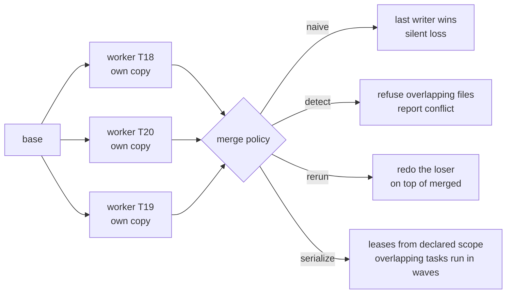

# 10.2 · Coordination: handoffs, shared state and conflicts

## Why it matters

A single agent cannot disagree with itself about a file name, cannot overwrite its own edit from ten minutes ago without seeing it, and never has to explain its plan to anyone. Every one of those becomes possible the moment there are two agents. The failures move from inside an agent (Module 2's taxonomy) to the **seams between agents**: what one wrote down for the other, which files both touched, and who wins when they disagree.

The MAST study of more than 1,600 annotated traces from seven multi-agent frameworks sorted failures into three categories: system design issues, **inter-agent misalignment** (about a third of failures), and task verification. The middle one is this lesson — its modes include information withholding, ignoring another agent's input, failing to ask for clarification, and task derailment. None of it is fixed by a better model. It is fixed by the same things that make two human developers work on one codebase: written contracts, ownership, and a rule for who decides.

This lesson turns the module's required break into a lab: three workers, three Contoso tickets, one `InvoiceService.cs`.

> [!NOTE]
> Content tags. **Concept** (stable): handoff contracts, ownership, merge policies, precedence. **Implementation** (as of 2026-09): `AgentTeam parallel`, Claude Code worktrees and `isolation: worktree`, the agent-team task list.

## How it works

### Handoffs: a contract on every edge

A handoff is everything the next agent will ever know about the work so far. Sub-agents in 06.3 taught that the return message is lossy; in a pipeline, every edge is lossy, and the losses compound. Anthropic's research-system write-up found that sub-agents given short, vague instructions duplicated each other's work or left gaps, and that each delegation needed an objective, an output format, guidance on tools and sources, and clear boundaries.

For each edge, write five things down:

| Field | Planner → worker in `AgentTeam` | Why |
|---|---|---|
| **Content** | the plan, and the ticket | 10.1: a worker without the ticket re-decides what the ticket already decided |
| **Shape** | `## Plan`, `Touch:`, `## Interfaces`, `## Checks`, `## Open questions` | a fixed shape is checkable |
| **Pointers, not copies** | file paths and symbols, not pasted file contents | pasted content is stale the moment another agent edits the file |
| **Validation (code)** | the orchestrator checks the sections exist; better: that every identifier in the ticket appears verbatim under `## Interfaces` | a model asked "is this plan good?" is another agent to evaluate |
| **On invalid** | retry once with the error, then stop and escalate | a silent pass-through is how the specialists break happened |

`AgentTeam` stores every message under `handoff/<task>.r<trial>/` (`01-planner-r1.md`, `02-worker-r1.md`, …). That folder *is* the pipeline's shared memory, and the first place you look when a result is wrong.

### Shared state: three models, one rule

| Model | Example | Write conflicts | Good for |
|---|---|---|---|
| **Shared artifact** | the working copy or branch every agent edits | yes, on every file two agents touch | sequential pipelines (one writer at a time) |
| **Message log** | the handoff folder; agent-team mailboxes | none: each agent appends its own file | plans, reviews, findings |
| **Task list** | the agent-team shared task list: claims use file locking, tasks can depend on tasks | on the list only, handled by locks | distributing independent work |

The rule that covers all three: **every mutable thing has exactly one owner at a time.** A plan's `Touch:` line (Module 5) is an ownership claim, and in a multi-agent system it becomes a *lease*: while worker A holds `InvoiceService.cs`, nobody else writes it.

### Parallel writers: isolation, then a merge policy

Isolation gives each writer its own copy: a folder copy in `AgentTeam`, a git worktree in Claude Code (`claude --worktree <name>`, or `isolation: worktree` in a subagent's front-matter). Isolation stops agents from trampling each other *while they work*. It does not remove the conflict; it moves it to the merge. The Claude Code agent-teams docs say it plainly: two teammates editing the same file leads to overwrites, so break the work so each owns different files.



| Policy | Correctness | Wall-clock | Cost | Use when |
|---|---|---|---|---|
| naive | loses work silently | fastest | lowest | never, for writers |
| detect | safe, incomplete | fast | low | as the minimum; a human resolves |
| rerun | safe, complete | slowest (parallel, then serial redo) | highest: the losers run twice | overlaps are rare and unpredictable |
| serialize | safe, complete | the sum of the overlapping tasks | same as naive | overlaps are predictable from scope |

A textual three-way merge (`git merge`) is a fifth option and a trap: two agents that each add a private `Owed` helper to the same class can merge cleanly and fail to compile, or compile and do the wrong thing. A clean merge proves the lines did not collide, not that the decisions agree.

### Conflicting outputs: precedence, not votes

When agents disagree — a reviewer wants `<`, the plan says `<=` — there are four ways to decide:

- **Last writer** wins. Not a policy, an accident.
- **Majority vote** among agents. Works for independent samples of the same question (voting in 10.1), not for a disagreement about what the requirement is: three copies of the same model share the same prior.
- **An arbiter agent.** Adds a third opinion and another call; it still has no authority the others lack.
- **Precedence.** A fixed order of sources, written in the design, that each finding must cite: the task's acceptance criteria, then project rules (`AGENTS.md`, ADRs), then role preferences. A finding that cites nothing is dropped; a conflict precedence cannot settle goes to a person.

This is the instruction hierarchy from [02.3](../module-02/lesson-03.md) applied between agents. It has a security corollary: a message from another agent is data, not an instruction with your authority. Claude Code's agent teams tell the receiving agent that a message came from another session, and a teammate cannot approve a permission on your behalf. Treat your own pipelines the same way — an agent that reads an injected ticket ([09.2](../module-09/lesson-02.md)) can pass the injection on in its handoff, so the trust boundaries from [09.1](../module-09/lesson-01.md) run between agents too.

## Show me

T18, T19 and T20 as three parallel workers from the same base, scripted so they finish at 64, 97 and 142 seconds. All three edit `InvoiceService.cs` and add a test to `InvoiceServiceTests.cs`, as a real agent would.

```text
$ dotnet run --project tools/AgentTeam -- parallel $T --repo $B --out runs/par-naive --only T18,T19,T20 --merge naive --agent fake:scenarios/clobber.json
  T18 finished at 64 s: merged 2 file(s)
  T20 finished at 97 s: merged 2 file(s)
  T19 finished at 142 s: merged 3 file(s)

| task | merge  | golden tests on the merged result |
| T18  | merged | FAIL: golden tests: 3/4 passed, 1 failed, 0 skipped |
| T19  | merged | PASS: golden tests: 3/3 passed, 0 failed, 0 skipped |
| T20  | merged | FAIL: build failed: error CS1061: 'InvoiceService' does not contain a definition for 'DaysOverdue' |

the merged branch's own test suite (what CI would run): GREEN: 7/7 passed, 0 failed
1/3 tasks correct on the merged result (golden tests) | wall-clock 142 s | agent calls 3 | cost $0.43
```

Read the last two lines together. Every worker reported "tests passed" (true, in its own copy). The merge reported three successes. CI on the merged branch is green. Two of the three tickets are gone — and so are their tests, because each worker's test lived in the same file that the last writer overwrote. Only the hidden golden tests from Module 7 see it.

The same three workers under the other policies:

| Policy | Tasks correct | Wall-clock | Agent calls | Cost |
|---|---|---|---|---|
| naive | 1/3 (CI green) | 142 s | 3 | $0.43 |
| detect | 1/3, two CONFLICTs reported | 142 s | 3 | $0.43 |
| rerun | 3/3 | 381 s | 5 | $0.75 |
| serialize | 3/3, waves `[T18] -> [T19] -> [T20]` | 303 s | 3 | $0.43 |

`serialize` read each task's declared scope, saw that all three can touch `src/Contoso.Billing/Invoices/InvoiceService.cs`, and ran them one after another: no parallelism left, and no loss either. When every task touches the hot file, the correct parallel plan *is* sequential, and a single agent doing the three tickets in one session would have been simpler.

## Try it

Budget: about 75 minutes, offline, from `labs/module-10`.

1. Run `parallel` with all four policies (`--out runs/par-<policy>`). Fill in the table above from your own output.
2. For `naive`, open `runs/par-naive/parallel-naive.trace.jsonl`: the span notes say which worker overwrote which file from whom. Then diff `runs/par-naive/merged/src/Contoso.Billing/Invoices/InvoiceService.cs` against the base.
3. Write section 3 (handoffs) and section 4 (shared state and conflicts) of your [multi-agent design](../../templates/multi-agent-design.md) from 10.1: one row per edge, an owner for every file, a merge policy, and a precedence order.
4. Optional, with git: in a clone of Contoso, `git worktree add ../m10-t18 -b t18` and `../m10-t20 -b t20`, make the T18 and T20 changes by hand (or with two `claude --worktree` sessions), and merge both branches. Does git report a conflict? Does the merge compile?

<details>
<summary>Hint for step 4</summary>

T18 changes the `IsOverdue` line; T20 inserts `DaysOverdue` just above it. Depending on exactly where each edit lands, git either merges cleanly or reports a conflict in adjacent lines. Either way, the answer to "is the merged code right?" comes from building and running the tests, not from the merge.
</details>

## Break it

> [!CAUTION]
> Offline, in copies under `runs/`. With `--agent claude`, three real agents edit three copies of the repository at once; keep `--budget-usd` and never point `--repo` at a working tree you care about.

The break is the naive run in Show me: three workers edit the same file; the orchestrator copies each result back when it finishes. Before you look at the golden column, predict from the completion times alone which ticket survives, and what the merged branch's own tests will say.

## Fix it

**Diagnose.**

1. *Symptom:* CI green, 1 of 3 tickets correct. A human reviewer who reads only the final diff sees a clean T19 change and nothing else.
2. *Evidence:* the trace notes on the T20 and T19 spans: `overwrote src/Contoso.Billing/Invoices/InvoiceService.cs (from T18)` and `(from T20)`. The completion order (64 s, 97 s, 142 s) predicts the survivor.
3. *Mechanism:* a shared mutable file with no owner. Isolation during work made each worker's tests pass in its own copy, which hid the problem until the merge; last-writer-wins then discarded two changes and their tests together.
4. *Class:* inter-agent misalignment at the shared-state seam, caused by a design with isolation but no merge policy.

**Modify.** Decide before running, from the plan: if tasks declare overlapping `Touch:` sets, `serialize` them (leases); if overlaps are rare and unpredictable, `detect` at minimum and `rerun` the loser on top of the merged state. Add the policy to section 4 of your design. And check the precondition 10.1 skipped: if every task touches the same class, parallel workers were the wrong topology.

**Rerun.**

```text
$ dotnet run --project tools/AgentTeam -- parallel $T --repo $B --out runs/par-serialize --only T18,T19,T20 --merge serialize --agent fake:scenarios/clobber.json
leases: 3 wave(s): [T18] -> [T19] -> [T20]
the merged branch's own test suite (what CI would run): GREEN: 9/9 passed, 0 failed
3/3 tasks correct on the merged result (golden tests) | wall-clock 303 s | agent calls 3 | cost $0.43
```

Nine tests now, not seven: all three workers' tests survived.

<details>
<summary>Solution notes</summary>

`detect` is the cheapest safe policy and the one to make default: it turns a silent loss into a visible conflict. `rerun` costs two extra agent calls here and took longest, because the losers waited for the fastest worker and then ran again. `serialize` has the same cost as naive and is correct, but its wall-clock time equals doing the work in sequence, which is the honest measure of how parallel this work really was.
</details>

## How do I know it works?

- [ ] Your design has a row for every handoff edge with a validation step that is code, not a model.
- [ ] Every file that more than one agent can write has an owner or a lease rule, and the merge policy is named.
- [ ] Your precedence order is written, and your reviewer role requires each finding to cite a source from it.
- [ ] You can reproduce the naive break and explain, from the trace notes, why CI stayed green.

## Use / don't use

**Use** a message log (one file per message) for plans, reviews and findings: it cannot conflict and it doubles as the debugging record. **Use** isolation plus `detect` as the floor for any parallel writers, `serialize` when overlap is visible in the plans. **Use** precedence with citations to settle disagreements, and a person for what precedence cannot settle.

**Don't** let two agents write the same file without a lease. **Don't** trust a clean textual merge, a green suite, or an agent's "tests passed" as evidence that nothing was lost. **Don't** settle requirement disagreements by vote or by a third model.

**Limitations.**

- `serialize` predicts overlap from declared scope; a worker that edits outside its `Touch:` line escapes the lease. Enforce scope (Module 5's scope gate) or detect at merge as well.
- Golden tests caught the loss here because the lab has them. In your repository, the equivalent is a check derived from each ticket's acceptance criteria, run after the merge.
- Message logs grow; an agent that must read the whole log to act has the context problem of Module 4 again.

## Reflect

1. Which file in your codebase would every parallel agent touch?
2. Where in your current AI layer does one agent's output reach another without any validation step?
3. What is your team's precedence order today, and is it written anywhere an agent can read it?

## Sources

- [Cemri et al. (2025) — Why Do Multi-Agent LLM Systems Fail?](https://arxiv.org/abs/2503.13657) — MAST: 14 failure modes in three categories (system design, inter-agent misalignment, task verification); 1,600+ annotated traces, 7 frameworks, kappa 0.88.
- [Anthropic Engineering — How we built our multi-agent research system](https://www.anthropic.com/engineering/multi-agent-research-system) — vague delegations led sub-agents to duplicate work or leave gaps; each needs objective, output format, tool guidance and boundaries; the lead cannot steer sub-agents mid-run.
- [Claude Code docs — Agent teams](https://code.claude.com/docs/en/agent-teams) — shared task list with dependencies and file-locked claiming; two teammates editing the same file leads to overwrites; messages from other sessions are marked as such and cannot approve on the user's behalf (as of 2026-09).
- [Claude Code docs — Run parallel sessions with worktrees](https://code.claude.com/docs/en/worktrees) — `--worktree`, `isolation: worktree` for subagents; worktrees isolate file edits (as of 2026-09).
- [Git documentation — git-worktree](https://git-scm.com/docs/git-worktree) — multiple working trees attached to one repository.
