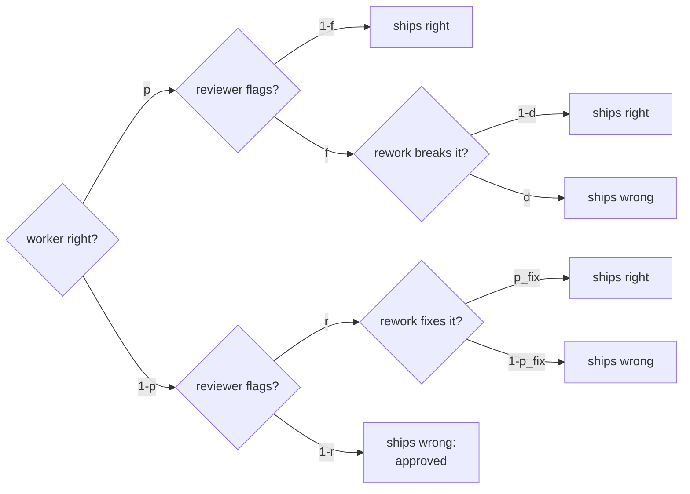

# 10.3 · Cost, latency and failure propagation

## Why it matters

The module's sample question is a vendor pitching a seven-agent pipeline for PR review. The three numbers to ask for are the three this lesson computes: **success rate against one agent on the same tasks (with an interval), cost per successful task, and p90 latency.** Every agent you add multiplies the first two ways it can go wrong and adds a term to the third.

Two published observations frame the arithmetic. Anthropic reported that in its browsing evaluation, token usage alone explained 80% of the variance in performance, and that its multi-agent system used about 15 times the tokens of a chat: more agents often win by spending more, which is a cost you can compare against spending it on one agent (10.4). And agents are stateful, so errors compound: the scaling study from 10.1 measured errors amplified 17.2 times when independent agents never checked each other, and 4.4 times with a coordinator.

This lesson gives you the equations, a tool that evaluates them (`AgentTeam estimate`), and the trace you read when the numbers go wrong.

> [!NOTE]
> Content tags. **Concept** (stable): expected cost and rounds, critical path, $\prod p_i$, the reviewer equation, trace-based debugging. **Implementation** (as of 2026-09): `AgentTeam estimate/trace`, the OpenTelemetry GenAI agent-span conventions (status: Development). Prices below are illustrative; use your own from traces.

## How it works

### Cost: count calls, not agents

*Intuition.* Every agent call starts a fresh context: system prompt, tools, project rules, the handoff, plus whatever it reads. A reviewer that re-reads the files the worker read pays for them again. Cost scales with **calls**, and a loop turns one agent into several calls.

*Equation.* For one task,

$$C = \sum_{\text{calls } i} \left(T^{\text{in}}_i\,\pi_{\text{in}} + T^{\text{out}}_i\,\pi_{\text{out}}\right)$$

For a review loop capped at $R$ rounds, where each round is approved with probability $a$, the expected number of review rounds is

$$\mathbb{E}[\text{rounds}] = \sum_{k=0}^{R-1}(1-a)^k = \frac{1-(1-a)^R}{a}$$

*Tiny example.* $a = 0.6$, $R = 3$: $1 + 0.4 + 0.16 = 1.56$ rounds. Uncapped it would be $1/a = 1.67$. At $a = 0$ — a reviewer that never approves — it is $R$ with a cap and unbounded without one. With the T18 scenario's prices, round 1 costs $0.05 + 0.12 + 0.04 = \$0.21$ and each further round (replan, rework, review) $\$0.15$; a $1.00 budget allows $1 + \lfloor (1.00-0.21)/0.15 \rfloor = 6$ rounds before it stops.

*Implementation.* `AgentTeam trace <runs>` prints each role's share of cost and the rounds distribution from real runs; `AgentTeam estimate` combines per-call costs with the loop probabilities.

*Interpretation.* Per call, the reviewer is cheap. The loop is not: its cost is set by $a$, which you do not control directly — a reviewer that asks for changes more often is a more expensive pipeline, whether or not it is a better one.

### Latency: the critical path

Sequential stages add; parallel stages cost their slowest branch; the task takes as long as its longest path. The specialists run in 10.1: $38 + \max(88, 71) = 126$ s, against $38 + 131 = 169$ s for one worker. Parallelism shortens only the parallel section; the planner, the merge and any review stay serial, so the speed-up is capped the way Amdahl's law caps any parallel program.

Loops matter more for the tail than for the median. Most tasks finish in round 1; the few that go to round 2 take twice as long, and those are what users remember. Always report p90 next to the median.

### Failure propagation: $\prod p_i$ and the reviewer equation

*Intuition.* In a chain, every stage must succeed. You met the arithmetic in [02.2](../module-02/lesson-02.md) as $p^k$ for $k$ independent runs.

*Equation.* A chain of independent stages: $P = \prod_i p_i$. A planner that is right 95% of the time feeding a worker that succeeds 65% of the time on a sound plan: $0.95 \times 0.65 = 0.62$. That beats a single agent only if the plan raises the worker's success above what one agent achieves alone.

A reviewer adds a way to *recover*, and a way to *break*. Let $p$ be the worker's success, $r$ the reviewer's recall on wrong results, $f$ its false-alarm rate on right ones, $p_\text{fix}$ the chance a flagged wrong result is fixed, and $d$ the chance that "fixing" a right result breaks it. With one review round:

$$P_1 = \underbrace{p(1-f)}_{\text{approved right}} + \underbrace{p\,f\,(1-d)}_{\text{flagged, survives rework}} + \underbrace{(1-p)\,r\,p_\text{fix}}_{\text{caught and fixed}}$$

so the reviewer changes success by $(1-p)\,r\,p_\text{fix} - p\,f\,d$: rescues minus damage.

*Tiny example.* $p = 0.65$, $r = 0.7$, $f = 0.15$, $d = 0.1$, $p_\text{fix} = 0.6$: $P_1 = 0.553 + 0.088 + 0.147 = 0.787$, a gain of about 14 points. Now a question task where one agent already succeeds 88% of the time, the reviewer is the same model and catches little ($r = 0.35$), and rewriting a terse correct answer often breaks it ($d = 0.35$): gain $= 0.12 \times 0.35 \times 0.5 - 0.88 \times 0.15 \times 0.35 = 0.021 - 0.046 = -2.5$ points. The reviewer makes it worse.

*Implementation.* `AgentTeam estimate pipelines/code-task.json` computes this exactly over up to $R$ rounds, with costs and latencies; `--set reviewer.recall=0.3` shows the sensitivity.

*Interpretation.* The equation assumes the reviewer's misses are independent of the worker's mistakes. A reviewer on the same model, reading the same context, shares the worker's blind spots, so its effective $r$ on exactly the errors that matter is lower than any calibration on random errors suggests. Huang et al. found that models asked to review and correct their own reasoning without external feedback struggled and sometimes got worse. The strongest reviewer is not a model: it is the compiler and the tests, with $r$ near 1 and $f$ near 0 on what they check.



[Simulation: Multi-agent — reliability and cost compounding](../../simulations/multi-agent/index.html?preset=compounding)

### Tracing: find the origin, not the symptom

A multi-agent failure surfaces at the last span and usually starts earlier: a plan that left a name open, a reviewer rule that contradicts the ticket. You find it only if every call is recorded. The OpenTelemetry GenAI conventions (still in Development status) describe the shape: an `invoke_agent {gen_ai.agent.name}` span per agent call, with token usage attributes, under one trace per task. `AgentTeam` writes the same shape as JSON lines: role, round, start, duration, cost, tokens, verdict, finding, files touched, and on the root span the **stop reason**.

The MAST taxonomy is a checklist for reading them. In a trace, *step repetition* and *unaware of termination conditions* look like the same span pair repeating; *incorrect verification* is a reviewer APPROVE on a result that fails; *information withholding* is a handoff without the fact the next span needed.

Three stops keep a loop from becoming a bill: a **round cap**, a **hard budget** per task, and an **oscillation rule** — if the planner kept its plan and the reviewer repeats the same finding, stop and escalate to a person.

## Show me

`AgentTeam estimate` on the two illustrative pipelines in `labs/module-10/pipelines/`:

```text
Code task: single agent vs planner -> worker -> reviewer
| single agent                           | 0.600 | $0.300 | 180 s | $0.500 |
| planner -> worker                      | 0.627 | $0.310 | 195 s | $0.494 |
| planner -> worker -> reviewer (max 3)  | 0.819 | $0.559 | 346 s | $0.683 |
review loop: expected rounds 1.47; P(stopped at max rounds) 0.037; P(reviewer approved a wrong result) 0.157

Question task: single agent vs planner -> worker -> reviewer
| single agent                           | 0.880 | $0.050 | 25 s | $0.057 |
| planner -> worker -> reviewer (max 2)  | 0.856 | $0.118 | 65 s | $0.138 |
pipeline vs single agent: -2.4 pts, cost x2.37, latency x2.60
```

(Columns: success, expected cost, expected latency, cost per success.) On the code task the pipeline buys 22 points at 1.9× cost; on the question task it loses 2 points at 2.4× cost. Same pipeline, opposite verdicts: the equation cares about $p$, $r$, $f$ and $d$, not about the number of agents.

Then 120 illustrative pipeline traces (tasks-v1 × 5), aggregated with their grades:

```text
$ dotnet run --project tools/AgentTeam -- trace samples/multi-vs-single/traces-pwr --results samples/multi-vs-single/results.csv --config pwr
120 traces, 441 agent calls, $19.17, 3.1 agent-hours
| worker   | 147 | 1.23 | 48% | 46% | 43,506 |
| reviewer | 147 | 1.23 | 27% | 25% | 24,409 |
| planner  | 147 | 1.23 | 26% | 29% | 23,365 |
rounds per trace: 1: 93, 2: 27
stop reasons:     approved 108, max_rounds 12
per trace: cost median $0.103, p90 $0.336, max $0.647 | wall median 56 s, p90 215 s
| approved in round 1   | 93 | 81 | 12 |
| approved after rework | 15 |  9 |  6 |
| stopped at max rounds | 12 |  4 |  8 |
reviewer approved a failing result: 18 | rework after a finding ended in a pass: 9
```

Half the spend is not the worker. The reviewer approved 18 failing results (incorrect verification) and its findings led to 9 passes after rework: on these tasks it rescued half as many as it waved through. The p90 cost is three times the median, all of it from the second round.

## Try it

Budget: about 75 minutes, offline.

1. By hand: compute $\mathbb{E}[\text{rounds}]$ for $a = 0.8, R = 2$ and $P_1$ for $p = 0.9$, $r = 0.5$, $f = 0.1$, $d = 0.2$, $p_\text{fix} = 0.6$. Is the reviewer worth a call?
2. Run `estimate` on both pipeline files. Then vary one input at a time with `--set`: `reviewer.recall=0.3`, `reviewer.false_alarm=0.3`, `worker.p=0.85`. Which input moves the reviewer's contribution most, and does the reviewer ever lower the cost per success?
3. Run the aggregate `trace` above, then pick two failed traces from the results file and read each with `trace … --task T.. --trial ..`. Name the span where each failure originated.
4. Write section 5 of your design (budget and stop conditions): round cap, budget per task, oscillation rule, and the expected cost per task from `estimate` with **your** inputs, or "unknown until 10.4".

<details>
<summary>Solution for step 1</summary>

$\mathbb{E}[\text{rounds}] = 1 + 0.2 = 1.2$. $P_1 = 0.9 \times 0.9 + 0.9 \times 0.1 \times 0.8 + 0.1 \times 0.5 \times 0.6 = 0.81 + 0.072 + 0.03 = 0.912$: a gain of 1.2 points, because rescues ($0.03$) barely exceed damage ($0.9 \times 0.1 \times 0.2 = 0.018$). At a strong worker, a reviewer is mostly an extra bill.
</details>

## Break it

> [!CAUTION]
> Offline. With `--agent claude` this break spends real money until the budget stops it; that is the lesson.

A platform team "hardened" the reviewer after a flaky test: rule R7 says every comparison against the clock must be strict (`break/10.3-deadlock/reviewer.md`, version 0.9.0). Nobody removed the line that let the task outrank it — they deleted it. The orchestrator runs with no round cap and no oscillation rule, only a $1.00 budget:

```bash
$H run $T --repo $B --out runs/deadlock --topology pwr --only T18 --trials 1 \
   --max-rounds 0 --budget-usd 1.00 --on-stall continue --agent fake:scenarios/t18-deadlock.json
```

T18 requires `<=`. Predict: how many rounds, how many calls, and what will EvalHarness's `grade` say about a working copy whose golden tests pass?

## Fix it

**Diagnose.**

```text
  golden tests: 4/4 passed, 0 failed, 0 skipped; changed 2 file(s)
  stop budget after 6 round(s), 19 call(s), $1.0100, 775 s | budget $1.01 reached after 6 round(s) without approval

$ dotnet run --project tools/AgentTeam -- trace runs/deadlock --task T18
| 137 | 34 | invoke_agent reviewer | 1 | 0.0400 | 27,000 | REQUEST_CHANGES | - R7 time comparisons: ...InvoiceService.cs:25 compares DueUtc <= UtcNow; ... |
| 171 | 29 | invoke_agent planner  | 2 | 0.0500 | 26,000 | KEEP            |  |
| 200 | 52 | invoke_agent worker   | 2 | 0.0600 | 39,000 |                 | files: ... |
| 252 | 34 | invoke_agent reviewer | 2 | 0.0400 | 27,000 | REQUEST_CHANGES | - R7 time comparisons: ... |
   ... the same three spans, rounds 3 to 6 ...
```

1. *Symptom:* a correct fix (golden 4/4) that the pipeline never approved; `grade` marks it failed ("the run reported an error"), at about seven times the single-agent run's cost and time ($0.14, 112 s in 10.1).
2. *Origin:* the reviewer span in round 1, not the budget stop in round 6. Its finding cites R7, a role rule that contradicts the task's acceptance criterion. Every later span repeats it.
3. *Mechanism:* two agents following different sources with no precedence between them (10.2), and an orchestrator with no termination condition except money.
4. *Class:* MAST's *step repetition* and *unaware of termination conditions* (system design), on top of a missing precedence rule (inter-agent misalignment).

**Modify.** Fix both layers. The role: restore `roles/reviewer.md` 1.0.0 — "the task text outranks everything else", and every finding must cite a task criterion or named project rule; R7 goes to the owners of the flaky test, not into every review. The orchestrator: `--max-rounds 3`, a budget, and the oscillation rule (on by default, `--on-stall escalate`).

**Rerun.** Orchestrator fix alone, same broken reviewer:

```text
  stop stalled after 2 round(s), 6 call(s), $0.3600, 286 s | escalated to a human: the planner kept its plan and the reviewer repeated the same finding (- R7 time comparisons: ...)
```

With the fixed reviewer (`fake:scenarios/t18-pipeline.json`): approved in round 1, 3 calls, $0.21. Grade both with EvalHarness: both pass.

<details>
<summary>Solution notes</summary>

The orchestrator fix limits damage; only the role fix removes the cause. Keep both: the next contradictory rule will come from somewhere else, and the oscillation rule turns it into a $0.36 escalation with both positions quoted instead of a $1.01 failure. In CI (Module 11), an escalation should post a question to a person, not fail silently.
</details>

## How do I know it works?

- [ ] You can compute $\mathbb{E}[\text{rounds}]$, a chain's $\prod p_i$ and the one-round reviewer gain by hand, and they match `estimate`.
- [ ] Your design states a round cap, a hard budget per task and an oscillation rule, and the expected cost per task with its inputs.
- [ ] For two failed traces you named the originating span and the MAST mode.
- [ ] Your reports quote cost per successful task and p90 latency, not only means.

## Use / don't use

**Use** `estimate` before building a pipeline, with inputs from single-agent traces, to see whether any plausible reviewer recall pays for itself. **Use** traces with a stop reason on every task in anything multi-agent. **Use** tests and the compiler as the first reviewer; add a model reviewer for what they cannot check.

**Don't** run a loop without a round cap, a budget and an oscillation rule. **Don't** assume a same-model reviewer's misses are independent of the worker's. **Don't** report mean latency for a pipeline with loops.

**Limitations.**

- The equations assume independence between stages and between trials; real stages share models, contexts and blind spots, which usually makes the multi-agent numbers worse than the estimate.
- $r$, $f$, $d$ and $p_\text{fix}$ are hard to measure directly; the grader-calibration method of [07.3](../module-07/lesson-03.md) measures $r$ and $f$ for a reviewer on labelled results.
- Prices and token counts change with models and caching; recompute from your own traces on every model change.

## Reflect

1. Which reviewer in your setup would score a negative gain on the equation, and why do you keep it?
2. What is the p90-to-median cost ratio of your longest-running agent workflow?
3. Which stop condition is missing from an agent loop you run today?

## Sources

- [Anthropic Engineering — How we built our multi-agent research system](https://www.anthropic.com/engineering/multi-agent-research-system) — token usage explained 80% of variance in its browsing evaluation; about 15× chat tokens; agents are stateful and errors compound; production tracing to diagnose failures.
- [Cemri et al. (2025) — Why Do Multi-Agent LLM Systems Fail?](https://arxiv.org/abs/2503.13657) — MAST modes including step repetition, unaware of termination conditions, information withholding, and incorrect or incomplete verification; 1,642 annotated traces.
- [Kim et al. (2025) — Towards a Science of Scaling Agent Systems](https://arxiv.org/abs/2512.08296) — error amplification 17.2× for independent agents vs 4.4× with centralized coordination (figures from the Google Research summary).
- [Huang et al. (2023) — Large Language Models Cannot Self-Correct Reasoning Yet](https://arxiv.org/abs/2310.01798) — without external feedback, models struggle to self-correct and sometimes degrade.
- [OpenTelemetry — GenAI agent spans](https://github.com/open-telemetry/semantic-conventions-genai/blob/main/docs/gen-ai/gen-ai-agent-spans.md) — `invoke_agent {gen_ai.agent.name}` spans, `gen_ai.agent.name`, `gen_ai.conversation.id`, `gen_ai.usage.input_tokens`/`output_tokens`; status Development (as of 2026-09).
