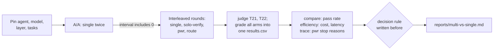

# 10.4 · When multi-agent is worse

## Why it matters

Everything so far says a multi-agent design *can* be worse: coupled work splits badly (10.1), seams lose work (10.2), loops multiply cost and reviewers can subtract points (10.3). None of that tells you whether it *is* worse on a given team's tickets. That takes a comparison, and it is the deliverable a client will pay for: `agent-evals/reports/multi-vs-single.md`, with a recommendation.

Most published multi-agent wins share a confound: the multi-agent arm spends more. Anthropic found token usage alone explained 80% of the variance in its browsing evaluation. Li et al. showed that simply sampling one model several times and voting improves performance as the number of "agents" grows, with no collaboration at all. So "the pipeline beat one agent" usually means "more compute and more checking beat less", and the question you actually need answered is different: **given the same verification budget, do several agents beat one?**

This lesson is the module project: design that comparison, run it on tasks-v1 with the Module 7 harness, and write the report.

> [!NOTE]
> Content tags. **Concept** (stable): the compute-matched baseline, pairing, deciding against a pre-written rule, the conditions under which multi-agent is worse. **Implementation** (as of 2026-09): `AgentTeam` topologies and roles, `claude -p` flags, EvalHarness commands. Numbers in Show me are illustrative (simulated); yours come from your runs.

## How it works

### One treatment: the topology

Everything from [07.5](../module-07/lesson-05.md) applies unchanged: the same 24 tasks, the same AI layer, one pinned agent version with auto-update off, the same model, interleaved rounds, paired by task, an A/A run first, and `compare` warnings read before intervals. `AgentTeam run` writes a manifest with the same fields as `EvalHarness run` plus `topology` and `roles_sha`, so both tools' results go into one `results.csv` and `compare` checks them against each other.

Multi-agent comparisons need four extra rules:

1. **A compute-matched baseline.** Besides the plain single agent, run one agent told to do what the pipeline does — plan, run the tests, re-check against the ticket — in one context (`roles/solo.md`, topology `single`). The gap between plain and verifying single agent is what checking buys; the gap between verifying single agent and pipeline is what *several agents* buy.
2. **Same failure rules.** A budget stop, a timeout or an escalation is an outcome of the configuration and counts as a failure, as timeouts did in 07.5. The pipeline's answer is its last worker output; nobody picks the best of several.
3. **Report by task kind, decided in advance.** tasks-v1 has 19 question tasks, 3 code tasks and 2 rubric tasks. Say before the run that you will report code tasks separately and that 3 tasks cannot settle anything alone; do not discover the "code-task win" afterwards.
4. **Cost and latency next to pass rate.** Cost per trial, cost per passing trial, median and p90 latency, each paired by task. A tie on pass rate at twice the cost is a loss.

### The arms

| Arm | How it runs | What comparing against it isolates |
|---|---|---|
| `single` | `EvalHarness run` (Module 7, unchanged) | the baseline |
| `single-aa` | the same, again | the instrument's own noise |
| `solo-verify` | `AgentTeam run --topology single` (`roles/solo.md`) | what verification buys without extra agents |
| `pwr` | `AgentTeam run --topology pwr --max-rounds 2` | the vendor's question: pipeline vs one agent |
| `route` | `AgentTeam run --topology route` (code tasks → pwr, question tasks → single) | whether a targeted pipeline beats a blanket one |



### When multi-agent is worse

The equations of 10.3 and the evidence of 10.1 give a checklist. A multi-agent design tends to lose when:

- **the work is sequential or coupled** — code and tests, an interface and its callers, one hot file;
- **the single agent is already strong** — the reviewer's rescue term $(1-p)\,r\,p_\text{fix}$ shrinks with $1-p$, its damage term $p\,f\,d$ grows with $p$;
- **a deterministic check exists** — tests and the compiler do the reviewer's job with no false alarms, inside one agent;
- **the extra agents share the model and the context** — their misses correlate with the worker's;
- **tasks are short** — every agent pays start-up context; a planner can cost more than the answer;
- **the task set is small** — any gain is unprovable, so "adopt" cannot be justified yet.

It tends to win on decomposable, read-heavy work (research across independent areas), on genuinely independent checks (a reviewer with information or tools the worker lacks), and where permissions must be separated.

[Simulation: Multi-agent — review loop vs one agent](../../simulations/multi-agent/index.html?preset=review-loop)

## Show me

The comparison on illustrative data (`labs/module-10/samples/multi-vs-single/`, 24 tasks × 5 trials per arm, simulated from the Module 7 "reduced" layer's success rates; not measurements):

```text
$ dotnet run --project ../module-07/tools/EvalHarness -- compare samples/multi-vs-single/results.csv --a single --b single-aa
paired (by task):   diff +0.0 pts, SE 0.058, 95% CI [-11.9 pts, +11.9 pts]
$ dotnet run --project ../module-07/tools/EvalHarness -- compare samples/multi-vs-single/results.csv --a single --b pwr
24 paired tasks: pwr better on 8, worse on 9, equal on 7
paired (by task):   diff +0.0 pts, SE 0.058, 95% CI [-11.9 pts, +11.9 pts]
$ dotnet run --project tools/AgentTeam -- efficiency samples/multi-vs-single/results.csv --a single --b pwr
| cost per trial    | $0.0733 | $0.1597 | +$0.0864 | [+$0.0630, +$0.1099] | 2.18x |
| latency per trial | 41 s    | 92 s    | +51 s    | [+37 s, +65 s]       | 2.23x |
```

All five arms:

| Arm | Pass rate | vs `single` (paired 95% CI) | Cost / trial | Cost / passing trial | Latency median · p90 |
|---|---|---|---|---|---|
| single | 78.3% | — | $0.073 | $0.094 | 24 s · 148 s |
| single-aa | 78.3% | +0.0 [−11.9, +11.9] | $0.076 | $0.097 | — |
| solo-verify | 83.3% | +5.0 [−7.0, +17.0] | $0.088 (1.20×) | $0.106 | 31 s · 208 s |
| pwr | 78.3% | +0.0 [−11.9, +11.9] | $0.160 (2.18×) | $0.204 | 56 s · 215 s |
| route | 80.0% | +1.7 [−9.7, +13.0] | $0.112 (1.52×) | $0.139 | 32 s · 221 s |

Against the compute-matched baseline the pipeline is 5 points *lower* (−17.0 to +7.0) at 1.81× the cost and 37 s slower per task. The report's verdict writes itself:

> On 24 tasks × 5 trials, no configuration differs detectably from a single agent in pass rate. The planner → worker → reviewer pipeline costs 2.2× per trial and 2.2× per passing trial with 2.2× the latency. **Recommendation: keep one agent.** Adopt the verification instructions of `solo-verify` (1.2× cost) for code tasks only if a larger code-task set confirms the gain; tasks-v1 has 3 code tasks, too few to decide. Re-run on model or agent upgrades.

That is the honest shape of most of these reports: not "multi-agent is bad", but "on these tasks, at this sample size, it bought nothing measurable for double the money".

## Try it

> [!WARNING]
> This is the expensive project of the module. With `--agent claude`, one trial of all four AgentTeam/EvalHarness arms on 24 tasks is roughly 24 + 24 + ~90 + ~40 ≈ 180 headless sessions, plus judge calls; five trials about 900. Run one trial first, read the `stats` cost line, and budget before continuing. Use only the fictional Contoso code or a repository your provider agreement covers, and keep results in a private repository.

Budget: about 2.5 hours, mostly waiting. From `labs/module-10`, with `H`, `E` and `T` as in the lab README and `~/m10-work` holding Contoso with the reduced layer.

1. **Decision rule first.** In the report, write: "Adopt a multi-agent arm only if its paired lower bound vs `solo-verify` is above −2 points *and* its cost per passing trial is at most 1.3× — otherwise keep one agent." Adjust the numbers, but write them now.
2. **Pin and A/A.** Pin Claude Code, `DISABLE_AUTOUPDATER=1`. Two rounds of `single` into `runs/single` and `runs/single-aa`; `grade` both; `compare`. Continue only if the interval includes 0.
3. **Interleave.**

   ```bash
   for k in 1 2 3 4 5; do
     $E run $T --repo ~/m10-work --out runs/single --trials $k
     $H run $T --repo ~/m10-work --out runs/solo  --topology single --trials $k --budget-usd 1.50
     $H run $T --repo ~/m10-work --out runs/pwr   --topology pwr    --trials $k --max-rounds 2 --budget-usd 1.50
     $H run $T --repo ~/m10-work --out runs/route --topology route  --trials $k --max-rounds 2 --budget-usd 1.50
   done
   ```

4. **Grade.** Judge T21 and T22 in each arm with your calibrated rubric (07.3), then `EvalHarness grade` each run folder into one `results.csv` with config names `single`, `solo-verify`, `pwr`, `route`.
5. **Analyse.** `compare` for `single`–`pwr`, `solo-verify`–`pwr`, `solo-verify`–`route`; `efficiency` for the same pairs; `trace runs/pwr --results results.csv --config pwr` for stop reasons and where failures came from.
6. **Report.** Fill in the [benchmark template](../../templates/benchmark.md) as `agent-evals/reports/multi-vs-single.md`: the five-arm table, code tasks separately, the trace findings, limitations, and the recommendation against your rule. Link the design document from 10.1–10.3.

<details>
<summary>Hint: the pipeline arm is much slower to finish</summary>

It is: two or three sessions per task instead of one, more on a second round. Do not stop it early "to save time" and compare on fewer tasks; that is the 07.5 break again. Lower the trials for *all* arms instead, and say so in the report.
</details>

## Break it

A vendor's slide is in `labs/module-10/break/10.4-vendor-claim.md`: "+33 points on real code tickets, 87% vs 53%, 95% CI +2.8 to +63.9, statistically significant, 15 runs per arm". It was computed from `samples/multi-vs-single/code-only.csv`. Answer the slide's four questions before reading on.

## Fix it

**Diagnose.**

```text
$ dotnet run --project ../module-07/tools/EvalHarness -- compare samples/multi-vs-single/code-only.csv --a single --b pwr
3 paired tasks: pwr better on 2, worse on 0, equal on 1
pass rate single 53% (15 trials) -> pwr 87% (15 trials)
paired (by task):   diff +33.3 pts, SE 0.176, 95% CI [-42.6 pts, +109.2 pts]
naive per trial:    diff +33.3 pts, 95% CI [+2.8 pts, +63.9 pts]  (treats every trial as independent)

$ dotnet run --project ../module-07/tools/EvalHarness -- compare samples/multi-vs-single/code-only.csv --a solo-verify --b pwr
pass rate solo-verify 87% (15 trials) -> pwr 87% (15 trials)
paired (by task):   diff +0.0 pts, SE 0.115, 95% CI [-49.7 pts, +49.7 pts]
cost solo-verify: $0.3112/trial, $0.3591 per passing trial
cost pwr: $0.4697/trial, $0.5419 per passing trial
```

1. *Unit of sampling:* the slide's interval is the naive per-trial one. Fifteen runs are 3 tasks × 5 trials; with the task as the unit, the interval is −42.6 to +109.2 points ([07.4](../module-07/lesson-04.md): trials of one task are not independent).
2. *Baseline compute:* the "single agent" did not run the tests or re-check its work. A single agent that does (`solo-verify`) scores the same 87%, at two thirds of the pipeline's cost per passing trial.
3. *Selection:* 3 code tasks out of a 24-task set, chosen after the fact. On all 24, the pipeline ties the plain agent at 2.2× cost (Show me).
4. *Missing:* cost, cost per success, latency, stop reasons.

**Modify.** Reply with the three numbers from this module's sample question: success against one agent **on your tasks, with a task-level interval**; **cost per successful task**; **p90 latency** — and ask for the compute-matched baseline. Add ten code tasks from your `NOTES.md` incidents (07.2) before you let anyone decide on code-task evidence.

**Rerun.** The five-arm comparison in Show me is the rerun: same data, fair design, a different conclusion.

<details>
<summary>Solution notes</summary>

Nothing on the slide is false. The per-trial interval is computed correctly for independent trials; the arms ran on the same model and repository. Every problem is a design choice: the unit of analysis, the baseline, the task selection, the missing costs. That is why the design is written before the runs, and why a buyer's first question is about the baseline, not about the p-value.
</details>

## How do I know it works?

- [ ] Your decision rule is dated before your first run, and the report applies it as written.
- [ ] The A/A interval includes 0; `compare` shows no version or task-set warnings between any two arms.
- [ ] The report has all five arms (or says which were skipped and why), code tasks separately, cost per passing trial and p90 latency with intervals.
- [ ] The recommendation names the conditions from this lesson that apply to your tasks, and what evidence would change it.

## Use / don't use

**Use** this comparison before adopting any multi-agent workflow, and again after every model or agent upgrade: the result belongs to the versions it ran on. **Use** the compute-matched baseline every time; it is the arm that answers the real question. **Use** routing (a pipeline only for the task kind that benefits) once the per-kind evidence exists.

**Don't** accept a multi-agent claim without a task-level interval, a compute-matched baseline and costs. **Don't** subset tasks after seeing the results. **Don't** read "no detectable difference" as "equal"; say what size of effect your task set could have detected.

**Limitations.**

- tasks-v1 is small and mostly question tasks. It can detect a 15–20-point effect, not a 5-point one; code-task conclusions need more code tasks.
- The comparison measures pass rate on graded tasks. It does not measure what a reviewer might add to maintainability, or what an escalation to a person is worth.
- A pipeline built by a better prompt engineer, or with a reviewer that has different information (a security scanner, production logs), could win where this one does not. The method stays; the verdict is local.

## Reflect

1. What would your decision rule have been before you saw the illustrative numbers, and did seeing them change it?
2. Which condition from the "worse" list applies most to your team's tickets?
3. How will you say "we tested it, and one agent is better here" to a team that built the pipeline?

## Sources

- [Miller (2024) — Adding Error Bars to Evals](https://arxiv.org/abs/2411.00640) — the question, not the trial, is the unit of sampling; clustered standard errors; paired differences.
- [Li et al. (2024) — More Agents Is All You Need](https://arxiv.org/abs/2402.05120) — sampling-and-voting alone improves performance as the number of agents grows, orthogonal to more complex methods: extra compute, no collaboration.
- [Anthropic Engineering — How we built our multi-agent research system](https://www.anthropic.com/engineering/multi-agent-research-system) — token usage explained 80% of performance variance in its browsing evaluation; multi-agent systems about 15× chat tokens.
- [Anthropic Engineering — Building effective agents](https://www.anthropic.com/engineering/building-effective-agents) — add multi-step agentic complexity only when it demonstrably improves outcomes.
- [Claude Code docs — Run Claude Code programmatically](https://code.claude.com/docs/en/headless) — `claude -p`, `--output-format json` with `total_cost_usd` (a client-side estimate), permission modes, `--allowedTools`, `--append-system-prompt` (as of 2026-09).
