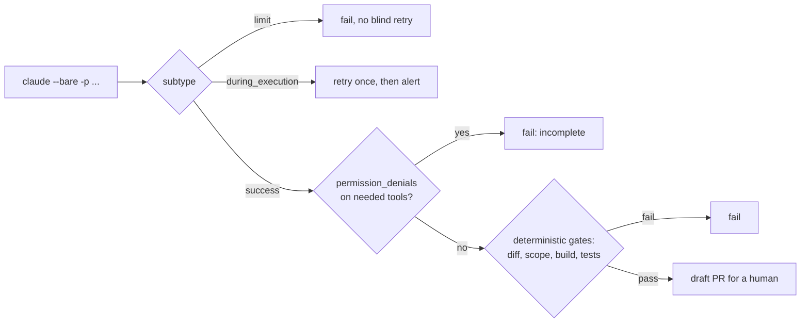

# 11.1 · Headless agents

## Why it matters

Everything so far ran with you in the loop. You read the plan, approved the edit, noticed when the agent said "done" and wasn't. In CI nobody is watching: the agent is an unattended process with an API key, a repository token and whatever tools the job hands it. Module 7 already ran agents headless for evals ([07.6](../module-07/lesson-06.md)) and warned that a `-p` session executes the checkout's hooks. This module turns that one eval job into a practice: agents that review PRs, triage tickets, draft changelogs and fix dependency breaks, every day, without you.

Three things change when the human leaves:

1. **Every default becomes a decision.** Interactive defaults are tuned for a person who can answer a prompt. In CI, a prompt that nobody answers is a denial, and a loop nobody stops is a bill.
2. **"The agent said it worked" stops being evidence.** In an interactive session you would look at the diff. A pipeline must look for you, deterministically, every time.
3. **The job is a trust boundary.** The job's secrets and token are exactly what a prompt injection ([09.2](../module-09/lesson-02.md)) wants. What code and text reach the job is now a security design question.

> [!NOTE]
> Content tags. **Concept** (stable): the run contract, result classification, deterministic verification, untrusted triggers, what can and cannot be pinned. **Implementation** (as of 2026-09): Claude Code `-p` flags, result subtypes, GitHub Actions triggers. Other agents have equivalents (Codex `exec`, Copilot coding agent, Cursor background agents); the contract is the same, the flag names differ.

## How it works

### The run contract

A headless run is a function call with side effects. Write its signature down: what it may read, what it may do, how long it may take, what it costs at most, what it returns.

```bash
claude --bare -p "$(cat prompt.txt)" \
  --append-system-prompt-file AGENTS.md \
  --settings .github/agent-settings.json \
  --permission-mode dontAsk \
  --allowedTools "Read,Grep,Glob,Edit(./src/**),Edit(./tests/**),Bash(dotnet build *),Bash(dotnet test *)" \
  --max-turns 15 --max-budget-usd 1.00 \
  --output-format json --no-session-persistence > result.json
```

| Flag | What it removes from chance |
|---|---|
| `--bare` | Implicit loading. Without it, `-p` loads the same context as an interactive session — hooks, skills, `.mcp.json` servers, `CLAUDE.md`, the runner's `~/.claude` — with no trust dialog. With it, nothing loads that you did not pass. |
| `--append-system-prompt-file AGENTS.md` | ...so the AI layer comes in explicitly, and you know which version. |
| `--settings` | The deny rules from Module 9 ([09.5](../module-09/lesson-05.md)): no secrets, no egress, no edits to the agent layer or workflows. |
| `--permission-mode dontAsk` + `--allowedTools` | Prompts. Every call that would have asked is denied; the tool surface is exactly the list. |
| `--max-turns`, `--max-budget-usd` | Runaway loops and runaway spend. Hitting either ends the run with its own result subtype. |
| `--output-format json` | Guessing. The job can read `subtype`, `num_turns`, `total_cost_usd` and `permission_denials`. |

The docs recommend `--bare` for scripted calls and say it will become the default for `-p`; until then, write it.

### Reading the result

The JSON result has a `subtype` that says how the loop ended ([agent loop docs](https://code.claude.com/docs/en/agent-sdk/agent-loop)):

| Subtype | Meaning | What the job does |
|---|---|---|
| `success` | The model stopped calling tools on its own | Verify the outcome (below). Not done yet. |
| `error_max_turns`, `error_max_budget_usd` | A cap ended the run | Fail. Do **not** retry unchanged: the same task hits the same cap. |
| `error_during_execution` | Interrupted (crash, cancelled request) | One retry is reasonable, then alert. |
| `error_max_structured_output_retries` | No output matched `--json-schema` | Fail. Never fall back to parsing free text. |

And one field that `success` does not cover: `permission_denials`. In `dontAsk` mode a call outside the allowlist is denied and the model is told so; it may work around it, or it may write a confident summary of work it never did. A `success` with denials of the tools the task needed is a failed task.



### Pin what you can, contain what you cannot

| Source of variation | Pin it with | Pinnable? |
|---|---|---|
| Agent version | install a specific version, `DISABLE_AUTOUPDATER=1` (07.6) | yes |
| Model | `--model` with a full model name, not an alias | yes, until the provider retires it |
| Context | `--bare` + explicit layer files | yes |
| Tools | `--allowedTools`, `--tools`, settings deny rules | yes |
| Sampling | nothing: the same prompt gives different runs ([02.2](../module-02/lesson-02.md)) | no — contain it |
| Provider-side behavior | nothing | no — detect it (nightly evals, 07.6) |

A headless job is therefore a stochastic job with deterministic walls. Its design question is not "how do I make it always right" but "what happens on the run that is wrong" — and the answer must be "a gate fails", not "it merges".

### Secrets, tokens and untrusted triggers

An agent job holds two credentials: the model API key and the `GITHUB_TOKEN`. Three rules keep them away from people who should not have them:

1. **Untrusted code never runs with secrets.** On `pull_request`, GitHub withholds secrets from fork PRs. `pull_request_target` runs in the base repository's context *with* secrets and a token that can write; the GitHub Security Lab calls combining it with a checkout of the PR head "a dangerous practice that may lead to repository compromise" ([pwn requests](https://securitylab.github.com/resources/github-actions-preventing-pwn-requests/)). An agent adds a second path: even without running PR code, it *reads* PR text, and that text can carry an injection.
2. **Secrets live in one step.** Put `ANTHROPIC_API_KEY` in the `env:` of the agent step, not the workflow. Default the token to `permissions: contents: read` and raise it per job ([GitHub secure use](https://docs.github.com/en/actions/reference/security/secure-use)). Write-capable jobs run in a GitHub *environment* whose secrets are released only after a required reviewer approves (11.4).
3. **Event text is data, not shell.** `run: claude -p "Fix ${{ github.event.pull_request.title }}"` is a script injection: the title is pasted into the shell script before bash parses it. Pass event text through an `env:` variable or a file.

## Show me

Four illustrative results from the same job, classified by `AgentOps result` (from `labs/module-11`):

```text
$ dotnet run --project tools/AgentOps -- result headless/samples/*.json --max-cost 1.50
FAIL budget.json: subtype=error_max_budget_usd turns=11 cost=$1.50 class=limit
     - error_max_budget_usd: the run hit its cap; do not retry unchanged (raise the cap deliberately or narrow the task)
FAIL denied.json: subtype=success turns=7 cost=$0.27 class=incomplete
     - 3 tool call(s) denied (Edit x2, Bash x1): a 'success' with denials did not do the task it was asked to do
FAIL max-turns.json: subtype=error_max_turns turns=13 cost=$0.88 class=limit
     - error_max_turns: the run hit its cap; do not retry unchanged (raise the cap deliberately or narrow the task)
OK   ok.json: subtype=success turns=9 cost=$0.41 class=ok
3 of 4 run(s) need attention
```

Look at `denied.json`. Its `result` field says: *"Fixed the overdue boundary in InvoiceService.IsOverdue (< to <=) and added a regression test. All tests pass."* Exit code 0. Every edit it describes was denied.

Now a workflow a teammate proposed — "let the agent fix PRs from anyone":

```text
$ dotnet run --project tools/AgentOps -- wflint headless/break/agent-fix-unsafe.yml
ERROR agent-fix-unsafe.yml: pwn-request: pull_request_target + checkout of the PR head: untrusted code runs with secrets and a write token
ERROR agent-fix-unsafe.yml: bypass-permissions: permission checks disabled; use --permission-mode dontAsk with an explicit --allowedTools list
ERROR agent-fix-unsafe.yml: token-permissions: no permissions: block; the GITHUB_TOKEN gets the repository default, which may be write
ERROR agent-fix-unsafe.yml: timeout: no timeout-minutes: a stuck run holds a runner (and a budget) for up to 6 hours
ERROR agent-fix-unsafe.yml: script-injection: untrusted event text interpolated inside a run: block; pass it through an env: variable or a file
ERROR agent-fix-unsafe.yml: unpinned-agent: agent installed without a version: results drift with every release (pin it, set DISABLE_AUTOUPDATER=1)
ERROR agent-fix-unsafe.yml: no-turn-cap: agent runs without --max-turns
WARN  agent-fix-unsafe.yml: no-budget-cap: agent runs without --max-budget-usd
WARN  agent-fix-unsafe.yml: not-bare: claude -p without --bare loads the checkout's hooks, .mcp.json and CLAUDE.md; ...
...
7 error(s), 9 warning(s)
```

Seven errors, and every one is a default someone did not decide. The safe version is `workflows/agent-fix.yml`: `workflow_dispatch` only (whoever starts it already has write access), a validated ticket id passed through `env:`, the environment approval, the run contract above, `AgentOps result`, then `LoopGate all` from Module 5 ([05.3](../module-05/lesson-03.md)), then a **draft** PR.

## Try it

Budget: 60 minutes, in `ai-layer-lab`. Offline parts first; the live run costs a few cents.

1. **Build the tool.** Copy `labs/module-11/tools/AgentOps` into `tools/`, run `dotnet build tools/AgentOps`, and classify the four samples as above. For each FAIL, write in one line what the job should do next (retry once, alert, raise a cap deliberately, or fix the allowlist).
2. **Lint.** Run `wflint` on the unsafe workflow, then on your own `.github/workflows/*.yml` from Modules 5 and 7. Module 5's `loop-gates.yml` gets two errors (no `permissions:`, no `timeout-minutes`); fix them in your repository.
3. **The contract, live.** Copy `headless/run-headless.sh` and `workflows/agent-settings.json` (to `.github/`). Write a prompt for task T18 from tasks-v1 (the due-instant boundary bug) and run the script locally. Confirm `result` says OK, the diff touches only `src/` and `tests/`, and `dotnet test` passes. Note turns and cost.
4. **Twice more.** Run it two more times on a clean branch. Did the three runs produce the same diff? Same cost? Write the spread in `NOTES.md` — this is the variance your CI job must tolerate.
5. **Wire it.** Copy `workflows/agent-fix.yml` to `.github/workflows/`, create the `agents` environment with yourself as required reviewer, set `AGENTS_ENABLED=true` and `CLAUDE_CODE_VERSION` as repository variables, and dispatch it for one ticket. Confirm the run waited for your approval before it could read the key.

<details>
<summary>Hint: the live run returns success but no diff</summary>

Open `result.json` and read `permission_denials`. The usual cause is a path rule that does not match how the agent names the file (`Edit(src/**)` vs `Edit(./src/**)`), or a missing `Bash(dotnet test *)` so the agent could not run tests and stopped. Fix the allowlist, not the permission mode. `bypassPermissions` "works" and is the wrong fix.
</details>

## Break it

> [!CAUTION]
> Branch and a throwaway repository only. Never add `pull_request_target` or `--dangerously-skip-permissions` to a real repository, even for a test.

1. Edit your local `run-headless.sh` to remove the two `Edit(...)` entries from the allowlist, and delete the two deterministic checks at the bottom (so the script ends after `claude`). Run it for T18. Read the job's output: what does it claim, and what exit code does it return?
2. Offline: open `headless/samples/denied.json` and `headless/break/agent-fix-unsafe.yml`. For the workflow, write the attack in three sentences: who opens what, what runs where, what they walk away with.

## Fix it

**Diagnose.**

1. *Symptom:* a green job whose summary describes a fix that does not exist.
2. *Mechanism:* `dontAsk` denied every `Edit` and `Bash(dotnet test)`; the model was told the calls were denied and wrote a plausible summary anyway. The loop ended normally, so `subtype` is `success` and the exit code is 0.
3. *Root cause:* the job trusted the agent's words. Nothing checked `permission_denials`, the diff, or the tests.

For the workflow: `pull_request_target` gives the job secrets and a write token; checking out the PR head puts attacker-controlled build files and `.claude/settings.json` hooks (loaded because it is not `--bare`) into that job; the PR title goes straight into a shell command; and permissions are bypassed. Any one of them is enough.

**Modify.** Restore the allowlist; add `AgentOps result` (denials fail the job) and the deterministic gates back. Replace the unsafe workflow with `agent-fix.yml`: manual dispatch by a maintainer, `permissions: contents: read` by default, the key in one step, environment approval, `--bare`, caps, draft PR.

**Rerun.** The broken script now fails with `class=incomplete`; the restored one passes `result`, the diff check and `dotnet test`. `wflint` on your workflows: 0 errors.

<details>
<summary>Solution notes</summary>

The general lesson is older than agents: never let a component grade its own work. Exit codes tell you the process ended; `subtype` tells you how the loop ended; only the diff, the build and the tests tell you whether the task happened. The same pattern closes 07.6 (the harness grades, not the agent) and returns in 11.3 as propose, validate, apply.
</details>

## How do I know it works?

- [ ] Your headless command sets bare mode, the layer file, settings, `dontAsk` with an explicit allowlist, both caps and JSON output — and you can say what each prevents.
- [ ] A run with denied edits fails the job, even though the agent reports success.
- [ ] The job's pass/fail comes from `result` plus diff, scope, build and tests, never from the `result` text.
- [ ] `wflint` reports 0 errors on every agent workflow in your repository.
- [ ] No agent workflow runs on `pull_request_target`, and the API key appears in exactly one step's `env:`.
- [ ] You have measured the spread of three identical runs and written it down.

## Use / don't use

**Use** headless agents for bounded, verifiable jobs: a ticket with tests, a review with a schema, a changelog from titles. **Use** `--bare` and an explicit allowlist every time, and a draft PR as the only output that touches `main`.

**Don't** run agents on events that untrusted people can trigger with secrets in reach. **Don't** use `bypassPermissions` outside a disposable, credential-free container. **Don't** read the agent's summary as a status.

**Limitations.**

- `--bare` makes the context explicit, not correct; a wrong `AGENTS.md` is loaded just as faithfully.
- Caps bound one run. A schedule or a retry loop multiplies runs; 11.4 adds ceilings across runs.
- The sandbox and deny rules from Module 9 still matter on a runner: the runner is disposable, the credentials in it are not.

## Reflect

1. Which of your current agent jobs would go green if every edit were denied?
2. What is the most dangerous credential in your CI, and which steps can see it today?
3. What spread did three identical runs show, and what does that imply for your gates?

## Sources

- [Claude Code docs — Run Claude Code programmatically](https://code.claude.com/docs/en/headless) — `-p`; `--bare` skips hooks, skills, MCP servers, `CLAUDE.md` and is recommended for scripts; without it `-p` runs project hooks and `.mcp.json` servers with no trust dialog; `dontAsk` denies anything that would prompt; `--json-schema` and `structured_output` (as of 2026-09).
- [Claude Code docs — CLI reference](https://code.claude.com/docs/en/cli-reference) — `--max-turns`, `--max-budget-usd` (print mode only), `--allowedTools`, `--tools ""` disables all tools, `--no-session-persistence` (as of 2026-09).
- [Claude Code docs — How the agent loop works](https://code.claude.com/docs/en/agent-sdk/agent-loop) — result subtypes `success`, `error_max_turns`, `error_max_budget_usd`, `error_during_execution`, `error_max_structured_output_retries`; all carry cost and turns.
- [GitHub Security Lab — Preventing pwn requests](https://securitylab.github.com/resources/github-actions-preventing-pwn-requests/) — `pull_request_target` plus checkout of the PR head can compromise the repository; split unprivileged work from privileged steps.
- [GitHub Docs — Secure use reference](https://docs.github.com/en/actions/reference/security/secure-use) — script injection through `github.event.*` text and intermediate environment variables; least-privilege `GITHUB_TOKEN`; secrets and fork PRs.
