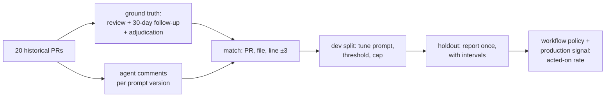

# 11.2 · CI review: signal vs noise

## Why it matters

A CI reviewer is the most visible agent a team will ever meet. It comments on every pull request, in front of everyone, and it is judged the way people judge any colleague who talks a lot: by how often it is worth listening to. The career path this course grew from has you "wire a CI job that runs your coding agent as a first-pass PR reviewer" in the first technical phase — and the first thing most teams learn is that it floods.

The failure is not that the bot is wrong. It is that it is *right too rarely for how often it speaks*, and people stop reading. Google's static-analysis platform learned this at scale: its criterion for any check shown in code review is fewer than 10% "effective false positives" — an issue counts as one if developers "did not take some positive action after seeing" it — because analyzers above that bar get ignored or disabled ([SWE at Google, ch. 20](https://abseil.io/resources/swe-book/html/ch20.html)). An LLM reviewer is a static analyzer with a very large, very unstable rule set. The same economics apply.

So this lesson does for the CI reviewer what 07.3 did for the LLM judge ([07.3](../module-07/lesson-03.md)): measure it against humans, as precision and recall, before you let it speak.

> [!NOTE]
> Content tags. **Concept** (stable): precision, recall and volume for review comments, the base-rate ceiling, ground truth and adjudication, dev/holdout tuning, effective false positives. **Implementation** (as of 2026-09): `AgentOps review`, `--json-schema`, the review workflow.

## How it works

### The confusion matrix of a reviewer

Take $N$ historical PRs. Let $D$ be the number of **known defects** in them, and $C$ the number of comments the agent posts. Match each comment to a defect (same PR and file, line within ±3, each defect once). Then:

$$\text{precision } p = \frac{TP}{C} \qquad \text{recall } r = \frac{TP}{D} \qquad \text{noise per PR} = \frac{C - TP}{N} \qquad \text{false alarms per finding} = \frac{1-p}{p}$$

*Intuition.* Precision is "when it speaks, is it worth reading?". Recall is "of the bugs that were there, how many did it catch?". Noise per PR is what each developer actually pays. False alarms per finding is the price, in wasted reads, of one real catch.

### The base-rate ceiling

*Intuition.* Most PRs have no defect at all. A reviewer that posts three comments on every PR cannot be mostly right, whatever model it uses.

*Equation.* Even with perfect recall, $TP \le D$, so

$$p \le \frac{D}{C}$$

*Tiny example.* Contoso's 20 historical PRs contain 14 known defects (0.7 per PR). A reviewer posting 3.2 comments per PR ($C = 64$) has $p \le 14/64 = 22\%$. Four out of five comments *must* be noise before you have read a single one.

*Interpretation.* Volume is a design parameter, not an outcome. To reach a precision target $p^*$, the reviewer must post at most $D/p^*$ comments on your PR mix — for $p^* = 0.67$ on Contoso, about 21 comments across 20 PRs, one per PR. Prompting "be thorough" moves you the wrong way on the one axis you control.

### Ground truth: what counts as a defect

Your $D$ comes from three sources, each incomplete:

| Source | What it catches | What it misses |
|---|---|---|
| Human review comments on the PR | defects reviewers noticed | most comments are not about defects at all; Microsoft's study found reviews "less about defects than expected" ([Bacchelli and Bird](https://www.microsoft.com/en-us/research/wp-content/uploads/2016/02/ICSE202013-codereview.pdf)) |
| 30-day follow-up: bugs and reverts traced back to the PR | escaped defects | anything not yet triggered in production |
| Adjudication: a human re-examines agent comments that matched nothing | real defects humans missed | only covers what the agent flagged |

Adjudication matters in both directions. Without it, every real bug the agent found and humans missed counts *against* the agent. With it, recall's denominator grows too. Contoso's reviewer v1 flagged `DateTime.Now` in PR-320; nobody had; `@contoso/billing-leads` confirmed it, and it became D14.

### Tune on dev, report on holdout

You will tune the reviewer: prompt, severity threshold, per-PR cap. Every choice made while looking at the 20 PRs fits those 20 PRs. So split them once, before tuning (Contoso: 12 dev, 8 holdout), make every decision on dev, and report the holdout — with a Wilson interval, because 8 PRs is a small sample ([07.4](../module-07/lesson-04.md)).



### Propose, filter, post

The tuned reviewer runs as in 11.1, read-only, with `--json-schema` so each comment has a file, line, severity, category and evidence. A deterministic step applies the measured policy (severity ≥ medium, no style/naming/docs, at most 3 per PR, evidence required) and only then posts. The agent holds no GitHub write tool: the thresholds live in the workflow, where a change is a reviewed diff, not a prompt mood.

## Show me

Illustrative data (simulated, not measurements) in `labs/module-11/review/`: 20 Contoso PRs, 13 defects from review and follow-up plus 1 adjudicated. Prompt v1 is "review this diff thoroughly, list every issue":

```text
$ dotnet run --project tools/AgentOps -- review review/prs.json review/comments-v1.json --adjudicated review/adjudicated.json
posted        64 comments (3.20 per PR)
true pos.     9   (known defects in split: 14)
false pos.    55   (of which duplicates: 1)
precision     9/64 = 14%  95% Wilson [8%, 25%]
recall        9/14 = 64%  95% Wilson [39%, 84%]
noise per PR  2.75 false comments   false alarms per real finding 6.1
ceiling       at this volume precision cannot exceed 22% (known defects / comments)
```

It catches most of the bugs. It also costs six wasted reads per catch, and developers had stopped reading after week two. `--by-category` shows the 33 style, naming and docs comments at 0%, but the rest are mixed: speculative null warnings call themselves "correctness", advice to switch to EF Core calls itself "architecture".

Three tuning moves, all on the dev split only:

| Change (dev, 12 PRs) | Comments | Precision | Recall |
|---|---|---|---|
| v1 as is | 39 | 5/39 = 13% | 5/8 |
| v1, severity ≥ medium, drop style/naming/docs, max 3 per PR | 20 | 5/20 = 25% | 5/8 |
| v2 prompt (evidence required, AGENTS.md grounded, no style) | 13 | 7/13 = 54% | 7/8 |
| v2, severity ≥ medium | 8 | 7/8 = 88% | 7/8 |

Filters on a flooding prompt top out near 25%: the noise is spread across every category and severity. Only changing *what the agent is asked to report* moves precision — the v2 prompt is Module 6's `pr-review` contract ([06.2](../module-06/lesson-02.md)) turned into a CI prompt: evidence or silence.

Then the holdout, once:

```text
$ dotnet run --project tools/AgentOps -- review review/prs.json review/comments-v2.json --adjudicated review/adjudicated.json --min-severity medium --split holdout
posted        6 comments (0.75 per PR), 5 suppressed
precision     4/6 = 67%  95% Wilson [30%, 90%]
recall        4/6 = 67%  95% Wilson [30%, 90%]
noise per PR  0.25 false comments   false alarms per real finding 0.5
```

The holdout is lower than dev (88% → 67%), as a tuned number should be. The interval is honest about what 8 PRs can tell you: somewhere between "mostly noise" and "mostly right". Contoso's decision: ship v2 with the policy, because the point estimate meets the team's bar (at least two of three comments worth acting on, recall at least half) and the flood was costing more than the risk; measure **acted-on rate** (comments resolved with a code change, thumbs-down counted as not useful) for the next 60 PRs; revisit at the monthly review (11.5).

## Try it

Budget: 75 minutes. Offline first, then your own repository.

1. **Reproduce.** Run `review` on v1 with and without `--adjudicated`. How does adjudicating D14 change precision *and* recall? Then `--by-category` and `--misses`.
2. **Ceiling.** Compute $D/C$ by hand for v1 and v2. At what comment volume could Contoso's reviewer reach 90% precision even with perfect recall?
3. **Tune on dev.** Using only `--split dev`, find the policy you would ship for v2 (try `--min-severity`, `--drop`, `--max-per-pr`). Write it down *before* running the holdout. Then run the holdout once and fill in the [CI review report template](../../templates/ci-review-report.md).
4. **Your repository.** Pick 20 merged PRs from your `ai-layer-lab` history (or your team's, in a private repository). List known defects from review threads and bugs traced back within 30 days. Run your reviewer headless on each PR's diff with `--json-schema review/review-schema.json`, save the comments in the same JSON shape, adjudicate the unmatched ones, and score.
5. **Wire it.** Copy `workflows/agent-review.yml`, the v2 prompt and the schema to `.github/`. Put your measured thresholds in its `env:` and link the report from the workflow header comment.

<details>
<summary>Hint: my repository has almost no known defects in 20 PRs</summary>

Then your base rate is low and your ceiling is brutal: with 3 defects in 20 PRs, a reviewer that posts even one comment per PR cannot exceed 15% precision. Either select a period with more change (a feature push, a migration), extend to 40–60 PRs, or conclude — legitimately — that an always-on reviewer does not pay for itself on this repository, and run it only on PRs that touch risky paths (`db/**`, money, auth).
</details>

## Break it

> [!CAUTION]
> Branch only. This break posts a lot of comments; do it on a throwaway repository or with the post step disabled.

Your manager saw v1's 64% recall and wants it back: "Just tell it to be thorough again and keep the thresholds." Set the workflow prompt to `review-v1.md`, keep `MIN_SEVERITY: medium` and `MAX_PER_PR: 3`, and score v1 with those filters on dev and on holdout. Then count, for one week of your own PRs, how many comments were acted on.

Before you run it: using only the ceiling equation, what is the best precision this configuration could reach?

## Fix it

**Diagnose.**

1. *Symptom:* precision 25% on dev, 30% on holdout; 1.25 false comments per PR; developers ignore the bot, including its real catches.
2. *Mechanism:* the filters cut volume, but v1 labels its noise as medium-severity correctness and architecture, so severity and category cannot separate signal from noise. Precision stays near the ceiling $D/C$ of the unfiltered prompt's behavior.
3. *Root cause:* optimizing recall on a low-base-rate stream. Every extra speculative comment buys a small chance of a catch and a certain cost in attention, and attention is the resource the whole reviewer depends on.

**Modify.** Return to v2 plus the measured policy. If recall matters for a class of change, get it without flooding: run a second, narrow reviewer only on PRs touching `db/migrations/**` with a migration-specific prompt, measured separately. Record the decision and both measurements in the report.

**Rerun.** v2 with the policy: dev 7/8, holdout 4/6, 0.7 comments per PR overall. Track acted-on rate weekly; if it falls below the report's bar, the policy goes back to dev.

<details>
<summary>Solution notes</summary>

Precision and recall trade through volume. For a CI reviewer the attention budget is fixed and shared by the whole team, so precision is the constraint and recall the objective within it — the reverse of an eval grader, where a missed failure is the expensive error. And never pick thresholds on the same PRs you report: a filter tuned on all 20 will look excellent on those 20 and mean little elsewhere.
</details>

## How do I know it works?

- [ ] Your report states $N$, $D$, $C$, precision and recall with Wilson intervals, noise per PR and the ceiling $D/C$.
- [ ] Ground truth combines review, 30-day follow-up and adjudication, and the report says how many came from each.
- [ ] Thresholds were chosen on dev; the holdout was scored once; both numbers are in the report.
- [ ] The workflow posts only after a deterministic filter, the agent has no write tool, and the thresholds in the workflow match the report.
- [ ] You are collecting a production signal (acted-on or thumbs-down rate) with a date to review it.

## Use / don't use

**Use** a CI reviewer where defects are frequent enough to clear the ceiling, where the rules are checkable (conventions in `AGENTS.md`, migrations, money, time, SQL), and as a narrow specialist on risky paths. **Use** acted-on rate as the production metric.

**Don't** measure it by comment count or by "it found something scary once". **Don't** let it comment on style; your analyzers and humans own that. **Don't** add a second and third reviewer agent to raise recall without measuring the combined precision — Module 10 shows how pipelines compound cost and error ([10.4](../module-10/lesson-04.md)).

**Limitations.**

- 20 PRs give wide intervals; treat the first report as a go/no-go, not a benchmark, and keep scoring.
- Line-window matching can miss a correct comment placed on another line, or credit a wrong comment near a defect; adjudicate borderline matches by hand.
- Ground truth ages: a defect found in month three changes month one's recall. Re-score when follow-up data arrives.

## Reflect

1. What is the base rate of real defects per PR in your repository, and what comment volume does that allow?
2. Which of your reviewer's comment types would you delete today if you had to pay for each wasted read?
3. What would make your team act on an agent comment as readily as on a colleague's?

## Sources

- [Software Engineering at Google, ch. 20 — Static Analysis](https://abseil.io/resources/swe-book/html/ch20.html) — "effective false positive" = no positive action taken; checks must stay under 10% effective false positives; the "Not useful" feedback loop.
- [Sadowski et al. — Tricorder (ICSE 2015)](https://research.google/pubs/tricorder-building-a-program-analysis-ecosystem/) — analysis results integrated into code review, kept only while developers find them useful.
- [Bacchelli and Bird — Expectations, Outcomes, and Challenges of Modern Code Review](https://www.microsoft.com/en-us/research/wp-content/uploads/2016/02/ICSE202013-codereview.pdf) — finding defects is the main motivation for review, but reviews are less about defects than expected; human review comments are an incomplete defect oracle.
- [Claude Code docs — GitHub Actions](https://code.claude.com/docs/en/github-actions) — review workflow with inline comments, automation mode with `prompt`, `claude_args` for `--max-turns` and `--allowedTools`, same-repository PRs only because fork PRs get no secrets (as of 2026-09).
