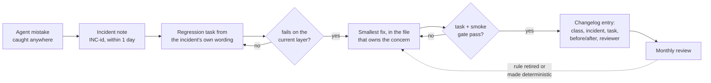

# 11.5 · Governance of the AI layer

## Why it matters

Module 3 made the AI layer a citizen of the repository: versioned, reviewed, owned ([03.1](../module-03/lesson-01.md)). Since then it has grown a lot of organs — rules, skills, hooks, MCP servers, an eval harness with gates, an attack suite, five agent jobs with prompts, policies, budgets and a kill switch. Each module added its own control. Nothing yet says who decides, how changes of different risk are treated, and what the team does, every time, when an agent gets something wrong.

The career path this course grew from asks for exactly that as a one-page "system evolution" policy: "what happens on your team when the agent gets something wrong" — who updates the rules, how, and who reviews it. Without it, two failures recur. Either nobody owns the layer and it rots (the wiki rules of Module 3), or everything needs a committee and people route around it with "quick fixes" that nobody tests. This lesson's break is the second one, and it costs Contoso the same incident twice.

> [!NOTE]
> Content tags. **Concept** (stable): ownership, change classes, the system-evolution loop, the enforcement ladder, cadence, overrides and deactivation. **Implementation** (as of 2026-09): CODEOWNERS and branch protection, `AgentOps evolution`, `ai-layer-governance.yml`.

## How it works

### Ownership and scope

Governance starts with a list: every file and setting that steers an agent (section 1 of the [governance template](../../templates/governance-policy.md)). Anything not on the list gets changed without review, so include the less obvious parts: workflow files, `agent-settings.json`, review and triage prompts and policies, eval tasks and gate thresholds, the repository variables for the agent version, the kill switch and the ceilings.

Then owners, enforced by CODEOWNERS: code owners are requested automatically on PRs that touch their files, branch protection can require their approval, and "the last matching pattern takes the most precedence" ([GitHub code owners](https://docs.github.com/en/repositories/managing-your-repositorys-settings-and-features/customizing-your-repository/about-code-owners)) — so the catch-all goes first and the AI-layer lines after it, as in 03.1. `governance/CODEOWNERS.additions` adds the Module 11 files, with security as a second owner wherever trust changes. This is NIST AI RMF GOVERN 2.1 made concrete: roles and responsibilities "documented and ... clear to individuals and teams" ([NIST AI RMF](https://airc.nist.gov/airmf-resources/airmf/5-sec-core/)).

### Change classes: review in proportion to risk

| Class | Examples | Review | Evidence |
|---|---|---|---|
| A — wording | typos, reordering, comments | 1 owner | smoke gate (07.6) |
| B — behavior | a rule, a skill step, a prompt, a policy threshold | 1 owner | smoke gate; numbers in the changelog; incident → regression task |
| C — capability and trust | permissions, tools, MCP, hooks, workflows, secrets | owner + security | threat model update (09.1), attack suite at 1.0 (09.6), `wflint` clean |
| D — platform | agent version, model | owner | full A/B, refreshed baseline (07.5) |

Classes exist so that a typo does not need a security review and a new MCP server cannot ride in on a typo's review. When unsure, the higher class applies.

### The system-evolution loop



The step teams skip is the task. *Why it matters:* a sentence in `AGENTS.md` is only protected by people remembering why it is there. A context-budget tidy-up (Module 4 told you to cut), a merge conflict, a well-meant rewrite — any of them can delete it, and nothing fails. A regression task makes the rule's *effect* part of the gate: delete the sentence, the task fails, the PR is blocked. The task is what makes the rule durable. Anthropic's eval guidance describes the same graduation: behaviors the agent has learned move into a regression suite that should stay near 100% and catches backsliding ([Demystifying evals](https://www.anthropic.com/engineering/demystifying-evals-for-ai-agents)).

Two refinements:

- **Write the task from the incident's own wording.** An existing golden task may cover the same rule in a different phrasing and keep passing while the incident's phrasing fails. Contoso's T06 asks the agent to fix a *bug* in a merged migration; both incidents asked it to *tidy* one.
- **Climb the enforcement ladder when you can.** A sentence in the rules < a skill step < a hook or gate (Module 8, `LoopGate arch`) < a convention test in the build. Each rung is less dependent on the model reading and obeying. The monthly review asks, for each incident-born rule: can this become a check?

Incidents are about the layer, not the developer who ran the agent. The SRE book's standard applies: a blameless write-up "assumes that everyone involved in an incident had good intentions" and focuses on preventive actions ([SRE postmortems](https://sre.google/sre-book/postmortem-culture/)).

### Cadence, thresholds, overrides, deactivation

Governance is a feedback loop, and the module has already built its sensors: CI review precision and acted-on rate (11.2), automation acceptance vs break-even (11.3), ledger cost per useful outcome and breaker trips (11.4), golden floors and attack-suite results (07.6, 09.6). A weekly 15-minute look at the ledger, a monthly review of those numbers plus incidents and overrides, and a quarterly platform upgrade and threat-model refresh are enough for most teams.

Every threshold lives in one table with the action on breach and the measurement that set it. Overrides — merging past a failed gate — are allowed but recorded in the changelog and reviewed monthly; an emergency path lets on-call merge a class A or B fix during an incident, with the task and owner review due within 24 hours. And someone must be able to switch the agents off: `AGENTS_ENABLED`, with named people who may flip it and who may flip it back (NIST MANAGE 2.4).

### Enforced by CI, not by memory

`workflows/ai-layer-governance.yml` runs on every PR that touches the layer: no AI-layer change without a changelog entry; `AgentOps evolution` checks each entry (class, reviewer, numbers, and for incidents a regression task that exists in the task set and failed first); `wflint` on the agent workflows. With branch protection requiring it, `agent-evals` and the security suite, the policy is the path of least resistance.

## Show me

Contoso's changelog as found at the start of this lesson (`labs/module-11/governance/break/AI-LAYER-CHANGELOG.md`). The story in four entries: on 3 September the agent edited merged migration V004 when asked to "tidy" it (BILL-166). On-call pushed a line into `CLAUDE.md` with an admin bypass: no task, "tried it once". On 12 September a context tidy-up removed that line as a duplicate; the smoke gate passed, because T06 covers the bug-fix phrasing. On 26 September BILL-171 asked for another tidy-up of V004, and the agent edited it again.

```text
$ dotnet run --project tools/AgentOps -- evolution governance/break/AI-LAYER-CHANGELOG.md --tasks ../module-07/tasks-v1/tasks.json --tasks governance/tasks-m11.json
FAIL  2026-09-26 — v1.6.0
      - incident without a regression task (mistake -> task -> fix -> gate)
      - Verified: cites no eval numbers or gate result
ok    2026-09-12 — v1.5.0
FAIL  2026-09-03 — v1.4.1 (hotfix)
      - incident without a regression task (mistake -> task -> fix -> gate)
      - Verified: cites no eval numbers or gate result
      - no owner review (bypass or self-merge): record it as an override and review it afterwards
ok    2026-08-28 — v1.4.0
4 entries checked, 5 problem(s)
```

Note which entry passes: v1.5.0, the tidy-up that actually deleted the rule. It was a legitimate class A change with a passing gate. The checker cannot see what the gate does not test — the defect is upstream, in v1.4.1. `governance/AI-LAYER-CHANGELOG.md` shows the same five weeks with the policy followed: v1.4.1 creates T25 from BILL-166's wording (fails 2/5 before, 5/5 after), and v1.5.0's first attempt fails the gate on T25, so the line is moved instead of deleted. There is no BILL-171 incident to log.

## Try it

Budget: 60 minutes, in `ai-layer-lab`.

1. **Scope and owners.** Fill sections 1–2 of the [governance template](../../templates/governance-policy.md) as `governance.md`. Append the Module 11 lines from `governance/CODEOWNERS.additions` to your `.github/CODEOWNERS` (after the catch-all) and require code-owner review on `main`.
2. **Classes.** Classify your last ten AI-layer commits A–D. How many would have needed a security review they did not get?
3. **Your own loop.** Take one agent mistake from your `NOTES.md` that has no regression task. Write the task from the incident's wording, run it on the current layer and see it fail (if it passes, the wording is not the incident's — try again), fix the layer, gate, and write the changelog entry with every field.
4. **Enforce.** Copy `workflows/ai-layer-governance.yml`, adjust the `--tasks` paths to your eval set, and open a PR that changes `AGENTS.md` without a changelog entry. It must fail. Then run `AgentOps evolution` on your changelog and fix every finding since the date you adopt the policy (`--since`).
5. **Cadence.** Put the first monthly review in the calendar with the metrics from 11.2–11.4 as its agenda, and write the thresholds table with the source of each number.

<details>
<summary>Hint: my old changelog fails everywhere</summary>

Do not rewrite history to satisfy the checker. Adopt the policy from a date, run `evolution --since <date>`, and add one line at the top of the changelog saying when the policy started. Old incidents without tasks go on the first monthly review's agenda: pick the two most likely to recur and give them tasks.
</details>

## Break it

> [!CAUTION]
> Branch only. This break uses an admin bypass of branch protection; never do it on a real repository to "test" governance.

On a branch of `ai-layer-lab`, reproduce the Contoso sequence: (1) add a one-line rule to `CLAUDE.md` for a mistake your agent made, merge it with an admin bypass and no task; (2) in a second PR, "tidy" `CLAUDE.md` and remove that line; (3) run the smoke gate. Does anything fail? Then copy `governance/break/AI-LAYER-CHANGELOG.md` over your changelog and run `evolution`.

## Fix it

**Diagnose.**

1. *Symptom:* the same incident twice in three weeks; every gate green in between.
2. *Mechanism:* the v1.4.1 rule had no test, so v1.5.0 could remove it without any signal. The golden task T06 covered a different phrasing of the same concern.
3. *Root cause:* the loop stopped at "fix" — no regression task, no gate evidence, no owner review. The emergency path was used without its follow-up.

**Modify.** Add T25 (from the incident wording, `governance/tasks-m11.json`) to your eval set; run it on the current layer and record the failure; move the rule into `AGENTS.md` next to the migration convention (one place, with its evidence); gate; write the v1.6.0 entry properly and amend v1.4.1 with an `Override:` note. Add `ai-layer-governance.yml` to branch protection so the next hotfix without a task fails CI.

**Rerun.** `evolution --since 2026-09-26` passes; a PR that deletes the moved line fails the smoke gate on T25.

<details>
<summary>Solution: the v1.6.0 entry</summary>

```markdown
## 2026-09-26 — v1.6.0

- **Class:** B (behavior rule)
- **Changed:** merged-migration rule in AGENTS.md now covers tidy-ups and formatting ("a merged V### is never edited; propose V###+1 and its U###"), with its evidence line; CLAUDE.md imports it. The v1.4.1 line is not restored.
- **Why:** incident — asked to "tidy" V004 in BILL-171, the agent edited a merged migration; second occurrence after BILL-166 because the v1.4.1 hotfix had no regression task.
- **Incident:** INC-2026-014 (and INC-2026-009)
- **Regression task:** T25 (new, golden, BILL-166/171 wording) failed 2/5 on v1.5.0; T06 5/5 unchanged.
- **Verified:** smoke 9 tasks x 3 + T25 x 5: T25 5/5; GATE PASSED vs baseline v1.5.0.
- **Reviewed by:** @contoso/billing-leads
```
</details>

## How do I know it works?

- [ ] `governance.md` lists the full scope, owners, classes, the evolution loop, cadence, thresholds, overrides and the kill switch — on one or two pages.
- [ ] CODEOWNERS covers every item in scope, and branch protection requires code-owner review and the governance, eval and security checks.
- [ ] Every incident since adoption has a regression task that failed before its fix.
- [ ] A PR that changes the layer without a changelog entry, or logs an incident without a task, fails CI.
- [ ] The first monthly review is scheduled, with the metrics from 11.2–11.4 as its agenda.

## Use / don't use

**Use** the loop for every agent mistake that reached a PR, a review or production. **Use** change classes to keep small changes cheap. **Use** the monthly review to retire rules and promote the durable ones to checks.

**Don't** write a policy that nobody can follow on a busy day; if the emergency path is used weekly, the normal path is too heavy. **Don't** treat a passing checker as proof of good governance: it verifies the paperwork, not the judgment. **Don't** blame the developer who ran the agent; fix the layer.

**Limitations.**

- `evolution` checks form, not truth: a task can be too weak, a number can be from the wrong run. The monthly review samples entries and reruns their tasks.
- Governance adds latency to AI-layer changes; measure it (PR open to merge for layer PRs) and keep it close to ordinary code review.
- A small team may merge classes A and B and hold the monthly review quarterly; write down that you did and why.

## Reflect

1. Which rule in your AI layer exists only because someone remembers an incident, with no task behind it?
2. What would your team's emergency path look like, and how would you know it was being overused?
3. Who, by name, can switch your agents off tonight?

## Sources

- [NIST AI RMF 1.0 — Core](https://airc.nist.gov/airmf-resources/airmf/5-sec-core/) — GOVERN 2.1 (documented roles and responsibilities), GOVERN 4.3 (practices for testing, incident identification and information sharing), MANAGE 2.4 (mechanisms to supersede, disengage or deactivate AI systems).
- [GitHub Docs — About code owners](https://docs.github.com/en/repositories/managing-your-repositorys-settings-and-features/customizing-your-repository/about-code-owners) — automatic review requests, last matching pattern wins, branch protection requiring code-owner review.
- [Google SRE Book — Postmortem culture](https://sre.google/sre-book/postmortem-culture/) — blameless postmortems; documenting incidents and putting preventive actions in place to reduce recurrence.
- [Anthropic Engineering — Demystifying evals for AI agents](https://www.anthropic.com/engineering/demystifying-evals-for-ai-agents) — regression evals near 100% that catch backsliding; capability evals graduate into regression suites.
