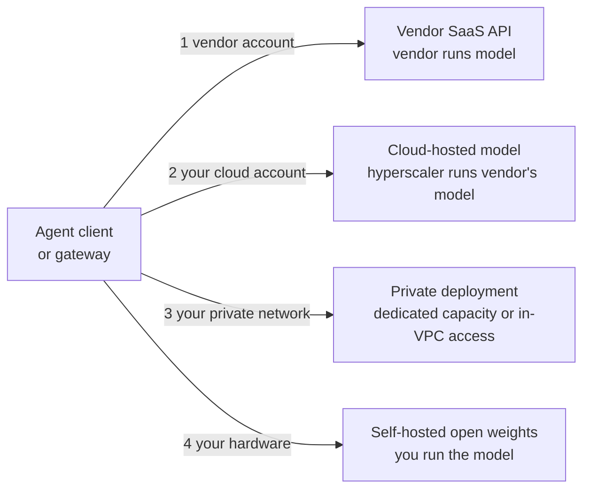

# 12.1 · Hosting options

## Why it matters

Up to now, "the model" was whatever sat behind your Claude Code login. One developer, one account, one bill. At 400 developers the first question an enterprise architect asks is not *which model* but *where does inference run, and whose infrastructure touches our code on the way?* Legal will ask where prompts are stored. Security will ask which identity system controls access. Finance will ask whose invoice it lands on. Procurement will ask whether you can leave.

Those answers are decided by the **hosting option**, long before anyone compares benchmark scores. In [02.5](../module-02/lesson-05.md) you learned to eliminate models on hard constraints before weighing the rest; this lesson applies the same rule one level up. The trap is familiar from every infrastructure decision you have made: somebody builds a spreadsheet of price per million tokens, the cheapest row wins, and three months later the team discovers that the cheap option fails the residency rule, or passes 46% of tasks, or needs two engineers to keep it alive.

This module follows one hypothetical company, **Fabrikam**: 400 .NET developers in eight teams, EU-only data policy, one primary cloud. Its brief is in [`labs/module-12/fabrikam/brief.md`](../../labs/module-12/fabrikam/brief.md). By the end of the module you will have its reference architecture, seven ADRs and answers to a 30-question security review.

> [!NOTE]
> Content tags. **Concept** (stable): the four hosting models, constraints-then-cost, cost per successful task with fixed cost. **Implementation** (as of 2026-09, re-verify quarterly): which providers offer which geographies, endpoint types and price premiums, and which API features each platform supports. Prices and pass rates in the lab are illustrative.

## How it works

### Four hosting models

Every option answers two questions: *who runs the model* and *whose account and network does the request travel through*.



| | 1. Vendor SaaS API | 2. Cloud-hosted model | 3. Private deployment | 4. Self-hosted open weights |
|---|---|---|---|---|
| Example (2026-09) | the model vendor's own API or Team/Enterprise plan | the same model family on a hyperscaler platform | provisioned capacity or private endpoints on 1 or 2 | an open-weights model served with vLLM on your GPUs |
| Who operates the model | vendor | hyperscaler | vendor or hyperscaler | you |
| Identity and billing | vendor accounts, SSO | your cloud IAM and bill | your cloud IAM | yours |
| Residency controls | whatever the vendor offers | region / geographic profiles | region | total |
| Newest models, full feature set | first | often later, subset | as 1 or 2 | not these models at all |
| Your ops burden | lowest | low | medium | highest |

Model 3 is usually model 1 or 2 with dedicated capacity and private connectivity, so in practice most enterprises choose between 1, 2 and 4, then add private networking.

### What actually differs between them

**The data path.** With a vendor API, requests go to the vendor's endpoints. With a cloud-hosted model, requests stay inside the hyperscaler's network and account model: Amazon Bedrock, for example, deploys model providers' software into Bedrock-owned accounts that the model providers cannot access, so they do not see your prompts or logs ([Bedrock data protection](https://docs.aws.amazon.com/bedrock/latest/userguide/data-protection.html)).

**Residency granularity.** Each platform exposes geography differently, and the differences are exactly what legal will ask about:

- The vendor API's `inference_geo` parameter accepts `"global"` (default) or `"us"`, and US-only inference is priced at 1.1× (as of 2026-09; [data residency](https://platform.claude.com/docs/en/manage-claude/data-residency)). There is no EU value today.
- Bedrock offers *geographic* cross-Region inference profiles (US, EU, APAC) that keep processing inside the geography, and *global* profiles that route worldwide at about 10% lower cost ([cross-Region inference](https://docs.aws.amazon.com/bedrock/latest/userguide/cross-region-inference.html)).
- Google Cloud offers global, multi-region (`us`, `eu`) and regional endpoints; multi-region and regional carry a 10% premium, and the newest models are served from global and multi-region endpoints rather than single regions ([Claude on Google Cloud](https://platform.claude.com/docs/en/build-with-claude/claude-on-vertex-ai)).

**Feature parity.** Hosted platforms trail the vendor API. The same Google Cloud page lists what is not supported there, including Message Batches, the Files API and the MCP connector. A feature you depend on is a hard constraint, not a preference.

**Operating model.** Claude Code's enterprise overview compares these routes on billing, regions, authentication, cost tracking and "enterprise features" such as IAM policies and CloudTrail or Cloud Audit Logs ([enterprise deployment overview](https://code.claude.com/docs/en/third-party-integrations)). With self-hosting you get none of that for free: an OpenAI-compatible server such as vLLM gives you an endpoint ([vLLM](https://docs.vllm.ai/en/latest/serving/online_serving/)); capacity planning, upgrades, evaluation of each new open model and on-call are yours.

### Constraints first, then cost per success

The procedure is the one from [02.5](../module-02/lesson-05.md), extended with a fixed cost:

1. **Hard constraints eliminate.** Residency, required features, contract terms, and a pass-rate floor on *your* tasks measured with the [07.4](../module-07/lesson-04.md) harness. Never trade a constraint against price.
2. **Survivors are compared on cost per successful task.**

*Intuition.* A self-hosted model has a large fixed monthly cost and a tiny marginal cost. A hosted one is almost all marginal cost. Neither number matters until you divide by how often the attempt succeeds, and add what failures cost the humans who review them.

*Equation.* With $N$ attempts a month, marginal cost $c$ per attempt, fixed monthly cost $F$, pass rate $p$ and review cost $h$ per failed attempt:

$$c_{\text{eff}} = c + \frac{F}{N}, \qquad \text{cost per success} = \frac{c_{\text{eff}}}{p} + \left(\frac{1}{p} - 1\right) h$$

*Tiny example.* Fabrikam plans $N = 120{,}000$ attempts a month, $h = \$15$. A larger open-weights model on its own GPUs: $c = \$0.04$, $F = \$96{,}000$, $p = 0.62$. Then $c_{\text{eff}} = 0.04 + 0.80 = \$0.84$, and cost per success $= 0.84 / 0.62 + (1/0.62 - 1) \times 15 \approx 1.35 + 9.19 = \$10.55$. A cloud-hosted frontier model at $c = \$0.62$, $F = 0$, $p = 0.74$: $0.84 + 5.27 = \$6.11$.

*Implementation.* `ArchCheck hosting` in the lab does both steps from a JSON file of options.

*Interpretation.* The review term dominates. Every percentage point of pass rate is worth more than most token discounts, which is why the pass rate must come from your task set, not a leaderboard.

## Show me

Fabrikam's six options, from [`fabrikam/hosting-options.json`](../../labs/module-12/fabrikam/hosting-options.json): the vendor API, the same model on hyperscaler A through an EU geographic profile, on hyperscaler B through an EU multi-region endpoint, an older model in a single EU region, and two open-weights models on Fabrikam's EU GPUs. Constraints: EU residency, tool use, prompt caching, streaming, and a 60% pass-rate floor.

```text
$ ArchCheck hosting fabrikam/hosting-options.json
Step 1 - hard constraints (eliminate, never weigh): residency=eu; features=tool-use,prompt-caching,streaming; pass rate >= 60 % on our tasks
  OUT  vendor-api: inference geo global/us does not include 'eu'
  keep hyperscaler-a-eu-profile
  keep hyperscaler-b-eu-multiregion
  keep hyperscaler-b-eu-region-older
  OUT  self-hosted-mid-open-weights: pass rate 46 % (95% CI 33 %-60 %, n=50) below 60 %
  keep self-hosted-large-open-weights

Step 2 - survivors at 120,000 attempts/month, $15 human review per failed attempt
  option                             p      95% CI  $/attempt  $/success   +review     $/month
  hyperscaler-a-eu-profile        0.74  0.60-0.84      0.620      0.838      6.11      74,400
  hyperscaler-b-eu-multiregion    0.74  0.60-0.84      0.680      0.919      6.19      81,600
  hyperscaler-b-eu-region-older   0.64  0.50-0.76      0.450      0.703      9.14      54,000
  self-hosted-large-open-weights  0.62  0.48-0.74      0.840      1.355     10.55     100,800
```

Read the last column carefully: the older model has the lowest monthly bill (\$54,000) and the second-worst cost per success (\$9.14), because its extra failures land on developers. Also note the intervals: with 50 trials, 0.74 and 0.62 overlap. The *ranking* on pass rate alone is not established; the cost ranking is robust here only because the gap in review cost is large. If two survivors were closer, you would run more trials (07.4) before deciding.

Fabrikam's decision, written up as ADR-0001 in 12.5: hyperscaler A's EU profile as primary, hyperscaler B's EU multi-region endpoint as fallback.

## Try it

Budget: 50 minutes. Setup: .NET SDK 8 or later; everything is offline. From `labs/module-12`:

```bash
dotnet build tools/ArchCheck -c Release
A="dotnet tools/ArchCheck/bin/Release/net8.0/ArchCheck.dll"
$A hosting fabrikam/hosting-options.json
```

1. Reproduce the output above. For each eliminated option, write one sentence saying which stakeholder's requirement eliminated it (legal, engineering, finance).
2. Change `failureReviewCost` from 15 to 5 (a team with very fast reviews). Does the order of the survivors change? Then set it to 40.
3. Change `attemptsPerMonth` to 400,000. At what volume does the large self-hosted model's cost per success first beat the older hosted model? Solve for $N$ with the equation, then confirm with the tool.
4. For your own organisation (or your wedge's typical client), list the hard constraints in the same JSON shape. Which of the four hosting models survive before you know a single price?

<details>
<summary>Hint for step 3</summary>

Set the two cost-per-success expressions equal. The review terms do not depend on $N$: $(1/0.62-1)\times 15 = 9.19$ and $(1/0.64-1)\times 15 = 8.44$. So the self-hosted option must make up 0.75 on the token term alone, which requires $(0.04 + 96{,}000/N)/0.62 < 0.703 - 0.75$: impossible, since the right side is negative. At this pass rate no volume makes self-hosting win; only a better model (higher $p$) can.
</details>

## Break it

Open [`fabrikam/hosting-options.json`](../../labs/module-12/fabrikam/hosting-options.json) and run the ranking a procurement spreadsheet would produce:

```bash
$A hosting fabrikam/hosting-options.json --by price
```

The cheapest row is `self-hosted-mid-open-weights` at $0.42 per attempt, fixed cost included. A draft architecture from Fabrikam's platform team chose it: "EU-resident by construction, cheapest per attempt, no vendor lock-in." Before reading on, list what that argument leaves out.

## Fix it

**Diagnose.** The price ranking skipped both steps. It never applied the pass-rate floor (the mid-size model passes 46% of Fabrikam's tasks, and even the top of its interval only reaches the floor), and it priced attempts, not successes. At 46% the review term alone is $(1/0.46 - 1) \times 15 = \$17.61$ per success, nearly three times the whole cost of the chosen option. "No lock-in" is real but belongs in the consequences of the decision, not in place of the constraint check.

**Modify.** Re-run without `--by price`. Record in your notes which constraint removed each option and the cost per success of each survivor. If the self-hosted route matters for other reasons (a sovereign-cloud requirement, air-gapped sites), write it as a separate hard constraint and see which options survive *that*.

**Rerun.** The default run eliminates the mid-size model and puts the large one last on cost per success. Keep the output: it is the evidence section of ADR-0001.

<details>
<summary>Solution notes</summary>

The general failure is weighing a price against a constraint. Price is a survivor-only criterion. The same mistake appears as "the cheaper region" (fails residency), "the cheaper platform" (lacks a feature you need), or "the cheaper model" (fails your tasks). In each case the fix is to make the constraint explicit in the options file so a tool, not a meeting, applies it.
</details>

## How do I know it works?

- [ ] For every option you can say who operates the model, whose account the request uses, and where it is processed.
- [ ] Each eliminated option has a named hard constraint, not a weight.
- [ ] Survivors are compared on cost per successful task, including fixed cost and review of failures.
- [ ] Pass rates come from your own tasks with a stated interval (07.4), and you know which differences are not established.
- [ ] Every implementation fact you rely on (a geography, an endpoint type, a feature) has a source and an "as of" date.

## Use / don't use

**Use** a cloud-hosted model when you already run that cloud's identity, network and audit controls and it offers the geography you need. **Use** the vendor's own API or plan when its geography and terms fit: it gets new models and features first and needs no infrastructure. **Use** self-hosted open weights when a constraint forces it (air gap, sovereign cloud) or when an open model passes your task set at a cost per success you can beat, with the people to run it.

**Don't** rank hosting options by price per token. **Don't** assume that "hosted in the EU" covers the fallback path, the telemetry and the tools (12.4). **Don't** treat a leaderboard score as your pass rate.

**Limitations.** The geographies, endpoint types, premiums and feature gaps above change quarterly; this lesson's numbers are a snapshot, and the lab's prices are illustrative. Cost per success assumes failures are detected and reviewed; undetected failures cost more and are harder to measure (Module 13). The Claude Code cost guidance of roughly $150–250 per developer per month is an average across deployments, not a planning number for your organisation ([costs](https://code.claude.com/docs/en/costs)): measure a pilot.

## Reflect

1. Which hard constraint in your organisation would eliminate the most hosting options, and who owns it?
2. Where have you seen a decision made on price per unit when the real unit was a success?
3. What would have to be true for self-hosting to win for your team?

## Sources

- [Claude Code docs — Enterprise deployment overview](https://code.claude.com/docs/en/third-party-integrations) — deployment options compared on billing, regions, authentication, cost tracking, enterprise features; pin model versions on cloud providers; proxies versus gateways.
- [Claude Platform docs — Data residency](https://platform.claude.com/docs/en/manage-claude/data-residency) — `inference_geo` values `global` and `us`; workspace geo `us` only; 1.1× for US-only inference (as of 2026-09).
- [Amazon Bedrock — Cross-Region inference](https://docs.aws.amazon.com/bedrock/latest/userguide/cross-region-inference.html) — geographic (US, EU, APAC) versus global profiles; global about 10% cheaper; data stays in AWS network; CloudTrail records the processing region.
- [Amazon Bedrock — Data protection](https://docs.aws.amazon.com/bedrock/latest/userguide/data-protection.html) — model deployment accounts; model providers have no access to prompts, completions or logs.
- [Claude Platform docs — Claude on Google Cloud](https://platform.claude.com/docs/en/build-with-claude/claude-on-vertex-ai) — global, multi-region (`us`, `eu`) and regional endpoints; 10% premium for regional and multi-region; unsupported features.
- [vLLM docs — OpenAI-compatible server](https://docs.vllm.ai/en/latest/serving/online_serving/) — serving an open-weights model behind an HTTP API you operate.
- [Claude Code docs — Manage costs effectively](https://code.claude.com/docs/en/costs) — average enterprise cost per developer; start with a pilot to establish a baseline.
