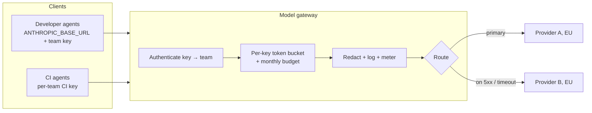

# 12.2 · Model gateways and routing

## Why it matters

In 12.1 Fabrikam chose two EU routes to its models. Now picture 400 developers and a few hundred CI jobs using them. Without anything in the middle, each client holds a provider credential, each team's usage lands on one bill, and when a CI job goes into a retry loop at 10:15 on a Tuesday, every developer in the company starts seeing `429 rate_limit_error`, because they all share the same organisation limit.

A **model gateway** is the component that sits between agent clients and model providers. It is where you put the controls an enterprise needs and a single developer never did: whose credential, which team pays, how much each team may use, what gets logged, and where a request goes when the primary provider is down. Module 11 operated agents one workflow at a time, with budgets and kill switches per job ([11.4](../module-11/lesson-04.md)); the gateway is the same idea at organisation scale.

It is also a new piece of critical infrastructure. If it goes down, every agent stops. This lesson is about getting both halves right: what to centralise, and how not to make the centre the weakest link.

> [!NOTE]
> Content tags. **Concept** (stable): gateway responsibilities, token buckets, quota sizing, noisy neighbours, serial and parallel availability, attribution coverage. **Implementation** (as of 2026-09): Claude Code's gateway variables, provider rate-limit semantics, and the example gateway products (an open-source proxy, a cloud API-management gateway, the vendor's own self-hosted gateway).

## How it works

### What a gateway centralises

Claude Code's documentation lists five things a gateway gives an organisation: provider credentials stay server-side while developers hold gateway credentials; usage is attributed per developer or team; budgets and rate limits are enforced in one place; every model request can be logged; and the provider can be switched in gateway configuration without touching developer machines ([LLM gateways](https://code.claude.com/docs/en/llm-gateway)). The same page names the price: the gateway is infrastructure you operate, and one that does not forward new client capabilities breaks the corresponding features.



Products differ in how they express this. An open-source proxy such as LiteLLM sets `max_budget`, `budget_duration`, `tpm_limit` and `rpm_limit` on virtual keys, users and teams ([LiteLLM](https://docs.litellm.ai/docs/proxy/users)). Azure API Management's AI gateway uses an `llm-token-limit` policy keyed on any counter (subscription, IP, custom header), emits token metrics per consumer, load-balances across backends and trips a circuit breaker using the backend's `Retry-After` ([APIM AI gateway](https://learn.microsoft.com/en-us/azure/api-management/genai-gateway-capabilities)). The concept is the same; pick on your constraints, as in 12.1.

On the client side, Claude Code points at a gateway with `ANTHROPIC_BASE_URL` and a gateway credential (a variable or an `apiKeyHelper` script), distributed through managed settings so developers configure nothing.

### Token buckets and quota sizing

*Intuition.* Providers meter throughput with a **token bucket**: capacity refills continuously up to a maximum, instead of resetting each minute ([rate limits](https://platform.claude.com/docs/en/api/rate-limits)). A request passes if the bucket holds enough tokens for it; otherwise it gets a 429 with a `retry-after` header. A gateway applies the same mechanism per key, so each team has its own bucket inside the organisation's.

*Equation.* A bucket with limit $L$ tokens per minute refills $r = L/60$ per second. If sustained demand $d$ (tokens per minute) exceeds $L$, the share of demand that cannot be served is at least

$$u = 1 - \frac{L}{d}$$

and with one shared bucket, *every* client sees that shortfall, whoever caused it.

*Tiny example.* Fabrikam's organisation limit is $L = 7{,}000{,}000$ input tokens per minute: 17,500 per developer, inside the 15–20k-per-user guidance for 100–500-user organisations in the Claude Code cost docs ([costs](https://code.claude.com/docs/en/costs)). Peak developer demand is about $400 \times 0.35 \times 3 \times 12{,}000 = 5.04$M TPM. Then a payments CI job loops: 40 parallel jobs, 6 requests a minute, 25,000 tokens each, adding 6.0M TPM. Total $d = 11.04$M, so $u = 1 - 7/11.04 = 37\%$ of demand cannot be served while the loop runs, and on a shared key the 400 developers pay for it.

*Implementation.* Give each team its own key and bucket, sized $L_t = n_t \times 17{,}500$, and put CI on separate, smaller keys. The sum of team limits may exceed the organisation limit (Fabrikam allocates 109%), because teams are rarely all at peak together; the organisation bucket still applies, so over-allocation trades some residual risk for fewer false 429s.

*Interpretation.* A quota boundary belongs where load originates. If one team's job can throttle eight teams, the boundary is in the wrong place.

Two provider details change the arithmetic. For most current models only *uncached* input tokens count toward the input-tokens-per-minute limit, so prompt caching raises effective throughput ([rate limits](https://platform.claude.com/docs/en/api/rate-limits)); size quotas in uncached tokens. And a 429 from a monthly spend cap carries no `retry-after`: retrying cannot succeed, so the gateway must tell the two apart.

### Fallback, and the component you forgot

*Intuition.* Two independent routes fail together less often than either alone. But every request also passes through the gateway, which is a single component in series.

*Equation.* With route availabilities $a_1, a_2$ (independent) and gateway availability $g$:

$$A = g \times \left(1 - (1-a_1)(1-a_2)\right)$$

*Tiny example.* $a_1 = 0.995$, $a_2 = 0.99$: the routes together give $1 - 0.005 \times 0.01 = 0.99995$. A gateway at $g = 0.999$ brings the total to $0.999 \times 0.99995 \approx 0.99895$: the gateway, not the providers, sets the ceiling. Correlated failures (both routes in one cloud region, one DNS dependency, one expired certificate) push $A$ lower still.

*Interpretation.* Fallback is worth having; running the gateway with replicas across zones and a documented break-glass path is worth more. And a fallback must satisfy every constraint the primary does: a fallback to a global endpoint breaks residency on the first outage (12.4), and a fallback to a different model must pass your eval gate ([07.6](../module-07/lesson-06.md)) before you trust its output.

### Chargeback and attribution coverage

Finance wants cost per team. The gateway meters tokens per key; cost per team is only as good as the key-to-team mapping. Define

$$\text{coverage} = \frac{\text{spend on keys owned by a team}}{\text{total spend}}$$

A shared CI key, a hackathon key nobody revoked, or a personal key used by a scheduled job all reduce coverage. Below about 95%, the monthly report stops being a management tool: nobody can be asked to explain the gap, and nobody's budget stops it.

## Show me

The same peak hour, simulated twice with the lab's token-bucket model. First, Fabrikam's draft: one shared key for everyone.

```text
$ ArchCheck simulate break/gateway.json
Org limit 7,000,000 TPM; 1 gateway key(s) with 7,000,000 TPM allocated (100 % of org); 60 simulated minutes, token buckets refilled every second.

  load                   team       key             requests    429s   429 %  demand TPM
  billing-devs           billing    shared             3,107     270   8.7 %     634,404
  payments-devs          payments   shared             4,102     343   8.4 %     848,759
  lending-devs           lending    shared             4,529     366   8.1 %     878,605
  ...
  payments-ci-fix-loop   payments   shared             7,050   1,817  25.8 %   2,962,298

8 teams lose more than 2% of requests. If only one of them caused the load, the quota boundary is in the wrong place (noisy neighbour).
```

The loop runs for 30 of the 60 minutes, so the developers' 8–9% over the hour means roughly one request in six failing while it runs. (Demand TPM is averaged over the hour; the loop's rate while active is twice what is shown.) Now the per-team design from `solution/gateway.json`:

```text
$ ArchCheck simulate solution/gateway.json
Org limit 7,000,000 TPM; 9 gateway key(s) with 7,600,000 TPM allocated (109 % of org); ...
  billing-devs           billing    billing            3,107       0   0.0 %     634,404
  ...
  payments-ci-fix-loop   payments   payments-ci        7,050   4,478  63.5 %   2,962,298

At most one team is throttled above 2%: the quota contains the load where it originates.
```

Same load, same seed. The loop now hits its own 600,000 TPM ceiling and nobody else notices. Then the bill:

```text
$ ArchCheck chargeback fabrikam/usage-2026-08.csv fabrikam/prices.json
  team             keys                                 cost   share  devs   per dev
  (unattributed)   hackathon-2026 shared-ci           31,087  33.0 %     -         -
  lending          gw-lending                         11,628  12.3 %    72       161
  ...
Total 94,312 USD. Attribution coverage 67.0 %.
FAIL 33.0 % of spend is on keys with no owning team.
```

## Try it

Budget: 60 minutes. From `labs/module-12`, with `A` set as in 12.1:

1. Run both simulations above. Then copy `solution/gateway.json` and halve the `payments-ci` key's `tpm`. What happens to payments developers? To everyone else?
2. Change `activeShare` for all developer loads from 0.35 to 0.55 (a company-wide training day). Which teams start to see 429s under the per-team design, and does raising the organisation limit alone fix it?
3. Compute by hand the fallback availability for your own two routes (use your providers' published status history or an assumption you write down), then include the gateway. Which component would you invest in first?
4. Run `chargeback` on August and on `solution/usage-2026-09.csv`. Write two sentences for finance explaining why September's cost per developer is higher than August's even though nothing got more expensive.

<details>
<summary>Hint for step 4</summary>

In August, a third of the spend sat on keys with no team, so each team's "per dev" figure left out its share of CI. In September CI runs on per-team keys, so the same work now appears in each team's line. Total spend fell slightly (the hackathon key was revoked); what changed is that the cost became visible.
</details>

## Break it

Open [`break/gateway.json`](../../labs/module-12/break/gateway.json). It is how Fabrikam's pilot grew: one key in the onboarding template, reused by every team and by CI "to keep it simple." Two symptoms reached the platform team the same week: "the agent is flaky every morning" from five teams, and "why is a third of the bill unowned?" from finance. Before running anything, predict which single design choice explains both.

## Fix it

**Diagnose.** One key means one bucket and one line on the bill. The CI loop's demand ($6.0$M TPM on its own) consumes the shared bucket, so developers across all eight teams are throttled (the noisy neighbour). The same key hides who spent what: `shared-ci` and `hackathon-2026` carry 33% of August's cost with no owner. Two symptoms, one cause: the **identity of the caller is coarser than the unit you manage**.

**Modify.** Issue one gateway key per team for interactive use, sized at 17,500 TPM per developer, and one smaller key per team for CI; revoke any key with no owning team; set monthly budgets with an alert at 80%. For CI keys, stop at 100%; for interactive keys, alert only (blocking a developer in the middle of an incident costs more than the tokens). The next lesson makes these keys short-lived and vault-issued.

**Rerun.** `simulate solution/gateway.json`: no team other than the looping CI key above 2% throttling. `chargeback solution/usage-2026-09.csv`: coverage 100%. Record both outputs as the evidence for the quotas ADR (12.5).

## How do I know it works?

- [ ] Every agent request in the design passes through the gateway; no client holds a provider credential.
- [ ] Each key maps to exactly one team (and CI has its own keys); a simulation or load test shows one team's runaway load does not throttle others.
- [ ] You can state the availability of your route set *including the gateway*, and the gateway has redundancy and a break-glass path.
- [ ] Every fallback route satisfies the same residency, feature and eval constraints as the primary.
- [ ] Monthly attribution coverage is above 95%, and you know which keys make up the rest.

## Use / don't use

**Use** a gateway once more than one team shares a provider organisation, whenever finance needs per-team cost, and whenever you need a fallback or the ability to switch provider without touching every machine.

**Don't** add a gateway for a single small team that a vendor plan's admin console already covers: you would be buying on-call for no control you need. **Don't** let the gateway's quota be the only cost control for CI; the job-level caps from Module 11 still apply. **Don't** retry a spend-cap 429; it will not succeed until the cap changes.

**Limitations.** The simulation is a model: Poisson arrivals, exponential request sizes, one-second refill, and made-up loads. It shows the mechanism and the order of magnitude, not your production numbers; measure a pilot. Gateways that re-shape requests can break client features they do not forward, so keep the gateway current with the agent clients. Anthropic documents gateway compatibility but does not endorse or audit third-party gateway products ([LLM gateways](https://code.claude.com/docs/en/llm-gateway)).

## Reflect

1. In your organisation today, what is the smallest unit whose AI spend you can name, and is it the unit anyone manages?
2. Which single component would stop every agent in your company if it failed?
3. Where would a fallback route silently violate one of your constraints?

## Sources

- [Claude Code docs — Other LLM gateways](https://code.claude.com/docs/en/llm-gateway) — credentials, usage tracking, cost controls, audit logging, provider switching; the gateway as operated infrastructure; rollout steps; no endorsement of third-party gateways.
- [Claude Platform docs — Rate limits](https://platform.claude.com/docs/en/api/rate-limits) — token bucket algorithm; RPM, ITPM, OTPM; 429 with `retry-after`; cache reads not counted toward ITPM for most models; spend-cap 429 without `retry-after`; workspace limits.
- [Claude Code docs — Manage costs effectively](https://code.claude.com/docs/en/costs) — per-user TPM/RPM recommendations by organisation size (15–20k TPM for 100–500 users); organisation-level limits shared across users.
- [LiteLLM docs — Budgets and rate limits](https://docs.litellm.ai/docs/proxy/users) — budgets and `tpm_limit`/`rpm_limit` on keys, users and teams; budget durations.
- [Microsoft Learn — AI gateway capabilities in Azure API Management](https://learn.microsoft.com/en-us/azure/api-management/genai-gateway-capabilities) — token limit policy per consumer, token metrics, load balancing, circuit breaker with `Retry-After`, logging of prompts and completions.
