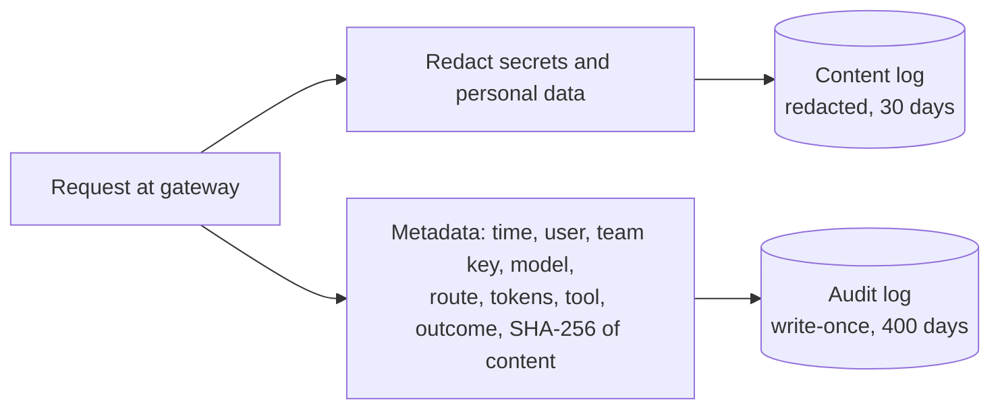

# 12.3 · Identity, secrets, networking and audit

## Why it matters

Fabrikam's draft architecture went to security review with one gateway key in the onboarding `.env` template, one organisation-wide CI secret for every repository, one Jira service account, and a gateway that logged every prompt for a year. The review came back in two days. The reviewer's summary was one sentence: *"We cannot tell who did anything, and everything anyone pasted is in a log the platform team can edit."*

That is the enterprise version of what Module 9 taught for one machine. There you cut a leg of the lethal trifecta and made the agent's tools least-privilege ([09.5](../module-09/lesson-05.md)). At 400 developers the same questions multiply: *which* identity made this call, on whose authority, with what credential, reachable from which network, and where is the evidence afterwards? In [08.4](../module-08/lesson-04.md) you wrote an audit hook and noted that a log on a developer's laptop is evidence for the developer, not for an auditor. This lesson ships that evidence somewhere the audited cannot change it.

> [!WARNING]
> The lab's prompt log contains **fake** credentials in the shapes of real ones (including AWS's documented example key id). If you adapt the redaction exercise to real logs, work on a copy inside your organisation's approved environment, never paste real log lines into a chat or ticket, and treat every credential you find as leaked: rotate it.

> [!NOTE]
> Content tags. **Concept** (stable): the four identities, per-team short-lived credentials, blast radius and exposure window, separation of duties, network as a layer under identity, redact-before-write, append-only audit. **Implementation** (as of 2026-09): Claude Code's `apiKeyHelper`, managed settings keys, OpenTelemetry flags, proxy and mTLS variables; GitHub Actions OIDC.

## How it works

### Four identities, four credentials

| Identity | Example | Credential that fits | Lifetime |
|---|---|---|---|
| **Developer** (human) | Dana on the billing team | SSO with MFA through the IdP; the gateway records the user | a working day |
| **Agent session** | Dana's Claude Code session | *acts with Dana's authority*: a team gateway key fetched at run time, plus Dana's own OAuth grants for tools | minutes (refreshed) |
| **Workload** | billing's nightly CI agent | workload identity federation: the CI platform's OIDC token exchanged for a short credential | the job, ≤ 1 h |
| **Tool / service** | Jira MCP server, a "jira-writes" bot | per-user OAuth for reads; a per-team bot identity for the few writes | per grant |

Two ideas from earlier modules carry the weight. First, the agent acts with the union of what its credentials allow (09.1), so every credential you hand a session is authority the model can use. Second, least privilege belongs at the lowest layer that supports it: credential scope first, server surface second, host rules third (08.1).

Claude Code supports this shape directly. An `apiKeyHelper` script returns the key at run time and is re-run every five minutes by default (`CLAUDE_CODE_API_KEY_HELPER_TTL_MS` changes it), so a key can come from a vault and be revoked centrally ([authentication](https://code.claude.com/docs/en/iam)). For CI, GitHub Actions can request a short-lived token from a cloud provider through OIDC, with claims such as repository and environment that the cloud's trust policy checks, so no long-lived secret is stored at all ([GitHub OIDC](https://docs.github.com/en/actions/concepts/security/openid-connect)). OWASP's secrets guidance says the same in general terms: centralise, automate rotation, prefer short-lived dynamic secrets, grant least privilege, audit access ([OWASP secrets](https://cheatsheetseries.owasp.org/cheatsheets/Secrets_Management_Cheat_Sheet.html)).

### Blast radius and exposure window

*Intuition.* A leaked credential does damage in two dimensions: how far it reaches and how long it works.

*Equation.* For a credential shared by $k$ of $T$ teams, with lifetime $L$ and a leak at a uniformly random moment that nobody detects, the reach and the expected remaining validity are

$$\text{reach} = \frac{k}{T}, \qquad E[\text{exposure}] \approx \frac{L}{2}$$

and detection caps exposure: $\min(L/2,\ t_{\text{detect}})$ on average.

*Tiny example.* Fabrikam's draft CI secret: $k = 8$ of 8 teams, $L = 365$ days, so reach 100% and about 182 days of expected exposure. A per-team OIDC credential: reach $1/8$, $L = 1$ h, about 30 minutes. A per-team gateway key rotated every 30 days: reach $1/8$, about 15 days, and cut to minutes by revocation in the vault because `apiKeyHelper` refreshes.

*Interpretation.* Shrinking $k$ limits damage and restores attribution; shrinking $L$ limits time. Neither depends on detecting the leak, which is why they come before monitoring.

### Roles and separation of duties

Give people roles, not credentials, and keep three powers apart: *using* agents (developers, CI), *changing the policy that constrains agents* (platform team, through reviewed pull requests under CODEOWNERS and the [governance policy](../../templates/governance-policy.md) from [11.5](../module-11/lesson-05.md)), and *reading the audit trail* (security). Nobody, including the platform team, may delete audit records.

Policy that must hold on every machine goes in **managed settings**, which apply above user, project and local settings. Keys such as `allowManagedPermissionRulesOnly`, `allowManagedMcpServersOnly` with `allowedMcpServers`, and `disableBypassPermissionsMode` let the organisation pin permission rules, restrict MCP servers to an allowlist and forbid the bypass mode ([managed settings](https://code.claude.com/docs/en/managed-settings)). The same file delivers `ANTHROPIC_BASE_URL`, the `apiKeyHelper`, and the telemetry settings below.

### Networking: a layer under identity

Zero trust starts from the premise that network location grants no implicit trust; each session is authenticated and authorised on its own ([NIST SP 800-207](https://csrc.nist.gov/pubs/sp/800/207/final)). So private networking does not replace per-team credentials. It adds a second boundary:

- **Gateway-only egress.** Only the gateway's subnet may reach provider hosts; the egress proxy blocks them for everyone else. Without this, a developer with a personal key walks around every control in 12.2.
- **Private connectivity** from the gateway to providers (private endpoints in the EU regions), so model traffic never crosses the public internet.
- **Client network settings.** Claude Code honours `HTTPS_PROXY`, custom CAs and mTLS client certificates (`CLAUDE_CODE_CLIENT_CERT`, `CLAUDE_CODE_CLIENT_KEY`) ([network configuration](https://code.claude.com/docs/en/network-config)), so a corporate proxy or an mTLS-protected gateway works without changes to the agent.
- **Tool egress.** The agent's own shell and fetch tools run under the sandbox and allowlists from 09.5; the gateway does not see those.

**Tenant isolation** in this design means per-team keys, budgets and log partitions at the gateway, per-user grants at MCP servers, and no shared workspace where one team's transcripts are readable by another.

### Audit without a secret store

A gateway that logs every prompt builds, by accident, the most sensitive data store in the company. Developers paste what they are debugging: connection strings, tokens, customer records. OWASP's logging guidance lists what must never be recorded directly (access tokens, passwords, connection strings, encryption keys) and asks for tamper detection and copying logs to read-only media ([OWASP logging](https://cheatsheetseries.owasp.org/cheatsheets/Logging_Cheat_Sheet.html)).

Split the record in two:



The hash lets an investigator confirm that a specific prompt was sent without anyone storing it. On the client, Claude Code's OpenTelemetry export carries metrics and events, and prompt text is excluded unless `OTEL_LOG_USER_PROMPTS=1` is set; tool parameters and content have their own opt-in flags, and managed settings lock the collector endpoint so developers cannot redirect it ([monitoring](https://code.claude.com/docs/en/monitoring-usage)).

## Show me

The identity, secrets, network and logging rules on Fabrikam's draft:

```text
$ ArchCheck lint break/architecture.json --rules IDN,SEC,NET,LOG,RET,MCP
FAIL IDN-SHARED     gw-shared: gateway-key credential shared by 8 of 8 teams. One leak or one runaway job reaches all 8; spend and actions cannot be attributed to a team.
FAIL SEC-STORAGE    gw-shared: credential stored in 'env-file'. Keep it in a vault and hand it out at run time.
FAIL IDN-SHARED     ci-agent: workload credential shared by 8 of 8 teams. ...
FAIL IDN-LIFETIME   ci-agent: CI/workload credential lives 8,760 h. Use workload identity federation (e.g. GitHub OIDC) ...
FAIL IDN-SHARED     jira-bot: service credential shared by 8 of 8 teams. ...
FAIL NET-DIRECT     clients may call model providers directly, around the gateway: no attribution, no quota, no audit ...
FAIL LOG-AUDIT      no audit-log store: you cannot answer 'which identity called which tool/model, when'.
FAIL LOG-RAW        gateway-log: prompts/responses stored unredacted. ...
FAIL RET-MAX        gateway-log: keeps raw content 365 days, policy max is 30.
FAIL MCP-SHARED     jira: write access through one shared token. Every write looks like the same user ...
(3 WARN lines omitted)
FAIL fabrikam-v0: 10 failure(s), 3 warning(s)
```

And what the unredacted log actually holds, from a sample of 12 lines:

```text
$ ArchCheck redact break/prompt-log.jsonl
  line   2 prompt     SECRET password      Passwo…(24 chars)
  line   3 prompt     SECRET bearer        Bearer…(43 chars)
  line   4 prompt     SECRET aws-key-id    AKIAIO…(20 chars)
  line   6 prompt     pii    email         dana.l…(21 chars)
  line   7 prompt     SECRET github-token  ghp_FA…(40 chars)
  line   8 prompt     SECRET jwt           eyJhbG…(74 chars)
  line  10 prompt     pii    iban          DE89 3…(24 chars)

12 log lines: 5 contain secrets (5 matches), 2 personal-data matches.
FAIL secrets in stored prompts. Redact at the gateway before the log is written, and rotate every credential listed above.
```

Five of twelve lines hold a credential, and every one of them was logged under `gw-shared` with `user: unknown`: nobody can say who pasted them.

## Try it

Budget: 60 minutes. From `labs/module-12`:

1. Run both commands above. For each FAIL, write which of the four identities it concerns and which of reach or lifetime it inflates.
2. Compute reach and expected exposure for each non-human identity in `break/architecture.json`, then for the same identities in `solution/architecture.json`.
3. Produce a redacted copy and check it: `$A redact break/prompt-log.jsonl --out out/prompt-log.redacted.jsonl`, then `$A redact out/prompt-log.redacted.jsonl`. Open the redacted file: what did the redaction keep that an investigator still needs?
4. Write the roles table for your organisation (or your wedge's client): who can use, who can change policy, who can read audit, and who can delete audit (the answer should be "no one").

<details>
<summary>Hint for step 3</summary>

The redacted copy keeps the timestamp, key, model, token counts and the surrounding prompt text, and adds `prompt_sha256`, a short hash of the original. The investigator can still see *that* a connection string was pasted, correlate the hash with a copy the developer still has, and know which credential to rotate, without the log holding the password.
</details>

## Break it

This is the module's required break: **agent tokens shared across teams, and prompts logged with secrets.** The draft looks efficient: one key to distribute, one CI secret to maintain, one log to search. Run `lint --rules IDN,LOG` and `redact` on the draft, then answer before reading on: if the `gw-shared` key leaked today, which teams would be affected, for how long, and how would you find out who leaked it?

## Fix it

**Diagnose.** Every team, for up to a year, and you could not find out: the key is shared (reach 8/8), long-lived (365 days), stored in a file copied to every laptop, and the log records `user: unknown`. Meanwhile the log itself became a second leak: five credentials from other systems sit in plaintext for 365 days, readable and editable by the platform team. The root cause is the same as in 12.2 at a different layer: **identity coarser than the unit you need to hold accountable**, plus **logging before redacting**.

**Modify.**

1. Rotate the five credentials found in the log first; redaction does not un-leak them.
2. Developers: SSO with MFA; the gateway records the SSO user. Agent sessions: a per-team gateway key returned by `apiKeyHelper` from the vault, rotated every 30 days, delivered through managed settings.
3. CI: GitHub OIDC federation, one-hour, team-scoped credentials; delete the organisation CI secret.
4. Tools: per-user OAuth for Jira and Confluence reads; a per-team bot for comment and label writes.
5. Network: provider hosts reachable only from the gateway subnet.
6. Logs: redact in the gateway before any sink; content log 30 days; metadata audit log with content hashes in write-once storage; client telemetry without prompt text, locked by managed settings.

**Rerun.** `$A lint solution/architecture.json` passes with no failures; the redacted log reports zero secrets. Keep both outputs: they are evidence for the security review in 12.5.

## How do I know it works?

- [ ] Every non-human credential belongs to exactly one team, and no workload credential lives longer than a day.
- [ ] No developer machine or CI job holds a provider key; keys come from a vault at run time.
- [ ] Provider hosts are unreachable except from the gateway, verified by an egress report, not a diagram.
- [ ] The audit trail answers "who, with which identity, called which model or tool, when, with what outcome" for any session, and the platform team cannot delete it.
- [ ] A weekly redaction check over the content log reports zero secrets.

## Use / don't use

**Use** per-team, short-lived, vault-issued credentials for agents from the first team onward; it is cheaper to start that way than to migrate 400 machines later. **Use** workload identity federation wherever your CI and cloud support it. **Use** managed settings for anything that must hold on every machine.

**Don't** treat a private network as authentication. **Don't** log prompt content "just in case"; decide what an investigation needs and log that. **Don't** rely on redaction patterns alone: they miss secrets in unfamiliar shapes, so keep the upstream controls (deny reads of `.env` and secret paths, from 09.5) as well.

**Limitations.** Pattern-based redaction has false negatives (custom token formats) and false positives (an IBAN-shaped test string). Per-user attribution requires the gateway to receive the user identity, which depends on the client and gateway supporting it. A developer who pastes a secret has still sent it to the model provider; redaction protects your logs, not the provider's copy, which is governed by the retention terms in 12.4.

## Reflect

1. Which credential in your organisation is shared by the most people, and how long does it live?
2. Who could delete your agents' audit trail today?
3. What is the last secret you pasted into a chat or agent session, and where is it now?

## Sources

- [Claude Code docs — Authentication](https://code.claude.com/docs/en/iam) — team authentication options; Console roles; `apiKeyHelper` re-run after five minutes by default, `CLAUDE_CODE_API_KEY_HELPER_TTL_MS`; credential precedence; restricting login to an organisation.
- [Claude Code docs — Deploy managed settings](https://code.claude.com/docs/en/managed-settings) — managed settings override user, project and local settings; `allowManagedPermissionRulesOnly`, `allowManagedMcpServersOnly`, `allowedMcpServers`, `disableBypassPermissionsMode`.
- [Claude Code docs — Monitoring](https://code.claude.com/docs/en/monitoring-usage) — OpenTelemetry metrics and events; `OTEL_LOG_USER_PROMPTS` and tool-content logging off by default; managed settings lock the OTLP destination.
- [Claude Code docs — Enterprise network configuration](https://code.claude.com/docs/en/network-config) — `HTTPS_PROXY`, custom CA, mTLS client certificate variables, required hosts.
- [GitHub Docs — OpenID Connect in GitHub Actions](https://docs.github.com/en/actions/concepts/security/openid-connect) — short-lived cloud tokens per job; claims for fine-grained trust; no stored cloud secrets.
- [OWASP — Secrets Management Cheat Sheet](https://cheatsheetseries.owasp.org/cheatsheets/Secrets_Management_Cheat_Sheet.html) — centralise, rotate automatically, short-lived dynamic secrets, least privilege, audit, detection.
- [OWASP — Logging Cheat Sheet](https://cheatsheetseries.owasp.org/cheatsheets/Logging_Cheat_Sheet.html) — never log tokens, passwords, connection strings or keys directly; tamper detection; read-only storage.
- [NIST SP 800-207 — Zero Trust Architecture](https://csrc.nist.gov/pubs/sp/800/207/final) — no implicit trust from network location; per-session authentication and authorisation; least privilege.
