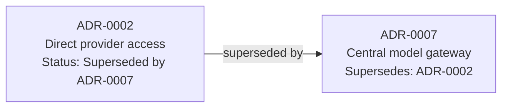
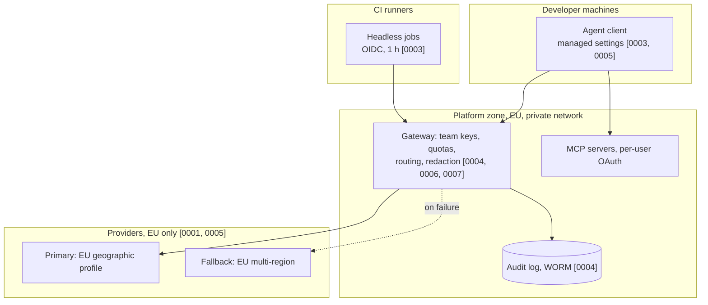

# 12.5 · ADRs and the reference architecture

## Why it matters

Four lessons produced four sets of decisions for Fabrikam: EU cloud-hosted models with an EU fallback, a central gateway with per-team quotas, per-team short-lived identities with redacted logs, and an inventory that keeps every copy of prompt data in the EU. Each decision was argued with numbers. None of that survives unless it is written down in a form that a security reviewer can check today and a new platform lead can understand in a year.

Two artifacts carry it. **Architecture decision records** keep the *why*: the forces, the options you rejected, what you gave up. The **reference architecture** keeps the *what*: boxes, arrows and trust boundaries, each traceable to a decision. Together they answer the enterprise security review, the 30 questions every architect, CISO and data-protection officer will ask in some form. This is also the portfolio artifact for the stage: the `enterprise-architecture` repository ([scaffold](../../projects/enterprise-architecture/README.md)).

> [!NOTE]
> Content tags. **Concept** (stable): ADR structure and immutability, supersession, context and container views, trust boundaries, evidence-backed review answers, traceability. **Implementation**: the course's ADR template, the `ArchCheck adr` and `review` checks, mermaid for diagrams.

## How it works

### The ADR

Michael Nygard's 2011 post defined the form most teams still use: a short record per architecturally significant decision with a **title**, **context** (the forces, stated neutrally), **decision** (in active voice: "We will…"), **status** (proposed, accepted, deprecated, superseded) and **consequences** (all of them: positive, negative, neutral). Records are one or two pages, live in the repository, are numbered sequentially and never renumbered, and a superseded record stays in place with a pointer to its replacement ([Nygard](https://www.cognitect.com/blog/2011/11/15/documenting-architecture-decisions)). MADR 4.0 adds explicit decision drivers, **considered options** with pros and cons, and a **confirmation** section describing how compliance with the decision will be checked ([MADR](https://github.com/adr/madr)).

The course template, [`templates/adr.md`](../../templates/adr.md), combines both and adds two fields that matter at enterprise scale:

- **`Topic:`** a stable key for the question the ADR answers (`model-gateway`, `data-residency`). Two *accepted* ADRs on one topic means somebody changed a decision without superseding the old one.
- **`Answers:`** the security-review question ids this ADR is evidence for. It turns the review into a traceability exercise instead of an essay.

Three rules make ADRs trustworthy:

1. **At least two real options.** An ADR with one option is an announcement. Write the do-nothing baseline too; it is the option every other must beat.
2. **At least one negative consequence.** Every real decision costs something. Fabrikam's gateway ADR admits the gateway is now critical infrastructure that can stop every agent.
3. **A confirmation someone else can run.** "We will review it" is not one. `ArchCheck lint --rules NET` in CI, or "zero connections to provider hosts from non-gateway subnets in the weekly egress report", is.

### Supersede, never edit

A decision changes when its context changes. Fabrikam's pilot let teams call providers directly (ADR-0002); at 400 developers that was replaced by a central gateway (ADR-0007). The history matters: in a year someone will propose "let teams use their own keys, it's simpler," and ADR-0002 shows it was tried, why, and why it stopped. So:



The link goes both ways, the old number is never reused, and only typos are fixed in place.

### The reference architecture: two views, one model

The C4 model describes software at four levels (context, containers, components, code) with notation left to you ([C4 model](https://c4model.com/)). For an enterprise agent platform, two levels do most of the work:

- A **context view**: developers, CI, the agent platform, model providers, Jira and Confluence, GitHub, SQL Server, the identity provider, and the security and finance functions that consume its reports.
- A **container view** with **trust boundaries** drawn as zones: developer machines, CI runners, the platform zone (gateway, MCP servers, vault, collector, audit and content logs), and the provider zone. Each boundary crossing names its control, and each element carries the numbers of the ADRs that decided it.

Keep a machine-readable twin of the container view (`architecture.json` in the lab). A picture cannot be linted; the twin can, in CI, so the diagram and reality do not drift apart. That lint run becomes the confirmation for several ADRs at once.

### Evidence-backed review answers

The lab's questionnaire has 30 questions in eight categories: hosting and vendor, identity and access, secrets, network, data and residency, logging and audit, agent behaviour and tools, operations and cost. It reuses what earlier modules built: the agent-level [security review checklist](../../templates/security-review-checklist.md) and [threat model](../../templates/agent-threat-model.md) from Module 9 answer the agent-behaviour questions, the [MCP security checklist](../../templates/mcp-security-checklist.md) from Module 8 answers the tools question, and the [governance policy](../../templates/governance-policy.md) from [11.5](../module-11/lesson-05.md) answers ownership and change control.

Each answer has two lines: `Answer:` and `Evidence:`. A reviewer can check "per-team keys, see ADR-0003 and the lint output"; a reviewer cannot check "Yes." Define

$$\text{review coverage} = \frac{\#\ \text{questions answered with evidence that exists}}{30}$$

and do not submit below 100%. An answer you cannot evidence is a finding you should report yourself.

## Show me

Fabrikam's v1 decision log, checked:

```text
$ ArchCheck adr solution/adr
ok   0001-eu-hosted-cloud-models.md               Accepted
ok   0002-direct-provider-access-per-team.md      Superseded by ADR-0007
ok   0003-identity-and-credentials.md             Accepted
ok   0004-prompt-logging-and-audit.md             Accepted
ok   0005-eu-data-residency.md                    Accepted
ok   0006-quotas-and-cost-allocation.md           Accepted
ok   0007-central-model-gateway.md                Accepted
PASS 7 ADRs, 0 warning(s)
```

The container view from [`solution/diagram.md`](../../labs/module-12/solution/diagram.md), trimmed:



And the review:

```text
$ ArchCheck review fabrikam/security-review-questionnaire.json solution/security-review.md
  Hosting & vendor          4/4
  Identity & access         5/5
  ...
  Operations & cost         2/2
PASS all 30 questions answered with evidence
```

## Try it

Budget: 2 hours; this is the stage's portfolio project.

1. Create your `enterprise-architecture` repository from the [scaffold](../../projects/enterprise-architecture/README.md). Copy [`templates/adr.md`](../../templates/adr.md) to `adr/`.
2. Choose your subject: Fabrikam (from the [brief](../../labs/module-12/fabrikam/brief.md)) or an anonymised version of a real organisation you know. Write at least five ADRs covering hosting, gateway, identity, logging and residency, and at least one that supersedes another.
3. Draw the context and container views in `diagram.md`, with trust boundaries and ADR numbers on elements. Write the machine-readable twin and make `ArchCheck lint` pass.
4. Answer the 30 questions in `security-review.md` with evidence. Run `ArchCheck adr adr/` and `ArchCheck review` until both pass.
5. Add a CI job that runs all three checks on every pull request that touches `adr/`, `diagram.md` or the architecture file.

<details>
<summary>Hint: a minimal CI job for step 5</summary>

```yaml
name: architecture-checks
on:
  pull_request:
    paths: ["adr/**", "diagram.md", "architecture.json", "security-review.md"]
permissions:
  contents: read
jobs:
  check:
    runs-on: ubuntu-latest
    steps:
      - uses: actions/checkout@v4
      - uses: actions/setup-dotnet@v4
        with: { dotnet-version: "8.0.x" }
      - run: dotnet build tools/ArchCheck -c Release
      - run: |
          A="dotnet tools/ArchCheck/bin/Release/net8.0/ArchCheck.dll"
          $A lint architecture.json
          $A adr adr
          $A review security-review-questionnaire.json security-review.md
```

Pin the actions to commit SHAs in a real repository, as in Module 11.
</details>

## Break it

Fabrikam's first submission to the review board is in `labs/module-12/break/`. Run:

```bash
$A adr break/adr
$A review fabrikam/security-review-questionnaire.json break/security-review.md
```

The ADR check reports three problems; the review check reports nine unanswered or unevidenced questions. Before reading on, find a fourth kind of problem the tools cannot see: compare the answers to Q01 and Q13 in the draft with `break/architecture.json`.

## Fix it

**Diagnose.**

- Two accepted ADRs on `model-gateway` (0002 direct access and 0003 central gateway): the team changed its mind and wrote a new record without superseding the old one. Anyone reading 0002 gets the wrong answer.
- ADR-0004 ("Log everything") has one option, no negative consequence and no confirmation. It was a preference recorded as a decision, and 12.3 showed its cost.
- ADR-0005 says `Superseded by ADR-0009`, which does not exist: a dangling pointer from an abandoned rewrite.
- Nine review answers are "Yes." or "TBD", without evidence, and Q30 is missing.
- The fourth problem: Q01 and Q13 say clients cannot reach providers directly, but the draft's architecture file has `directProviderAccess: true`. The answers describe the design the team wanted, not the one it had. Evidence links would have exposed this; `lint` does.

**Modify.** Set ADR-0002 to `Superseded by ADR-0003` and add `Supersedes: ADR-0002` to 0003. Do not edit ADR-0004's substance: write a new ADR (redact at the gateway, audit metadata in write-once storage) that supersedes it, with three options and a confirmation. Restore ADR-0005 to `Accepted` (or write the ADR-0009 it points to). Rewrite each weak answer with a specific claim and a link to the ADR, diagram, architecture file or check output that proves it, and answer Q30. Then fix the architecture file until the answers are true, not the other way round.

**Rerun.** `ArchCheck adr` and `review` pass; `lint` passes on the architecture file the answers cite. Compare with `solution/`; your wording will differ, and that is fine as long as every check passes and every answer is true.

<details>
<summary>Solution notes</summary>

The reference solution renumbers so that the central gateway is ADR-0007 and the redaction decision is ADR-0004 in the final log; in your fix, keeping the draft's numbers and adding new ADRs at the end is the more honest history. Either way the rule holds: numbers are never reused, accepted substance is never edited, and every changed decision leaves a visible trail.
</details>

## How do I know it works?

- [ ] At least five ADRs, each with context, two or more options, a decision, a negative consequence and a runnable confirmation; `ArchCheck adr` passes.
- [ ] At least one ADR supersedes another, with the link recorded in both.
- [ ] The diagram shows context and containers, draws trust boundaries, and labels elements with ADR numbers; its machine-readable twin passes `lint`.
- [ ] All 30 review questions are answered with evidence that exists; `ArchCheck review` passes, and a spot check of three answers against the architecture file finds no contradiction.
- [ ] The three checks run in CI on every change to the architecture artifacts.

## Use / don't use

**Use** ADRs for decisions that are expensive to reverse or that someone will question later: hosting, gateways, identity, data handling, anything a security review asks about. **Use** the diagram and its lintable twin as the single description reviewers and engineers share.

**Don't** write ADRs for reversible, local choices (a library version, a folder name); the ceremony will kill the habit. **Don't** let the diagram become the only source of truth: pictures drift. **Don't** answer a review question you cannot evidence; say what is missing and when it will exist.

**Limitations.** `ArchCheck adr` checks structure, not judgment: a well-formed ADR can still record a bad decision. `review` checks that evidence exists, not that it supports the claim; a human reviewer still has to read it. The 30-question list is a starting point modelled on common enterprise reviews, not a standard; real organisations add their own questions, often many more.

## Reflect

1. Which decision in your current system would you most like to find an ADR for, and what would it need to say?
2. Which of your review answers were you tempted to write as "Yes." without evidence?
3. What is one decision you made in this module that you expect to supersede within a year, and what would trigger it?

## Sources

- [Michael Nygard — Documenting Architecture Decisions (2011)](https://www.cognitect.com/blog/2011/11/15/documenting-architecture-decisions) — title, context, decision, status, consequences; one or two pages; sequential numbers never reused; superseded records kept.
- [MADR 4.0](https://github.com/adr/madr) — context and problem statement, decision drivers, considered options, decision outcome, consequences, confirmation, pros and cons of options.
- [Simon Brown — The C4 model](https://c4model.com/) — context, containers, components and code; notation- and tool-independent diagrams.
- [Claude Code docs — Enterprise deployment overview](https://code.claude.com/docs/en/third-party-integrations) — the deployment, gateway and policy options Fabrikam's ADRs choose between (as of 2026-09).
